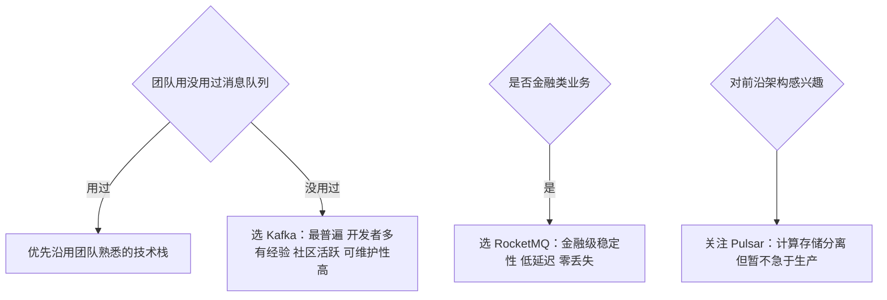

# Go 项目开发: 消息队列的场景引入与选型对比

消息队列不只是"系统间多一种通信方式"。用手机生产线类比：焊接 → 组装 → 质检 → 包装，每道工序时间不同 —— **传送带解决了传递问题（通信），下游的临时小仓库解决了速度不匹配问题（缓冲）**。消息队列的核心作用就是这两个词：**通信与缓冲**。

## 纲要

- 四种该引入消息队列的场景
- 五大主流消息队列横向对比
- Kafka 与 RocketMQ 的存储差异
- 选型的三步决策法

## 四种该引入消息队列的场景

### 异步数据处理

耗时任务（视频审核、转换等）无法实时返回结果，先入队再由专门服务处理。**对实时性要求不高的场景也适用**：搜索服务中，上游数据变更通常通过回调通知搜索服务，直接把通知放进队列 —— 好处是 ES 出问题时可以随时暂停消费而不丢数据；ES 集群做运维需要停止写入时，关闭消费者也很方便。

### 流量削峰（流控）

秒杀是典型：开始瞬间大量请求冲向后端，可能直接打垮服务。用队列把瞬时流量暂存，服务端按自身处理能力异步消费；用户端点击后先展示"结果计算中"，消费完成后再展示真实结果。

### 系统解耦

电商搜索是标准案例：搜索服务与商品服务是独立微服务，商品服务把商品数据写入队列，搜索服务消费后建索引 —— 搜索与商品服务通过队列解耦。**所有依赖商品数据的下游服务都可以订阅同一份数据**，各自实现自己的业务能力。

### 流处理

流计算任务的数据处理可以直接用 Kafka；以及"一份数据、多个下游系统消费"的场景，消息队列天然适配。

## 五大主流消息队列

| 产品 | 语言 | 单机吞吐 | 优势 | 短板 |
| --- | --- | --- | --- | --- |
| **ActiveMQ** | Java（Apache） | 万级 | 功能完善，主从高可用，丢消息概率低 | **成熟度极低，基本已垂暮** |
| **RabbitMQ** | Erlang（小众语言） | 万级 ~ 十万级 | 实现 AMQP、支持多协议与传递确认、并发性能好、基本不丢消息 | **可维护性差**（Erlang 小众）；**消息大量堆积时性能明显下降** |
| **Kafka** | Java/Scala（Apache） | **十万级**（开压缩 + 异步批量更高） | 分布式、多分区多副本、可用性极高、丢消息概率小；**micro-batch 处理模型** —— 客户端先攒一波再一起发送，大幅减少网络传输与磁盘 IO；大数据生态几乎所有开源系统优先支持 | **topic 数量到几百上千时吞吐显著下降** |
| **RocketMQ** | Java（阿里 2012 开源 → Apache） | 十万级 | 低延迟、强一致、高性能高可靠、**消息零丢失**；**topic 几百上千对吞吐影响不大**；阿里内部大流量验证 | 社区活跃度不如 Kafka |
| **Pulsar** | Yahoo → Apache 顶级项目 | 十万级，**不受 topic 数量影响** | **计算与存储分离**、多租户、跨机房复制、强一致；被称为下一代云原生分布式消息平台 | 活跃度与成熟度不高，仍在成长期 |

## Kafka 与 RocketMQ 的存储差异

这个差异解释了"为什么 topic 数量影响 Kafka 而不影响 RocketMQ"：

| 维度 | Kafka | RocketMQ |
| --- | --- | --- |
| 存储粒度 | 以 **partition** 为单位：每个分区一组消息文件（segment）+ 一组索引文件，一一对应，以文件中第一条消息的索引序号命名 | 以 **broker** 为单位：只有一组消息文件，索引文件按 topic / 队列创建（consumer queue） |
| 索引方式 | **稀疏索引** —— 出于存储成本考虑，每隔几条消息才建一个索引 | **稠密索引** —— 每条消息都建索引，每个索引 20 字节 |
| 定位消息 | 先定位索引文件，再找到索引指向的位置，从该位置**顺序遍历**消息文件直到目标；首次定位有开销，之后可批量顺序读 | 根据消息队列序号**直接计算出索引的全局位置**，再按索引找消息 |
| 写入 | 追加写入，文件到大小上限后切新文件 | 顺序追加到 broker 消息文件末尾，写满切文件 |
| 扩容迁移 | 分区粒度细，**容易做数据迁移与扩容** | 粒度粗 → 写入的文件数少，**顺序写更方便** → 这正是 topic 数量影响小的原因 |

## 选型：三步决策法

选型不是看"谁功能多、谁性能好"，而是**以实际业务需求为导向，在满足需求的前提下选实施成本最低的方案**（人力成本 + 资源成本）。



- **金融类业务**对稳定性要求极高 —— RocketMQ 的金融级稳定性与低延迟就是选择它的理由。
- **没用过消息队列的团队**，直接选 Kafka：使用最普遍、大部分开发者都有经验、分布式集群搭建容易、社区活跃、Java/Scala 开发可维护性高。
- **Pulsar** 虽然活跃度与成熟度不高，但计算存储分离的设计很前卫，值得持续关注与学习。

## 消息队列全景一览

```dir
消息队列/
├── 引入场景
│   ├── 异步处理
│   ├── 流量削峰
│   ├── 系统解耦
│   └── 流处理
├── 主流产品
│   ├── Kafka            十万级吞吐
│   ├── RocketMQ         金融级零丢失
│   ├── RabbitMQ         多协议
│   ├── Pulsar           存算分离
│   └── ActiveMQ         垂暮
└── 选型决策
    ├── 团队熟悉度
    ├── 业务诉求
    └── 前沿架构
```

## 总结

消息队列的引入时机看四个信号：**任务要异步化、流量要削峰、系统要解耦、数据要分流**。选型的核心不是参数对比表，而是两个问题 —— **你的业务最怕什么**（金融怕丢消息，日志怕吞吐不够）**、你的团队会什么**。新框架再先进，团队驾驭不了就是负资产。

