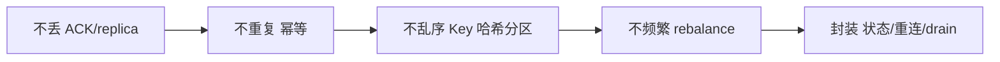

# Go 项目开发: Golang 使用 Kafka 的正确姿势

Kafka 在搜索链路里是**数据同步的任督二脉**：商品变更、订单变更、日志回流，都靠它把变更事件从业务库推到索引侧。但 Kafka 用好不难、用对很难 —— 生产里最常挨的三刀就是**消息丢了、重复消费了、顺序乱了**。

本节按三个问题展开：**如何避免消息丢失 → 如何通过幂等性应对重复消费 → 如何保证同一业务对象的消息有序**，最后落到 Go SDK（sarama）的封装与用法。

## 纲要

- 同步发送与异步发送的本质差异
- ACK 的三种模式，以及减少消息丢失的五个手段
- 消息投递的三种语义，以及幂等性消费的三种实现
- 分区有序：用 Key 哈希把同一业务对象送进同一分区
- 消费后异步处理：内存队列 + 哈希分发
- rebalance 的触发条件与七个规避手段
- sarama 生产者封装：状态机、断线重连、发送与错误回收
- sarama 消费者封装：consumer group、回调、偏移量标记与优雅退出
- 完整使用示例

## 同步发送与异步发送的本质差异

**严格同步**是逐条发送、实时拿结果 —— 效率极为低下，和异步方式的吞吐量差着数量级。绝大多数业务场景用**异步**就够了。

两者的本质区别只有一句：**生产者是否等 broker 的 ACK 响应，才发下一条**。

```txt
# 同步：一条一条发，每条都要等 broker 确认
part, offset, err := producer.SendMessage(msg)
```

```txt
# 异步：消息丢进 channel，SDK 攒批后提交，不等单条响应
producer.Input <- msg
```

在 Go SDK 里：

- **同步生产者**：`sarama.NewSyncProducer` + `SendMessage(topic, value)`，返回值直接带分区、偏移量和错误。
- **异步生产者**：`sarama.NewAsyncProducer` + 往 `producer.Input` 这个 channel 里塞 `*sarama.ProducerMessage`，SDK 在内部攒批提交。

**异步发送返回的"成功"不代表消息进了 Kafka** —— 它只说明塞进了 Go 的内存 channel。要拿最终结果，得从 `producer.Successes()` / `producer.Errors()` 两个 channel 里读，这是异步封装里最容易漏的一环。

## ACK 的三种模式与减少消息丢失

| ACK | 行为 | 可靠性 | 性能 |
| --- | --- | --- | --- |
| `0` | 不等任何确认，发出即继续 | 最差 | 最高 |
| `1` | 等 leader 写入成功，不等 follower | 一般 | 中等 |
| `-1` / `all` | 等 `min.insync.replicas` 个副本全部写入 | 最高 | 最低 |

- **ACK=0**：只要消息发出去就认为成功，服务端有没有写进去它不管，可靠性无从谈起。
- **ACK=1**：leader 写入即返回。leader 宕机、新 leader 还没同步到这条消息时，**消息就丢了**。这条路径可以通过回调拿错误、让生产者重发来补救。
- **ACK=-1/all**：要求配置的副本数都写入成功，最安全，单台机器崩溃集群照跑。代价是延时更高，**一般只有金融类业务才用**。

**不是所有场景都需要严格不丢**，要按业务衡量 —— 目标是「在可接受的性能损失前提下，尽可能少丢」。

减少消息丢失的五个手段：

1. **`acks` 设为 `-1` / `all`**。
2. **加大重试次数**，默认 3 次，可靠性优先的场景设到 5 次。
3. **`unclean.leader.election.enable=false`** —— 控制哪些 broker 有资格竞选新 leader；设为 false 后，**不允许落后于原 leader 的 broker 当新 leader**，从根源避免丢失。
4. **提高副本数**：`replication.factor = 3`，每条消息存三份。这层是拿存储成本换可用性，效果类似 ES 的副本分片，**但 Kafka 的副本数是分区副本总数，包含 leader 自己**。
5. **`min.insync.replicas` 至少写入 2 个副本**（3 副本场景）。

第 5 点有个必须记住的算术：**副本数必须严格大于"至少写入成功数"**。两者相等时，挂掉一个副本整个分区就不可用了。通用做法是：

```txt
min.insync.replicas = replication.factor - 1   # 3 副本 → 至少 2 个确认
```

## 消息投递的三种语义

| 语义 | 行为 | 成本 | 适用 |
| --- | --- | --- | --- |
| 至多一次（at most once） | 消息可能丢，但不会重复 | 最低 | 监控指标、日志采集 |
| 至少一次（at least once） | 不丢，但会重复 | 中等 | 主流 MQ 都是这档：RabbitMQ、RocketMQ、Kafka |
| 恰好一次（exactly once） | 不丢也不重复 | 最高 | 事务 + 幂等，实现代价大 |

**Kafka 原生支持事务和 exactly-once 语义，但普通的生产-消费流程里要完全避免重复消费依然困难。** 生产上的通行做法是：**不追求"不重复"，而是让消费逻辑天然幂等** —— 执行一次和多执行一次的影响相同。

幂等性的意思很朴素：跟 HTTP 里反复 DELETE 同一个资源是一个道理，删一次和删十次结果一样，多出的那几次顶多回个 404，不影响资源本身。

### 幂等实现的三种方式

**一、用业务主键做下游文档 ID**

典型场景：消费消息写 ES。把商品 ID 直接作为 ES 文档的 `_id`，同一条消息重复消费就是覆盖同一个文档 —— **代价最小的幂等**，几乎不用额外判断。

**二、用数据库主键或唯一索引**

MySQL、MongoDB 都行，Redis 的 SET 也行。**只要能在插入时告诉你"这条是否已存在"，就能做幂等。**

做法是拿业务主键（或业务主键 + 版本号 + 操作类型）拼成一个唯一值先 insert：

- 插入成功 → 首次处理，继续走业务逻辑；
- 唯一键冲突 → 已处理过，直接丢弃。

**三、全局唯一 ID + 消费状态表**

发消息时给每条消息生成一个全局唯一 ID，消费时先查这个 ID 消费过没有，没消费过就处理并标记状态。

这种方案通用性最高，但**实现最麻烦**：「查状态 → 消费消息 → 标记状态」这三步要保证原子性，就得上分布式锁，**性能牺牲明显**。除非前两种方案都满足不了，否则别走这条路。

## 消息乱序：用 Key 哈希进同一个分区

Kafka **只保证同一个分区内有序**。单分区单消费者当然严格有序，但生产环境出于吞吐考虑几乎不会只用一个分区。

正确解法是：**把同一业务对象的消息送到同一个分区**。

发送时指定消息的 Key，并让生产者用哈希分区器 —— 相同 Key 算出的哈希相同，自然落到同一分区。消费侧也就保证了同一个商品 ID 的消息由同一个处理线程消费，对同一条数据的增删改天然按序。

```txt
# 生产者启用哈希分区
config.Producer.Partitioner = sarama.NewHashPartitioner

# 发送时带上 Key
msg := &sarama.ProducerMessage{
    Topic: "goods-change",
    Key:   sarama.ByteEncoder(商品ID),
    Value: sarama.ByteEncoder(payload),
}
```

效果对比：

| 方案 | 优点 | 缺点 |
| --- | --- | --- |
| 按 Key 哈希分区 | 天然有序、无额外代码 | 分区内热点（某类 ID 流量特别大时倾斜） |
| 手动指定 partition | 完全可控 | 分区数一变代码就要跟着改，**扩展性差** |

消费完还要**异步处理**时，同样按 Key 哈希分发到不同的内存队列，保证队列内部有序。

## rebalance：触发条件与七个规避手段

rebalance 耗时长，**期间消费者全部停止消费**，消费组实例特别多时更要命 —— 实时性下降、消息堆成一坨。

三个触发条件：

1. **消费者加入或离开**（最常见 —— 发版、改配置、改分区数都要重启）；
2. **topic 分区数变化**（为了提升并发度加分区）；
3. **订阅关系变化**（新增或取消订阅某个 topic）。

规避手段：

1. **消费者独立成服务** —— 用隔离原则把消费逻辑单独拆成微服务，避免"改了个非消费代码也要发版重启消费者"。
2. **消费代码加 `recover`** —— 一处 panic 不该让整个消费进程挂掉进而触发 rebalance。
3. **`max.poll.interval.ms` 按业务最长耗时设** —— 消费者长时间不提交偏移会被判定死亡。业务最长 10 秒就设 20 秒。
4. **心跳两段式配置** —— `session.timeout.ms` 至少是 `heartbeat.interval.ms` 的三倍，保证判定死亡前能发满三轮心跳。推荐：**heartbeat 2 秒、session 6 秒**（单位都是毫秒，别写成 "6s"）。
5. **`session.timeout.ms` 也别设太大** —— 死掉的实例还是需要尽快剔除。
6. **改分区数后必须重启生产者和消费者** —— Go SDK 的设计缺陷：改完分区后消费者可能一段时间识别不到新分区，甚至一直识别不到。**消费滞后超过 7 天，消息会按磁盘阈值被删，那就真丢了**。
7. **仍频繁 rebalance 就查 GC 和系统负载** —— 频繁 Full GC 或机器负载过高都会间接触发。

## 生产者封装（sarama）

封装的核心是三件事：**统一配置默认值 → 维护连接状态 → 断线自动重连**。

```go
package main

import (
	"errors"
	"sync"
	"time"

	"github.com/IBM/sarama"
)

const (
	statusDisconnected = iota
	statusConnected
	statusClosed
)

// KafkaProducer 同步/异步生产者共用的壳，状态与重连信号都在这里
type KafkaProducer struct {
	name      string
	addrs     []string
	config    *sarama.Config
	producer  sarama.SyncProducer
	status    int
	mu        sync.RWMutex
	reconnect chan struct{}
}

// defaultProducerConfig 默认配置：acks=all、重试 5 次、LZ4 压缩、按 Key 哈希分区
func defaultProducerConfig() *sarama.Config {
	cfg := sarama.NewConfig()
	cfg.Producer.RequiredAcks = sarama.WaitForAll // 对应 acks=-1/all
	cfg.Producer.Retry.Max = 5                    // 默认 3 次，可靠性优先提到 5 次
	cfg.Producer.Compression = sarama.CompressionLZ4
	cfg.Producer.Partitioner = sarama.NewHashPartitioner
	cfg.Producer.Return.Successes = true
	return cfg
}

// NewKafkaProducer 初始化生产者并挂上保活任务
func NewKafkaProducer(name string, addrs []string, cfg *sarama.Config) (*KafkaProducer, error) {
	if cfg == nil {
		cfg = defaultProducerConfig()
	}
	p, err := sarama.NewSyncProducer(addrs, cfg)
	if err != nil {
		return nil, err
	}
	k := &KafkaProducer{
		name:      name,
		addrs:     addrs,
		config:    cfg,
		producer:  p,
		status:    statusConnected,
		reconnect: make(chan struct{}, 1),
	}
	go k.keepConnect()
	return k, nil
}

// SendMessage 同步发送，返回落到哪个分区的哪个偏移；未连接时直接报错
func (k *KafkaProducer) SendMessage(topic, key string, value []byte) (int32, int64, error) {
	if k.getStatus() != statusConnected {
		return 0, 0, errors.New("kafka producer not connected: " + k.name)
	}
	msg := &sarama.ProducerMessage{Topic: topic, Value: sarama.ByteEncoder(value)}
	if key != "" {
		// Key 是分区哈希的输入，同一业务对象用同一个 Key 才能保证有序
		msg.Key = sarama.ByteEncoder(key)
	}
	partition, offset, err := k.producer.SendMessage(msg)
	if err != nil {
		k.triggerReconnect()
		return 0, 0, err
	}
	return partition, offset, nil
}

// keepConnect 监听重连信号，断开状态下重建生产者
func (k *KafkaProducer) keepConnect() {
	for {
		if k.getStatus() == statusClosed {
			return
		}
		select {
		case <-k.reconnect:
			if k.getStatus() == statusDisconnected {
				if err := k.reconnectProducer(); err != nil {
					time.Sleep(2 * time.Second)
				}
			}
		case <-time.After(2 * time.Second):
		}
	}
}

func (k *KafkaProducer) reconnectProducer() error {
	p, err := sarama.NewSyncProducer(k.addrs, k.config)
	if err != nil {
		return err
	}
	k.mu.Lock()
	defer k.mu.Unlock()
	k.producer = p
	k.status = statusConnected
	return nil
}

// triggerReconnect 标记断开、关掉旧连接，并通知保活任务重建
func (k *KafkaProducer) triggerReconnect() {
	k.mu.Lock()
	k.status = statusDisconnected
	if k.producer != nil {
		_ = k.producer.Close()
	}
	k.mu.Unlock()

	select {
	case k.reconnect <- struct{}{}:
	default:
	}
}

// Close 关闭生产者，保活任务会自行退出
func (k *KafkaProducer) Close() error {
	k.mu.Lock()
	defer k.mu.Unlock()
	if k.status == statusClosed {
		return nil
	}
	k.status = statusClosed
	if k.producer != nil {
		return k.producer.Close()
	}
	return nil
}

func (k *KafkaProducer) getStatus() int {
	k.mu.RLock()
	defer k.mu.RUnlock()
	return k.status
}

func main() {
	p, err := NewKafkaProducer("default", []string{"127.0.0.1:9092"}, nil)
	if err != nil {
		panic(err)
	}
	defer p.Close()

	partition, offset, err := p.SendMessage("test", "goods-1", []byte(`{"id":1}`))
	if err != nil {
		panic(err)
	}
	println("sent to", partition, offset)
}
```

### 生产者侧的三个设计点

- **状态用 int + 读写锁管理**，发送前先判状态，没连接直接返回错误，绝不裸调 nil producer。
- **`keepConnect` + `reconnect` channel 组成重连闭环**：发送出错 → 标记断开并推信号 → 保活任务发现断开了就重建生产者。
- **Broker 不可达时，重连之前先 `Close()` 旧 producer**，否则旧连接上的资源会一直挂着。

## 消费者封装（sarama）

消费者用 **consumer group** 模式：分区分配、rebalance、偏移提交都由 sarama 托管，业务只需要实现三个钩子。

```go
package main

import (
	"context"
	"errors"
	"sync"
	"time"

	"github.com/IBM/sarama"
)

// Handler 业务侧的消息回调
type Handler func(msg *sarama.ConsumerMessage) error

// 消费状态，与生产者封装共用同一套常量
const (
	statusDisconnected = iota
	statusConnected
	statusClosed
)

// KafkaConsumer 基于 consumer group 封装，rebalance 由 sarama 托管
type KafkaConsumer struct {
	addrs  []string
	topics []string
	group  string
	config *sarama.Config
	client sarama.ConsumerGroup
	status int
	mu     sync.RWMutex
}

// claimHandler 把业务 handler 适配成 sarama 的 ConsumerGroupHandler
type claimHandler struct {
	handler Handler
}

// Setup / Cleanup 是 ConsumerGroupHandler 的必需实现，按需扩展
func (c *claimHandler) Setup(sarama.ConsumerGroupSession) error   { return nil }
func (c *claimHandler) Cleanup(sarama.ConsumerGroupSession) error { return nil }

// ConsumeClaim 逐条取消息，业务处理成功后才标记偏移
func (c *claimHandler) ConsumeClaim(sess sarama.ConsumerGroupSession, claim sarama.ConsumerGroupClaim) error {
	for msg := range claim.Messages() {
		if err := c.handler(msg); err != nil {
			// 处理失败不标记偏移，下轮会重投（至少一次语义）
			continue
		}
		sess.MarkMessage(msg, "")
	}
	return nil
}

// defaultConsumerConfig 从最新偏移开始消费，心跳 2s、session 6s
func defaultConsumerConfig() *sarama.Config {
	cfg := sarama.NewConfig()
	cfg.Consumer.Offsets.Initial = sarama.OffsetNewest
	cfg.Consumer.Group.Heartbeat.Interval = 2 * time.Second
	cfg.Consumer.Group.Session.Timeout = 6 * time.Second // 至少 3 倍心跳时间
	cfg.Consumer.MaxProcessingTime = 20 * time.Second    // 业务最长 10s 时设 20s
	return cfg
}

// NewKafkaConsumer 建立消费者 group 连接
func NewKafkaConsumer(addrs []string, topics []string, group string, cfg *sarama.Config) (*KafkaConsumer, error) {
	if cfg == nil {
		cfg = defaultConsumerConfig()
	}
	client, err := sarama.NewConsumerGroup(addrs, group, cfg)
	if err != nil {
		return nil, err
	}
	return &KafkaConsumer{
		addrs:  addrs,
		topics: topics,
		group:  group,
		config: cfg,
		client: client,
		status: statusConnected,
	}, nil
}

// Run 持续消费；消费者加入/离开、分区数变化触发的 rebalance 由 sarama 自动接管
func (k *KafkaConsumer) Run(handler Handler) error {
	ch := &claimHandler{handler: handler}
	for {
		if err := k.client.Consume(context.Background(), k.topics, ch); err != nil {
			k.triggerReconnect()
			return err
		}
		// 两次 rebalance 之间留缓冲，避免抖动式反复重平衡
		time.Sleep(time.Second)
	}
}

// triggerReconnect 出错时断开，等待下一次 Run 重建
func (k *KafkaConsumer) triggerReconnect() error {
	k.mu.Lock()
	defer k.mu.Unlock()
	if k.status == statusClosed {
		return errors.New("consumer closed: " + k.group)
	}
	k.status = statusDisconnected
	return k.client.Close()
}

// Close 优雅退出，channel 里没处理完的消息会先被消费完
func (k *KafkaConsumer) Close() error {
	k.mu.Lock()
	defer k.mu.Unlock()
	k.status = statusClosed
	return k.client.Close()
}

func (k *KafkaConsumer) getStatus() int {
	k.mu.RLock()
	defer k.mu.RUnlock()
	return k.status
}

func main() {
	c, err := NewKafkaConsumer([]string{"127.0.0.1:9092"}, []string{"test"}, "search-group", nil)
	if err != nil {
		panic(err)
	}
	defer c.Close()

	_ = c.Run(func(msg *sarama.ConsumerMessage) error {
		println("consume:", string(msg.Value))
		return nil
	})
}
```

### 消费者侧的三个要点

- **`MarkMessage` 必须在业务处理成功后调用** —— 先处理成功再标记，这是"至少一次"语义下的正确姿势。
- **退出时不能直接 `Close()` 了事**，channel 里还压着没处理的消息，要先停读、drain 完再关。
- **消费者参数含义直接看 sarama 源码注释**，每个字段的默认值都写在注释里，比翻文档快。
- 用 consumer group 的好处是 **rebalance 由库托管**，业务侧不用自己维护分区分配和心跳 —— 但要记住：**rebalance 期间消费是停的**，这正是上一节那些参数必须调对的原因。

## 完整使用示例

用 docker-compose 起一个 zk + 3 节点的 Kafka 集群做本地验证：

```txt
docker-compose up -d
# 包含 zookeeper 和三个 kafka 节点
```

业务消息体按自己的模型定义，发送前转 JSON：

```go
package main

import (
	"context"
	"encoding/json"
	"fmt"
	"time"

	"github.com/IBM/sarama"
)

// GoodsChange 业务消息体
type GoodsChange struct {
	ID        int    `json:"id"`
	Name      string `json:"name"`
	UpdatedAt int64  `json:"updated_at"`
}

// producerDemo 同步发送一条消息，err 就是最终结果
func producerDemo() {
	cfg := sarama.NewConfig()
	cfg.Producer.RequiredAcks = sarama.WaitForAll // acks=all
	cfg.Producer.Retry.Max = 5                    // 默认 3 次，可靠性优先提到 5 次

	producer, err := sarama.NewSyncProducer([]string{"127.0.0.1:9092"}, cfg)
	if err != nil {
		panic(err)
	}
	defer producer.Close()

	body, _ := json.Marshal(GoodsChange{ID: 1, Name: "test-name-sync", UpdatedAt: time.Now().Unix()})
	msg := &sarama.ProducerMessage{
		Topic: "test",
		Key:   sarama.ByteEncoder("goods-1"), // Key 参与分区哈希，同一业务对象固定同一分区
		Value: sarama.ByteEncoder(body),
	}
	partition, offset, err := producer.SendMessage(msg)
	if err != nil {
		fmt.Println("send failed:", err)
		return
	}
	fmt.Println("sent to partition", partition, "offset", offset)
}

// consumerDemo 用 consumer group 起消费者，回调里打印消息
func consumerDemo() {
	cfg := sarama.NewConfig()
	cfg.Consumer.Offsets.Initial = sarama.OffsetNewest // 从最新偏移开始

	group, err := sarama.NewConsumerGroup([]string{"127.0.0.1:9092"}, "search-group", cfg)
	if err != nil {
		panic(err)
	}
	defer group.Close()

	ctx := context.Background()
	for {
		if err := group.Consume(ctx, []string{"test"}, &demoHandler{}); err != nil {
			panic(err)
		}
	}
}

func main() {
	consumerDemo()
}

// demoHandler 最小消费者处理器
type demoHandler struct{}

func (d *demoHandler) Setup(sarama.ConsumerGroupSession) error   { return nil }
func (d *demoHandler) Cleanup(sarama.ConsumerGroupSession) error { return nil }

func (d *demoHandler) ConsumeClaim(sess sarama.ConsumerGroupSession, claim sarama.ConsumerGroupClaim) error {
	for msg := range claim.Messages() {
		fmt.Printf("consumer: partition=%d offset=%d value=%s\n",
			msg.Partition, msg.Offset, string(msg.Value))
		sess.MarkMessage(msg, "")
	}
	return nil
}
```

- **同步发送**：`SendMessage` 返回的 error 是实时的，err 为 nil 就说明这条消息真正写进了 Kafka。
- **异步发送**：往 channel 塞完就返回，**拿不到最终结果**，要等 SDK 攒批提交后从 successes / errors 通道读；演示程序里必须留一段等待时间，否则消息还没落盘进程就退出了。

## Kafka 正确姿势链路



```dir
Kafka 正确姿势/
├── 不丢消息
│   ├── ACK=-1/all
│   ├── 重试 5 次
│   ├── 副本数=3
│   └── min.insync=2
├── 不重复（幂等）
│   ├── 业务主键做文档 ID
│   ├── 唯一索引插入
│   └── 状态表+分布式锁
├── 不乱序
│   └── Key 哈希同分区
└── 不频繁 rebalance
    ├── 消费者独立服务
    ├── recover 防 panic
    └── 心跳 2s/会话 6s
```

## 总结

Kafka 用对的四条主线：

1. **不丢**：ACK 按业务选（`1` 够用就别上 `all`），重试次数、副本数、`min.insync.replicas`、禁用不干净 leader 选举一起配；别把 `min.insync` 配成等于副本数。
2. **不重复**：放弃"恰好一次"的幻想，用**业务主键做下游文档 ID** 或 **唯一索引插入**做幂等，真要全局去重用状态表 + 分布式锁，代价心知肚明。
3. **不乱序**：`Key` 哈希进同一分区，消费后按 Key 分发到不同内存队列做异步处理；别手动钉死 partition。
4. **不频繁 rebalance**：消费者独立部署、代码加 `recover`、心跳 2s / session 6s、处理超时 20s，改分区记得重启生产者与消费者。

封装侧记住三个动作：**状态判断、断线重连、退出前 drain**，这三件做扎实，SDK 就能稳定扛在生产和消费两端。

