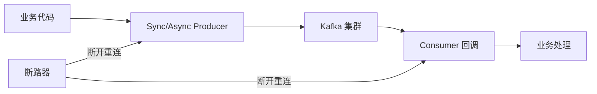

# Golang使用kafka的正确姿势

Kafka 是搜索链路里做异步解耦、削峰填谷的关键中间件，但「能连上」和「用得稳」之间差着一整套工程细节：连接断开怎么自动重连、消息丢了怎么办、重复消费怎么去重、同一业务的消息怎么保证顺序。本节基于项目的 Kafka SDK 封装，讲清楚生产/消费两端的健壮性设计，以及避免消息丢失、实现消费幂等、按业务字段哈希保证顺序的实战要点。（以下代码片段为封装思路示意，具体字段以项目源码/sarama 版本为准，建议实测。）

## 纲要

- 生产者：同步/异步两种模式，发送前校验连接状态
- 消费者：状态机 + 回调函数 + 偏移量提交
- 断线重连：用断路器（circuit breaker）避免雪崩式重试
- 三大坑：消息丢失、重复消费、消息乱序的应对
- 本地验证：docker-compose 起集群 + 测试用例跑通收发

## 第一节 生产者与消费者的封装思路

生产者内部维护 `close / connected / disconnected` 状态。发送前若非 `connected` 直接抛错；发送过程中若检测到 broker 连不上，先把生产者置为断开，再往 `reconnect` channel 丢信号触发重连。异步生产者把消息丢进内部 channel 由 SDK 批量提交，吞吐高但不实时返回结果；同步生产者 `Send` 直接返回实时 error。

消费者维护连接/断开两态，启动时设置默认配置，核心逻辑在后台两个异步任务：一个是「保持连接 + 断线重连」，一个是「持续消费消息」。退出时先让 channel 里未处理完的消息消费完，再 `close` 安全退出。

```go
// 断路器重连（示意）：断开后延时 2s 再触发重连，避免瞬间重试风暴
if cb.IsOpen() {
    if state == disconnected {
        time.Sleep(2 * time.Second)
        triggerReconnect() // 重新实例化 syncProducer 并装载
    }
}
```

消费者默认配置里有两个关键点：设置 `max.poll.interval.ms` 与客户端 `version`，以及初始偏移量——一般从 `latest` 开始消费，特殊场景才用 `earliest`。

## 第二节 本地起集群并验证

用 docker-compose 一键拉起一个 zookeeper + 3 个 Kafka 节点（端口 9091/9092/9093），连任意一个节点即可测试。

```yaml
# docker-compose.yml（示意）
services:
  zookeeper:
    image: confluentinc/cp-zookeeper:latest
    ports: ["2181:2181"]
  kafka1:
    image: confluentinc/cp-kafka:latest
    ports: ["9091:9091"]
  kafka2:
    image: confluentinc/cp-kafka:latest
    ports: ["9092:9092"]
  kafka3:
    image: confluentinc/cp-kafka:latest
    ports: ["9093:9093"]
```



```dir
kafka-sdk/
├── producer/
│   ├── sync.go
│   ├── async.go
│   └── reconnect.go
├── consumer/
│   ├── loop.go
│   └── callback.go
├── circuit/            # 断路器
│   └── breaker.go
└── test/
    └── main_test.go
```

| 问题 | 现象 | 应对手段 |
| --- | --- | --- |
| 消息丢失 | broker 抖动未感知 | 发送实时校验连接 + 失败触发重连 |
| 重复消费 | 重试/重平衡 | 业务实现幂等（去重表/唯一键） |
| 消息乱序 | 落到不同 partition | 按业务字段哈希固定 partition |

## 总结

用 Kafka 的正确姿势，本质是把「网络不可靠」当常态来设计：生产者侧发送前校验连接、失败即重连；消费者侧用断路器在连续失败 3 次后打开、3 秒后半开探测，避免雪崩式重试把集群打垮。

三个高频坑的标配解法要记牢：**消息丢失**靠连接态校验与重连；**重复消费**靠业务幂等（落唯一键/去重）；**消息乱序**靠按业务字段（如 userID）哈希到固定 partition，让同一用户的消息天然有序。本节作业：自己动手实现这套 Kafka SDK 封装，并用同步/异步生产者验证生产、消费全链路跑通。
