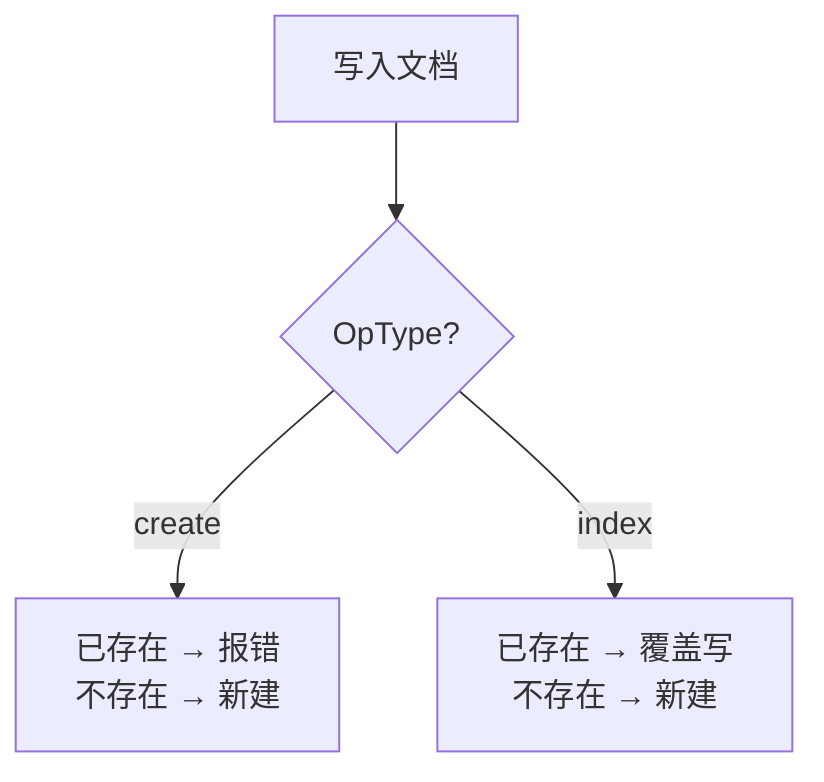
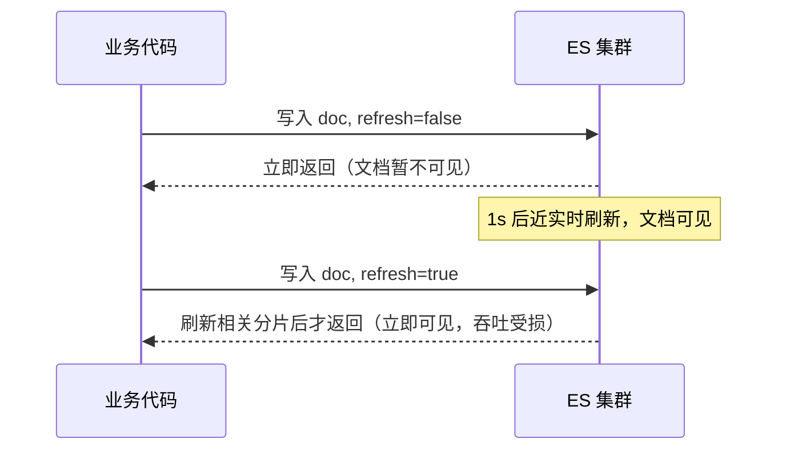

# Go 操作 ES 的一些技巧和注意事项（二）：文档增删改与批量/Bulk 封装

上一节聊了连接、索引与基础读写，这一节进入**文档写链路的封装**：创建、覆盖、删除、更新、upsert，以及它们各自的**批量（Bulk）形态**。这些操作是业务写入 ES 的高频路径，封装得好，吞吐和稳定性都上得去；封装得糙，版本冲突、脏写、吞吐崩塌都会找上门。

> 本文以课程里基于 `olivere/elastic` v7 风格的客户端封装为例（官方 `go-elasticsearch` 语义一致），重点讲清楚**行为语义**而非某一行的 API 拼写。

## 纲要

- 创建文档：`IndexService` + `OpType(create/index)` 的语义差异
- `refresh` 三值：false / true / wait_for 的实时性与吞吐权衡
- Bulk 两种封装：`BulkProcessor` 攒批 vs `BulkService` 实时提交
- 覆盖写（replace）与**有序性**这个隐形坑
- 版本控制：external version 防乱序覆盖
- 删除 / 更新：`deleteByQuery`、`updateByQuery` 与 `proceed_on_version_conflict`
- `upsert`：存在则更新、不存在则插入

## 创建文档：OpType 决定「存在时怎么办」

创建文档时，先拿到 `IndexService`（`client.Index()` 返回），设置索引名、文档 ID、`routing` 和文档结构体。关键在 **`OpType`**：



- `OpType=create`：若文档已存在，返回错误。适合「严格不允许重复写入」的场景。
- `OpType=index`：无论是否存在都写入，存在即覆盖。

传入的 `doc` 可以是结构体，客户端会按字段映射写入 ES。ID 和 `routing` 可选——ES 允许不指定 ID、不指定 routing 写入，但**指定 routing 能让后续读写都落到同一分片，性能更优**。

## refresh：实时性 vs 吞吐的旋钮

`refresh` 有三个取值，默认 `false`，新手容易在这里踩坑：

| 取值 | 行为 | 实时性 | 吞吐 |
| --- | --- | --- | --- |
| `false`（默认） | 写入后不做任何刷新，文档在**下一次近实时刷新（默认 1s）后**才可见 | 低（~1s 延迟） | **高** |
| `true` / `""` | 立即刷新**该文档相关的主分片和副本分片**，文档立即可见 | **高** | 低（极大降低集群吞吐） |
| `wait_for` | 不强迫立即刷新，而是**等待刷新发生后再响应**（等约 1s） | 中 | 中 |



ES 写入先进 index buffer，每隔约 1 秒刷到 OS cache 才可被搜索。`refresh=false` 牺牲一点实时性换吞吐；`refresh=true` 实时性最高但**会极大降低集群吞吐**；`wait_for` 是折中——提交后等刷新发生，拿到响应即可判断文档已写入，便于做后续串联操作。**高吞吐写入场景统一用 `false`**。

## Bulk：两种封装形态

批量创建有两种典型封装：

1. **`BulkProcessor`（攒批提交）**：把文档一条条 `Add` 进 processor，内部积攒到阈值（课程里配的是 **500 条 / 1 秒 / 累计 5MB**，任一满足即提交）后统一提交 ES。简单、性能高，是**通常场景的首选**。
2. **`BulkService`（实时提交一批）**：直接传入一批文档，立即提交并返回 `BulkResponse`。性能略低，但能**实时拿到每批的执行结果**，**可用性要求高的场景**用它。

```dir
docoperation/               文档操作封装包
├── create.go              创建：IndexService + OpType(create)
├── bulk_create.go         BulkProcessor 攒批 / BulkService 实时
├── replace.go             覆盖写：BulkIndexRequest
├── delete.go              DeleteService / deleteByQuery
├── update.go              UpdateService / updateByQuery
└── upsert.go              upsert / docAsUpsert
```

## 覆盖写 replace 与有序性坑

覆盖写用 `BulkIndexRequest`（注意不是 create，是 index）：文档存在就覆盖，不存在就新增。

**隐形坑在于有序性**：相同 `ID` 的文档，必须保证按预期顺序到达。如果旧文档比新文档后处理，就会把旧版本覆盖成「当前最新」——显然不是我们想要的。所以 replace 要**确保同一 ID 的写入有序**，或改用带版本号的方式兜底。

## 版本控制：external version 防乱序

带版本号写入时，实例化请求并指定 `VersionType` 与 `Version`。默认是 **`external`**（`internal` 极少用）。

`external` 的规则：**当前写入的版本号必须大于 ES 中已有文档的版本号，才允许写入**；若 ES 中没有该文档，也会被写入。

业务实践：每次对数据的修改都生成一个版本号，更新时把这个版本号一起提交给 ES，ES 与上一次提交的版本号对比，只有当前版本号更大才覆盖。这样即便消息乱序到达，也不会用旧版本覆盖新版本。

## 删除与更新

- **删除**：用 `DeleteService`，指定 ID 与 `routing`；同样支持 external 版本号（版本必须大于当前才能删）。
- **按查询删除** `deleteByQuery`：用 `query` 设条件命中文档后删除。**关键参数 `proceed_on_version_conflict`**——查询出来的文档在删除过程中可能又被修改，产生版本冲突导致删除失败；开启它能在冲突时继续，最大化保证文档被删干净。
- **更新**：`client.Update()` 返回 `UpdateService`，**必须指定文档 ID**；若是 `updateByQuery` 则必须带 `routing` 才能高效。
- **按查询更新** `updateByQuery`：设 `query` 和更新脚本（ES 默认 painless），同样建议设置 `proceed_on_version_conflict`，先查一批再更新时若文档被改/删产生冲突，也能把该更新的都更新成当前版本。

## upsert：存在更新、不存在插入

`upsert` 即「文档存在则更新，不存在则插入」：

- 用 `OpType=index` + 版本控制实现时，**必须传完整文档结构**（因为插入时是把整篇 doc 写入并覆盖）。
- 另一种更精细的写法：传入两个参数——`update`（一个 map，含要更新的字段与值）和 `doc`（文档不存在时插入的内容），并设 **`DocAsUpsert=true`** 启用 upsert。这样只更新指定字段，不存在时才写入整篇 `doc`。
- 批量 upsert 同理：`BulkUpdateRequest` + `DocAsUpsert=true`，交给 `BulkProcessor` 处理。

## 总结

文档写链路的封装，核心是把「语义」和「性能」两头都顾上：

- **`OpType` 选 create 还是 index**，决定存在时报警还是覆盖；覆盖写务必保证**同 ID 有序**或用 **external 版本号**兜底。
- **`refresh` 是实时性与吞吐的旋钮**，高吞吐写入坚定用 `false`。
- **Bulk 两种形态**：`BulkProcessor` 攒批（高性能、通用）与 `BulkService` 实时（高可用、要结果）。
- **`deleteByQuery` / `updateByQuery` 一定加上 `proceed_on_version_conflict`**，否则并发改写会让批量操作半途失败。
- **`upsert` 用 `DocAsUpsert`** 做「部分更新 + 不存在则插入」最稳。

把这些封装收敛到一个 `docoperation` 包里，业务侧只管传文档和 ID/routing，写入的正确性、吞吐和冲突容错就都有了保障。
