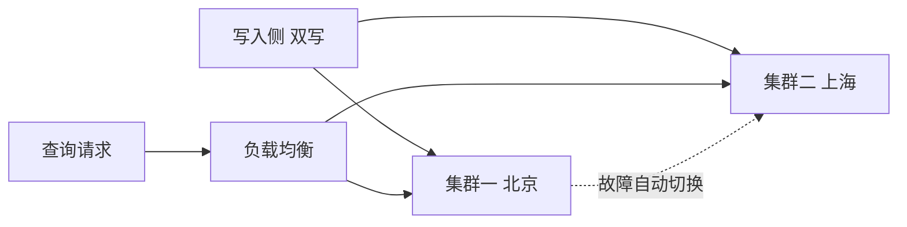

# Go 项目开发: 应对数据膨胀的三个搜索优化方向

数据量涨上来之后，"每个查询都打到全部分片"就成了搜索系统的慢性病。本文从**容量预估**讲到**三个优化方向**，对应商品搜索这类典型场景。

## 纲要

- 怎么预估存储容量
- 分片数规划的两个细节
- 方向一：用上 routing，减少检索范围
- 方向二：数据冷热拆分
- 方向三：多集群分担查询负载

## 怎么预估存储容量

开工前先预估集群的数据量，方法有两种：

- **抽样法** —— 向集群写入一定量数据，用索引总存储空间 ÷ 文档数得到单条文档的平均大小，再乘以预估文档总数，就是主分片占用的总大小。
- **历史数据法** —— 用最近一到三年的线上数据建索引，索引总大小 ÷ 文档数 = 平均单条文档大小，再乘以预估总量。

估算出容量后就能算主分片数：使用 SSD 时按经验值 **单分片 50GB** 计算（经验值不一定对所有场景有效，有条件还是用真实数据压测）。

**两个容易被忽视的细节**：

- **主分片数要容易被节点数整除**。设 1000 个分片比 1020 个更好规划 —— 1000 除了能被偶数整除，还能被个位数为 5 的数整除，后续加节点时选择空间更大。
- **小文本的数据量级要接近千万甚至亿级**。索引自身的元数据也占存储，文档数太少会影响平均单条文档大小的评估准确性。
- **必须模拟线上真实数据，避免写入相同文本** —— 相同文本分词后会产生大量相同的 term，对存储占用量的预估会有偏差。

## 商品数据为什么难优化

商品数据的特点：**没有明确的数据维度，不是用户维度的数据，对全部用户共享**。这导致搜索时**无法通过用户维度做 routing**，每个查询都要路由到全部分片。

而 ES 并不是并发查询所有分片 —— 默认**最多同时查询 5 个分片**；TPS 很高时 CPU 被抢占，实际并发可能还达不到这个值。查询的分片越多、分片越大，查询性能受影响越大。

应对思路有三个方向。

## 方向一：用上 routing —— 优化搜索性能永远的神

一旦查询带上了 routing，就会只路由到指定分片查询。

商品搜索的做法：**用商品类目作为 routing** —— 先根据用户查询关键词做意图识别，判断出用户可能查询的商品类目，再用类目 ID 做 routing 查询，能在很大程度上减少一次查询命中过多分片的问题。

这一条几乎零成本（前提是建模时 routing 设计对了），效果却最直接。

## 方向二：数据冷热拆分

互联网数据的二八原则几乎成了铁律：**约 20% 的数据承载了超过 80% 的访问频率**。

- 收集搜索后被点击的商品、搜索热度高的品类，识别出热点数据。
- 把热点数据**单独存储到一个 ES 集群**，让它使用更充裕的集群资源；数据变更时同步更新。

这 20% 的数据在规模上已经小很多，查询效率自然更高；而大部分请求查的恰恰是这部分数据 —— **总体查询速度随之上升**。

## 方向三：多集群分担查询负载

查询请求量很大时，查询本身特别消耗集群资源。可以搭建**多套集群**：

- 在不同机房搭建 ES 集群，数据**同步写入**到这些集群。
- 查询时通过负载均衡把请求转发到不同集群处理。
- 某个集群故障时，负载均衡切到其他集群。



收益是双重的：**既解决了异地容灾、提高了高可用性，又减轻了单个集群的负载**。单集群在 5000 QPS 和 1000 QPS 量级下的吞吐性能差距很明显，把请求均摊到多个集群，单集群性能显著提升，整体查询效率随之优化。

## API 速览

| 手段 | 关键配置 / 做法 |
| --- | --- |
| 容量预估 | `GET /<index>/_stats` 查索引占用；抽样法 / 历史数据法 |
| 分片规划 | 单分片 50GB 经验值（SSD）；主分片数能被节点数整除 |
| routing 优化 | 写入与查询都带 `routing=<类目ID>`；配合意图识别缩小类目范围 |
| 冷热拆分 | 热点数据单独建集群，变更同步更新 |
| 多集群 | 多机房部署 + 数据双写 + 查询侧负载均衡 |

## 优化架构拓扑

```dir
search-optimization/
├── 容量预估
│   ├── 抽样法
│   └── 历史数据法
├── 方向一 routing
│   └── 类目意图识别
├── 方向二 冷热拆分
│   ├── 热点识别
│   └── 热点集群
└── 方向三 多集群
    ├── 多机房双写
    └── 负载均衡
```

## 总结

三个方向按投入产出排序：**routing 优化近乎零成本、优先做**；**冷热拆分需要热点识别体系，中期做**；**多集群是终局方案，成本最高但顺带解决容灾**。前提只有一个 —— 建模阶段就把 routing 设计对，否则数据膨胀之后，每一步优化都要付重建索引的代价。

