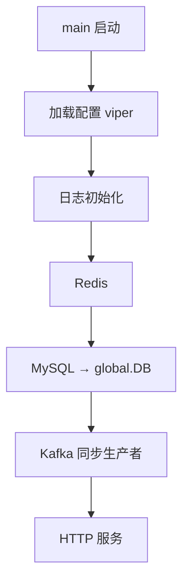

# Go 项目开发: 初始化商城主服务依赖的中间件服务

入口函数 `main.go` 启动的第一件事不是起 HTTP，而是**把依赖的中间件依次初始化**：Redis、MySQL、Kafka。这些组件任何一个是坏的，服务都不该起来 —— 硬着头皮起，后面只会变成一堆难查的运行时错误。

本节讲清楚三件事：**配置怎么读、每个客户端怎么初始化、出错该 panic 还是只记日志**。

## 纲要

- 全局配置：viper 读 yaml + mapstructure 标签
- Redis 初始化：单机版客户端与关键超时参数
- MySQL 初始化：DSN 拼装、连接池三参数、结果存全局
- Kafka 初始化：同步生产者与默认配置
- 错误处理的分寸：什么情况 panic、什么情况只记日志
- 初始化顺序与注意事项总结

## 全局配置：配置从哪来

所有地址都在 `config.yaml` 里，代码里不写死。读配置用 viper，**解析靠 `mapstructure` 标签**，标签名必须和 yaml 的键逐字对上。

```go
package main

import (
	"fmt"
	"time"

	"github.com/spf13/viper"
)

// Config 全局配置，字段标签必须与 config.yaml 的键一一对应
type Config struct {
	Database struct {
		User     string        `mapstructure:"user"`
		Password string        `mapstructure:"password"`
		Host     string        `mapstructure:"host"`
		Name     string        `mapstructure:"name"`
	} `mapstructure:"database"`
	Redis struct {
		Addr         string        `mapstructure:"addr"`
		Password     string        `mapstructure:"password"`
		IdleTimeout  time.Duration `mapstructure:"idle_timeout"`
		ReadTimeout  time.Duration `mapstructure:"read_timeout"`
	} `mapstructure:"redis"`
	Kafka struct {
		Hosts []string `mapstructure:"hosts"`
	} `mapstructure:"kafka"`
}

// LoadConfig 读取 yaml 配置并映射到结构体
func LoadConfig(path string) (*Config, error) {
	viper.SetConfigFile(path)
	viper.SetConfigType("yaml")
	if err := viper.ReadInConfig(); err != nil {
		return nil, fmt.Errorf("read config failed: %w", err)
	}
	var c Config
	if err := viper.Unmarshal(&c); err != nil {
		return nil, fmt.Errorf("unmarshal config failed: %w", err)
	}
	return &c, nil
}

func main() {
	cfg, err := LoadConfig("config/config.yaml")
	if err != nil {
		panic(err)
	}
	fmt.Println("mysql:", cfg.Database.Host, cfg.Database.Name)
	fmt.Println("redis:", cfg.Redis.Addr)
	fmt.Println("kafka:", cfg.Kafka.Hosts)
}
```

**标签对不上不报错，只是静默填零值** —— `Host` 会变成空字符串，等连不上库才反应过来。所以初始化之后**打印一眼关键地址**是很有必要的自检动作。

## Redis / MySQL / Kafka 初始化

三个客户端的初始化套路完全一致：**建连接 → 判错 → 记日志（带上客户端名）→ 决定要不要 panic**。

```go
package main

import (
	"fmt"
	"time"

	"github.com/IBM/sarama"
	"github.com/go-redis/redis/v7"
	"gorm.io/driver/mysql"
	"gorm.io/gorm"
)

// InitRedis 单机版 Redis 客户端
func InitRedis(name, addr, pwd string, idleTimeout, readTimeout time.Duration) (*redis.Client, error) {
	rdb := redis.NewClient(&redis.Options{
		Addr:         addr,
		Password:     pwd,
		IdleTimeout:  idleTimeout,  // 空闲连接多久回收
		ReadTimeout:  readTimeout,  // 读超时，网络抖动时及时失败
		DialTimeout:  5 * time.Second,
	})
	if err := rdb.Ping().Err(); err != nil {
		return nil, fmt.Errorf("redis[%s] init failed: %w", name, err)
	}
	return rdb, nil
}

// InitMysql 建连接 + 设连接池；返回 *gorm.DB 供后续所有操作使用
func InitMysql(name, user, pwd, host, dbName string) (*gorm.DB, error) {
	dsn := fmt.Sprintf("%s:%s@tcp(%s)/%s?charset=utf8mb4&parseTime=True&loc=Local&timeout=10s",
		user, pwd, host, dbName)
	ormDB, err := gorm.Open(mysql.Open(dsn), &gorm.Config{PrepareStmt: true})
	if err != nil {
		return nil, fmt.Errorf("mysql[%s] init failed: %w", name, err)
	}
	sqlDB, err := ormDB.DB()
	if err != nil {
		return nil, fmt.Errorf("mysql[%s] get sqlDB failed: %w", name, err)
	}
	// 默认 0 不限制，高并发直接把 MySQL 打成 too many connections
	sqlDB.SetMaxOpenConns(1000)
	sqlDB.SetMaxIdleConns(10)
	sqlDB.SetConnMaxLifetime(time.Minute)
	return ormDB, nil
}

// InitSyncProducer 同步 Kafka 生产者：SendMessage 同步返回最终结果
func InitSyncProducer(name string, hosts []string) (sarama.SyncProducer, error) {
	if len(hosts) == 0 {
		return nil, fmt.Errorf("kafka[%s] hosts is empty", name)
	}
	producer, err := sarama.NewSyncProducer(hosts, sarama.NewConfig())
	if err != nil {
		return nil, fmt.Errorf("kafka[%s] init failed: %w", name, err)
	}
	return producer, nil
}

func main() {
	redisClient, err := InitRedis("default_redis_client", "127.0.0.1:6379", "", 100*time.Second, 10*time.Second)
	if err != nil {
		panic(err) // Redis 起不来属于致命错误，直接 panic
	}
	defer redisClient.Close()

	ormDB, err := InitMysql("default_client", "root", "pwd", "127.0.0.1:3306", "shop")
	if err != nil {
		panic(err)
	}

	producer, err := InitSyncProducer("default_kafka_sync_producer", []string{"127.0.0.1:9092"})
	if err != nil {
		panic(err) // Kafka 不可用同样致命
	}
	defer producer.Close()

	fmt.Println("init ok:", redisClient, ormDB, producer)
}
```

三个细节：

- **Kafka 选同步生产者**。商城主服务发的是商品变更事件，丢一条就少一次索引同步，宁可慢一点也要拿到确定的发送结果。`AsyncProducer` 是往 channel 里丢，退出时容易丢消息 —— 这就是下一节要做优雅退动的直接原因。
- **MySQL 初始化完必须把 `*gorm.DB` 挂到全局变量**（项目里是 `global.DB`），后面 service 层统一从全局取，谁也不用再连一次。
- **错误日志里带上客户端名**。线上挂了多个 Redis / MySQL / Kafka 时，没有名字你根本不知道是哪个集群的问题。

## 错误处理的分寸

不是所有错误都该 panic，分三档最合理：

| 组件 | 初始化失败 | 处理 |
| --- | --- | --- |
| Redis | 连不上 | **panic**（缓存不可用，接口大面积异常） |
| MySQL | 连不上 | **panic**（主服务直接不可用） |
| Kafka | 连不上 | **panic**（变更事件发不出去） |
| 某个可选组件 | 连不上 | 记 error 日志 + panic 前先打点，让巡检能看见 |

判断标准只有一句：**这个组件现在挂掉，服务还能不能正常对外提供服务？不能，就 panic。**

## 初始化顺序

```txt
1. 加载配置（viper）        ← 失败直接退出
2. 初始化日志（base/setupLog，写 runtime/log）
   ↑ 必须排在前，后面的错误都要能落日志
3. 初始化 Redis
4. 初始化 MySQL → global.DB
5. 初始化 Kafka 同步生产者
6. 初始化 JWT / Redis 监听 / 微信相关
7. 起 HTTP 服务
```

日志一定要在其它组件之前初始化 —— 否则后面每一步的错误都只能打到 stderr，进不了 runtime/log，线上排障直接瞎。

## 关键设计速览



```dir
supermain/
├── config/
│   ├── config.yaml
│   └── config.go          viper + mapstructure
├── pkg/
│   ├── cache/             Redis 封装
│   ├── db/                MySQL 封装
│   └── mq/                Kafka 封装
├── internal/
│   └── middleware/
└── main.go                初始化入口
```

## 注意事项总结

1. **配置全在 `config.yaml`**，viper 读进来先用 mapstructure 映射，标签名必须逐字对齐。
2. **标签对不上是静默失败**，初始化完打印一眼关键地址做自检。
3. **Redis 单机版用 `redis.NewClient`**，别忘 `Ping()` 探活。
4. **MySQL 设连接池三参数**，默认不限制会把 MySQL 打爆。
5. **MySQL 的 `*gorm.DB` 挂到全局**，service 层统一从全局取。
6. **Kafka 主服务用同步生产者**，宁可慢也要拿到确定结果。
7. **错误日志必须带客户端名**，多集群定位全靠它。
8. **致命组件初始化失败直接 panic**，别让服务带病启动。
9. **日志初始化排第一**，否则后面的错误无处可落。

## 总结

入口 `main.go` 第一件事不是起 HTTP，而是**把依赖的中间件依次初始化**：Redis、MySQL、Kafka。任何一个坏了，服务都不该带病起来——硬起只会变成一堆难查的运行时错误。

套路是统一的：**建连接 → 判错 → 记日志（带客户端名）→ 决定 panic 还是只记日志**。致命组件（Redis / MySQL / Kafka）连不上就直接 panic，判断标准只有一句：这个组件挂了服务还能不能正常对外服务？不能就 panic。同时日志必须排第一初始化，否则后续错误进不了 runtime/log，线上排障直接瞎。

