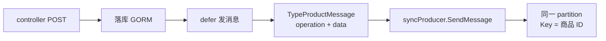

# Go 项目开发: 商品变更事件发送 Kafka 消息

上节把生产者的重连、状态判断、优雅关闭都做完了，这一节要真正往 topic 里塞数据：**商品的增、改、删、上架、下架，全部变成一条带 operation 的消息**。

同步链路是 `supermain（商品变更）→ Kafka（shop_product）→ productconsumer（写 ES）`。这节只做前半段：**怎么把变更事件发出去，还不拖慢接口**。

三个必须同时满足的目标：

- **不丢**：同步发送（等 broker  ack），失败必须记日志，生产里要有补偿
- **不乱序**：同一商品的消息落进同一个 partition —— Key 用商品 ID
- **不拖接口**：发送放在 `defer` 里，response 先回给客户端，消息随后再发

## 纲要

- 消息结构体放哪：models 里的 TypeProductMessage
- topic 与 operation 枚举：统一收在 pkg/enums
- controller 的 POST：改动成功后在 defer 里发消息
- DTO.ID > 0 判更新，等于 0 判创建
- Key 用商品 ID 哈希进同分区，同一个商品不会乱序
- 上下架：Status == 0 判下架，且必须先把商品详情取出来
- 删除：硬删除之前必须先取 productinfo，删完就取不到了
- 把发送逻辑抽成 service 层（本节作业）

## 消息结构体：定义在 models 里

消息体放 `internal/models/store_product.go`。商品本体结构体 `StoreProduct` 里有商品名称、详情、关键词、类型这一系列字段，**大部分都要发给下游**，所以消息里带上整份商品数据，而不是只带一个 ID。

```go
package main

import "fmt"

// ---------------- internal/models/store_product.go ----------------

// 商品主表结构体：要同步给搜索侧的字段基本都在这
type StoreProduct struct {
	ID          int64  `json:"id"`
	Title       string `json:"title"`
	Description string `json:"description"`
	Keywords    string `json:"keywords"`
	TypeID      int64  `json:"type_id"`
	Status      int    `json:"status"`
	Price       int64  `json:"price"`
	CreatedAt   int64  `json:"created_at"`
}

// 商品变更事件的消息体：操作类型 + 商品数据，两层就够消费端用了
type TypeProductMessage struct {
	Operation string        `json:"operation"`
	Data      *StoreProduct `json:"data"`
}

// ---------------- pkg/enums/product/event.go ----------------

const (
	// 一个 topic 只装一类商品变更，下游 productconsumer 一个消费者组就够
	ProductTopic = "shop_product"

	// operation：增删改 + 上下架，消费端靠它 switch
	ProductOpCreate = "create"
	ProductOpUpdate = "update"
	ProductOpDelete = "delete"
	ProductOpOnSale = "onsale"
	ProductOpUnSale = "unsale"
)

func main() {
	msg := TypeProductMessage{
		Operation: ProductOpUpdate,
		Data:      &StoreProduct{ID: 1001, Title: "87 键机械键盘", Status: 1},
	}
	fmt.Println(msg.Operation, msg.Data.ID, msg.Data.Title)
}
```
**为什么是 operation + data 两层？**

- `operation` 让消费端只做一层 `switch`，不用去猜 Data 里哪个字段变了
- `Data` 直接复用 `StoreProduct` 指针，不在消息层再造一份重复的 DTO
- `Data` 用**指针**而不是值：以后商品表加字段、做软删除重建索引，消息结构都不用跟着改

## controller 里发消息：放在 defer 里

商品变更在后台操作，代码在 `supermain/internal/controllers/storeproduct` 的 `Post` 方法里。改动成功之后、返回 response 之前发消息，但**不能直接写在返回语句前面** —— 那会把接口耗时拉长，Kafka 一抖 P99 就飙上去了。

Go 的 `defer` 是**函数返回之后**才执行，正好把发送挪到 response 之后：

```go
package main

import (
	"encoding/json"
	"fmt"
	"strconv"

	"github.com/IBM/sarama"
)

// 实际项目里这些在 internal/models 和 pkg/enums，这里为了整块能跑原样贴出来
type StoreProduct struct {
	ID          int64  `json:"id"`
	Title       string `json:"title"`
	Description string `json:"description"`
	Keywords    string `json:"keywords"`
	TypeID      int64  `json:"type_id"`
	Status      int    `json:"status"`
	Price       int64  `json:"price"`
}

type TypeProductMessage struct {
	Operation string        `json:"operation"`
	Data      *StoreProduct `json:"data"`
}

const (
	ProductTopic    = "shop_product"
	ProductOpCreate = "create"
	ProductOpUpdate = "update"
)

// DTO：绑定 POST body 进来的参数
type StoreProductDTO struct {
	ID          int64  `json:"id"`
	Title       string `json:"title"`
	Description string `json:"description"`
	Keywords    string `json:"keywords"`
	TypeID      int64  `json:"type_id"`
	Status      int    `json:"status"`
	Price       int64  `json:"price"`
}

// 模拟 global.GetSyncProducer("default_kafka_sync_producer")
var syncProducer sarama.SyncProducer

// Post：商品新增和改动都走这一个接口
func Post(dto *StoreProductDTO) error {
	// 1. 落库（GORM 写入，此处省略）
	product := &StoreProduct{
		ID:          dto.ID,
		Title:       dto.Title,
		Description: dto.Description,
		Keywords:    dto.Keywords,
		TypeID:      dto.TypeID,
		Status:      dto.Status,
		Price:       dto.Price,
	}

	// 2. response 返回之后才执行 —— 不占接口耗时
	defer func() {
		operation := ProductOpCreate
		if dto.ID > 0 {
			operation = ProductOpUpdate
		}
		sendProductEvent(operation, product)
	}()

	return nil
}

// 同步发送：返回 partition / offset / error
func sendProductEvent(operation string, product *StoreProduct) {
	message, _ := json.Marshal(TypeProductMessage{Operation: operation, Data: product})

	producerMessage := &sarama.ProducerMessage{
		Topic: ProductTopic,
		// Key 用商品 ID：哈希分区后同一商品永远落在同一 partition，
		// 同一商品的增删改才是有序的，不会"后发先至"把新数据盖成旧数据
		Key:   sarama.ByteEncoder(strconv.FormatInt(product.ID, 10)),
		Value: sarama.ByteEncoder(message),
	}

	partition, offset, err := syncProducer.SendMessage(producerMessage)
	if err != nil {
		// 生产里这里要做补偿或重发，演示阶段先记日志
		fmt.Println("send message error", err.Error(), partition, offset, product.ID)
		return
	}
	fmt.Println("send message success", partition, offset, product.ID)
}

func main() {
	_ = Post(&StoreProductDTO{ID: 1001, Title: "87 键机械键盘", Status: 1})
}
```
**逐行走一遍：**

- `operation` 先默认成 `create`，再看 `dto.ID > 0` 判成 `update`。DTO 是 `bind` 解析出来的，**带 ID 就是改，ID 为零就是新增**，不需要前端额外传一个操作类型
- `json.Marshal(productMessage)` 拿到 `[]byte`，正好是 `Value` 需要的编码
- 生产者用 `global.GetSyncProducer("default_kafka_sync_producer")` 取，上一节初始化的是**同步生产者**
- `SendMessage` 返回 `partition、offset、error` 三个值，**三个都要接住**：出错时 partition/offset 是无效值但至少能看出是哪次发送失败
- 判断流程：`SendMessage` 阻塞到 broker ack 才返回（上节配的 `RequiredAcks = WaitForAll`），所以 err 非 nil 就是真丢了，必须记

## 上下架：Status == 0 判下架

上下架接口只传两个东西，DTO 里基本就一个 `Status`。默认 operation 是 `onsale`，**`Status == 0` 才是下架**，改成 `unsale`。

关键一点：上下架只改状态位，但**商品详情还得原样带给消费端**，消费端要用它重刷索引，所以必须 `models.GetProduct(id)` 把详情捞出来。

```go
package main

import (
	"encoding/json"
	"errors"
	"fmt"
	"strconv"

	"github.com/IBM/sarama"
)

type StoreProduct struct {
	ID     int64  `json:"id"`
	Title  string `json:"title"`
	Status int    `json:"status"`
	Price  int64  `json:"price"`
}

type TypeProductMessage struct {
	Operation string        `json:"operation"`
	Data      *StoreProduct `json:"data"`
}

const (
	ProductTopic    = "shop_product"
	ProductOpOnSale = "onsale"
	ProductOpUnSale = "unsale"
)

// 上下架接口只有一个状态参数
type StatusDTO struct {
	ID     int64 `json:"id"`
	Status int   `json:"status"` // 0 下架，非 0 上架
}

var syncProducer sarama.SyncProducer

// 内存里假装有一张商品表，对应 models.GetProduct 的查询
var productTable = map[int64]*StoreProduct{
	1001: {ID: 1001, Title: "87 键机械键盘", Status: 1},
	1002: {ID: 1002, Title: "4K 显示器", Status: 1},
}

func getProduct(id int64) (*StoreProduct, error) {
	if p, ok := productTable[id]; ok {
		return p, nil
	}
	return nil, errors.New("product not found")
}

// OnSale 对应 storeproduct 控制器的 OnSale 方法
func OnSale(dto *StatusDTO) error {
	operation := ProductOpOnSale
	if dto.Status == 0 {
		operation = ProductOpUnSale
	}

	// 商品详情要原样发给消费端去刷索引，不能只发一个 ID
	info, err := getProduct(dto.ID)
	if err != nil {
		return err
	}
	info.Status = dto.Status

	message, _ := json.Marshal(TypeProductMessage{Operation: operation, Data: info})
	partition, offset, err := syncProducer.SendMessage(&sarama.ProducerMessage{
		Topic: ProductTopic,
		Key:   sarama.ByteEncoder(strconv.FormatInt(dto.ID, 10)),
		Value: sarama.ByteEncoder(message),
	})
	if err != nil {
		fmt.Println("send message error", err.Error(), partition, offset, dto.ID)
		return err
	}
	fmt.Println("send message success", partition, offset, dto.ID)
	return nil
}

func main() {
	_ = OnSale(&StatusDTO{ID: 1002, Status: 0})
}
```
**上下架和改价的差别：** 改价的 `Data` 就是前端 post 上来的那一份；上下架的 `Data` 是**从库里捞出来的完整商品**，前端只给了状态位，所以必须回查。

## 删除：硬删除之前必须先取详情

删除走的是 `Delete` 方法。这一处最容易写出 bug 的地方是：

> 商品是**硬删除**的。删完之后再调 `getProduct`，**已经取不到了**。

所以顺序只能是：**先取 productinfo → 再落库删除 → 最后发消息**。而且取的时候顺手判一下，客户端传的 ID 查不到商品就直接抛异常，不要发一条空消息的删除事件出去。

```go
package main

import (
	"encoding/json"
	"errors"
	"fmt"
	"strconv"

	"github.com/IBM/sarama"
)

type StoreProduct struct {
	ID     int64  `json:"id"`
	Title  string `json:"title"`
	Status int    `json:"status"`
}

type TypeProductMessage struct {
	Operation string        `json:"operation"`
	Data      *StoreProduct `json:"data"`
}

const ProductTopic = "shop_product"

var syncProducer sarama.SyncProducer

var productTable = map[int64]*StoreProduct{
	1001: {ID: 1001, Title: "87 键机械键盘", Status: 1},
	1002: {ID: 1002, Title: "4K 显示器", Status: 1},
}

func getProduct(id int64) (*StoreProduct, error) {
	if p, ok := productTable[id]; ok {
		return p, nil
	}
	return nil, errors.New("product not found")
}

// Delete 对应 storeproduct 控制器的 Delete 方法
func Delete(id int64) error {
	// 关键：硬删除，删完就查不到了，必须在删除之前把详情取出来
	info, err := getProduct(id)
	if err != nil {
		return err // 商品不存在，直接返回，不要发删除消息
	}

	// 1. 先落库删除
	delete(productTable, id)

	// 2. 再发删除事件，消费端据此把 ES 里的文档删掉
	message, _ := json.Marshal(TypeProductMessage{Operation: "delete", Data: info})
	partition, offset, err := syncProducer.SendMessage(&sarama.ProducerMessage{
		Topic: ProductTopic,
		Key:   sarama.ByteEncoder(strconv.FormatInt(id, 10)),
		Value: sarama.ByteEncoder(message),
	})
	if err != nil {
		fmt.Println("send message error", err.Error(), partition, offset, id)
		return err
	}
	fmt.Println("send message success", partition, offset, id)
	return nil
}

func main() {
	_ = Delete(1002)
}
```
**删库与发消息不是原子的。** 删成功了但消息没发出去，ES 里就留着一条永远删不掉的脏数据。这一条兜不住，**靠的是后面"索引商品数据"那节的全量重建 + 定期对账**，增量消息只负责实时性。

## 把发送逻辑抽成 service 层（本节作业）

三个地方（改、上下架、删）复用同样一段发送代码，最该抽出去。抽成 `ProductEventSender` 之后，业务代码里只剩"组装消息 + 调 Send"：

```go
package main

import (
	"context"
	"encoding/json"
	"fmt"
	"strconv"
	"time"

	"github.com/IBM/sarama"
)

type StoreProduct struct {
	ID     int64  `json:"id"`
	Title  string `json:"title"`
	Status int    `json:"status"`
}

type TypeProductMessage struct {
	Operation string        `json:"operation"`
	Data      *StoreProduct `json:"data"`
}

const ProductTopic = "shop_product"

// ProductEventSender：把 topic、producer、序列化规则收拢在一处
type ProductEventSender struct {
	producer sarama.SyncProducer
	topic    string
}

func NewProductEventSender(p sarama.SyncProducer, topic string) *ProductEventSender {
	return &ProductEventSender{producer: p, topic: topic}
}

// Send：组装、设 Key、同步发送，只把错误抛给调用方
func (s *ProductEventSender) Send(ctx context.Context, operation string, product *StoreProduct) error {
	message, err := json.Marshal(TypeProductMessage{Operation: operation, Data: product})
	if err != nil {
		return fmt.Errorf("marshal product message: %w", err)
	}
	_, _, err = s.producer.SendMessage(&sarama.ProducerMessage{
		Topic: s.topic,
		Key:   sarama.ByteEncoder(strconv.FormatInt(product.ID, 10)),
		Value: sarama.ByteEncoder(message),
	})
	return err
}

// Close 同步关闭，会把缓冲区冲干，进程退出前一定要调
func (s *ProductEventSender) Close() error {
	return s.producer.Close()
}

var syncProducer sarama.SyncProducer

func main() {
	// 同步发送会一直阻塞到 ack（上节配的 RequiredAcks = WaitForAll）
	// 高吞吐场景换异步生产者 + Close 冲干；关键链路（改价、上下架）再保留同步
	ctx, cancel := context.WithTimeout(context.Background(), 3*time.Second)
	defer cancel()

	sender := NewProductEventSender(syncProducer, ProductTopic)
	defer func() { _ = sender.Close() }()

	_ = sender.Send(ctx, "update", &StoreProduct{ID: 1001, Title: "87 键机械键盘", Status: 1})
}
```
## 关键设计速览



| operation | 触发场景 | 是否需回查详情 |
| --- | --- | --- |
| create / update | 新增 / 改动 | 否（前端已给） |
| onsale / unsale | 上下架 | 是（回查完整商品） |
| delete | 硬删除 | 是（删前先取） |

```dir
supermain/
├── internal/
│   ├── models/
│   │   └── store_product.go 商品结构 + 消息体
│   ├── controllers/
│   │   └── storeproduct/     POST/OnSale/Delete
│   └── service/
│       └── product_event.go  发送逻辑抽层
├── pkg/
│   └── enums/
│       └── product/event.go  topic + operation
└── global/                   同步生产者句柄
```

## 注意事项总结

1. **消息体放 models，枚举放 pkg/enums**，不要散在各个 controller 里各写各的字符串。
2. **operation 一定要是个枚举常量**，别在业务里硬写 `"create"` 这种字面量，拼错一个字母消费端就静默丢事件。
3. **Key 必须是商品 ID**，配合哈希分区（`sarama.NewHashPartitioner`），同一个商品的所有事件才会进同一个 partition，才谈得上有序。Key 换成时间戳或 UUID，顺序保证直接作废。
4. **Key 要转字符串**：`strconv.FormatInt(dto.ID, 10)`，`ProducerMessage.Key` 是 `Encoder` 类型。
5. **Value 直接放序列化后的字节**：`sarama.ByteEncoder(message)`，和 `json.Marshal` 的返回值天然对齐。
6. **发送放 defer 是为了不拖接口**，但 defer 里的错误**没法变成 HTTP 响应**，所以只能记日志 + 走补偿，别指望前端感知到。
7. **同步发送会阻塞到 ack**，改价、上下架这类强一致场景用它；大批量导入场景要换异步生产者，否则接口会被拖死。
8. **err 日志要把 partition、offset、商品 ID 都打出来**，出问题时是唯一能定位到具体哪条商品、哪次发送的依据。
9. **上下架必须回查商品详情**：前端只给了状态位，`Data` 得是完整的 `StoreProduct`。
10. **删除必须硬删前先取详情**，取不到直接 return，不要发送一条空消息的删除事件。
11. **删库和发消息不是原子的**，增量消息保证实时、全量重建保证最终一致，两条腿走路。
12. **进程退出前要 `Close()` 生产者**，否则还压在缓冲区里的消息直接没了（上节的优雅退出就是干这个的）。

## 本节作业

把三个 controller（改动、上下架、删除）里的发送代码抽成一个 service 方法，**入参只有 `(operation string, productID int64, data *StoreProduct)`**，内部统一做序列化、设 Key、同步发送、错误日志；再给 `Send` 加一个超时控制，避免 broker 抖动时把 goroutine 堵死。

## 总结

把商品的增、改、删、上架、下架统一变成一条带 `operation` 的消息，是数据同步链路的前半段。三个目标必须同时满足：**不丢**（同步发送等 ack、失败记日志）、**不乱序**（Key 用商品 ID 哈希进同分区）、**不拖接口**（发送放 `defer`，response 先回客户端）。

几个关键取舍：消息体放 models、枚举放 pkg/enums，别散在 controller 里硬写字面量；上下架和删除必须**回查完整商品详情**再发，否则消费端刷不出索引；删库和发消息不是原子的，靠全量重建 + 定期对账兜底。进程退出前务必 `Close()` 生产者，否则缓冲区里的消息直接没了。

