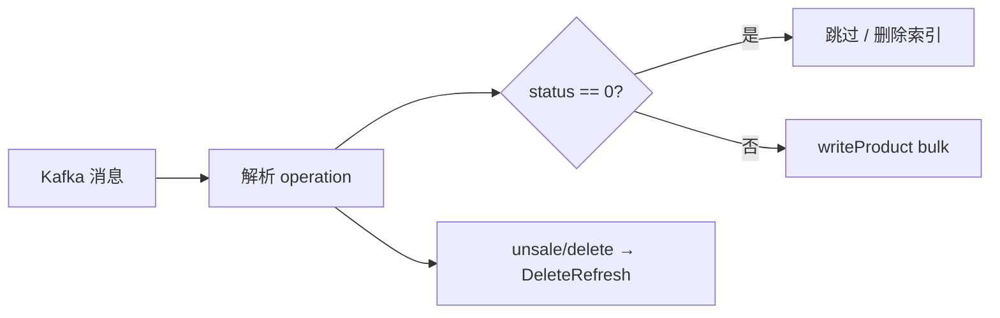

# Go 项目开发: 索引商品数据（productconsumer 消费写 ES）

链路走到最后一段了：`supermain 商品变更 → Kafka(shop_product) → productconsumer → ES`。

这一节拆三小节讲完：**索引 setting 怎么改、consumer 服务怎么起怎么关、消息回调里怎么分支写 ES**。核心就一句话 —— **下架的商品不进 ES，得下架时同步把文档删掉**。

## 纲要

- 索引 setting：description 单独挂一个带 html_strip 的分词器
- 为什么这个分词器不能放进公共 analyzer
- 组件初始化：Redis、ES 客户端，容器里 panic 前必须先打日志
- 优雅关闭顺序：先断 Kafka，再关 ES（bulk processor 必须 Close）
- 常量与索引结构体：index 名称、operation、topic 收在 global/constant
- 启动消费者：StartKafkaConsumer + 消息回调
- 消费回调：解析失败也要 return true，否则消息无限重投
- 写 ES 的分支：create / onsale / update / delete / unsale
- 下架用 DeleteRefresh 同步删，上架才写索引
- 调试验证：下架不落索引，上架后能搜到

## 索引 setting：给 description 单开一个分词器

商品详情字段 `description` 里带 **HTML 标签**，要把它过滤掉。ES 内置了 `html_strip` char_filter，直接挂上就行：

```txt
{
  "settings": {
    "analysis": {
      "analyzer": {
        "ik_max_word_with_html": {
          "type": "custom",
          "tokenizer": "ik_max_word",
          "char_filter": ["html_strip"]
        }
      }
    }
  },
  "mappings": {
    "properties": {
      "id":        { "type": "integer" },
      "title":     { "type": "text", "analyzer": "ik_max_word" },
      "keywords":  { "type": "text", "analyzer": "ik_max_word" },
      "description": { "type": "text", "analyzer": "ik_max_word_with_html" },
      "price":     { "type": "integer" },
      "cat_id":    { "type": "integer" },
      "status":    { "type": "integer" }
    }
  }
}
```
**为什么不直接把 `html_strip` 塞进公共的 `ik_max_word`？**

- 商品标题、关键词这些字段**根本不含 HTML**，白过一遍 char_filter 就是纯浪费
- ES 索引阶段每个字段都要走一次 analysis，`char_filter` 是**逐字段**执行的，字段一多，这点浪费会被放大
- 追求极致性能的项目，这类细节要提前用设计规避掉：`description` 用一个独立 analyzer，其它字段照旧走 `ik_max_word`

索引建好后如果结构上要调整，**必须先删再建**（`DELETE /shop_product` → `PUT /shop_product`），直接 PUT setting 是不生效的。

## 常量与索引结构体

消费端要用到的索引名、operation、topic 统一收在 `global/constant` 里，不要在每个文件里写字符串字面量：

```go
package main

// ---------------- global/constant.go ----------------

const (
	// 索引用统一前缀，重建索引时按前缀批量操作
	IndexProduct = "shop_product"

	// topic 与上游保持一致
	TopicProduct = "shop_product"

	// operation：发消息和消费消息用的是同一套值
	OperationCreate = "create"
	OperationUpdate = "update"
	OperationDelete = "delete"
	OperationOnSale = "onsale"
	OperationUnSale = "unsale"

	// ES 客户端名，和初始化时传的一致
	ESDefaultClient = "default_client"

	// 商品消费者组名，同组消费者分摊分区
	ConsumerGroupProduct = "productconsumer"
)

// ---------------- internal/consumer/product_index.go ----------------

// storeProduct：上游 supermain 里 models.StoreProduct 发过来的那一份商品数据
type storeProduct struct {
	ID          int64  `json:"id"`
	Title       string `json:"title"`
	Description string `json:"description"`
	Keywords    string `json:"keywords"`
	CatID       int    `json:"cat_id"`
	Status      int    `json:"status"`
	Price       int64  `json:"price"`
}

// productMessage：消费者真正解析出来的消息结构
type productMessage struct {
	Operation    string        `json:"operation"`
	ProductIndex *storeProduct `json:"product_index"`
}

func main() {
	msg := productMessage{Operation: OperationUpdate, ProductIndex: &storeProduct{ID: 26, Status: 1}}
	println(msg.Operation, msg.ProductIndex.ID)
}
```
**注意 `ProductIndex` 是指针。** 解析出来之后要先判空，再取字段 —— 一条坏消息可能根本没有 `product_index` 段。

## 组件初始化：容器里 panic 前必须先打日志

初始化 Redis 和 ES 两个客户端，ES 起来之后要**赋到全局变量**里，后面消费回调直接用，不用每次 `GetClient`。

关键细节：**`panic` 之前必须先 `log.Error`**。生产是部署在容器里的，直接 panic 日志就随容器一起没了，得靠日志采集才能看到。

```go
package main

import (
	"fmt"
	"time"

	"github.com/go-redis/redis/v7"
	"github.com/olivere/elastic/v7"
)

// 常量沿用上一段（实际项目在 global/constant.go）
const ESDefaultClient = "default_client"

// global：整个工程共用的句柄
var (
	gESClient *elastic.Client
	gRedis    *redis.Client
)

// InitESClient：对应 pkg/es 的 InitESClientWithOptions
func InitESClient(name, url, user, pwd string) error {
	client, err := elastic.NewClient(
		elastic.SetURL(url),
		elastic.SetBasicAuth(user, pwd),
		elastic.SetHealthcheck(true),
		elastic.SetHealthcheckInterval(15*time.Second),
		elastic.SetSniff(false), // 直接连单一节点时关掉 sniff
	)
	if err != nil {
		return err
	}
	if name != "" {
		fmt.Println("init es client", name)
	}
	gESClient = client
	return nil
}

// InitRedis：对应 pkg/cache 的 InitRedis
func InitRedis(addr, pwd string) error {
	rdb := redis.NewClient(&redis.Options{
		Addr:         addr,
		Password:     pwd,
		IdleTimeout:  30 * time.Second,
		MaxRetries:   3,
	})
	if err := rdb.Ping().Err(); err != nil {
		return err
	}
	gRedis = rdb
	return nil
}

func main() {
	if err := InitRedis("127.0.0.1:6379", ""); err != nil {
		fmt.Println("init redis error", err.Error())
		return
	}
	if err := InitESClient(ESDefaultClient, "http://127.0.0.1:9200", "elastic", "123456"); err != nil {
		fmt.Println("init es client error", err.Error())
		return
	}
}
```
Mongo 这节暂时不用，等订单那块再初始化。

## 优雅关闭：先断 Kafka，再关 ES

关闭顺序**不能反**：

- **先关 Kafka 消费者**：入口断掉就不再有新消息进来
- **再关 ES**：此时没有流量了，关中间件才安全（和 `supermain` 里"先关 HTTP 再关 Kafka"是同一个道理 —— 先断入口）

还有一个最容易漏的：**bulk processor 必须 Close**。它是**异步**的，消息丢进 Go 的 channel 就算返回了，进程一退，channel 里攒着的批量请求全丢，这就是数据不一致的来源。

```go
package main

import (
	"fmt"

	"github.com/IBM/sarama"
	"github.com/olivere/elastic/v7"
)

const (
	// 索引名与 group（实际项目在 global/constant.go）
	TopicProduct         = "shop_product"
	ConsumerGroupProduct = "productconsumer"
)

// ESClient 包一层，Close 里显式关掉 bulk processor
type ESClient struct {
	bulk *elastic.BulkProcessor
}

// Close 会等 bulk 把滞留请求全部提交完再返回
func (c *ESClient) Close() error {
	if c == nil || c.bulk == nil {
		return nil
	}
	// Close 无参，它内部会等滞留请求全部提交完再返回
	if err := c.bulk.Close(); err != nil {
		return err
	}
	fmt.Println("es bulk processor closed")
	return nil
}

// productConsumer：MQ 包导出的消费者，内部是 consumer group
type productConsumer struct {
	group sarama.ConsumerGroup
}

// Close 是同步的，会等 rebalance 结束
func (c *productConsumer) Close() error {
	if c == nil || c.group == nil {
		return nil
	}
	return c.group.Close()
}

var kafkaHosts = []string{"127.0.0.1:9092"}

// startConsumer：真实项目里是 mq.StartKafkaConsumer(hosts, topics, group, cfg, handler)
func startConsumer(topics []string, group string) (*productConsumer, error) {
	cfg := sarama.NewConfig()
	cfg.Consumer.Group.Rebalance.Strategy = sarama.BalanceStrategyRoundRobin
	cfg.Consumer.Offsets.Initial = sarama.OffsetNewest
	group2, err := sarama.NewConsumerGroup(kafkaHosts, group, cfg)
	if err != nil {
		return nil, err
	}
	return &productConsumer{group: group2}, nil
}

// 关闭顺序：先 Kafka 断入口，再 ES
var hooks = []func() error{
	closeKafka,
	esClientClose,
}

func closeKafka() error {
	fmt.Println("closing kafka consumer")
	return nil
}

func esClientClose() error {
	return globalES.Close()
}

var globalES = &ESClient{}

func gracefulExit() {
	for i, h := range hooks {
		if err := h(); err != nil {
			// 单个失败只记日志，不要中断其余关闭动作
			fmt.Println("close hook", i, "error", err.Error())
		}
	}
}

func main() {
	pc, err := startConsumer([]string{TopicProduct}, ConsumerGroupProduct)
	if err != nil {
		fmt.Println("start consumer error", err.Error())
		return
	}
	gracefulExit()
	_ = pc
}
```
## 消费回调：解析失败也必须提交 offset

回调签名是 `func(message *sarama.ConsumerMessage) (bool, error)`，**返回 `true` 才提交 offset**。

这里有个很容易写错的点：**`json.Unmarshal` 失败也要 `return true`**。

- 解析不出来 = 这条消息根本不是合法 JSON
- 你要是返回 `false`，消息会**一直重回队列**，重启再消费、还是解析失败，无限循环
- 这种消息重试多少次都不会成功，正确做法是打日志（或者落到数据库做人工/补偿处理），**然后提交 offset**

```go
package main

import (
	"context"
	"encoding/json"
	"fmt"
	"strconv"

	"github.com/IBM/sarama"
	"github.com/olivere/elastic/v7"
)

// 索引名、operation、商品结构（实际项目在 global/constant 和 product_index.go）
const (
	IndexProduct     = "shop_product"
	OperationCreate  = "create"
	OperationUpdate  = "update"
	OperationDelete  = "delete"
	OperationOnSale  = "onsale"
	OperationUnSale  = "unsale"
)

type storeProduct struct {
	ID     int64  `json:"id"`
	Title  string `json:"title"`
	Status int    `json:"status"`
	CatID  int    `json:"cat_id"`
}

type productMessage struct {
	Operation    string        `json:"operation"`
	ProductIndex *storeProduct `json:"product_index"`
}

var (
	esClient      *elastic.Client
	bulkProcessor *elastic.BulkProcessor
)

// messageHandler：每条消息进来都走这里
func messageHandler(message *sarama.ConsumerMessage) (bool, error) {
	// 先打日志看看消息长什么样，排查问题时这是最直接的手段
	fmt.Println("partition", message.Partition, "offset", message.Offset, "value", string(message.Value))

	var msg productMessage
	if err := json.Unmarshal(message.Value, &msg); err != nil {
		fmt.Println("unmarshal product message error", err.Error(), string(message.Value))
		return true, nil // 非法消息不重投，直接提交 offset
	}
	if msg.ProductIndex == nil {
		fmt.Println("product index is nil", string(message.Value))
		return true, nil
	}

	p := msg.ProductIndex
	switch msg.Operation {
	case OperationCreate, OperationOnSale:
		// 创建时可能还没上架，ES 里只搜已上架商品，没上架的直接不落索引
		if p.Status == 0 {
			return true, nil
		}
		writeProduct(context.Background(), p)

	case OperationUpdate:
		// 改商品顺手把它下架了：先删文档，再写新的
		if p.Status == 0 {
			deleteProduct(context.Background(), p)
			return true, nil
		}
		writeProduct(context.Background(), p)

	case OperationDelete, OperationUnSale:
		// 删除和下架都要把索引文档删掉
		deleteProduct(context.Background(), p)
	}

	return true, nil // 手动提交 offset
}

// writeProduct：走 bulk processor 异步批量提交
func writeProduct(ctx context.Context, p *storeProduct) {
	req := elastic.NewBulkCreateRequest().
		Index(IndexProduct).
		Id(strconv.FormatInt(p.ID, 10)).
		Routing(strconv.Itoa(p.CatID)). // catID 是 int，用 Itoa 转字符串
		Doc(p)
	// Add 只把请求丢进处理器的内部 channel，不返回错误
	bulkProcessor.Add(req)
}

// deleteProduct：下架/删除必须同步删，并且 refresh=true
func deleteProduct(ctx context.Context, p *storeProduct) {
	_, err := esClient.Delete().
		Index(IndexProduct).
		Id(strconv.FormatInt(p.ID, 10)).
		Routing(strconv.Itoa(p.CatID)).
		Refresh("true"). // v7 的 Refresh 收 string；true = 删除后立即可见
		Do(ctx)
	if err != nil {
		fmt.Println("delete refresh error", err.Error(), p.ID)
	}
}

func main() {
	_ = messageHandler
}
```
**几个实现取舍：**

- **`DeleteRefresh` 而不是走 bulk 删**：它**同步**执行、`refresh=true`，删完立刻能在搜索里排掉。商品下架后用户还能搜到是 P0 级的体感问题，所以这里不能异步
- **写入走 bulk**：写操作量大、`refresh=false` 由 bulk 攒批提交，吞吐优先
- **routing 用类目 ID（`cat_id`）**：相同类目的文档聚到同一批分片上，后面按类目筛选、重建索引时都更顺手
- **ID 用商品 ID**：`strconv.FormatInt(p.ID, 10)`，保证 ES 文档和数据库主键一一对应

## 调试验证

启动 `cd productconsumer && go run main.go`，第一次跑会报 **topic 不存在**。原因是 topic 是**生产者发了消息才自动创建**的 —— 回头看 `supermain` 的三个发送点，之前漏传了 `topic` 字段（第 7.14 节的作业就是把发送逻辑抽出来，改一处就能全补上）。

补上之后重启生产者，这次消费者一启动就自动建出 `shop_product` 这个 topic，消费者监听的是第 0 个分区。

实测走的流程：

1. 后台把一个在售商品**下架** → 收到一条 `status=0` 的消息
2. 此时查 ES `shop_product` 索引：**没数据**（下架的商品不落索引）
3. 后台把这个商品**上架** → 又收到一条消息，`status=1`
4. 再查索引：**出现了这条商品**

用 `title` 字段（`ik_max_word` 分词）查 `store.title = test` 能命中，ES 返回的 ID 和后台的商品 ID 对得上。

## 关键设计速览



| operation | 处理 | 写入方式 |
| --- | --- | --- |
| create / onsale | 上架才写 | bulk 异步 |
| update | 下架则删，否则写 | bulk / Delete |
| delete / unsale | 删文档 | Delete + refresh=true |

```dir
productconsumer/
├── global/
│   └── constant.go      索引名 / topic / operation
├── internal/
│   ├── consumer/
│   │   └── handler.go    消息回调
│   └── index/
│       └── product.go    write / delete
├── pkg/
│   ├── es/               ES 客户端
│   └── mq/               Kafka 消费者
└── main.go
```

## 注意事项总结

1. **下架商品不写 ES**，创建时 `status=0` 直接跳过，本身就减少了一份数据量。
2. **下架/删除必须同步删 + `refresh=true`**，否则用户还能搜到已下架商品。
3. **写入走 bulk、删除走直连**，一个是吞吐优先、一个是实时优先，别用反了。
4. **解析失败也要 `return true` 提交 offset**，非法消息重投多少次都不会成功，只会无限循环。
5. `json.Unmarshal` 之后**先判 `ProductIndex` 是否为 nil**，再取字段。
6. **`routing` 用类目 ID**，同类目文档聚在同批分片，重建索引更方便。
7. ES 文档 ID 与数据库主键对齐，**`strconv.FormatInt(p.ID, 10)` 转字符串**。
8. **关闭顺序：先 Kafka 消费者，再 ES**，先断入口再关中间件。
9. **bulk processor 必须 `Close()`**，它内部是 channel 异步提交，不关就是丢数据。
10. **`panic` 之前先打日志**，容器里直接 panic 日志会随着容器一起消失。
11. `html_strip` **只挂在 description 的独立 analyzer 上**，别塞进公共 `ik_max_word`。
12. **改索引 setting 要先删再建**，直接 PUT 是不生效的。
13. `DeleteRefresh` 在 elastic v7 里收的是 **string**（`"true"`），不是 bool。

## 本节作业

把消费回调里的五个分支（`create` / `update` / `delete` / `onsale` / `unsale`）抽成 `handleOperation(msg *productMessage) error`，函数内部只做 switch；再给 `writeProduct` 加一个**失败重试 + 重试次数上限**，超过上限的落一张 `product_index_fail` 表，等定时任务重扫。

## 总结

链路走到 `productconsumer` 写 ES 这一段，核心一句话：**下架的商品不进 ES，下架时同步把文档删掉**。写入走 bulk 异步攒批（吞吐优先），删除走直连 `Delete + refresh=true`（实时优先，否则用户还能搜到已下架商品）。

几个不能踩的坑：消费回调里 `json.Unmarshal` 失败也要 `return true` 提交 offset，否则非法消息无限重投；`routing` 用类目 ID 让同类目文档聚在同批分片；关闭顺序**先断 Kafka 消费者再关 ES**，且 bulk processor 必须 `Close()`，它内部是 channel 异步提交，不关就是丢数据；`html_strip` 只挂在 description 的独立 analyzer 上，别塞进公共 `ik_max_word`。

