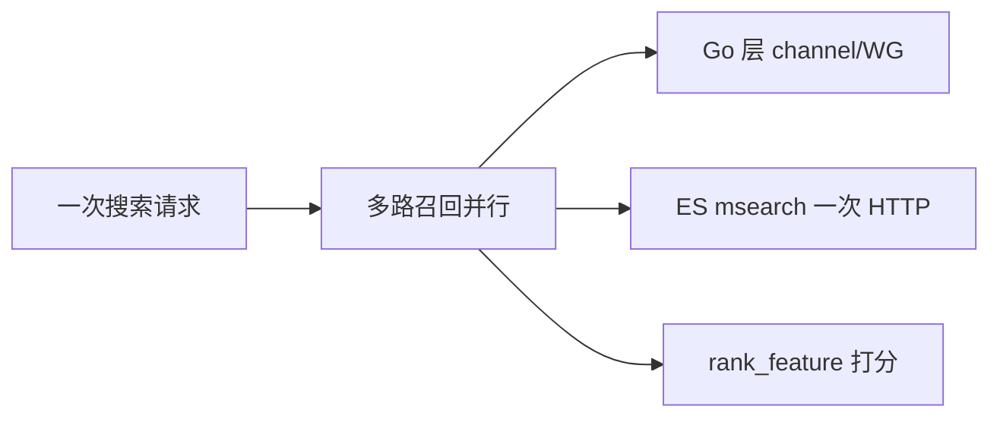

# Go 项目开发: 提升搜索性能之并发搜索

搜索服务的 P99 往往不是被单条查询拖垮的，而是**一次请求里串行发了好几路召回** —— 走 A 集群、走 B 集群、再查一遍广告索引，加起来就是三条链的耗时和。

这一节给三条并行的路子：

- **Go 层**：用 `channel` 或 `sync.WaitGroup` 把多路召回并行发出去，总耗时取**最慢的那一路**而不是之和
- **ES 层**：用 `msearch` 把多个查询打包成**一次 HTTP 请求**，省掉网络往返
- **ES 7 新特性**：`rank_feature` query 让数值字段参与**打分排序**（不只是过滤）

## 纲要

- 三种并发维度：多集群 / 多条件 / 多索引
- channel 版并行：done channel 计数，谁先完成谁先写
- `sync.WaitGroup` 版：`Add` 在 `go` 之前、`Done` 放 `defer`、传指针不传值
- msearch：一次请求发多条查询，responses 按序对应
- msearch 两种 body 写法：URL 指定 index / body 首行指定 index
- rank_feature mapping：数值字段要加一个 `.rank` 子字段
- positive_score_impact：让"值越小"而不是"值越大"得分更高
- rank_feature 是分片级打分，多分片得分有误差
- rank_feature 不支持 0、负数、数组，也不能排序聚合

## 先把并发拆成三件事

| 维度 | 做法 | 收益 |
| --- | --- | --- |
| 多集群 | 索引拆分到不同集群，Go 层并行请求后合并重排 | 单集群扛不住时的横向扩容 |
| 多条件 | 一次请求里发多个查询条件并发召回 | 用户搜索时的多路召回 |
| 多索引 | 商品、订单、活动索引一起查 | 一次前端请求聚合多个业务线 |

三种本质一样：**把串行改成并行**。下面先讲 Go 层的两种写法。

## 方式一：done channel 计数

思路：每个查询跑在独立 goroutine 里，**跑完就往自己的 done channel 丢一个 `true`**；主流程读两个 channel，两个都读到才继续往下走。

```go
package main

import (
	"fmt"
	"time"
)

// t1 / t2：两个"完成信号"，容量给 0 也行，但一定要带缓冲避免死锁隐患
var (
	t1 = make(chan bool)
	t2 = make(chan bool)
)

// searchThreadOne：模拟一路召回，返回这一路的结果集（这里用 string 代指）
func searchThreadOne() string {
	// defer 在 return 之后才执行 —— 所以是先发查询、再报完成
	defer func() {
		t1 <- true
	}()

	time.Sleep(1 * time.Second) // 模拟一次耗时查询
	fmt.Println("t1 search")
	return "res1"
}

func searchThreadTwo() string {
	defer func() {
		t2 <- true
	}()

	time.Sleep(1 * time.Second)
	fmt.Println("t2 search")
	return "res2"
}

func main() {
	res1 := ""
	res2 := ""

	// 并行发起，两个 goroutine 谁先跑完谁先返回
	go func() {
		res1 = searchThreadOne()
	}()
	go func() {
		res2 = searchThreadTwo()
	}()

	// 两行都执行完，说明两路都跑完了
	<-t1
	<-t2

	// 走到这里 = 所有查询结束，总耗时取决于最慢的那一路（约 1s），不是 2s
	fmt.Println("all search done", res1, res2)
}
```
**几个容易踩的点：**

- `defer` 里发信号，保证的是**"查询真的结束了"**这个时点，而不是"函数被调度了"
- 主流程 `<-t1` 是**阻塞**的，两行都过才算完成，天然就是"等待全部完成"的语义
- 每路都要有一个自己的 channel，别共用一个 —— 共用就分不清是哪路完成了

## 方式二：sync.WaitGroup

`WaitGroup` 更简洁，但**结果还是要靠 channel 或闭包往外带**（`WaitGroup` 本身不传值）。

```go
package main

import (
	"fmt"
	"sync"
	"time"
)

func searchThreadOne(wg *sync.WaitGroup) string {
	defer wg.Done() // return 之后标记完成

	time.Sleep(1 * time.Second)
	fmt.Println("t1 search")
	return "res1"
}

func searchThreadTwo(wg *sync.WaitGroup) string {
	defer wg.Done()

	time.Sleep(1 * time.Second)
	fmt.Println("t2 search")
	return "res2"
}

func main() {
	var wg sync.WaitGroup
	wg.Add(2) // 有两个任务，必须在 go 之前 Add

	resultCh := make(chan string, 2) // 2 个结果，缓冲 = 任务数，避免 goroutine 卡在发送上

	go func() {
		resultCh <- searchThreadOne(&wg)
	}()
	go func() {
		resultCh <- searchThreadTwo(&wg)
	}()

	wg.Wait() // 等两个任务都 Done 了才往下走

	close(resultCh)
	var results []string
	for r := range resultCh {
		results = append(results, r)
	}
	fmt.Println("all search done", results)
}
```
**`WaitGroup` 的三条铁律：**

1. `wg.Add(n)` 必须写在 `go` 语句**之前**，写在 goroutine 里主流程可能已经 `Wait` 过了，计数器还没加上就直接返回
2. `wg.Done()` 必须放 `defer`，否则中途 panic 就永远等不回来（死锁）
3. 传 **`*sync.WaitGroup` 指针**，传值会拷贝结构体，`Done` 加的是副本上的计数，主流程永远等不到

**两种方式怎么选：**

- 只要"等全部完成"、不关心谁先完成 → **`WaitGroup`**，代码短
- 想知道谁先回来、想在先回来那路先做点事（比如先落缓存）→ **channel 计数**，能拿到时序

## ES 层：msearch 一次请求发多条查询

上面是 Go 层并行，**每路还要各自发一次 HTTP**。多路召回时网络往返本身就是开销，`msearch` 把多条查询打包成一个请求：

```txt
# 写法一：index 写在 URL 上，body 里每条查询就是裸 query
POST /test_index/_msearch
{"query":{"match":{"name":"test"}}}
{"query":{"match":{"name":"test2"}}}

# 写法二：不指定 index，body 里每条查询第一行先写索引名
POST /_msearch
{"index":"test_index1"}
{"query":{"match":{"name":"test1"}}}
{"index":"test_index2"}
{"query":{"match":{"name":"test3"}}}
```
规则很简单：**body 里每一条查询都要一对花括号，加一个查询条件就多一对**。不指定索引时，第一条查询的 body 第一句必须是 `{"index":"xxx"}` 把索引名带上。

返回的 `responses` 是**数组，每个元素对应一条查询的独立结果集**，顺序和请求里写的顺序一一对应，可以按 index 取。

Go 侧用 `MultiSearchService` 拼：

```go
package main

import (
	"context"
	"fmt"

	"github.com/olivere/elastic/v7"
)

var esClient *elastic.Client

// msearchConcurrent 一次把两条查询打出去，只花一次网络往返
func msearchConcurrent() error {
	ctx := context.Background()

	src1 := elastic.NewSearchSource().Query(elastic.NewMatchQuery("name", "test"))
	req1 := elastic.NewSearchRequest().Index("test_index1").SearchSource(src1)

	src2 := elastic.NewSearchSource().Query(elastic.NewMatchQuery("name", "test3"))
	req2 := elastic.NewSearchRequest().Index("test_index2").SearchSource(src2)

	// Add 可以一次塞多个请求
	result, err := elastic.NewMultiSearchService(esClient).
		Add(req1, req2).
		Do(ctx)
	if err != nil {
		return err
	}

	// responses 顺序与请求顺序一致，按下标取
	for i, r := range result.Responses {
		if r == nil {
			fmt.Println("msearch response", i, "is nil")
			continue
		}
		fmt.Println("msearch", i, "took", r.TookInMillis, "hits", r.TotalHits())
		for _, hit := range r.Hits.Hits {
			fmt.Println("  id", hit.Id, "score", hit.Score)
		}
	}
	return nil
}

func main() {
	_ = msearchConcurrent
}
```
注意 `Do` 之后要**逐个判 `Responses` 元素是否为 nil** —— 单条查询出错（比如索引不存在）不会让整个 msearch 失败，只会让对应位置是 nil。

## ES 7：rank_feature 让数值字段参与打分

普通 `double` 字段直接拿去 `rank_feature` 查询会**直接报错**（提示字段类型不匹配），必须先建一个 `rank_feature` 类型的子字段。

原始字段 `price` 在业务里还要当普通数值用，所以**加子字段**而不是改原字段类型：

```txt
PUT /shop_product
{
  "mappings": {
    "properties": {
      "store_name": { "type": "text" },
      "price": {
        "type": "double",
        "fields": {
          "rank": { "type": "rank_feature" }
        }
      },
      "sales": {
        "type": "double",
        "fields": {
          "rank": { "type": "rank_feature" }
        }
      }
    }
  }
}
```
查询体：

```txt
POST /shop_product/_search
{
  "query": {
    "bool": {
      "must": [
        { "match": { "store_name": "test" } }
      ],
      "should": [
        {
          "rank_feature": {
            "field": "sales.rank",
            "boost": 1.0
          }
        },
        {
          "rank_feature": {
            "field": "price.rank",
            "boost": 1.0,
            "positive_score_impact": false
          }
        }
      ]
    }
  }
}
```
**`positive_score_impact: false` 是关键**：默认值是 `true`，表示"值越大得分越高"。商品场景我们要的是**价格越低越靠前**，所以必须设成 `false`。注意它**不支持 0 和负值**。

`boost` 也不能随便设：设成 0.1 这种小于 1 的值，rank_feature 的排序权重会被冲淡，排序结果**完全不符合业务直觉**；设成 **≥ 1** 才能正常体现"价格低 + 销量高"优先。

Go 侧这么写：

```go
package main

import (
	"context"
	"fmt"

	"github.com/olivere/elastic/v7"
)

var esClient *elastic.Client

// rankFeatureSearch：bool 召回 + rank_feature 打分排序
func rankFeatureSearch(keyword string) error {
	ctx := context.Background()

	q := elastic.NewBoolQuery().
		Must(elastic.NewMatchQuery("store_name", keyword)).
		Should(
			// 销量越高越靠前（默认正影响）
			elastic.NewRankFeatureQuery("sales.rank").Boost(1.0),
			// 价格越低越靠前（SDK 没暴露 positive_score_impact，走手写 body）
			elastic.NewRankFeatureQuery("price.rank").Boost(1.0),
		)

	// rank_feature 只做打分，分页还得靠 from/size 或 search_after 自己控
	result, err := esClient.Search("shop_product").
		Query(q).
		Size(10).
		Do(ctx)
	if err != nil {
		return err
	}

	for _, hit := range result.Hits.Hits {
		fmt.Println("id", hit.Id, "score", hit.Score)
	}
	return nil
}

func main() {
	_ = rankFeatureSearch
}
```
**`positive_score_impact: false` 用 SDK 怎么写？** olivere/elastic v7 的 `RankFeatureQuery` **没有导出这个方法**（只有 `Boost` / `Field` / `QueryName` / `ScoreFunction`）。两种绕法：

```go
package main

import (
	"context"
	"fmt"

	"github.com/olivere/elastic/v7"
)

var esClient *elastic.Client

// 方案一：手写 body，完整保留 positive_score_impact: false
func rankFeatureRawBody() error {
	body := `{
	  "query": {
	    "bool": {
	      "must": [{"match": {"store_name": "test"}}],
	      "should": [
	        {"rank_feature": {"field": "sales.rank", "boost": 1.0}},
	        {"rank_feature": {"field": "price.rank", "boost": 1.0, "positive_score_impact": false}}
	      ]
	    }
	  }
	}`

	// v7 的 SearchService 没有 BodyString，手写 query 用 Source 传字符串
	result, err := esClient.Search("shop_product").Source(body).Size(10).Do(context.Background())
	if err != nil {
		return err
	}
	fmt.Println("hits", len(result.Hits.Hits))
	return nil
}

func main() {
	_ = rankFeatureRawBody
}
```
**方案二更推荐**：在写入时就把数值取反存一份（比如存 `1.0/price` 或者 `maxPrice - price`），这样用默认的 `positive_score_impact=true` 也能表达"越小越靠前"，查询永远走 SDK 原生方法，不用手写 JSON。

## rank_feature 的三个硬限制

1. **分片级打分**。和 `script_score` 一样，rank_feature 的排序是**在每个分片上各自算完再汇总**的。单分片时 `price=100` 的文档得分显著高于 `price=1`；一改成 3 个主分片，`price=1` 那两条的分数就变了（0.81 → 0.9/0.8）。**多分片下得分不是全局精确的，有误差** —— 因为它不做跨分片的全局归一。
2. **不支持 0、负数、数组**。商品价格、销量都可能是 0，写入前必须做特殊处理（比如为 0 时写一个极小的正值，或者干脆不写这个字段）。
3. **不能用于排序和聚合**。它只能出现在 `rank_feature` 查询里，别指望 `sort` 或 `aggs` 用上它，所以老老实实把它当子字段用。

## 关键设计速览



```dir
search-perf/
├── concurrency/
│   ├── channel.go        done channel 计数
│   └── waitgroup.go      WaitGroup 三铁律
├── es/
│   ├── msearch.go        多查询打包
│   └── rank_feature.go   数值打分
└── mapping/
    └── product.mapping   price/sales .rank
```

## 注意事项总结

1. **多集群并发 = 索引拆到不同集群 + Go 层并行请求 + 结果合并重排**，不是换一个 SDK 就自动并发的。
2. 总耗时取决于**最慢的那一路**，所以要把慢的那路切细，别让某一路成为长尾。
3. `WaitGroup` 的 `Add` 在 `go` 前、`Done` 走 `defer`、**必须传指针**。
4. `channel` 版能拿到**谁先完成**的时序，`WaitGroup` 版只能拿"全部完成"，按需求选。
5. `defer` 里发信号，保证的是查询结束时点，不是函数被调度的时点。
6. **msearch 省的是网络往返**：N 条查询一次 HTTP，响应统一打包返回。
7. msearch 的 `responses` **顺序与请求一致**，但每一项要**判 nil**（单条查询失败整体不失败）。
8. msearch body 里**每加一条查询就多一对花括号**，漏写一对会直接 400。
9. `rank_feature` 必须用 `rank_feature` 类型的字段，普通 `double` 查询会直接报错。
10. 原字段要保留业务用法时，**加 `.rank` 子字段**，不要改原字段类型。
11. **价格类字段一定要配 `positive_score_impact: false`**，否则是"越贵越靠前"。
12. `boost` 用 **≥ 1**，小于 1 会把排序权重冲淡到看不出效果。
13. **多分片下 rank_feature 得分有误差**，别拿它做精确排序，业务排序（价格低优先）放在应用层重排。

## 本节作业

1. 把本节 demo 代码跑一遍，分别用单分片和三主分片建 `shop_product` 索引，对比 rank_feature 的得分差异。
2. 用 `msearch` 重写一次商品搜索：一条查 `shop_product`、一条查活动索引，把两个结果集在 Go 侧合并成一个统一列表返回。
3. 给 `price` 为 0 的文档想一个写入方案，保证 rank_feature 查询不报错。

## 总结

搜索的 P99 往往不是被单条查询拖垮，而是**一次请求里串行发了好几路召回**。优化从三个维度入手：Go 层用 channel 或 `WaitGroup` 把多路并行发出去，总耗时取最慢那一路而非之和；ES 层用 `msearch` 把多条查询打包成一次 HTTP，省掉网络往返；ES 7 的 `rank_feature` 让数值字段参与打分排序。

`WaitGroup` 的三铁律是 `Add` 在 `go` 前、`Done` 走 `defer`、传指针；`msearch` 的 `responses` 顺序与请求一致但每项要判 nil；`rank_feature` 必须配 `positive_score_impact: false` 表达"价格低优先"，且多分片下得分有误差，精确排序要放到应用层重排。

