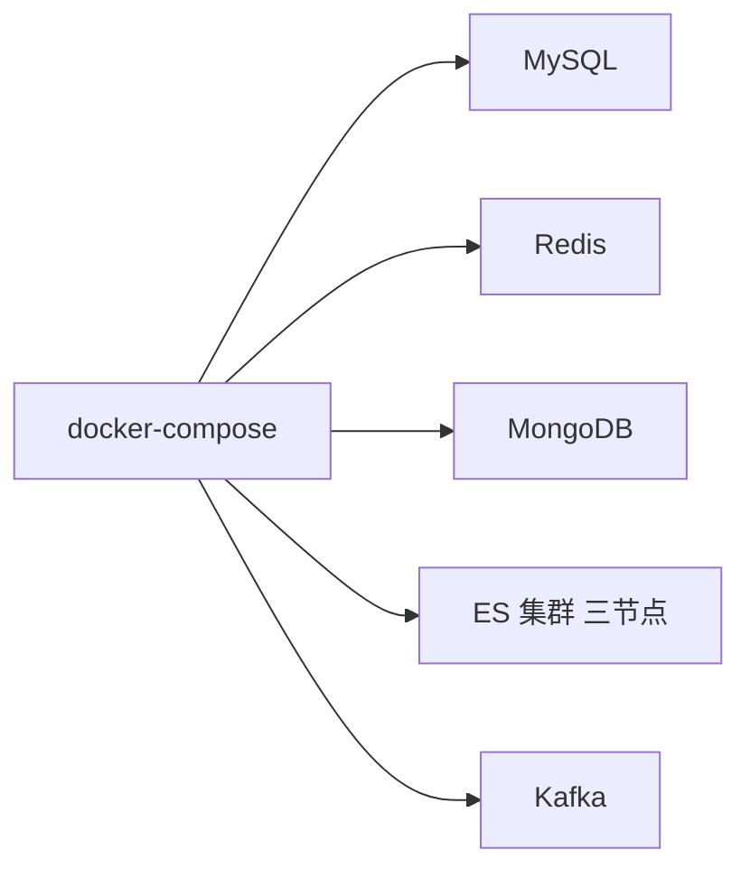

# Go 项目开发: 项目环境说明（docker-compose 全套中间件）

写代码之前先把环境跑起来。整个项目要五套中间件：MySQL、Redis、MongoDB、ES 集群、Kafka 集群，全部用 `docker-compose` 起，源码里每个组件目录下都有对应的 `docker-compose.yml`。

这一节把**每个组件在哪、compose 里配了什么、Windows 上哪些坑、ES 怎么走 HTTPS** 讲清楚。

> 环境版本：ES **8.2.2**（本节源码里是 8.x，后面章节 tooling 上仍用 elastic **v7** 的 Go 客户端，两者能互通，但 8.x 的部分特性（比如 `rank_feature` 的多值支持）行为有差异，代码里要留意）。

## 纲要

- 环境清单与各组件目录位置
- Redis：cache/redis 一个 compose 就够
- MySQL：db/test 下的 compose，密码、data 映射、my.cnf 字符集
- MongoDB：nosql 目录，**必须用数据卷**挂载
- ES 集群：三节点 + kibana，证书生成镜像、healthcheck、启动依赖顺序
- ES 插件：本地文件离线安装，比在线下载快得多
- Kafka：mq 目录下的单节点 kafka + zookeeper
- docker-compose 的 up / stop / down / restart 区别
- Windows Docker 三个必踩坑：镜像加速、共享目录、mongo 数据卷
- ES 走 HTTPS：WithScheme + 自定义 http.Client + TLS 配置

## 环境清单

| 组件 | 版本 | 目录 | 备注 |
| --- | --- | --- | --- |
| Elasticsearch | 8.2.2 | `es/` | 三节点集群 + kibana，HTTPS |
| MySQL | 5.7（最低 5.7，8.0 也可） | `db/` | root/test 密码 `admin123` |
| Redis | 6.0.9（3.0+ 即可） | `cache/redis/` | 单实例 |
| MongoDB | 4.4.2 | `nosql/` | 必须数据卷挂载 |
| Kafka | — | `mq/` | 单节点 + zookeeper |

## Redis：最简单的一个

```txt
# 进入 cache/redis 目录
cd cache/redis
docker-compose up -d
```
配置都预置好了，基本不用改。

## MySQL：注意 data 目录映射与字符集

```txt
cd db/test
docker-compose up -d
```
compose 里要点：

- 镜像用 **mysql 5.7**，`root` 密码 `admin123`，另外新建了一个 `test` 用户，密码同样是 `admin123`
- **把 MySQL 的 data 目录映射出来**（映射到 `test` 目录下的 `data`，启动后生成 `data` 文件夹，里面就是物理数据文件）
- `config/my.cnf` 里配的是**字符集**相关的东西 —— 项目里商品标题、详情有中文，字符集不对会直接乱码

## MongoDB：必须用数据卷，不能挂共享目录

```txt
cd nosql
docker-compose up -d
```
compose 里有个**关键配置**：MongoDB 的数据目录挂的是 **`volumes` 里声明的数据卷**，不是宿主机目录：

```txt
version: "3"
services:
  mongo:
    image: mongo:4.4.2
    volumes:
      - mongodata:/data/db    # 数据卷，不是 ./data 这种本地目录
    ports:
      - "27017:27017"
volumes:
  mongodata:                  # compose 启动时自动创建这个卷
```
**为什么要这样？** MongoDB 的文件系统有特殊要求，直接挂到 Windows 共享目录上**容器根本起不来**（重启必崩），必须走 Docker 自己管理的数据卷。

## ES 集群：三节点 + 证书 + kibana

ES 是最复杂的一个，`es/` 目录下有三个服务：

1. **第一个镜像：生成证书**。ES 8 需要节点间互信 + HTTPS，所以先要生成一组证书文件，生成后通过 volume 挂到容器的 `certs` 目录
2. **三个 ES 节点**：都挂 `certs`、`data`、`plugins` 三个目录，暴露 9200
3. **kibana**：连第一个 ES 节点的 9200，端口 5601

版本在 `es/test/.env` 里定义，改 `ES_VERSION` 一处即可：

```txt
ES_VERSION=8.2.2
ELASTIC_PASSWORD=admin123
KIBANA_PASSWORD=admin123
CLUSTER_NAME=shop
```
几个 compose 细节：

- **`healthcheck`**：每 10 秒用证书访问 9200 探一次（HTTPS），**100 秒内没起来容器就启动失败**
- **`restart`**：配的是"docker 一开服务就跟着起"，也可以改成 `on-failure`（只在失败时重启）
- **启动依赖**：第二个节点 `depends_on` 第一个，第三个 `depends_on` 第二个 —— 第一个先起、通常自动成为 master，后面的节点靠 `initial_master_nodes` 读前一个节点的状态

### 插件离线安装

在线下载 ES 插件很慢，源码里已经把插件下好了放在 `plugins` 目录。手动装一次：

```txt
# 进到 es01 容器终端
docker exec -it <es容器名> /bin/bash

# 插件拷进容器的 data 目录
docker cp plugins/xxx.zip <es容器名>:/usr/share/elasticsearch/data/

cd /usr/share/elasticsearch
# 用 file:// 协议指定本地路径安装，秒装
bin/elasticsearch-plugin install file:///usr/share/elasticsearch/data/xxx.zip
```
`file://` + 绝对路径是本地安装的关键，比联网下载快一个数量级。

## Kafka：单节点够用

`mq/` 目录下只有**一个 kafka 节点 + 一个 zookeeper**。多节点机器负载吃不消，课程跑单节点；生产环境再按多 broker 扩。

## compose 四个命令的区别

在 `docker-compose.yml` 所在目录执行：

| 命令 | 行为 |
| --- | --- |
| `docker-compose up` | 启动服务 |
| `docker-compose stop` | **只停容器**，进程没了但容器和挂载还在 |
| `docker-compose down` | 停容器 **并删掉**它，连一起新建的网卡、数据卷一起删 |
| `docker-compose restart` | 重启（改完配置常用这个） |

也就是 **stop 能复活，down 是推倒重来**。要改 ES 配置重跑，一般 `down` 再 `up`；只是想重启加载，`restart` 就够。

## Windows Docker 三个必踩坑

1. **一定要设镜像加速**。Docker Desktop → Settings → Docker Engine，在 `registry-mirrors` 下加加速器（课程文稿里给了 163 和清华两个源），否则拉镜像慢到怀疑人生。
2. **挂载目录要加共享目录**（File Sharing）。Settings → Resources → File sharing，把 compose 里 `volumes` 挂的所有宿主目录（以及它们的父目录）都加进去；不加的话**容器直接起不来**。有的 Windows 版本还有安全策略，多挂一层父目录更保险。
3. **MongoDB 走数据卷**，见上面那条。

## ES 走 HTTPS：SDK 里怎么连

ES 8 默认开启安全，客户端必须走 HTTPS + 证书。项目里在 `pkg/es/client.go` 封装了 `InitClientWithOptions`，对外用**函数选项模式**把 scheme 传进来：

```go
package main

import (
	"crypto/tls"
	"fmt"
	"net"
	"net/http"
	"time"

	"github.com/olivere/elastic/v7"
)

// WithScheme：函数选项，把 "https" / "http" 传进初始化函数
type ESClientOption func(*esOptions)

type esOptions struct {
	scheme string
}

func WithScheme(scheme string) ESClientOption {
	return func(o *esOptions) {
		o.scheme = scheme
	}
}

// getDefaultClient：HTTPS 要用的 http.Client，核心是关掉 keepalive + 配 TLS
func getDefaultClient(insecure bool) *http.Client {
	transport := &http.Transport{
		// HTTPS 场景下一般要禁掉 keepalive，避免复用连接踩到证书/连接复用问题
		DisableKeepAlives:     true,
		DisableCompression:    true,
		MaxIdleConns:          100,
		IdleConnTimeout:       90 * time.Second,
		TLSHandshakeTimeout:   10 * time.Second,
		ExpectContinueTimeout: 1 * time.Second,
		DialContext: (&net.Dialer{
			Timeout:   30 * time.Second,
			KeepAlive: 30 * time.Second,
			DualStack: true,
		}).DialContext,
	}
	if insecure {
		// 自签证书场景：跳过 TLS 校验（生产环境请挂正式证书，不要这么干）
		transport.TLSClientConfig = &tls.Config{InsecureSkipVerify: true}
	}
	return &http.Client{Transport: transport}
}

// InitClientWithOptions：options 里带 scheme，返回 error
func InitClientWithOptions(name string, url string, user string, pwd string, options ...ESClientOption) error {
	cfg := &esOptions{scheme: "http"}
	for _, o := range options {
		o(cfg)
	}

	client, err := elastic.NewClient(
		elastic.SetURL(url),
		elastic.SetBasicAuth(user, pwd),
		elastic.SetScheme(cfg.scheme),
		// HTTPS 连自签证书集群时，把自定义 http.Client 配进来
		elastic.SetHttpClient(getDefaultClient(true)),
		elastic.SetHealthcheck(true),
		elastic.SetHealthcheckInterval(15*time.Second),
		elastic.SetSniff(false), // 单节点/指定地址连法，关掉节点嗅探
	)
	if err != nil {
		return err
	}
	fmt.Println("init es client", name, cfg.scheme, url)
	_ = client
	return nil
}

func main() {
	if err := InitClientWithOptions("default_client", "https://127.0.0.1:9200", "elastic", "admin123",
		WithScheme("https")); err != nil {
		fmt.Println("init es client error", err.Error())
		return
	}
}
```
**几个要点：**

- `InitClientWithOptions` 返回的是 `(*elastic.Client, error)` 还是 `error`，取决于封装；这里按**返回 error** 写，调用方 `if err != nil { panic(err) }` 兜住
- `SetScheme("https")` + `SetURL("https://...")` 要**一起用**，只设一个会走不通
- HTTPS 下必须把 `certs` 挂进容器并让 kibana 用它连 ES，否则 kibana 起不来
- `SetHttpClient` 收的是 `Doer` 接口，`*http.Client` 天然满足

## 关键设计速览



```dir
project-env/
├── es/                   三节点 + kibana + 证书
├── db/                   MySQL compose + data
├── cache/redis/          单实例
├── nosql/                MongoDB 数据卷
├── mq/                   Kafka + zookeeper
└── plugins/              本地 ES 插件
```

## 注意事项总结

1. ES **8.2.2** 是本节源码环境，Go 侧 SDK 用的是 **elastic v7**，能连但 8.x 特性（如多值 rank_feature）行为不同，代码要对应看。
2. ES 三个节点**依次依赖**启动，第一个节点通常自动成为 master。
3. healthcheck 10 秒一次、**100 秒超时**，ES 起不来先看是不是证书没挂对。
4. `es/test/.env` 里定版本，`ES_VERSION` 改一处全 compose 生效。
5. 插件走**本地 file:// 安装**，别在线下载。
6. `stop` 和 `down` 不一样：stop 只是停容器，down 连容器、网卡、数据卷一起删。
7. **Windows 一定要配 registry mirrors**，拉镜像速度的差别是十倍级。
8. **挂载目录必须加 File sharing**，否则容器起不来。
9. **MongoDB 必须挂数据卷**，挂共享目录起不来。
10. 修改组件配置后，`restart` 通常够；改挂载/版本就 `down` 再 `up`。
11. ES 走 HTTPS 要 **scheme + URL + http.Client 三件套**，`SetScheme("https")` 必须和 `https://` 的 URL 一起给。
12. 自签证书开发阶段才用 `InsecureSkipVerify`：**生产必须挂正式证书**。

## 本节作业

按 README 把五套中间件全部 `up` 起来，验证 ES 集群三个节点都是 `green`，并用 kibana（5601）跑通一个 `GET /_cat/health`；然后把 `InitClientWithOptions` 改成**支持传多个 ES 地址**（传入 `[]string`），三节点任一可用即算初始化成功。

## 总结

写代码前先把环境跑起来：MySQL、Redis、MongoDB、ES 集群、Kafka 五套中间件全部用 `docker-compose` 起，源码里每个组件目录都有对应的 `docker-compose.yml`。ES 8.2.2 是本节源码环境，Go 侧 SDK 用 elastic v7，能互通但 8.x 特性行为有差异，代码要对应看。

几个必踩的坑：Windows 一定要配 registry mirrors（拉镜像速度差十倍）、挂载目录必须加 File sharing、MongoDB 必须挂数据卷（挂共享目录起不来）；ES 走 HTTPS 要 scheme + URL + 自定义 http.Client 三件套；`stop` 只是停容器、`down` 连容器网卡数据卷一起删。把这些地基铺平，后面跑工程才顺。

