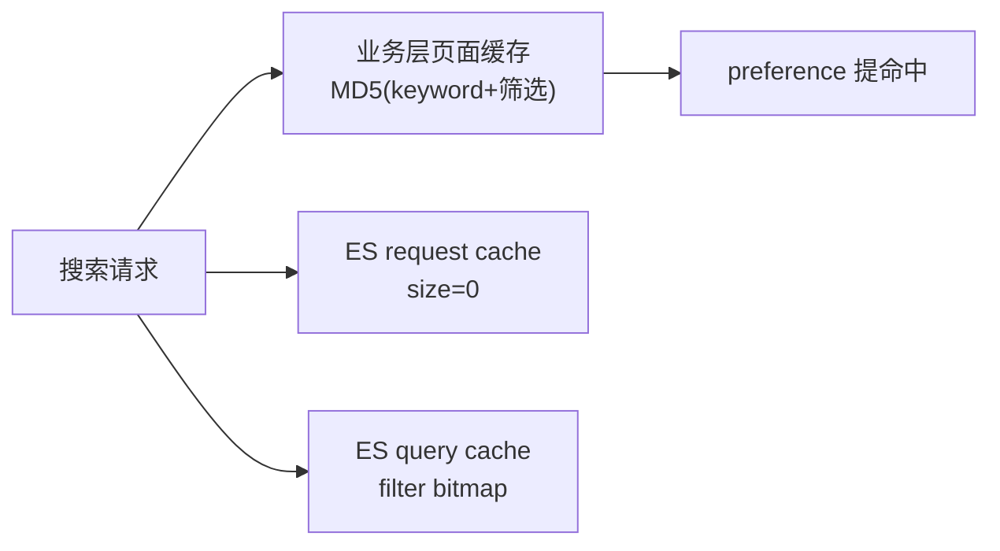

# Go 项目开发: 提升搜索性能之多级缓存策略

缓存为王。商品搜索是典型互联网应用，**20% 的热门关键词能吃掉 80% 的搜索请求**，命中缓存的请求根本不用走 ES。

这一节分两层：

- **业务层**：自己服务的缓存（页面缓存 / 商品 ID 列表缓存）
- **ES 层**：分片级 `request cache`、节点级 `query cache`，再用 `preference` 把缓存命中率顶上去

## 纲要

- 二八法则：20% 热门词占 80% 请求
- 页面缓存：以查询请求为 key，关键词 + 筛选条件做 MD5 取指纹
- 个性化场景：用户维度做 key 会让缓存爆炸，只存**排序好的商品 ID**
- 只缓存前 N 页 ID（离线统计最大翻页）+ 压缩存储
- 时效性：缓存存一天 + 增量集群矫正
- request cache：分片级，默认只缓存 `size=0` 的请求
- 增大 refresh_interval 和段合并间隔，等于延长缓存寿命
- query cache：节点级，段太小的不缓存，因为段一合并缓存就失效
- fielddata cache 不建议开：加载后不回收、成本极高
- preference：让同一个用户的请求落到同一分片

## 第一层：业务层页面缓存

**缓存 key 用查询请求本身。** 先想清楚：在不考虑个性化推荐的前提下，**查询结果只跟查询关键词和筛选条件有关**。

所以 key = `md5(关键词 + 筛选条件)`，value = 返回给用户的页面（或结构化结果）。完全相同的请求直接命中返回。

```go
package main

import (
	"crypto/md5"
	"fmt"
	"time"

	"github.com/go-redis/redis/v7"
)

// SearchRequest：前端传过来的搜索条件，参与生成缓存 key
type SearchRequest struct {
	Keyword    string `json:"keyword"`
	CatID      int    `json:"cat_id"`
	Page       int    `json:"page"`
	SortField  string `json:"sort_field"`
	SortAsc    bool   `json:"sort_asc"`
}

// SearchResult：缓存的 value
type SearchResult struct {
	Total int64         `json:"total"`
	Hits  []interface{} `json:"hits"`
}

// cacheKey：关键词 + 筛选条件做指纹，翻页不进 key（只缓存第一页/热门页）
func cacheKey(req *SearchRequest) string {
	raw := fmt.Sprintf("%s|%d|%s|%v", req.Keyword, req.CatID, req.SortField, req.SortAsc)
	return "search:page:" + fmt.Sprintf("%x", md5.Sum([]byte(raw)))
}

var rdb *redis.Client

// searchWithPageCache：命中缓存直接返回，没命中才打 ES
func searchWithPageCache(req *SearchRequest) (*SearchResult, error) {
	key := cacheKey(req)

	if data, err := rdb.Get(key).Bytes(); err == nil {
		var cached SearchResult
		// 实际项目用 json.Unmarshal 反序列化
		fmt.Println("cache hit", key)
		_ = data
		return &cached, nil
	}

	// 未命中：走 ES（这里省略查询，结果先置空）
	result := &SearchResult{}

	// 热门词 + 第一页缓存一天；其余场景短 TTL 兜底
	ttl := 10 * time.Minute
	if req.Page <= 1 {
		ttl = 24 * time.Hour
	}
	_ = rdb.Set(key, "cached-payload", ttl).Err()
	return result, nil
}

func main() {
	_, _ = searchWithPageCache(&SearchRequest{Keyword: "机械键盘", CatID: 12, Page: 1})
}
```
**几个设计点：**

- **翻页不进 key**，只缓存热门的前几页，否则 key 数量随 `page` 线性膨胀
- **TTL 分级**：第一页（用户最常点）存一天，深翻页只存几分钟
- **只缓存通用页面**。一旦排序结果要**按用户个性化定制**，就不能这么缓存了

## 个性化场景：只缓存商品 ID，不缓存结果集

用户维度做 key 会踩两个坑：**key 数量暴增**（存储成本上去了）、**命中率暴跌**（同一用户一天就搜几次）。

解决办法是**换个缓存粒度**：

1. **value 只存排序好的商品 ID 列表**，不存完整结果集 —— 存储量直接降一个数量级
2. **只缓存前 N 页的 ID**：离线统计用户的最大翻页值，只把这几页涉及的 ID 缓存起来，后续翻页大概率命中
3. **压缩后存储**，进一步省空间
4. **时效性兜底**：缓存时间设一天，同时把**更新的数据单独放一个增量集群**；召回时**全量集群 + 增量集群一起召回**，用增量集群的数据**矫正缓存**（修正过期商品、下架商品）

```go
package main

import (
	"fmt"
	"strconv"
	"time"

	"github.com/go-redis/redis/v7"
	"github.com/olivere/elastic/v7"
)

// idsKey：用户 + 关键词 + 排序 决定一份 ID 列表
func idsKey(userID int64, keyword string, sortField string) string {
	return "search:ids:" + strconv.FormatInt(userID, 10) + ":" + keyword + ":" + sortField
}

var (
	rdb       *redis.Client
	esClient  *elastic.Client
	pageSize  = 20
	cachePage = 5 // 只缓存前 5 页
)

// searchWithIDListCache：先取缓存里的 ID 列表，再按页批量拉详情
func searchWithIDListCache(userID int64, keyword string, page int, sortField string) ([]interface{}, error) {
	key := idsKey(userID, keyword, sortField)

	// 1. 命中缓存：直接按页切 ID
	if ids, err := rdb.Get(key).Result(); err == nil {
		fmt.Println("id list cache hit", key)
		return fetchHits(strParse(ids), page), nil
	}

	// 2. 未命中：召回 ID 列表（只缓存前 cachePage 页）
	src := elastic.NewSearchSource().
		Query(elastic.NewMatchQuery("store_name", keyword)).
		Sort(sortField, false).
		From(0).Size(pageSize * cachePage).
		// 只要 ID，别把明细拉回来
		FetchSourceContext(elastic.NewFetchSourceContext(false))
	result, err := esClient.Search("shop_product").Source(src).Do(nil)
	if err != nil {
		return nil, err
	}
	ids := make([]string, 0, len(result.Hits.Hits))
	for _, h := range result.Hits.Hits {
		ids = append(ids, h.Id)
	}

	// 3. 写缓存，一天过期
	_ = rdb.Set(key, joinIDs(ids), 24*time.Hour).Err()

	// 4. 用增量集群的数据矫正：过滤掉缓存期间下架/改价的商品
	ids = correctWithDelta(ids)

	return fetchHits(ids, page), nil
}

func fetchHits(ids []string, page int) []interface{} {
	if len(ids) == 0 || page > cachePage {
		return nil
	}
	start := (page - 1) * pageSize
	if start >= len(ids) {
		return nil
	}
	end := start + pageSize
	if end > len(ids) {
		end = len(ids)
	}
	out := make([]interface{}, 0, end-start)
	for _, id := range ids[start:end] {
		out = append(out, "id:"+id)
	}
	return out
}

func strParse(s string) []string { return []string{s} }
func joinIDs(ids []string) string { return ids[0] }
func correctWithDelta(ids []string) []string { return ids }

func main() {
	_, _ = searchWithIDListCache(1001, "机械键盘", 1, "price.rank")
}
```
## 第二层：ES 自身的缓存

### request cache：分片级

`request cache` 在**每个分片本地缓存查询结果**，常用的搜索请求几乎立即返回。

关键点：

- **默认只缓存 `size=0` 的搜索请求** —— 也就是说它**不缓存 hits（结果集本身）**，只缓存 `hits.total`、聚合 aggregation、搜索建议 suggest
- **触发 refresh 时分片级 request cache 全部失效**，所以要**加大 refresh 间隔**（`index.refresh_interval`）来延长缓存寿命
- 容量满时按 **LRU 淘汰**
- 默认占 **JVM 堆的 1%**，在 `config/elasticsearch.yml` 里调（`indices.requests.cache.size`）
- 可以动态清：

```txt
# 清空查询缓存
POST /shop_product/_cache/clear?request=true

# 动态关闭（默认开启）
PUT /shop_product/_settings
{ "index.requests.cache.enable": false }
```
```txt
# 查看 request cache 占了多少堆内存
GET /_nodes/stats?metrics=indices_requests_cache
```
生产上内存充裕又对查询性能要求高，可以把这个值逐步调大 —— 但**别调太大**，数据总量一直在涨，占用也会跟着涨。

### query cache：节点级（filter cache）

`query cache`（也叫 filter cache）缓存**带 filter 过滤器**的查询结果，**节点级别、该节点上所有分片共享**一份。

- 默认最多容纳 **1 万个查询**，最多占堆内存 **10%**；满了按 LRU 淘汰
- **段太小的查询不缓存**：ES 维护查询历史，当某段的文档数 **< 10000 或 < 分片的 3%** 时该段不参与缓存 —— 因为小段很可能马上被段合并，一合并缓存就白存了。所以**延长段合并间隔 = 延长 query cache 有效期**
- 基于 **bitmap** 建缓存，建 bitmap 本身有开销，只值得缓存高频查询
- **ES 5.1.1 之后移除了 term query 的缓存**
- 同样支持动态开关：

```txt
PUT /shop_product/_settings
{ "index.queries.cache.enabled": false }
```
### fielddata cache：不建议开

`fielddata` 一旦加载**不会自动回收**，加载成本还极高，实际使用中容易引发一堆问题，**不建议对字段开启它**。

### preference：把同一用户的请求打到同一分片

request cache 和 query cache 都是**分片/节点级**的。问题来了：

> 同一个请求连着发两次，ES 有多个副本、用的是默认路由算法，两次请求**可能落到不同副本**上 —— 缓存命中率直接被稀释。

解法是加 `preference` 参数：

```txt
GET /shop_product/_search?preference=1001
{
  "query": { "match": { "store_name": "机械键盘" } }
}
```
把 `preference` 设成**用户 ID、session ID** 这种用户维度的唯一值，同一个用户的请求就会**优先打到同一个分片**，缓存命中率上来了。

两个注意点：

- **自定义 preference 的值不能以下划线开头**，`_` 开头全是 ES 的预设值
- 常用的预设值是 `_local`（优先使用本地分片查询，前面章节用过）

Go 侧这么传：

```go
package main

import (
	"context"
	"fmt"
	"strconv"

	"github.com/olivere/elastic/v7"
)

var esClient *elastic.Client

// searchWithPreference：同一用户固定打到同一分片，缓存命中率才稳
func searchWithPreference(userID int64, keyword string) error {
	src := elastic.NewSearchSource().
		Query(elastic.NewMatchQuery("store_name", keyword)).
		Size(20)

	_, err := esClient.Search("shop_product").
		Preference(strconv.FormatInt(userID, 10)). // 用户维度唯一值
		Source(src).
		Do(context.Background())
	if err != nil {
		return err
	}

	// 想优先走本地分片也可以用预设值 "_local"
	_, err = esClient.Search("shop_product").
		Preference("_local").
		Source(src).
		Do(context.Background())
	if err != nil {
		return err
	}
	fmt.Println("search done")
	return nil
}

func main() {
	_ = searchWithPreference
}
```
## 关键设计速览



| 层级 | 类型 | 缓存内容 | 注意 |
| --- | --- | --- | --- |
| 业务层 | 页面缓存 | 关键词 + 筛选结果 | 翻页不进 key |
| 业务层 | ID 列表 | 排序后商品 ID | 只缓存前 N 页 |
| ES | request cache | total / 聚合 | 默认只缓存 size=0 |
| ES | query cache | filter bitmap | 段太小不缓存 |

```dir
search-cache/
├── biz/
│   ├── page_cache.go     页面缓存 MD5
│   └── id_cache.go       ID 列表 + 增量矫正
├── es/
│   ├── request_cache.go  size=0 缓存
│   └── query_cache.go    filter bitmap
└── conf/
    └── refresh_interval  延长缓存寿命
```

## 注意事项总结

1. **二八法则**是缓存的前提：20% 的热门词贡献 80% 请求，业务缓存先保热门。
2. 页面缓存的 **key = 关键词 + 筛选条件的 MD5 指纹**（不考虑个性化时，结果只跟这两个有关）。
3. 个性化场景**不要缓存完整结果集**，只缓存**排序好的商品 ID**，否则 key 爆炸、命中率暴跌。
4. **只缓存前 N 页 ID**（离线统计最大翻页），深翻页基本没人点，不值得缓存。
5. ID 列表**压缩后再存**，能明显省缓存空间。
6. **时效性**：缓存存一天 + **增量集群矫正**（全量 + 增量同时召回，用增量修正缓存），避免用户搜到已下架商品。
7. **request cache 默认只缓存 `size=0` 的请求**，它缓存的是 total / 聚合 / 建议，不缓存 hits。
8. **加大 `refresh_interval` 和段合并间隔 = 延长缓存寿命**，因为 refresh/合并都会让缓存失效。
9. request cache 默认占 **JVM 堆 1%**，可调但**不能调太大**（数据量在涨）。
10. **段太小不进 query cache**（< 10000 文档或 < 分片 3%），因为段合并会让它立刻失效。
11. query cache 是**节点级、全分片共享**，默认 1 万个查询 / 10% 堆内存。
12. **`fielddata` 不建议开**：加载后不回收、成本高，容易出事。
13. **`preference` 用用户 ID / session ID 提高命中率**，但**值不能以下划线开头**（`_` 是 ES 预设）。
14. 自定义值打不到同一分片时，先确认是不是多副本 + 默认路由导致的打散。

## 本节作业

1. 给页面缓存加**热点探测**：按关键词统计一天内的搜索次数，超过阈值的词走长 TTL（一天），其余走短 TTL。
2. 把 `searchWithIDListCache` 的条件补齐：命中 ID 列表后，**用 `mget` 按 ID 批量取商品详情**（注意 ID 顺序要保持），并且**跳过已被增量集群判为下架的 ID**。
3. 用 `_nodes/stats` 验证加大 `refresh_interval` 前后 request cache 的命中变化。

## 总结

缓存为王，商品搜索 20% 的热门词能吃掉 80% 的请求，命中缓存的根本不用走 ES。优化分两层：**业务层**自己管缓存（页面缓存 / 商品 ID 列表缓存），**ES 层**用分片级 `request cache`、节点级 `query cache`，再用 `preference` 把同一用户请求打到同一分片。

页面缓存 key 用 `md5(关键词 + 筛选条件)`、翻页不进 key、TTL 分级；个性化场景只缓存排序好的商品 ID 而非完整结果集，并用增量集群矫正过期数据。`request cache` 默认只缓存 `size=0` 的请求，`query cache` 对太小的段不缓存——所以加大 `refresh_interval` 和段合并间隔等于延长缓存寿命。`fielddata` 不建议开，加载后不回收、成本极高。

