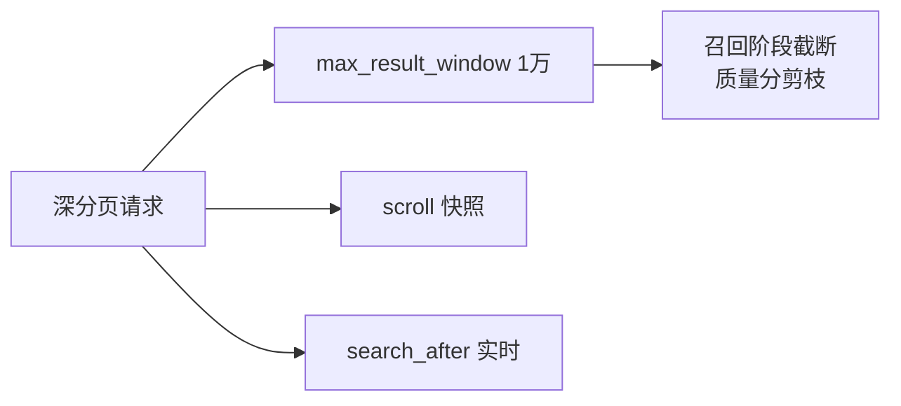

# Go 项目开发: 提升搜索性能之截断策略

热门 query（比如「男装」）能召回**几千万条**文档，逐条处理性能直接崩。从用户角度想：绝大多数电商搜索**不支持无限翻页**，前三页找不到用户就换词或者走了。

所以真正的解法不是"把分页放开"，而是**把召回和分页截断在可控范围内**。

## 纲要

- 深度分页的硬限制：`max_result_window` 默认 1 万，`from + size` 超过就拒绝
- 为什么深度分页慢：分片返回 `[0, from+size)`，协调节点全量汇总排序
- 深分页的两个代价：慢 + 吃集群资源
- 方案一：scroll 滚动查询（快照游标，非实时）
- scroll 的三个上限：24 小时、500 个上下文、必须清理
- 方案二：`search_after`（实时、无偏移量）
- 排序字段必须用**业务唯一键**
- 索引侧截断：索引用细粒度分词、查询用粗粒度
- 召回阶段截断：相关性过滤、敏感词词典、按翻页次数截断
- 离线质量分模型：倒排链按质量分降序排，拉够就停

## 深度分页的硬限制

ES **默认最大偏移量是 10000**，`from + size` 超过 10000 直接拒绝请求 —— 注意，**即使命中文档数不到一万也照拒**。

```txt
# from=10000, size=1 → 拒绝
POST /test_index/_search
{ "from": 10000, "size": 1, "query": { "match_all": {} } }
# Result window is too large, from + size must be less than or equal to: [10000]

# from=9999, size=1 → 刚好通过（每页 50 条能翻 200 页，够绝大多数场景）
```
可以改：

```txt
PUT /test_index/_settings
{ "index.max_result_window": 20000 }
```
**但不建议调。** 两个理由：

1. **深度分页本身就很慢**
2. **它会吃光整个集群的资源**，影响集群整体性能（不只是这一次查询）

## 为什么深度分页慢

查询请求可以打到集群任意节点，那个节点就是**协调节点**。流程：

1. 请求按 `routing` 哈希到对应分片；不带 routing 就打到**索引的全部分片**
2. **每个分片内部先排序**，把 **`[0, from+size)` 区间的所有文档**（注意：不是从 from 开始）返回给协调节点
3. 协调节点汇总所有分片的结果，**再整体排序**，最后才切出 `[from, from+size)`

为什么分片不能只返回 from 开始的那 size 条？**因为分布式排序必须看到全量才准。**

举个例子：三个分片，分片 1 价格最高是 9，分片 2 是 7，分片 3 是 3。如果各分片只回自己最高的 3 条，拿到的一总觉得是 9/7/3；**但真实全局前三可能是 9/7/4** —— 第二、三名都来自分片 2，分片 3 根本排不进前三。分片级截断排序会算错。

代价就出来了：

> 命中 **n 个分片**，协调节点要收集 **n × (from + size)** 条文档。

`from` 一大，这个数就爆炸 —— 轻则网络浪费、CPU 打满，重则**直接 OOM**。

## 方案一：scroll 滚动查询

scroll 生成一个游标 `scroll_id`，后续查询只带它往下取，直到 `hits` 为空。

**scroll_id 本质是一次查询的上下文快照**，所以：

- **快照建立之后，原文档的增删改都不会影响这个快照的结果** —— 也就是说 **scroll 会损失实时性**
- 首次查询必须带 `sort`，**没有排序要求时用 `_doc` 最快**
- 后续查询体只留 `scroll` 和 `scroll_id`

```txt
# 1. 初始化查询
POST /test_index/_search?scroll=5m
{
  "query": { "match": { "name": "test" } },
  "sort": [ "_doc" ],
  "size": 1
}
# 返回里带 scroll_id

# 2. 后续滚动（scroll_id 每次要换上一步返回的那个；没有排序要求时它不变）
POST /_search/scroll
{ "scroll": "5m", "scroll_id": "<上一步返回的scroll_id>" }
```
### scroll 的三个上限

1. **最长 24 小时**。`scroll` 设成 2 天会**直接拒绝请求**（`[scroll] timeout`），最大就一天。
2. **默认最多 500 个 scroll 上下文**（`search.max_open_scroll_context`）。

```txt
PUT /_cluster/settings
{ "persistent": { "search.max_open_scroll_context": 5000 } }

# 查看当前打开了多少个
GET /_nodes/stats?metrics=indices_search
# 里的 open_contexts 字段
```
3. **用完必须清**，否则上下文一直占内存。三种清法：

```txt
# 按 id 删（多个用逗号隔开 / 或多值数组）
DELETE /_search/scroll
{ "scroll_id": ["id1", "id2"] }

# 直接拼在 URL 后面
DELETE /_search/scroll?scroll_id=id1,id2

# 全清
DELETE /_search/scroll?all
```
### 切片并行提速

数据量大的时候，用 `slice` 把一次滚动拆成多个任务并行跑：

```txt
POST /test_index/_search?scroll=5m
{
  "slice": { "id": 0, "max": 4 },
  "query": { "match": { "name": "test" } },
  "sort": [ "_doc" ],
  "size": 1000
}
```
改成 `"id": 1/2/3`、`"max": 4` 起另外三个，四个任务各扫一片。

Go 侧（SDK 里 `ScrollService` 会在滚完时返回 `io.EOF`，**拿到 EOF 必须主动 `Clear`**）：

```go
package main

import (
	"context"
	"fmt"
	"io"

	"github.com/olivere/elastic/v7"
)

var esClient *elastic.Client

// scrollAll：初始化一次滚动查询，用 callback 逐批把结果交给调用方
func scrollAll(query elastic.Query, batchSize int, fn func(hits []*elastic.SearchHit) error) error {
	ctx := context.Background()

	src := elastic.NewSearchSource().
		Query(query).
		Sort("_doc", true). // 无排序要求用 _doc，效率最高
		Size(batchSize)

	scroll := esClient.Scroll("test_index").Body(src).KeepAlive("5m")
	defer scroll.Clear(ctx) // 无论如何都要清，防止上下文泄漏

	for {
		result, err := scroll.Do(ctx)
		if err == io.EOF {
			break // 滚完了
		}
		if err != nil {
			return err
		}
		if len(result.Hits.Hits) == 0 {
			break
		}
		if err := fn(result.Hits.Hits); err != nil {
			return err
		}
	}
	return nil
}

func main() {
	err := scrollAll(elastic.NewMatchQuery("name", "test"), 1000, func(hits []*elastic.SearchHit) error {
		fmt.Println("batch hits", len(hits))
		return nil
	})
	if err != nil {
		fmt.Println("scroll error", err.Error())
	}
}
```
## 方案二：search_after（实时、无偏移量）

业务上有**实时**深分页需求（比如要取第 5000 页之后的实时结果）时，用 `search_after`。

**关键点：排序字段必须是业务上的唯一主键**（商品 ID 这种），不能是 score 或可能有重复的字段。

```txt
# 1. 初始化查询（带业务唯一键排序）
POST /test_index/_search
{
  "size": 1,
  "query": { "match": { "name": "test" } },
  "sort": [ { "productID": "asc" } ]
}

# 2. 后续查询：把上一个文档最后一个 sort 值塞进 search_after
POST /test_index/_search
{
  "size": 1,
  "query": { "match": { "name": "test" } },
  "sort": [ { "productID": "asc" } ],
  "search_after": [ 1 ]
}
```
第三步把上一步的 sort 值（这里是 2）再填进去，就取到第三篇；**继续填最后一条，直到 `hits` 为空**，空了就说明取完了。

Go 侧：

```go
package main

import (
	"context"
	"fmt"

	"github.com/olivere/elastic/v7"
)

var esClient *elastic.Client

// searchAfterAll：用 search_after 无偏移量地往后翻
func searchAfterAll(query elastic.Query, sortField string, batchSize int, fn func(hits []*elastic.SearchHit) error) error {
	ctx := context.Background()

	src := elastic.NewSearchSource().
		Query(query).
		Sort(sortField, true).
		Size(batchSize)

	for {
		result, err := esClient.Search("test_index").Source(src).Do(ctx)
		if err != nil {
			return err
		}
		if len(result.Hits.Hits) == 0 {
			break // 取完了
		}
		if err := fn(result.Hits.Hits); err != nil {
			return err
		}

		// 取最后一个文档的 sort 值作为下一次的 search_after
		last := result.Hits.Hits[len(result.Hits.Hits)-1]
		sortValue := last.Sort[len(last.Sort)-1]
		src = elastic.NewSearchSource().
			Query(query).
			Sort(sortField, true).
			Size(batchSize).
			SearchAfter(sortValue)
	}
	return nil
}

func main() {
	err := searchAfterAll(elastic.NewMatchQuery("name", "test"), "productID", 1000, func(hits []*elastic.SearchHit) error {
		fmt.Println("batch hits", len(hits))
		return nil
	})
	if err != nil {
		fmt.Println("search after error", err.Error())
	}
}
```
**scroll vs search_after 怎么选：**

- **非实时、全量导出/重建索引** → `scroll`（快照一致，省心）
- **要实时、业务确需深翻** → `search_after`（每页都是实时查询，没有上下文要清理）

## 索引侧截断：真正省性能的地方

大多数场景根本不该用深分页，**直接限制用户可翻的页数**就行。而性能大头其实在**召回阶段**。

### 分词力度：索引细、查询粗

分词粒度越细，召回越宽松，召回结果可能越多。这就是**索引用细粒度分词器（如 `ik_max_word`）、查询用粗粒度分词器（如 `ik_smart`）** 的原因 —— 先用细粒度保证"别漏"，再用粗粒度在查询侧减少无意义召回。

### 召回阶段的四种截断手段

1. **按相关性截断**：只取前 N 条结果，后面的直接扔掉
2. **过滤不合法数据**：敏感词词典过滤，召回阶段就干掉，别留给排序
3. **按翻页次数截断**：分析用户实际翻页深度，把召回量特别长的 query 直接截断
4. **离线质量分模型**（关键）：

> 离线为每个商品算一个**质量分**，**索引阶段就把商品按质量分降序写入倒排链** —— 保证倒排链里前面的商品质量分总是高于后面的。
>
> 在线从前往后拉倒排时，**结果数少于 `10 × topN` 条就停止拉取**，然后对这批结果计算文本相关性，**按文本相关性再取前 topN 个**。

这一套的本质是：**用质量分做倒排链的顺序剪枝**，让有限的拉取量里大概率包含真正的好商品，再让文本相关性做最后的精排。截断之后用户体验不会明显下降，因为用户本来就只看前面几页。

## 关键设计速览



| 方案 | 实时性 | 上下文 | 适用 |
| --- | --- | --- | --- |
| 限制翻页 | 实时 | 无 | 绝大多数场景 |
| scroll | 非实时 | 需清理（≤24h） | 全量导出 / 重建 |
| search_after | 实时 | 无 | 业务深翻 |

```dir
search-truncation/
├── index/
│   └── analyzer.go       索引细 / 查询粗
├── recall/
│   ├── relevance.go      相关性截断
│   ├── sensitive.go      敏感词词典
│   └── quality.go        质量分剪枝
└── paging/
    ├── scroll.go
    └── search_after.go
```

## 注意事项总结

1. `max_result_window` 默认 **10000**，`from + size` 超了**直接拒绝**（命中不足也拒）。
2. 能不调大就**别调大** —— 深度分页既慢又吃整个集群的资源。
3. 每个分片返回的是 **`[0, from+size)`**，不是从 from 开始的 size 条；协调节点收集 `n × (from + size)` 条。
4. 分片级截断排序**不准**，分布式排序必须全量汇总后再排。
5. **scroll 是快照，会损失实时性**；建立后文档的增删都不影响结果。
6. scroll 最长 **24 小时**，超过直接拒绝请求。
7. 默认 **500 个 scroll 上下文**，用 `search.max_open_scroll_context` 可调；用 `open_contexts` 监控。
8. **scroll 用完一定要清**（`DELETE /_search/scroll`，`?all` 全清），否则上下文泄漏。
9. 无排序要求的 scroll 用 **`_doc` 排序**，效率最高。
10. 数据量超大用 **slice 切片并行** 提速。
11. **scroll 结束要 `Clear`**，SDK 里是滚完收到 `io.EOF` 之后。
12. **`search_after` 的排序字段必须是业务唯一键**（商品 ID 这种），score 和有重复值的字段不行。
13. `search_after` 的**上一轮最后一个 sort 值**要原样带到下一轮，sort 条件必须完全一致。
14. 全量导出用 scroll，实时深翻用 `search_after`。
15. **索引用细粒度分词（召回全）、查询用粗粒度分词（召回少）**。
16. 召回阶段就截断：相关性过滤 + 敏感词词典 + 按翻页深度截断。
17. **离线质量分 + 倒排链按质量分降序**，在线拉够 `10 × topN` 就停，再按文本相关性取 topN。

## 本节作业

1. 把 `scrollAll` 和 `searchAfterAll` 封装进 `pkg/es/query.go`，统一成 `ScrollQuery(query, fn)` / `SearchAfterQuery(query, fn)` 两个入口。
2. 用 `slice` 改 `scrollAll`，把一次全量导出拆成 4 个并行任务再合并结果。
3. 给 `searchAfterAll` 加一个**排序条件校验**：排序字段不是唯一键时直接返回错误，别让线上排出重复数据。

## 总结

热门 query 能召回几千万条文档，逐条处理性能直接崩。真正的解法不是放开分页，而是**把召回和分页截断在可控范围内**。深度分页受 `max_result_window`（默认 1 万）硬限制，且协调节点要收集 `n × (from + size)` 条文档，既慢又吃整个集群资源，能不调大就别调大。

深翻场景两条路：**非实时的全量导出用 scroll**（快照一致、≤24 小时、用完必须 `Clear`），**实时的业务深翻用 `search_after`**（排序字段必须是业务唯一键，无上下文要清理）。更根本的是在召回阶段截断：索引细粒度分词、查询粗粒度分词，再叠加相关性过滤、敏感词词典、按翻页深度截断，以及离线质量分模型做倒排链顺序剪枝——拉够 `10 × topN` 就停，再按文本相关性取 topN。

