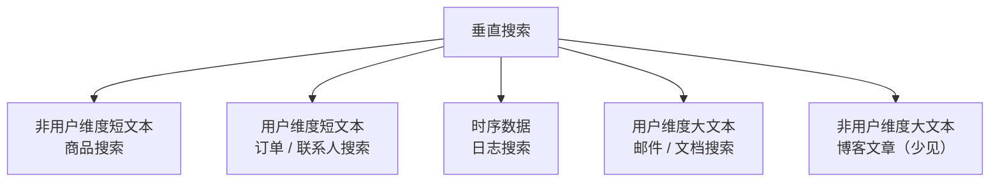

# 非用户短文本搜索及优化-章节导学

从本章起，课程进入**实战章节**。在搜索中台研发中，不同搜索业务因数据与索引特征不同，出现的问题和优化手段差异很大。本章是四大核心场景之一——**非用户维度短文本搜索**的实战与优化，我们会以商品搜索为例，把实现细节、数据建模与优化经验讲透。

## 纲要

- 垂直搜索的四大典型场景分类
- 非用户维度短文本：数据被全平台共享
- 用户维度短文本：数据有明确用户边界、增量快
- 时序数据：明确时间维度、越新越热
- 用户维度大文本：单条文本大（邮件、文档）
- 本章目标：商品搜索的实现、建模与指标上报

## 四大典型场景

根据业务与索引数据特征，垂直搜索可分为以下几类：



| 场景 | 数据特征 | 典型例子 | 核心挑战 |
| --- | --- | --- | --- |
| 非用户维度短文本 | 数据被平台全部用户共享 | 商品搜索 | 高并发、建模与相关性 |
| 用户维度短文本 | 数据有明确用户维度，增量快、量级大 | 订单、联系人搜索 | 用户隔离、冷热分离 |
| 时序数据 | 明确时间维度，越新访问越频繁 | 日志搜索 | 按时间滚动、冷热分层 |
| 用户维度大文本 | 单条文本很大 | 邮件、文档搜索 | 存储与索引成本高 |
| 非用户维度大文本 | 单文档较大，全平台共享 | 博客文章 | 业务少见，不展开 |

## 本章聚焦：非用户维度短文本搜索

本章要解决的，正是上表中的**第一类——非用户维度短文本搜索**，并以**商品搜索**为具体案例详细展开：

- 从**业务场景与功能**出发，挖掘这类搜索的难点与注意事项；
- 分享这类场景下的**优化经验**；
- 详细介绍**数据建模细节**（mapping、字段设计、索引排序、copy_to 等）；
- 实现具体业务功能，并完成**搜索接口指标数据上报**。

```dir
ch7-product-search/
├── 业务与功能分析
│   ├── 场景难点挖掘
│   └── 优化方向梳理
├── 数据建模
│   ├── mapping 设计
│   ├── 索引排序 / copy_to
│   └── 分词器选择
├── 业务实现
│   ├── 搜索接口
│   └── 商品数据索引
└── 性能与可观测
    ├── QPS / 耗时上报
    └── Grafana 面板
```

## 为什么从这里切入

非用户维度短文本（典型如商品搜索）是**最常见、也最能代表垂直搜索共性**的场景：它没有用户隔离的复杂度，却集中体现了建模、分词、相关性、高并发查询等核心问题。把这一章吃透，后续订单、日志、邮件等场景的差异化打法就能快速套用。

本章开始课程**以实战为主**。再次强调：**编程只有亲自动手练习，才能把知识内化为技能**——动手、动手、再动手。

## 总结

本章是搜索实战的入口，先把垂直搜索按「用户维度 / 文本大小 / 时间维度」切分为四类，再聚焦最具代表性的**非用户维度短文本（商品搜索）**。后续章节会沿「业务分析 → 数据建模 → 功能实现 → 指标上报」的主线推进，每一环都建议跟着代码自己跑一遍。

记住一句话：**场景决定模型，模型决定优化手段**。先把这一章的商品搜索打法吃透，其他三类场景的差异化处理就能举一反三。
