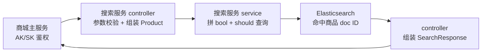

# Go 项目开发: 商品搜索接口的实现（controller + service 全链路）

四节拼一条完整链路：**`main.go` 起服务 → controller 收参数调 service → service 拼查询打 ES → controller 把命中结果组装成响应 → 主服务拿 AK/SK 鉴权调接口**。

这一节把每一步的代码都摊开，重点是三个容易写错的点：

- **`should` 条件为什么必须配 `minimum_should_match`**
- **`new` 参数为什么必须是指针**
- **排序为什么不能用裸 `map`**

## 纲要

- main.go：日志 / MySQL / Redis / ES 四件套初始化
- 优雅关闭：http → ES → mysql → cache → **log.Sync**
- controller：keyword 必填校验，参数不合法直接返回 `errorParams`
- `product` 结构体：userID / kword / new *int / sales / price / pageNumber / pageSize
- `new` 用指针：不传 = nil = 不过滤，传 0/1 才有业务含义
- service：bool + should 拼四个查询条件
- 拼音字段**含字母才加查询条件**，能少一个条件就少一个
- 排序用 **map 切片**保证顺序，map 是无序的
- `fetch_source=false` + 只取 ES doc ID（只要商品 ID）
- `preference = uid` 提高缓存命中率
- 结果组装：total 取 `hits.total.value`，单条解析失败 `continue`
- AK/SK 鉴权表：`is_delete=-1` + `is_used=1` 才生效

## 整体链路与工程结构

请求从商城主服务进来，经过搜索服务的 controller 与 service，最终打到 Elasticsearch，再把商品 ID 组装回响应：



搜索接口的工程结构分四层：入口、参数、业务、存储适配。

```dir
shop-search/
├── main.go                 四个组件初始化 + 优雅关闭
├── controller/
│   └── product.go          参数校验、组装 Product、调 service
├── service/
│   └── search.go           拼 bool/should 查询、调用 ES
├── internal/
│   └── report/es/          索引结构：ProductIndex
└── repo/
    └── es/                 ES 客户端封装（global.ES）
```

## main.go：四个组件初始化 + 优雅关闭

初始化顺序：日志 → MySQL → Redis → ES（ES 是核心组件，**初始化失败直接 panic**）。

关的时候是反过来的顺序：**http → ES → mysql → cache → log.Sync**。

最后那个 `log.Sync()` 最容易漏 —— **日志写文件是异步的**，进程一退，还没落盘的日志就没了。

```go
package main

import (
	"context"
	"fmt"
	"net/http"
	"time"

	"github.com/go-redis/redis/v7"
	"github.com/olivere/elastic/v7"
	"gorm.io/driver/mysql"
	"gorm.io/gorm"
)

const (
	ESDefaultClient = "default_client"
	ClientName      = "shop_search_api"
)

// global：整个工程共用的组件句柄
var (
	gES  *elastic.Client
	gDB  *gorm.DB
	gRdb *redis.Client
)

// ---------------- 日志（项目里的 log 包，简化版） ----------------

// WithDisableConsole=true 时不往终端打，日志写文件（路径在 mysql.yml 的 app.log.path）
func InitLog(name string, path string, disableConsole bool) {
	fmt.Println("init log", name, path, "disableConsole", disableConsole)
}

// Sync：把异步写文件里没落盘的日志刷出去，退出前必须调
func LogSync() error { return nil }

// ---------------- 组件初始化 ----------------

func InitMysqlClient(name, user, pwd, host, dbName string) (*gorm.DB, error) {
	dsn := fmt.Sprintf("%s:%s@tcp(%s)/%s?charset=utf8mb4&parseTime=True&loc=Local&timeout=10s", user, pwd, host, dbName)
	db, err := gorm.Open(mysql.Open(dsn), &gorm.Config{})
	if err != nil {
		return nil, err
	}
	sqlDB, err := db.DB()
	if err != nil {
		return nil, err
	}
	sqlDB.SetMaxOpenConns(100)
	sqlDB.SetMaxIdleConns(10)
	sqlDB.SetConnMaxLifetime(time.Minute)
	fmt.Println("init mysql client", name)
	return db, nil
}

func InitRedis(addr, pwd string, db int) (*redis.Client, error) {
	rdb := redis.NewClient(&redis.Options{
		Addr:         addr,
		Password:     pwd,
		DB:           db,
		MaxRetries:   3,
		MinIdleConns: 5,
	})
	if err := rdb.Ping().Err(); err != nil {
		return nil, err
	}
	fmt.Println("init redis client")
	return rdb, nil
}

// ES 走 HTTPS：scheme + 账号密码 + 关掉 sniff
func InitESClient(name, url, user, pwd string) (*elastic.Client, error) {
	client, err := elastic.NewClient(
		elastic.SetURL(url),
		elastic.SetBasicAuth(user, pwd),
		elastic.SetScheme("https"),
		elastic.SetSniff(false),
		elastic.SetHealthcheck(true),
		elastic.SetHealthcheckInterval(15*time.Second),
	)
	if err != nil {
		return nil, err
	}
	fmt.Println("init es client", name, url)
	return client, nil
}

// ---------------- 优雅关闭 ----------------

var httpServer = &http.Server{Addr: ":9090"}

// 顺序不能反：先断流量，再关中间件
var closeHooks = []func() error{
	closeHTTP,
	closeES,
	closeMysql,
	closeCache,
	closeLog,
}

func closeHTTP() error { return httpServer.Shutdown(context.Background()) }
func closeMysql() error {
	if gDB == nil {
		return nil
	}
	sqlDB, _ := gDB.DB()
	return sqlDB.Close()
}
func closeCache() error {
	if gRdb == nil {
		return nil
	}
	return gRdb.Close()
}
func closeES() error {
	if gES == nil {
		return nil
	}
	// 项目里是 global.ES.Close()，SDK 侧没有单独的 stop 方法，这里保持空实现
	return nil
}
func closeLog() error { return LogSync() }

func gracefulExit() {
	for i, hook := range closeHooks {
		if err := hook(); err != nil {
			fmt.Println("close hook", i, "error", err.Error())
		}
	}
}

func main() {
	InitLog(ClientName, "./logs/shop.log", false) // dev 环境直接打终端

	var err error
	if gDB, err = InitMysqlClient("default_mysql_client", "root", "admin123", "127.0.0.1:3306", "shop"); err != nil {
		fmt.Println("init mysql error", err.Error())
		panic(err)
	}
	if gRdb, err = InitRedis("127.0.0.1:6379", "", 0); err != nil {
		fmt.Println("init redis error", err.Error())
		panic(err)
	}
	// ES 是核心组件，起不来就只能挂
	if gES, err = InitESClient(ESDefaultClient, "https://127.0.0.1:9200", "elastic", "admin123"); err != nil {
		fmt.Println("init es client error", err.Error())
		panic(err)
	}

	// 起 HTTP（这里只做演示，真实项目里走 router 注册）
	go func() {
		if err := httpServer.ListenAndServe(); err != nil && err != http.ErrServerClosed {
			fmt.Println("http server error", err.Error())
		}
	}()

	gracefulExit()
}
```
## controller：参数校验与组装

controller 干三件事：**接参数 → 组装 product → 调 service → 处理错误**。

先说 `product` 结构体，它是 controller 和 service 之间传的搜索参数：

```go
package main

import (
	"github.com/olivere/elastic/v7"
)

// Product：搜索参数，由 controller 组装后传给 service
type Product struct {
	UserID     int64  // 用于打日志统计 + 当 preference 提高缓存命中率
	Kword      string // 搜索关键词
	New        *int   // 是否查新品：0 否 / 1 是；不传是 nil，不做过滤
	Sales      string // 销量排序：asc / desc
	Price      string // 价格排序：asc / desc
	PageNumber int    // 页码
	PageSize   int    // 每页条数
}

// SearchResult：service 返回的 ES 结果
type SearchResult = elastic.SearchResult

func main() {
	_ = Product{}
	_ = SearchResult{}
}
```
三个设计点：

1. **`New *int` 必须用指针**。HTTP 传进来的是字符串，**没传这个参数**和**传了 `0` / `1`** 是两种情况：`nil` 表示"不过滤"，非 nil 才去加 `term` 过滤条件。用值类型就分不清是"没传"还是"传了 0"。
2. **`UserID` 有两个用途**：一是日志统计，二是**当 `preference` 用**（同一个用户的请求落到同一分片，缓存命中率高）。
3. **页码和每页条数是字符串**，要 `strconv` 转 int，转失败要有兜底。

controller 里的主体逻辑：

```go
package main

import (
	"strconv"

	"github.com/olivere/elastic/v7"
)

// 项目里这些在 pkg/apigw、global、errorcode，这里简化成本地桩
type apigw struct{}

func (c *apigw) Query(k string) string      { return "" }
func (c *apigw) UserID() int64              { return 0 }
func (c *apigw) ResponseError(e interface{}) {}
func (c *apigw) ResponseOK(v interface{})    {}

var errorParams = "error_params"
var errorSearch = "error_search"
var logError = func(v ...interface{}) {}

// Product：搜索参数
type Product struct {
	UserID     int64
	Kword      string
	New        *int
	Sales      string
	Price      string
	PageNumber int
	PageSize   int
}

// SearchResult：service 返回的 ES 结果
type SearchResult = elastic.SearchResult

// ---------------- controller/product.go ----------------

// SearchProduct：/product/search 接口的实现
func SearchProduct(c *apigw) {
	// 1. 关键词必填
	kword := c.Query("kword")
	if len(kword) == 0 {
		c.ResponseError(errorParams) // HTTP 400 / illegal params
		return                       // 必须 return，别让程序往下走
	}

	// 2. 组装 product
	p := &Product{
		Kword:      kword,
		UserID:     c.UserID(),
		Sales:      c.Query("salesorder"),
		Price:      c.Query("priceorder"),
		PageNumber: strconv2Int(c.Query("pagenumber"), 1),
		PageSize:   strconv2Int(c.Query("pagesize"), 20),
	}

	// 新品过滤：只在传了 news 参数时才加条件
	if news := c.Query("news"); len(news) > 0 {
		newsInt, _ := strconv.Atoi(news)
		p.New = &newsInt
	}

	// 3. 调 service 查 ES
	res, err := SearchProductService(p)
	if err != nil {
		logError("search error", err.Error())
		c.ResponseError(errorSearch)
		return
	}

	c.ResponseOK(buildSearchResponse(res))
}

func strconv2Int(s string, def int) int {
	v, err := strconv.Atoi(s)
	if err != nil {
		return def
	}
	return v
}

type SearchResponse struct{ Total int64; Hits []*ProductIndex }

type ProductIndex struct{ ID int64 `json:"id"` }

func main() {
	_ = SearchProduct
	_ = buildSearchResponse
}

// SearchProductService：service 入口，实现见下面 service 层的代码
func SearchProductService(p *Product) (*SearchResult, error) { return nil, nil }

func buildSearchResponse(res *elastic.SearchResult) *SearchResponse {
	return &SearchResponse{}
}
```
## service：拼查询打 ES

查询体长这样（先看 DSL，逻辑就清楚了）：

```txt
POST /shop_product/_search
{
  "from": 0, "size": 20,
  "query": {
    "bool": {
      "should": [
        { "match_phrase": { "storeName":     { "query": "手机", "boost": 2.0   } } },
        { "match":        { "storeName":     { "query": "手机", "boost": 1.0   } } },
        { "match_phrase": { "storeName.pinyin": { "query": "手机", "boost": 0.7 } } },
        { "match":        { "desc":          { "query": "手机", "boost": 0.5   } } }
      ],
      "minimum_should_match": 1,
      "filter": [ { "term": { "isNew": 1 } } ]
    }
  },
  "sort": [ { "price": "desc" }, { "_score": "desc" } ],
  "_source": { "enabled": false }
}
```

四个 `should` 条件的权重与取舍，可以直接看这张表：

| 查询条件 | 字段 | 类型 | boost | 说明 |
| --- | --- | --- | --- | --- |
| 店铺名短语匹配 | `storeName` | `match_phrase` | 2.0 | 最精准，命中店铺名整段 |
| 店铺名普通匹配 | `storeName` | `match` | 1.0 | 更宽，召回更多 |
| 店铺名拼音 | `storeName.pinyin` | `match_phrase` | 0.7 | 仅关键词含字母时才加入 |
| 描述融合匹配 | `desc` | `match` | 0.5 | `kword+description` 的 `copy_to` 字段 |

几个关键点：

- **`minimum_should_match: 1`**：`should` 里的条件至少命中一个才算匹配，否则 bool 查询会退化成"必须全中"
- **`storeName` 用 `match_phrase`（boost 2）+ `match`（boost 1）双保险**：短语匹配更准、普通匹配更宽
- **`desc` 是 `kword + description` 的 `copy_to` 融合字段**，权重给低一点（0.5）
- **`storeName.pinyin` 只在关键词含字母时才加** —— 每多一个 `should` 条件都实打实影响性能，能省就省
- **`_source.enabled = false`**：这个场景只要商品 ID，而 ID 就在 ES 的 doc ID 里，**取 source 纯属浪费**

service 的实现：

```go
package main

import (
	"context"
	"fmt"

	"github.com/olivere/elastic/v7"
)

const (
	IndexProduct = "shop_product"
)

// 项目里是 global.ES
var esClient *elastic.Client

// Product：搜索参数
type Product struct {
	UserID     int64
	Kword      string
	New        *int
	Sales      string
	Price      string
	PageNumber int
	PageSize   int
}

// SearchResult：service 返回的 ES 结果
type SearchResult = elastic.SearchResult

// SearchProduct：具体搜索逻辑
func SearchProduct(p *Product) (*SearchResult, error) {
	// 1. 四个查询条件：无论如何都要带前三个
	storeNamePhrase := elastic.NewMatchPhraseQuery("storeName", p.Kword).Boost(2.0).
		QueryName("storeNameMatchPhraseQuery")
	storeNameMatch := elastic.NewMatchQuery("storeName", p.Kword).Boost(1.0).
		QueryName("storeNameMatchQuery")

	// desc 是 kword + description 的融合字段
	descMatch := elastic.NewMatchQuery("desc", p.Kword).Boost(0.5).
		QueryName("descMatchQuery")

	// 2. 拼音条件：先定义好，含字母才加进 should
	storeNamePinyin := elastic.NewMatchPhraseQuery("storeName.pinyin", p.Kword).Boost(0.7).
		QueryName("storeNamePinyinMatchPhraseQuery")

	shouldQueries := make([]elastic.Query, 0, 4)
	shouldQueries = append(shouldQueries, storeNamePhrase, storeNameMatch, descMatch)
	if includeLetter(p.Kword) {
		shouldQueries = append(shouldQueries, storeNamePinyin)
	}

	boolQuery := elastic.NewBoolQuery().
		Should(shouldQueries...).
		MinimumShouldMatch("1") // should 里至少命中一个（v7 收 string）

	// 3. 新品过滤：只有传了才加
	if p.New != nil {
		boolQuery = boolQuery.Filter(elastic.NewTermQuery("isNew", *p.New))
	}

	// 4. 排序：map 切片，保证顺序
	orders := make([]map[string]bool, 0, 3)
	if p.Price != "" {
		if strtoLowerCase(p.Price) == "desc" {
			orders = append(orders, map[string]bool{"price": false}) // false = 降序
		} else {
			orders = append(orders, map[string]bool{"price": true})
		}
	}
	if p.Sales != "" {
		if strtoLowerCase(p.Sales) == "desc" {
			orders = append(orders, map[string]bool{"sales": false})
		} else {
			orders = append(orders, map[string]bool{"sales": true})
		}
	}
	// 没传排序时也要按相关度排
	orders = append(orders, map[string]bool{"_score": false})

	from := (p.PageNumber - 1) * p.PageSize

	// 5. 打 ES：只要 ID，不要 source
	res, err := globalSearch(from, p.PageSize, boolQuery, orders, p.UserID)
	if err != nil {
		return nil, err
	}
	fmt.Println("search took", res.TookInMillis)
	return res, nil
}

// globalSearch：项目里 global.ES.Search 的等价实现
func globalSearch(from, size int, query elastic.Query, orders []map[string]bool, uid int64) (*SearchResult, error) {
	ctx := context.Background()

	svc := esClient.Search(IndexProduct).
		Query(query).
		Query(query).
		From(from).
		Size(size).
		FetchSource(false) // 只要 ES 的 doc ID，不取 source

	// 顺序遍历 map 切片，逐个设排序（不能直接遍历 map，那会打乱顺序）
	for _, m := range orders {
		for field, asc := range m {
			svc = svc.Sort(field, asc)
		}
	}

	// preference 用用户 ID，同一个用户打到同一分片，缓存命中率高
	svc = svc.Preference(fmt.Sprintf("%d", uid))

	return svc.Do(ctx)
}

func includeLetter(s string) bool { return false }
func strtoLowerCase(s string) string { return s }

func main() {
	_, _ = SearchProduct(&Product{Kword: "手机", PageNumber: 1, PageSize: 20})
}
```
**为什么排序要用 `[]map[string]bool` 而不是 `map[string]bool`？**

`map` 是**无序**的。你把 `price`、`sales`、`_score` 按顺序塞进 map，后面遍历拼 DSL 时顺序可能乱掉 —— 用户传了"价格降序 + 销量降序"，结果出来变成按销量排，这种 bug 线上极难复现。用**切片 + 单键 map** 既能表达"字段→升降序"，又能保证顺序。

SDK 的 `Sort(field, ascending)` 是按调用顺序拼到 DSL 里的，所以只要保证 `Sort` 的调用顺序是 `price → sales → _score` 就对了。

## controller 侧的结果组装

service 返回的是 `*elastic.SearchResult`，controller 要把它转成给端上的 `SearchResponse`。

```go
package main

import (
	"encoding/json"
	"strconv"

	"github.com/olivere/elastic/v7"
)

// ProductIndex：索引里存的商品结构（internal/report/es/product_report.go）
type ProductIndex struct {
	ID       int64  `json:"id"`
	StoreName string `json:"store_name"`
	Price    int64  `json:"price"`
	Sales    int64  `json:"sales"`
}

// SearchResponse：最终返回给端上的结构
type SearchResponse struct {
	Total int64         `json:"total"`
	Hits  []*ProductIndex `json:"hits"`
}

func buildSearchResponse(res *elastic.SearchResult) *SearchResponse {
	resp := &SearchResponse{Total: 0, Hits: make([]*ProductIndex, 0, 20)}

	if res == nil {
		return resp // ES 没查到结果是正常的，不是错误
	}
	// v7 里是 TotalHits 指针，取值走 .Value
	if res.Hits.TotalHits != nil {
		resp.Total = res.Hits.TotalHits.Value
	}

	for _, hit := range res.Hits.Hits {
		// 方式一：只要商品 ID，直接把 ES 的 doc ID 转 int
		id, err := strconv.ParseInt(hit.Id, 10, 64)
		if err != nil {
			// ES ID 不是业务整数时的兜底：尝试解析 source
			continue
		}
		resp.Hits = append(resp.Hits, &ProductIndex{ID: id})

		// 方式二：要完整字段，才反序列化 source
		// index := &ProductIndex{}
		// if err := json.Unmarshal(hit.Source, index); err != nil {
		//     continue // 单条解析失败跳过，不影响其余结果
		// }
		// resp.Hits = append(resp.Hits, index)
	}
	return resp
}

func main() {
	_ = buildSearchResponse
	_ = json.Marshal
}
```
要点：

- **`res == nil` 不是错误**，ES 没查到就返回空列表
- **`total` 取 `res.Hits.Total.Value`**，不是 `res.Hits.TotalHits`（后者在旧版本/不同上下文返回的是指针，容易 nil 崩溃）
- **单条解析失败要 `continue`**，别因为一条脏数据把整个响应拖挂
- 因为 service 里 `FetchSource(false)`，**这个场景直接读 `hit.Id` 转 int 就够了**，比反序列化整条 source 快得多

## 鉴权数据：AK/SK

搜索服务要对商城主服务暴露，接口鉴权数据存在 `doc/db/mysql/api_client.sql` 里，导入一条 AK/SK。

两条硬要求（否则不生效）：

- **`is_delete = -1`**
- **`is_used = 1`**

主服务拿到 AK/SK 之后，才能在 `supermain` 里调 `productSearch` 这个接口。

## 注意事项总结

1. **`main.go` 里 ES 初始化失败必须 `panic`** —— 它是核心组件，起不来服务就没有意义。
2. **退出前要 `log.Sync()`**，日志是异步写文件的，不 Sync 就丢日志。
3. 关闭顺序：**http → ES → mysql → cache → log**，先断流量再关中间件。
4. **keyword 必填**，没传直接返回 `errorParams`（HTTP 400），**返回后必须 `return`**。
5. **错误返回都要 `return`**，这是 controller 里最常见的低级 bug。
6. **`New *int` 必须指针**：`nil` = 不过滤，`0/1` = 具体含义。
7. **`userID` 别忘了塞进 `preference`**，这是白捡的缓存命中率。
8. **should 必须配 `minimum_should_match: 1`**，否则退化成全中才行。
9. **拼音条件先定义、后判断**，关键词不含字母就不加这个查询条件。
10. **每多一个 should 条件都实打实影响性能**，能省则省。
11. **排序用 map 切片保序**，裸 map 会打乱排序字段顺序。
12. **没传排序也要按 `_score` 降序兜底**。
13. **`FetchSource(false)` + 只读 `hit.Id`** —— 这个场景只要商品 ID。
14. **`res == nil` 是正常情况**，不是错误分支。
15. **`total` 取 `res.Hits.Total.Value`**。
16. **AK/SK 数据要 `is_delete=-1` 且 `is_used=1`** 才生效。

## 本节作业

1. 把 `SearchProduct` 的四个查询条件抽成 `buildShouldQueries(p *Product) []elastic.Query`，方便以后加条件不用改主流程。
2. 给 `pagesize` 加上限（比如最大 50），并给 `pagenumber` 加上限（超过 `max_result_window / pagesize` 直接返回空结果而不是让 ES 报错）。
3. 把 `searchProduct` 的 ES 调用包一层超时（`context.WithTimeout`，比如 3 秒），超时直接返回 `errorSearch`，别把线程池拖死。

## 总结

商品搜索接口是一条完整的链路：**`main.go` 起四件套 → controller 收参数、做校验、组装 `Product` → service 拼 `bool + should` 查询打 ES → controller 把命中的商品 ID 组装成响应返回**。每一步都有容易写错的点，而写错往往不是语法问题，是语义问题。

三个最关键的语义陷阱是：**`new` 必须是 `*int`**（区分"没传"与"传了 0"）、**`should` 必须配 `minimum_should_match`**（否则退化成全中才行）、**排序必须用 map 切片保序**（裸 `map` 遍历顺序不确定）。外加两个性能细节：`_source` 关掉只取 doc ID、拼音条件只在含字母时加。

最后别忘了工程侧的收尾：ES 初始化失败直接 `panic`、退出前 `log.Sync()`、关闭顺序 `http → ES → mysql → cache → log`，以及 AK/SK 鉴权数据必须 `is_delete=-1` 且 `is_used=1` 才生效。把这些串起来，一个能上线的商品搜索接口才算齐活。

