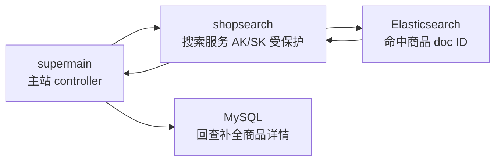

# Go 项目开发: 商城服务对接搜索服务（AK/SK 加签调用 shopsearch）

两节拼一条**主站侧对接链路**：**配置层加 AKSK → controller 分流（无关键词走 MySQL / 有关键词走 ES）→ service 拼参数加签发 HTTP → 反序列化抽商品 ID → MySQL 补全商品详情返回前端**。

这一节把每一步的代码都摊开，重点是四个容易写错的点：

- **`searchGood` 返回的是「商品 ID 列表」而不是商品详情**
- **`json.Unmarshal` 第二个参数必须传指针**
- **header 要带 `Authorization` + 时间字段两个，缺一个签名校验不过**
- **请求超时设短（5 秒），别把主站线程池拖死**

## 纲要

- 配置层：`API` 结构体加 `searchProductAK` / `searchProductSK`，`mapstructure` 标签与 yaml key 对齐
- 请求域名与 URI 分开定义：`searchProductHost` + `/api/v1/product/search`
- controller 分两个分支：**`len(kword) == 0` 直接走 MySQL**
- 走 ES 分支时先取 uid（`jwt.GetAppUserID`），**取不到忽略错误**，uid 不是必传
- 分页工具：`GetFrontPage` / `GetFrontLimit` / `GetTotalPage` 三个
- service 用 `url.Values` 拼参数，**参数名必须与 shopsearch 的 router 定义逐字一致**
- `news > 0` / `priceOrder != ""` 才透传，避免把空值传过去
- 加签：`sign.New(ak, sk, expired).Generate(uri, http.MethodGet, params)` 返回三元组
- 签名失败 / HTTP 非 200 / 反序列化失败 / `success=false`，**四个分支全部返回 `productSearchList` + 0 + 0**
- 从 `data.hits` 里抽 `productID` 到切片，**长度为 0 直接返回默认值**
- 最后用 `getProductByIDS` 走 MySQL 把详情补全，ES 只当"召回器"

## 对接链路总览

主站 `supermain` 通过 AK/SK 加签调用搜索服务 `shopsearch`，`shopsearch` 打 ES 召回商品 ID，再由主站回 MySQL 补全详情：



两个服务的工程边界划分如下：

```dir
mall/
├── supermain/              主站服务
│   ├── config/             AK/SK 配置（searchProductAK/SK）
│   ├── controller/         双分支路由：无关键词走 MySQL
│   └── service/            加签、发 HTTP、抽商品 ID
└── shopsearch/             搜索服务（AK/SK 受保护）
    ├── main.go             四件套初始化 + 优雅关闭
    ├── controller/         参数校验、组装 Product
    └── service/            拼查询、打 ES
```

## 一、配置层：把 AKSK 配进 supermain

配置结构固定是 `api` 下面挂 `searchProductAK` / `searchProductSK`，`config.go` 里要有一个 `API` 结构体，字段名和标签值跟 yaml **逐字对齐**（`mapstructure` 标签写错不会报错，只会静默填零值，这类 bug 极难查）。

```yaml
app:
  mode: dev
  name: supermain
  port: 8080
api:
  # 调用商城搜索微服务（shopsearch）用的 AK/SK
  searchProductAK: "testAK"
  searchProductSK: "testSK"
  # 搜索服务地址，本地起的就是 localhost:9090
  searchProductHost: "http://localhost:9090"
```
```go
package main

import "fmt"

// API 配置：mapstructure 标签必须和 config.yaml 里的 key 一致
type APIConfig struct {
	SearchProductAK   string `mapstructure:"searchProductAK"`
	SearchProductSK   string `mapstructure:"searchProductSK"`
	SearchProductHost string `mapstructure:"searchProductHost"`
}

type Config struct {
	Mode string     `mapstructure:"mode"`
	Name string     `mapstructure:"name"`
	Port int        `mapstructure:"port"`
	API  APIConfig  `mapstructure:"api"`
}

// 全局配置单例，启动后由 viper 填充
var globalConfig *Config

// SearchProductHost：请求域名，本地就是 http://localhost:9090
const (
	searchProductHost = "http://localhost:9090"
	searchProductURI  = "/api/v1/product/search"
)

// authTokenExpired：签名 token 的有效期，默认 30 分钟
const authTokenExpired = 30 * 60

func main() {
	globalConfig = &Config{
		Mode: "dev",
		Name: "supermain",
		Port: 8080,
		API: APIConfig{
			SearchProductAK:   "testAK",
			SearchProductSK:   "testSK",
			SearchProductHost: searchProductHost,
		},
	}

	fmt.Println("search ak:", globalConfig.API.SearchProductAK)
	fmt.Println("search sk len:", len(globalConfig.API.SearchProductSK))
	fmt.Println("search host:", globalConfig.API.SearchProductHost, searchProductURI)
}
```
## 二、controller：两个分支，无关键词走 MySQL

controller 里先按 `kword` 组装 `Product`，然后 **第一个分支就是判断关键词长度**。没有关键词说明只是列表页（筛选 + 分页），**MySQL 过滤效率比 ES 高得多，没必要把请求打到 ES**。

```go
package main

import (
	"fmt"
	"net/http"
)

// ============ 本地桩：gin 上下文 / 业务响应 / 分页工具 ============

type apigw struct {
	w http.ResponseWriter
	r *http.Request
}

func (c *apigw) Query(key string) string { return c.r.URL.Query().Get(key) }
func (c *apigw) UserID() int64           { return 10001 }
func (c *apigw) ResponseOK(data interface{}) {
	fmt.Println("response ok:", data)
}
func (c *apigw) ResponseError(err error) { fmt.Println("response err:", err) }

const defaultPageSize = 20

// GetFrontPage：pagenumber 取不到或 <=0 兜底成 1
func getFrontPage(c *apigw) int {
	n := 0
	if v := c.Query("pagenumber"); v != "" {
		fmt.Sscanf(v, "%d", &n)
	}
	if n > 0 {
		return n
	}
	return 1
}

// GetFrontLimit：limit 优先，取不到用配置里的 pagesize
func getFrontLimit(c *apigw) int {
	if v := c.Query("pagesize"); v != "" {
		n := 0
		fmt.Sscanf(v, "%d", &n)
		if n > 0 {
			return n
		}
	}
	return defaultPageSize
}

// GetTotalPage：总页数，不能被 0 除
func getTotalPage(total, size int) int {
	if size <= 0 {
		return 0
	}
	if total%size == 0 {
		return total / size
	}
	return total/size + 1
}

// ============ product service 入参 ============

type ProductIndex struct {
	ProductID int64 `json:"productID"`
}

type Product struct {
	UID        int64
	Name       string
	PageNumber int
	PageSize   int
	News       int
	PriceOrder string
	SalesOrder string
}

// getList：无关键词时走 MySQL 过滤，直接把符合条件的商品捞出来
func (p *Product) getList() ([]ProductIndex, int) {
	fmt.Println("mysql filter name:", p.Name)
	return []ProductIndex{{ProductID: 1001}, {ProductID: 1002}}, 2
}

// ============ controller：无关键词分支 ============

func searchProductHandler(c *apigw) {
	productService := &Product{}
	productService.Name = c.Query("kword")
	productService.PageNumber = getFrontPage(c)
	productService.PageSize = getFrontLimit(c)
	productService.PriceOrder = c.Query("priceorder")
	productService.SalesOrder = c.Query("salesorder")
	if news := c.Query("news"); news != "" {
		n := 0
		fmt.Sscanf(news, "%d", &n)
		productService.News = n
	}
	_ = productService.News

	// 没有关键词：MySQL 过滤比 ES 快，直接返回
	if len(productService.Name) == 0 {
		list, total := productService.getList()
		c.ResponseOK(map[string]interface{}{
			"code":       0,
			"data":       list,
			"total":      total,
			"totalPage":  getTotalPage(total, productService.PageSize),
			"pageNumber": productService.PageNumber,
		})
		return
	}

	fmt.Println("has keyword, go to es branch")
}

func main() {
	req, _ := http.NewRequest(http.MethodGet, "/api/v1/product/search?pagenumber=1&pagesize=20", nil)
	searchProductHandler(&apigw{r: req})
}
```
## 三、controller：有关键词走 ES，先取 uid

走 ES 分支后第一件事是取 uid 塞进 `Product.UID`。**没登录也能取不到，这里直接忽略错误**——uid 只是为了提高 ES 缓存命中率（`preference`），不是鉴权项。

```go
package main

import (
	"fmt"
	"net/http"
)

// ============ 本地桩：gin 上下文 / jwt / 业务响应 ============

type apigw struct{ r *http.Request }

func (c *apigw) Query(key string) string { return c.r.URL.Query().Get(key) }
func (c *apigw) ResponseOK(data interface{})   { fmt.Println("response ok:", data) }
func (c *apigw) ResponseError(err error)       { fmt.Println("response err:", err) }

// getAppUserID：登录后才有 uid；没登录返回 0，调用方直接忽略错误
func getAppUserID(c *apigw) int64 { return 10001 }

type ProductIndex struct {
	ProductID int64 `json:"productID"`
}

type Product struct {
	UID        int64
	Name       string
	PageNumber int
	PageSize   int
	News       int
	PriceOrder string
	SalesOrder string
}

// searchGood：走 ES 召回，只返回商品 ID 列表 + 总条数 + 总页数
func (p *Product) searchGood() ([]ProductIndex, int, int, error) {
	fmt.Println("call shopsearch api, kword:", p.Name, "uid:", p.UID)
	return []ProductIndex{{ProductID: 1001}}, 1, 1, nil
}

func buildSearchResponse(list []ProductIndex, total, totalPage int) map[string]interface{} {
	return map[string]interface{}{"code": 0, "data": list, "total": total, "totalPage": totalPage}
}

// ============ controller：有关键词分支 ============

func searchProductHandler(c *apigw) {
	productService := &Product{}
	productService.Name = c.Query("kword")
	productService.PageNumber = 1
	productService.PageSize = 20

	// 走 ES 分支，先拿 uid（取不到就算了）
	if len(productService.Name) == 0 {
		fmt.Println("no keyword, return early")
		return
	}
	uid := getAppUserID(c)
	productService.UID = uid

	list, total, totalPage, err := productService.searchGood()
	if err != nil {
		c.ResponseError(fmt.Errorf("search product error"))
		return
	}
	c.ResponseOK(buildSearchResponse(list, total, totalPage))
}

func main() {
	req, _ := http.NewRequest(http.MethodGet, "/api/v1/product/search?kword=iphone", nil)
	searchProductHandler(&apigw{r: req})
}
```
## 四、service：拼参数 → 加签 → 发 HTTP 请求

参数用一个 `url.Values` 逐条 `Add`，**参数名必须和 shopsearch 那边的 router 定义逐字一致**（`kword` / `pageNumber` / `pageSize` / `news` / `priceOrder` / `salesOrder` / `uid`），大小写错一个就搜不到东西，而且不会报错。

| service 侧 | 透传给 shopsearch | 类型处理 |
| --- | --- | --- |
| `d.UID` | `uid` | `int64` 用 `strconv.FormatInt` 转 string |
| `d.Name` | `kword` | 直接传 |
| `d.PageNumber` | `pageNumber` | `strconv.Itoa` |
| `d.PageSize` | `pageSize` | `strconv.Itoa` |
| `d.News > 0` | `news` | 大于 0 才加 |
| `d.PriceOrder` | `priceOrder` | 非空才加 |
| `d.SalesOrder` | `salesOrder` | 非空才加 |

```go
package main

import (
	"encoding/json"
	"fmt"
	"net/http"
	"net/url"
	"strconv"
	"time"
)

// ============ 本地桩：签名包 / httpclient 包 / 业务码 ============

const (
	headerAuthField     = "Authorization"
	headerDateTimeField = "X-Date"
	authTokenExpired    = 1800 // 30 分钟，单位秒
)

// 搜索服务域名与接口路径，参数名对齐 shopsearch 的 router 定义
const (
	searchProductHost = "http://localhost:9090"
	searchProductURI  = "/api/v1/product/search"
)

type signClient struct {
	ak      string
	sk      string
	expired int
}

func newSignClient(ak, sk string, expired int) *signClient {
	return &signClient{ak: ak, sk: sk, expired: expired}
}

// generate：返回 (authorization, date, error) 三元组
func (s *signClient) generate(uri string, method string, params url.Values) (string, string, error) {
	return "Bearer dummy-authorization", "2026-10-02T10:00:00Z", nil
}

type clientOption func(*clientOptionSet)

type clientOptionSet struct {
	headers map[string]string
	timeout time.Duration
}

func withHeader(key, value string) clientOption {
	return func(o *clientOptionSet) { o.headers[key] = value }
}

func withTimeout(d time.Duration) clientOption {
	return func(o *clientOptionSet) { o.timeout = d }
}

type httpClient struct{ opt *clientOptionSet }

func newHTTPClient(opts ...clientOption) *httpClient {
	set := &clientOptionSet{headers: make(map[string]string)}
	for _, opt := range opts {
		opt(set)
	}
	return &httpClient{opt: set}
}

// get：返回 (httpCode, body, error)
func (h *httpClient) get(u string, params url.Values) (int, []byte, error) {
	target := u
	if len(params) > 0 {
		target += "?" + params.Encode()
	}
	resp, err := http.Get(target)
	if err != nil {
		return 0, nil, err
	}
	defer resp.Body.Close()
	buf := make([]byte, 8192)
	n, _ := resp.Body.Read(buf)
	return resp.StatusCode, buf[:n], nil
}

// ============ shopsearch 响应结构 ============

type ProductIndex struct {
	ProductID int64 `json:"productID"`
}

type productSearchResponse struct {
	Total int64          `json:"total"`
	Hits  []ProductIndex `json:"hits"`
}

type searchResponse struct {
	Success bool                   `json:"success"`
	Code    int                    `json:"code"`
	Message string                 `json:"message"`
	Data    *productSearchResponse `json:"data"`
}

// ============ 入参 ============

type Product struct {
	UID        int64
	Name       string
	PageNumber int
	PageSize   int
	News       int
	PriceOrder string
	SalesOrder string
}

func getTotalPage(total, size int) int {
	if size <= 0 {
		return 0
	}
	return (total + size - 1) / size
}

// fillProductDetail：ES 给 ID，MySQL 补详情，这里用本地桩替代
func fillProductDetail(ids []int64) []ProductIndex {
	res := make([]ProductIndex, 0, len(ids))
	for _, id := range ids {
		res = append(res, ProductIndex{ProductID: id})
	}
	return res
}

// searchGood：调 shopsearch 拿商品 ID 列表
func searchGood(d *Product) (*[]ProductIndex, int, int, error) {
	productSearchList := &[]ProductIndex{}

	parameters := url.Values{}
	parameters.Add("uid", strconv.FormatInt(d.UID, 10))
	parameters.Add("kword", d.Name)
	parameters.Add("pageNumber", strconv.Itoa(d.PageNumber))
	parameters.Add("pageSize", strconv.Itoa(d.PageSize))
	if d.News > 0 {
		parameters.Add("news", strconv.Itoa(d.News))
	}
	if d.PriceOrder != "" {
		parameters.Add("priceOrder", d.PriceOrder)
	}
	if d.SalesOrder != "" {
		parameters.Add("salesOrder", d.SalesOrder)
	}
	fmt.Printf("searchGoods params: %v\n", parameters)

	// 加签：必须和 shopsearch 侧用同一个签名包、同一种算法
	signer := newSignClient("testAK", "testSK", authTokenExpired)
	authorization, date, err := signer.generate(searchProductURI, http.MethodGet, parameters)
	if err != nil {
		fmt.Println("sign error:", err)
		return productSearchList, 0, 0, err
	}

	client := newHTTPClient(
		withHeader(headerAuthField, authorization),
		withHeader(headerDateTimeField, date),
		withTimeout(5*time.Second),
	)
	code, body, err := client.get(searchProductHost+searchProductURI, parameters)
	if err != nil || code != http.StatusOK {
		fmt.Println("search product http error:", err, "code:", code, "body:", string(body))
		return productSearchList, 0, 0, err
	}

	searchRES := &searchResponse{}
	if err = json.Unmarshal(body, searchRES); err != nil {
		fmt.Println("unmarshal search response error:", err, "body:", string(body))
		return productSearchList, 0, 0, err
	}
	if searchRES == nil || !searchRES.Success {
		fmt.Println("search response not success:", string(body))
		return productSearchList, 0, 0, nil
	}
	if searchRES.Data == nil {
		return productSearchList, 0, 0, nil
	}

	totalNumber := int(searchRES.Data.Total)
	totalPage := getTotalPage(totalNumber, d.PageSize)

	// 从 hits 里抽商品 ID，后面靠 ID 回 MySQL 补详情
	productIDS := make([]int64, 0)
	for _, hit := range searchRES.Data.Hits {
		if hit.ProductID == 0 {
			continue
		}
		productIDS = append(productIDS, hit.ProductID)
	}
	if len(productIDS) == 0 {
		return productSearchList, totalNumber, totalPage, nil
	}
	*productSearchList = fillProductDetail(productIDS)

	fmt.Println("searchGood total:", totalNumber, "totalPage:", totalPage)
	return productSearchList, totalNumber, totalPage, nil
}

func main() {
	_, _, _, _ = searchGood(&Product{UID: 10001, Name: "iphone", PageNumber: 1, PageSize: 20})
}
```
注意两个细节：

- **`searchGood` 里只认 `productID` 一个字段**：ES 召回结果只带 ID，详情后面回 MySQL 补，不要把整个 ES doc 往前端塞。
- **`fillProductDetail` 在下一节实现**，这里是先调用再定义（同包内函数，编译期能解析）。

## 五、service：反序列化 → 抽 ID → MySQL 补详情

响应结构对齐 shopsearch 那边的 `SearchResponse`：`success` / `code` / `message` / `data`，`data` 里是 `total` + `hits`。

```go
package main

import "fmt"

// ============ ES 召回结果 / MySQL 商品模型 / VO ============

type ProductIndex struct {
	ProductID int64 `json:"productID"`
}

type storeProduct struct {
	ID    int64
	Name  string
	Price float64
}

type productVO struct {
	ProductID int64
	Name      string
	Price     float64
}

func (p *storeProduct) toVO() productVO {
	return productVO{ProductID: p.ID, Name: p.Name, Price: p.Price}
}

// getProductByIDS：以 id 为键的 map 条件，查所有包含这些 id 的商品
func getProductByIDS(ids []int64) []storeProduct {
	cond := make(map[string]interface{}, len(ids))
	cond["id__in"] = ids
	fmt.Println("mysql where:", cond)

	list := make([]storeProduct, 0, len(ids))
	for _, id := range ids {
		list = append(list, storeProduct{ID: id, Name: fmt.Sprintf("product-%d", id), Price: 99})
	}
	return list
}

// fillProductDetail：ES 给 ID，MySQL 给详情，copy 成 VO
func fillProductDetail(ids []int64) []ProductIndex {
	list := getProductByIDS(ids)
	res := make([]ProductIndex, 0, len(list))
	for _, item := range list {
		vo := item.toVO()
		res = append(res, ProductIndex{ProductID: vo.ProductID})
	}
	return res
}

func main() {
	list := fillProductDetail([]int64{1001, 1002})
	for _, item := range list {
		fmt.Println("product:", item.ProductID)
	}
}
```
## 注意事项

1. **无关键词直接走 MySQL**，不要为了"统一"无脑打 ES——列表页的过滤 + 分页在 MySQL 里更快。
2. **`uid` 取不到就忽略错误**，登录态不是搜索的必要条件，只影响 `preference` 缓存命中率。
3. **参数名逐字对齐**：`uid / kword / pageNumber / pageSize / news / priceOrder / salesOrder`，大小写错一个搜不到且不报错。
4. **`int64` 转 string 用 `strconv.FormatInt(d.UID, 10)`**，`int` 转 string 用 `strconv.Itoa`，别用 `fmt.Sprintf("%d")` 之外的写法（性能差一个量级）。
5. **`news` 大于 0、`priceOrder` 非空才 `Add`**，避免把空字符串透传到搜索服务，污染 bool 查询。
6. **加签参数三元组**：`sign.New(ak, sk, expired)` + `Generate(uri, method, params)`，返回 `authorization / date / error`，主站和 shopsearch **必须用同一套签名算法**。
7. **header 要两个**：`Authorization` 放签名串，另外还要放时间字段（如 `X-Date`），服务端按时间校验 token 是否过期。
8. **超时设 5 秒**：搜索是主站链路的一环，慢了整页都打不开；超时直接返回空列表 + 打错误日志，不能把 goroutine 堆住。
9. **HTTP 非 200 也要判**：`err != nil` 只是连接层错误，`code != http.StatusOK` 是业务拒绝（比如签名过期），两种都要记日志。
10. **`json.Unmarshal(body, searchRES)` 必须传指针**，传值会静默成功但 `searchRES` 一直是零值。
11. **`success == false` 单独判一次**，HTTP 200 不代表业务成功，这是最容易漏的一层。
12. **`searchRES.Data == nil` 也要兜**，空结果集时 `Data` 不返回，直接取 `Data.Total` 会 nil panic。
13. **`productIDS` 长度为 0 直接返回默认值**，别把空切片往 MySQL 里丢（会变成 `WHERE id IN ()`，SQL 语法错误）。
14. **ES 只当召回器**：结果里只留 `productID`，详情一律回 MySQL 补，避免 ES 文档结构变动影响前端。
15. **`getTotalPage` 要防 `size == 0` 除零**，分页参数为 0 时总页数返回 0。

## 本节作业

1. 把 `searchGood` 里的 HTTP 调用抽成 `callShopSearch(params url.Values) (*searchResponse, error)`，让加签、超时、错误分支集中在HTTP层，业务层只负责解析。
2. 给 `searchProductHost` 做一个「本地/测试/生产」三档配置，通过 yaml 切换（不要硬编码 `http://localhost:9090`）。
3. 在签名失败 / HTTP 非 200 这两个分支加上指标上报（比如计数器 + 错误码），否则线上只会看到用户说"搜不出东西"，看不到原因。

## 总结

商城主站对接搜索服务是一条「加签调用 + ES 召回 + MySQL 补全」的链路：**配置层把 AK/SK 放进 supermain → controller 按关键词有无分流（无关键词走 MySQL，有关键词走 ES）→ service 拼 `url.Values`、加签、发 HTTP → 反序列化抽商品 ID → 回 MySQL 补全详情返回前端**。

四个最容易写错的点是：**`searchGood` 只返回商品 ID 列表而不是详情**、**`json.Unmarshal` 必须传指针**、**请求 header 要同时带 `Authorization` 和时间字段两个**、**HTTP 超时设短（5 秒）别拖死主站线程池**。

把 ES 严格当成"召回器"是这条链路的设计核心：检索只产出 ID，所有商品详情都回 MySQL 取，这样 ES 索引结构怎么变都不会波及前端。配套地，签名失败 / HTTP 非 200 / 反序列化失败 / `success=false` 四个分支全部兜底成空列表，保证主站永远不会因为搜索抖动而白屏。

