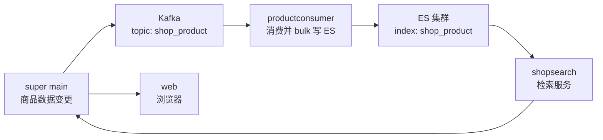

# Go 项目开发: 商品搜索业务场景和功能分析

这一节不写代码，是把**「为什么要做商品搜索」和「这一整套系统到底要做什么」**讲清楚。理解了这两点，后面所有代码（写索引、接搜索、加缓存）才知道为什么这么写。

三个结论先摆在这：

- **搜索是电商的主要流量入口**，搜索带来的流量和转化经常占到一半以上
- **商品搜索 ≠ 网页搜索**，两者在数据结构、召回率、个性化上的目标完全不一样
- **整个链路是「主站发变更事件 → Kafka → 消费端写 ES → 搜索服务检索 → 主站补全返回」**

## 纲要

- 电商流量来源：搜索 / 推荐 / 活动 / 直播 / 推广 / 分销
- **搜索是用户主动行为**，意图明确，比被动推荐更容易成交
- 数据来源：网页搜索爬互联网；商品搜索只用企业内部的商品数据
- 数据规模：网页搜索万亿级；自营商城万级；开放平台千万级
- 数据结构：**商品是结构化数据**，字段固定，可以直接写进索引
- 召回率：商品搜索要**宁滥勿缺**，不能让商品丢曝光
- 个性化：购物要登录，**用户画像清晰**，个性化要求远高于网页搜索
- 效果目标：网页搜索看关键词匹配度，商品搜索看**点击率和转化率**
- 本项目范围：基于商品名称搜索 + 价格 / 销量 / 新品排序
- 流程架构：supermain → Kafka → productconsumer → ES → shopsearch → supermain → web

## 系统拓扑与链路总览

从变更发生到用户搜到商品，数据要流经五个节点，整体是一条「事件驱动 + 检索补全」的链路：



参与这条链路的工程组件划分如下：

```dir
search-system/
├── supermain/              主站服务，发变更事件
├── kafka/                  topic: shop_product
├── productconsumer/        Go 服务，消费并写 ES
├── elasticsearch/          index: shop_product
├── shopsearch/             Go 服务，对外检索（AK/SK）
└── web/                    浏览器展示
```

## 一、电商流量从哪来，为什么搜索最重要

电商系统的流量来源大致有六类：**搜索、推荐、活动运营、直播、推广投放、分销**。

这里面搜索的特殊之处在于——**它是用户主动发起的行为**。用户自己敲了关键词，说明购买意图已经很明确了，所以搜索的转化率天然高。这也是为什么大部分电商系统里，搜索能贡献一半以上的流量和成交。

推论有两个，直接决定后面系统的设计：

- **搜索挂了 = 主站废了一半**，所以搜索链路必须有降级（超时、缓存兜底）
- **搜索慢 = 用户流失**，所以才需要后面那些性能手段（多级缓存、并发搜索、截断策略）

## 二、网页搜索 vs 商品搜索：六个维度

这是本节最该记住的一张表，面试也常问。

| 对比维度 | 网页搜索 | 商品搜索 |
| --- | --- | --- |
| 数据来源 | 整个互联网，靠爬虫抓 | 企业内部商品数据，商家后台同步进来 |
| 数据规模 | 万亿级，每天海量新增 | 自营万级，开放平台千万级，增量小 |
| 数据结构 | **非结构化**，要清洗处理 | **结构化**，字段固定，直接写索引 |
| 召回率要求 | 低，命中过亿也正常 | **高**，不想让商品丢曝光 |
| 个性化要求 | 一般，基于历史行为 | **高**，登录态清晰，画像好做 |
| 效果评估目标 | 关键词匹配度 | **点击率、转化率** |

三个关键差异展开说一下：

**数据结构**：商品属性由企业自己的系统控制，字段是固定的（`title` / `price` / `sales` / `isNew` / `storeName` …），所以**不需要像网页搜索那样做图谱解析和清洗**，数据可以直接灌进 ES。

**召回率**：网页搜索一个关键词动辄命中上亿，少召回几条没人察觉；商品搜索数据量不大，而且**平台不希望商品丧失曝光机会**，所以宁可多召回几条也不轻易过滤。

**个性化**：网上购物基本要登录，用户画像天然清晰。根据浏览/购买过的商品能推出来用户属性，而不同用户对不同商品的喜好、消费能力差异很大（有人只买百元货，有人专买旗舰），所以商品搜索的个性化要求明显高于网页搜索。

## 三、本项目要实现的搜索功能范围

本项目的商品搜索**只做一件事的主干**：**基于商品名称的搜索**，再支持按**价格、销量、新品**三个属性排序。

范围收窄有好处——能把一条完整链路跑通（写入、索引、检索、补全、返回），比铺开一堆功能更能练手。对应的请求参数结构如下：

```go
package main

import (
	"fmt"
	"strings"
)

// ============ 排序字段白名单：只认这几个，其余落到综合排序 ============

const (
	SortByPrice = "price"
	SortBySales = "sales"
	SortByScore = "_score"
)

type searchRequest struct {
	Kword      string
	SortField  string
	SortAsc    bool
	IsNew      int
	PageNumber int
	PageSize   int
}

// parseSortField：把前端传的排序参数映射到索引字段
func parseSortField(f string) (string, bool) {
	switch strings.ToLower(strings.TrimSpace(f)) {
	case "price", "价格":
		return SortByPrice, true
	case "sales", "销量":
		return SortBySales, true
	default:
		// 默认综合排序，按 _score 降序
		return SortByScore, false
	}
}

// validate：关键词必填，页码和页大小做兜底
func validate(req *searchRequest) error {
	if strings.TrimSpace(req.Kword) == "" {
		return fmt.Errorf("kword can not be empty")
	}
	if req.PageNumber <= 0 {
		req.PageNumber = 1
	}
	if req.PageSize <= 0 {
		req.PageSize = 20
	}
	if req.PageSize > 100 {
		req.PageSize = 100
	}
	return nil
}

func main() {
	req := &searchRequest{Kword: "iphone", SortField: "sales", SortAsc: false, PageNumber: 1}
	field, ok := parseSortField(req.SortField)
	fmt.Println("sort field:", field, "asc:", ok)

	if err := validate(req); err != nil {
		fmt.Println("validate failed:", err)
		return
	}
	fmt.Printf("search: %+v\n", *req)
}
```
注意排序字段是**白名单制**的：`price` / `sales` 之外的一律落到 `_score` 综合排序。**不要把前端传的字段直接拼进 sort**，否则随便一个 `password` 都能成为排序字段，这是很常见的越权写法。

## 四、整体流程架构

商品数据的变更会经过主站服务，新增 / 上架 / 修改 / 删除这些操作通过**通知的方式**写进 Kafka 集群；下游的 `productconsumer` 服务从 Kafka 消费变更，写进 ES 集群；另外还有一个 `shopsearch` 服务，从 ES 里取数据对外提供检索。

```text
商品数据变更（super main）
        │ 通知 / 消息
        ▼
Kafka 集群（topic: shop_product）
        │  consumer group: product_consumer
        ▼
productconsumer（Go 服务）
        │  bulk 写入
        ▼
ES 集群（index: shop_product）
        │  检索
        ▼
shopsearch（Go 服务，AK/SK 受保护）
        │  HTTP 返回商品 ID 列表
        ▼
super main（补 MySQL 商品详情）→ web → 浏览器
```
业务操作到 ES 写入动作的映射是这样的：**新增 / 修改 / 上架 → 写索引；下架 / 删除 → 删索引**。下架的商品不该再被搜到，但数据还在库里。

```go
package main

import "fmt"

// ============ 商品变更操作类型 ============

const (
	OpCreate = "create" // 新增
	OpUpdate = "update" // 修改
	OpDelete = "delete" // 删除（物理删）
	OpOnSale = "onsale" // 上架
	OpUnSale = "unsale" // 下架
)

type esAction int

const (
	actionIndex esAction = iota // 写索引（create / update / onsale）
	actionDelete                // 删索引（delete / unsale）
)

// resolveAction：把业务操作翻译成 ES 侧的写入动作
func resolveAction(op string) esAction {
	switch op {
	case OpDelete, OpUnSale:
		return actionDelete
	default:
		return actionIndex
	}
}

func main() {
	for _, op := range []string{OpCreate, OpUpdate, OpDelete, OpOnSale, OpUnSale} {
		if resolveAction(op) == actionDelete {
			fmt.Printf("%-8s -> delete from index\n", op)
			continue
		}
		fmt.Printf("%-8s -> index into es\n", op)
	}
}
```
## 注意事项

1. **搜索是主动行为**，转化率高，所以搜索可用性等级等同于核心交易链路。
2. **商品数据是结构化数据**，字段由企业内部系统控制，不需要像网页搜索那样做非结构化清洗。
3. **数据规模别被吓到**：自营商城万级、开放平台千万级，跟网页搜索的万亿级完全不是一个量级。
4. **召回率宁宽勿窄**：商品搜索要求高召回，平台不希望商品丢曝光机会。
5. **个性化依赖登录态**：商品搜索能拿到清晰用户画像，网页搜索大多拿不到。
6. **效果不能只看匹配度**：商品搜索最终看**点击率和转化率**，召回结果好不好要用业务指标验证。
7. **排序字段必须白名单**，禁止前端字段直接拼进 `sort`。
8. **下架 ≠ 删除**：下架是删索引（用户搜不到），数据还得留在 MySQL。
9. **变更走消息中间层**：主站不直接写 ES，避免主站耦合索引结构和 ES 可用性。
10. **ES 只存商品 ID**：检索返回 ID 后回 MySQL 补详情，避免索引字段变动影响前端。
11. **本项目范围要收窄**：先把「名称搜索 + 三种排序」这条主干跑通，再谈扩展。

## 本节作业

1. 给 `validate` 再补两条：关键词长度上限（比如 50 个字符）、`PageNumber` 上限（超过 `max_result_window / PageSize` 直接判非法而不是让 ES 报错）。
2. 把 `resolveAction` 扩展成返回 `(action, error)`，遇到未知 operation 时打错误日志并**丢弃该消息**（不要带着脏数据写索引）。
3. 画一张你自己的链路图，标出每个节点的失败会怎样（Kafka 挂了怎么办、ES 挂了怎么办、shopsearch 超时了主站怎么降级）。

## 总结

商品搜索之所以值得单独做一套系统，是因为它和网页搜索在六个维度上都不一样：**数据来源是企业内部商品、规模是万到千万级、结构是固定的结构化数据、召回率要求高、个性化强、最终看点击与转化**。这些差异决定了后面的写入、索引、检索设计。

整条业务链路是「**主站发变更事件 → Kafka → productconsumer 写 ES → shopsearch 检索 → 主站补全返回**」。关键设计有两个：**下架不等于删除**（删索引但留 MySQL 数据）、**ES 只存供召回的 ID**，详情回 MySQL 补。

本项目的范围刻意收窄到「商品名称搜索 + 价格/销量/新品排序」这一条主干，先把写入、索引、检索、补全、返回的完整链路跑通，比铺一堆功能更能练手。理解"为什么做、做什么"，后面所有代码才知道为什么这么写。

