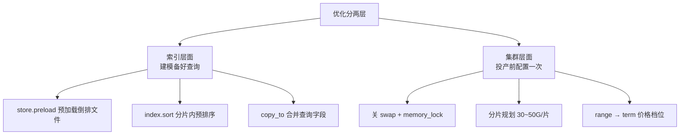

# Go 项目开发: 集群和索引层面的一些优化（上线前必配）

优化分两层：**索引层面**（建模时就把查询要用的东西备好）和**集群层面**（投产前把配置一次关到位）。本节把它们补齐，最后再给一个查询侧的实战技巧——**把 `range` 查询转成 `term` 查询**。

三个别忘了的点：

- **`store.preload` / `sort` / `copy_to` 是索引建模的老三样**
- **swap 必须关，`memory_lock` 必须开**
- **平台给了固定价格档位，就用 `term` 别用 `range`**

## 纲要

- 索引层面优化回顾：预加载索引文件 / 预排序字段 / `copy_to` 合并查询字段
- `index.store.preload` 把倒排文件提前读进页缓存
- `index.sort` 让分片内数据有序，跳过大量无用文档
- `copy_to` 把 `description` / `kword` 合并到一个 `all` 字段，少查多个字段
- 集群规模建议：**8 核以上独立主节点**，读写量大时**独立协调节点分离读写**
- 分片经验值：单分片 30~50G、每 GB 堆 ≤30 分片、单节点 ≤1000 分片、集群 ≤10 万分片
- 关闭 swap：`swapoff -a` + 注释 fstab + `vm.swappiness=1` + `bootstrap.memory_lock: true`
- 禁止通配符删索引：`action.destructive_requires_name: true`
- 自动创建索引要**白名单**，否则 dynamic mapping 会把字段类型推断歪
- SSD 可以调大：并发恢复 / 并发 rebalance / 段合并速度
- **副本延迟恢复 5 分钟**，避免节点抖动触发全量副本恢复
- 价格区间：固定档位存 `price_range` 字段用 `term` 查，**比 `range` 快**

## 优化分层与集群拓扑

优化分两层：**索引层面在建模时备好查询要用的东西**，**集群层面在投产前把配置一次关到位**。两层各自覆盖的具体手段如下：



集群节点的角色划分（投产前就要定好的拓扑）：

```dir
es-cluster/
├── master/                 独立主节点（≥8 核），只管集群状态
├── data/                   数据节点，扛分片与读写
│   ├── node-1/
│   └── node-2/
├── coordinating/           独立协调节点（读写量大时分离）
│   ├── read/
│   └── write/
└── index/
    ├── settings            preload / sort 预设
    └── mappings            copy_to / price_range
```

## 一、索引层面：建模时就把查询要用的东西备好

前面数据建模那节提过三种优化方式，这里落到具体配置上。

```json
{
  "settings": {
    "index": {
      "number_of_shards": 3,
      "number_of_replicas": 1,
      "store": { "preload": ["dvd", "tim", "doc_values"] },
      "sort": { "price": { "order": "desc" } }
    }
  },
  "mappings": {
    "dynamic": "strict",
    "properties": {
      "title":       { "type": "text", "analyzer": "ik_max_word", "search_analyzer": "ik_max_word" },
      "store_name":  { "type": "text", "analyzer": "ik_max_word" },
      "price":       { "type": "double" },
      "sales":       { "type": "long" },
      "is_new":      { "type": "boolean" },
      "price_range": { "type": "keyword", "index": true, "doc_values": false },
      "all":         { "type": "text", "analyzer": "ik_max_word" },
      "description": { "type": "text", "analyzer": "ik_max_word", "copy_to": ["all"] },
      "kword":       { "type": "text", "analyzer": "ik_max_word", "copy_to": ["all"] }
    }
  }
}
```
三点解释：

- **`store.preload`**：把倒排索引文件（`tim`）、文档值（`dvd`）提前读进文件系统缓存，查询时省一次磁盘 IO。
- **`index.sort`**：分片内按 `price desc` 预排序，查询带这个排序条件时能直接跳过大量无用文档。
- **`copy_to`**：把 `description` 和 `kword` 都拷到 `all` 字段，以后查描述、查关键词都只打 `all` 一个字段，**少打一个字段就少一次倒排查**。

创建索引和批量写入的 Go 写法：

```go
package main

import (
	"context"
	"errors"
	"fmt"
	"strings"

	"github.com/olivere/elastic/v7"
)

const indexProduct = "shop_product"

// 索引结构：预加载 + 预排序 + copy_to 三件套
const productIndexBody = `{
  "settings": {
    "index": {
      "number_of_shards": 3,
      "number_of_replicas": 1,
      "store": { "preload": ["dvd", "tim", "doc_values"] },
      "sort": { "price": { "order": "desc" } }
    }
  },
  "mappings": {
    "dynamic": "strict",
    "properties": {
      "title":       { "type": "text", "analyzer": "ik_max_word", "search_analyzer": "ik_max_word" },
      "store_name":  { "type": "text", "analyzer": "ik_max_word" },
      "price":       { "type": "double" },
      "sales":       { "type": "long" },
      "is_new":      { "type": "boolean" },
      "price_range": { "type": "keyword", "index": true, "doc_values": false },
      "all":         { "type": "text", "analyzer": "ik_max_word" },
      "description": { "type": "text", "analyzer": "ik_max_word", "copy_to": ["all"] },
      "kword":       { "type": "text", "analyzer": "ik_max_word", "copy_to": ["all"] }
    }
  }
}`

var esClient *elastic.Client

type productDoc struct {
	Title       string `json:"title"`
	StoreName   string `json:"store_name"`
	Price       float64 `json:"price"`
	Sales       int64  `json:"sales"`
	IsNew       bool   `json:"is_new"`
	PriceRange  string `json:"price_range"`
	All         string `json:"all"`
}

// createProductIndex：先删再建，保证每次建出来的结构一致
func createProductIndex() error {
	if _, err := esClient.DeleteIndex(indexProduct).Do(context.Background()); err != nil {
		var notFound *elastic.Error
		if !errors.As(err, &notFound) || notFound.Status != 404 {
			fmt.Println("delete index error:", err)
		}
	}
	if _, err := esClient.CreateIndex(indexProduct).BodyString(productIndexBody).Do(context.Background()); err != nil {
		return err
	}
	fmt.Println("create index ok:", indexProduct)
	return nil
}

// bulkWriteProducts：批量写，price_range 由 price 折算出来
func bulkWriteProducts(products []*productDoc) error {
	bulk := esClient.Bulk().Index(indexProduct)
	for _, p := range products {
		if len(strings.TrimSpace(p.PriceRange)) == 0 {
			p.PriceRange = calcPriceRange(p.Price)
		}
		bulk.Add(elastic.NewBulkIndexRequest().Id(fmt.Sprintf("%d", int64(p.Price))).Doc(p))
	}
	if _, err := bulk.Do(context.Background()); err != nil {
		return err
	}
	fmt.Println("bulk write:", len(products))
	return nil
}

// calcPriceRange：把连续价格打到固定档位上
func calcPriceRange(price float64) string {
	switch {
	case price < 10:
		return "0-10"
	case price < 50:
		return "10-50"
	case price < 100:
		return "50-100"
	case price < 200:
		return "100-200"
	case price < 500:
		return "200-500"
	default:
		return "500-"
	}
}

// 写入时把 description / kword 也塞进 all，等价于 copy_to
func buildAll(title, description, kword string) string {
	return strings.Join([]string{title, description, kword}, " ")
}

func main() {
	if err := createProductIndex(); err != nil {
		fmt.Println("init index failed:", err)
		return
	}
	list := []*productDoc{
		{Title: "商品一", StoreName: "测试店铺", Price: 5, Sales: 10, IsNew: true, All: buildAll("商品一", "这是描述", "手机")},
		{Title: "商品二", StoreName: "测试店铺", Price: 15, Sales: 30, All: buildAll("商品二", "这是描述", "电脑")},
	}
	if err := bulkWriteProducts(list); err != nil {
		fmt.Println("bulk failed:", err)
	}
}
```
`dynamic: strict` 也值得单独说一句——**字段写错了直接报错，而不是悄悄多一个字段出来**。比默认的 `true` 好排查得多。

## 二、集群层面：投产前的一次性配置

这些配置在集群投产之前就要设好，上线后再改基本要重启或者重建索引。

| 配置项 | 作用 | 建议 |
| --- | --- | --- |
| `bootstrap.memory_lock` | 锁定堆内存，防被 OS swap 出去 | `true` |
| `vm.swappiness` | swap 倾向度 | 设成 `1` |
| `action.destructive_requires_name` | 禁止通配符删索引 | `true` |
| `action.auto_create_index` | 只允许白名单索引自动创建 | 监控索引白名单 |
| `cluster.routing.allocation.node_initial_primaries_recoveries` | 并发恢复的主分片数 | SSD 调大 |
| `indices.recovery.max_bytes_per_sec` | 每秒恢复数据量 | SSD 800MB~1GB |
| `cluster.routing.allocation.cluster_concurrent_rebalance` | 集群级并发 rebalance | = 节点数（或 2 倍） |
| `cluster.routing.allocation.node_concurrent_recoveries` | 节点级并发恢复 | SSD 2；**单机多节点设 1** |
| `index.merge.scheduler.max_thread_count` | 段合并并发 | SSD 调到 100MB/s 档 |
| `index.unassigned.node_left.delayed_timeout` | 节点离线后副本延迟恢复 | `5m` |

```yaml
# elasticsearch.yml（节选，都是投产前必须定的）
bootstrap.memory_lock: true
action.destructive_requires_name: true
action.auto_create_index: .monitoring*,.watches*,.triggered_watches*,.ml*,.security*

# 分片恢复：SSD 可以放大
cluster.routing.allocation.node_initial_primaries_recoveries: 4
indices.recovery.max_bytes_per_sec: 100mb
cluster.routing.allocation.node_concurrent_recoveries: 2
cluster.routing.allocation.cluster_concurrent_rebalance: 6

# 段合并
index.merge.scheduler.max_thread_count: 2

# 节点离线后延迟 5 分钟再恢复副本，给集群自愈或人工处理留时间
index.unassigned.node_left.delayed_timeout: 5m
```
关闭 swap 是三步：**临时关 `swapoff -a`，编辑 `/etc/fstab` 注释 swap 那行（重启后仍生效），再把 `vm.swappiness` 设成 1**。

其中 `action.auto_create_index` 这条最容易踩：服务启动后如果索引没用指定方式创建，业务一写数据，ES 会靠 **dynamic mapping 自动推断字段类型**，推断出来的类型经常不是我们要的（比如把日期推断成 `text`）。所以上线前要给它加白名单，只允许监控类这类索引自动创建。

分片规划的经验值也要算一遍，别拍脑袋：

```go
package main

import (
	"fmt"
	"math"
)

// ============ 经验值（不同业务场景会有区别，有条件用线上数据压测） ============

const (
	heapGBPerNode      = 16   // 单节点 JVM 堆（GB）
	maxShardsPerGBHeap = 30   // 每 GB 堆最多承载的分片数
	maxShardsPerNode   = 1000 // 单节点分片上限
	maxShardsCluster   = 100000 // 整个集群分片上限
	targetShardSizeGB  = 40   // 单分片目标大小，经验值 30~50G
)

type clusterPlan struct {
	Nodes      int // 数据节点数
	DataSizeGB int // 总数据量
}

// estimateShards：返回 (建议主分片数, 分片数上限, 单分片实际大小)
func estimateShards(p clusterPlan) (int, int, int) {
	perNode := heapGBPerNode * maxShardsPerGBHeap
	if perNode > maxShardsPerNode {
		perNode = maxShardsPerNode
	}
	limit := perNode * p.Nodes
	if limit > maxShardsCluster {
		limit = maxShardsCluster
	}

	// 建议主分片数：总数据量 / 目标分片大小，再向上取到节点数的倍数，保证各节点均衡
	raw := int(math.Ceil(float64(p.DataSizeGB) / targetShardSizeGB))
	if raw < p.Nodes {
		raw = p.Nodes
	}
	primary := int(math.Ceil(float64(raw)/float64(p.Nodes))) * p.Nodes

	actualSize := targetShardSizeGB
	if primary > 0 {
		actualSize = p.DataSizeGB / primary
		if actualSize < 1 {
			actualSize = 1
		}
	}
	return primary, limit, actualSize
}

func main() {
	plan := clusterPlan{Nodes: 6, DataSizeGB: 1200}
	primary, limit, size := estimateShards(plan)
	fmt.Printf("主分片数 %d，实际单分片约 %dG，分片数上限 %d\n", primary, size, limit)

	// 单机多节点部署时，节点级并发恢复必须设成 1
	fmt.Println("单机三节点部署：node_concurrent_recoveries = 1（否则总并发 = 1*3 = 3，磁盘 IO 打满）")
}
```
## 三、价格区间过滤：把 range 换成 term

商品搜索里常要"过滤 100~200 元区间"。常规做法是用 `range`：

```json
{
  "query": {
    "bool": {
      "must": [
        { "match_phrase": { "all": "商品" } },
        { "range": { "price": { "gte": 0, "lt": 10 } } }
      ]
    }
  }
}
```
注意 **`lt` 不取等**：价格刚好等于 10 的商品不该落在 `0-10` 这个档位里；高版本 ES 对数值类型的 range 查询做过优化，低版本在价格固定时建议直接换成 `term`。

因为平台只给用户固定档位（0-10 / 10-50 / 50-100 / 100-200 / 200-500 / 500+），**完全没必要让用户自由选区间**——那就把区间值本身存成一个字段，查询时直接 `term`：

```go
package main

import (
	"fmt"

	"github.com/olivere/elastic/v7"
)

// priceRange 字段：keyword + doc_values=false，只给 term 查询用，不做排序聚合
const (
	priceRange0To10    = "0-10"
	priceRange10To50   = "10-50"
	priceRange50To100  = "50-100"
	priceRange100To200 = "100-200"
)

// priceTermQuery：档位查询，走倒排，比 range 快
func priceTermQuery(rangeKey string) elastic.Query {
	return elastic.NewTermQuery("price_range", rangeKey)
}

// priceRangeQuery：连续区间，左闭右开
func priceRangeQuery(min, max float64) elastic.Query {
	return elastic.NewRangeQuery("price").Gte(min).Lt(max)
}

// buildPriceQuery：有固定档位就用 term，没有才退回 range
func buildPriceQuery(hasPreset bool, min, max float64, rangeKey string) elastic.Query {
	if hasPreset && rangeKey != "" {
		return priceTermQuery(rangeKey)
	}
	return priceRangeQuery(min, max)
}

func main() {
	q1 := buildPriceQuery(true, 0, 0, priceRange10To50)
	src1, err1 := q1.Source()
	fmt.Println("term :", src1, err1)

	q2 := buildPriceQuery(false, 10, 50, "")
	src2, err2 := q2.Source()
	fmt.Println("range:", src2, err2)

	// 落到 bool query 里，must 至少命中一个
	boolQ := elastic.NewBoolQuery().Must(
		elastic.NewMatchPhraseQuery("all", "商品"),
		q1,
	)
	src3, err3 := boolQ.Source()
	fmt.Println("bool :", src3, err3)

	_ = err2
	_ = err3
}
```
## 注意事项

1. **`store.preload` 别全量开**：只对查询高频的字段开（`tim` / `dvd` / `doc_values`），开了会占内存和页缓存。
2. **`doc_values: false` 用在只查不排的字段上**：`price_range` 只给 term 用，关掉 doc_values 能省磁盘和内存。
3. **`index.sort` 只对高频排序字段生效**：预排序会写 extra 文件，占磁盘，别给所有字段都配。
4. **`dynamic: strict` 优于默认**：写错字段直接报错，比事后发现类型被推断歪好排查。
5. **独立主节点**：8 核 / 16 核以上的大集群建议独立主节点，主节点只管集群状态，不扛数据。
6. **读写量大就分离协调节点**：读写各 3 个独立协调节点，避免协调压力影响数据节点。
7. **分片数宁少勿多**：单分片 30~50G，每 GB 堆 ≤30 分片，单节点 ≤1000 分片，集群 ≤10 万。
8. **单机多节点部署要把节点级并发恢复设成 1**：否则一台物理机 3 个节点 × 2 = 6 路并发恢复，磁盘 IO 直接打满。
9. **swap 必须关**：`swapoff -a` + 注释 `/etc/fstab` + `vm.swappiness=1` + `memory_lock: true` 四件事一起做，缺一个重启就打回原形。
10. **禁止 `DELETE /index*` 这种通配符删除**：线上一次手滑就是全cluster数据没了。
11. **自动创建索引必须白名单**：防止 dynamic mapping 把字段类型推断成预期之外的值。
12. **SSD 才调大恢复 / 合并参数**，机械盘用默认值，调大只会拖垮磁盘。
13. **副本延迟恢复 5 分钟**：节点短暂离线时避免立刻触发大量副本恢复，压垮网络和磁盘。
14. **`range` 用 `lt` 不用 `lte`**：左闭右开，档位之间才不会重叠。
15. **固定档位优先 `term`**：平台给的是固定价格段时，存档位字段比算 range 更快更准。

## 本节作业

1. 把 `estimateShards` 扩展成函数 `planCluster(dataSizeGB int, nodes, replicas int)`，返回主键 + 副本数 + 总分片数，并打印每种节点规模下的分片大小曲线。
2. 给 `buildPriceQuery` 加一条兜底：档位不在白名单里时，自动降级成 `range` 查询并打一条 warn 日志，而不是静默返回空结果。
3. 把索引的 `settings` 从 Go 常量抽成一份 `product_index.json` 文件，用 `os.ReadFile` 读进来再传给 `BodyString`，方便改结构不用重新发版。

## 总结

集群与索引的优化分两层：**索引层面在建模时就把查询要用的东西备好**（预加载 `store.preload`、预排序 `index.sort`、`copy_to` 合并字段），**集群层面在投产前把配置一次性关到位**（关 swap、`memory_lock` 开、分片规划、禁止通配符删索引、自动创建索引白名单、副本延迟恢复）。

几个最该记住的数字和经验值：**单分片 30~50G、每 GB 堆 ≤30 分片、单节点 ≤1000 分片、集群 ≤10 万**；swap 必须关、`memory_lock` 必须开；单机多节点部署时节点级并发恢复要设成 1，否则磁盘 IO 直接打满。

查询侧还有一个实战 trick：平台给的是固定价格档位时，把区间值存成 `price_range` 字段、用 `term` 查，比 `range` 走得快也更准；`range` 记得用 `lt` 做左闭右开，档位之间才不会重叠。

