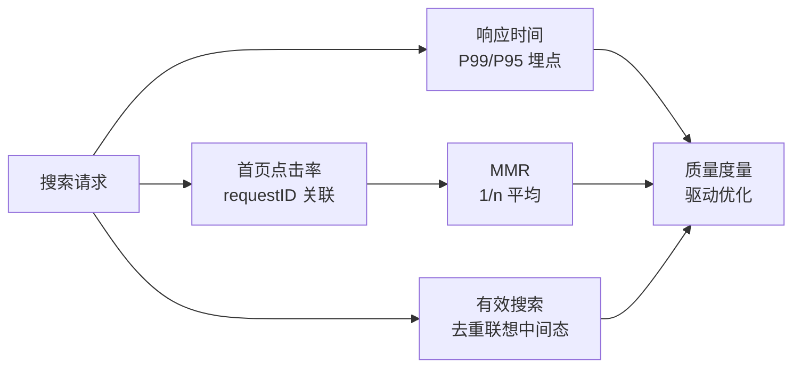

# Go 项目开发: 衡量搜索服务质量的关键指标（P99 / 首页点击率 / MMR）

电商的终极指标是**成交率**，而**搜索召回结果的质量很大程度上决定成交率**。这一节给三个可落地的度量指标，把"搜索好不好"从玄学变成数字。

三个指标按重要性排序：

1. **响应时间**——最重要的指标，直接决定用户愿不愿意用
2. **首页点击率**——结果是否符合用户预期
3. **MMR（首页发生过点击的平均倒数）**——点击是否集中在靠前的位置

## 纲要

- 终极目标是成交率，搜索结果质量直接影响它
- **一秒原则**：从发起请求到结果展示，超过 1 秒用户就有明显延迟感
- 响应时间在服务端各环节埋点，最后在接口层统计
- 用 **P99 / P95 分位数**衡量，别只看平均值（平均值会被长尾掩盖）
- 上报走 Prometheus，后面小节会实战分位数上报
- **首页点击率 = 发生过首页点击的请求数 / 请求总数**
- 点击数据前端埋点最直接；后端要靠 **requestID 关联**点击和搜索请求
- **MMR = 被点击文档位置 n 的倒数 1/n 的平均值**，最大值不超过 1
- 前三个位置就被点中，MMR 能到 30% 以上，已经是很可观的结果
- **有效搜索**：输入联想每敲一个字都会触发搜索，只有最后一次有效，前端要按关键词连续度去重

## 指标总览

把"搜索好不好"从玄学变成数字，靠三个层层递进的指标：**响应时间（最底层、决定用户用不用）→ 首页点击率（结果符不符合预期）→ MMR（点击是不是靠前）**，外加一个"有效搜索"的统计口径校正。



三个核心指标的定义与目标，先放一张总表：

| 指标 | 定义 | 目标 / 经验值 |
| --- | --- | --- |
| 响应时间（P99） | 分位数耗时，不被长尾掩盖 | ≤ 1 秒（一秒原则） |
| 首页点击率 | 有首页点击的请求数 / 总请求数 | 越高越好 |
| MMR | 被点击位置倒数 1/n 的平均 | 前三位命中能到 0.3+ |
| 有效搜索 | 排除联想中间态后的搜索 | 按 `kword` 去重统计 |

指标数据的采集与计算分布在链路的不同位置：

```dir
metrics-pipeline/
├── gateway/                网关埋点：注入 requestID
├── search-service/         各环节耗时埋点（网关→服务→ES→补全）
├── collector/              指标聚合（Prometheus 分位数）
├── click-log/              前端点击 + requestID 回传
├── dashboard/              首页点击率 / MMR 看板
└── alert/                  异常告警规则
```

## 一、响应时间：最重要，且必须看分位数

互联网服务有个"一秒响应"原则，**整个搜索接口从用户发起请求到页面展示结果，最多不能超过 1 秒**，否则用户会有明显的延迟感知。

采集方式：在服务端**各环节埋点**（网关 → 搜索服务 → ES → 补全 → 返回），最后在**用户级接口统计整体耗时**。上报用 Prometheus，看 **P99 和 P95**。

```go
package main

import (
	"fmt"
	"math"
	"sort"
	"time"
)

// LatencyMeter：最近 n 次耗时的滑动窗口，用来算分位数
type LatencyMeter struct {
	size  int
	buf   []time.Duration
	idx   int
	count int
}

func newLatencyMeter(size int) *LatencyMeter {
	return &LatencyMeter{size: size, buf: make([]time.Duration, size)}
}

// record：写入一次耗时
func (m *LatencyMeter) record(d time.Duration) {
	m.buf[m.idx] = d
	m.idx = (m.idx + 1) % m.size
	if m.count < m.size {
		m.count++
	}
}

// quantile：取 [0,1] 分位，直接对窗口内数据排序取下标
func (m *LatencyMeter) quantile(q float64) time.Duration {
	if m.count == 0 {
		return 0
	}
	sorted := make([]time.Duration, 0, m.count)
	for i := 0; i < m.count; i++ {
		sorted = append(sorted, m.buf[i])
	}
	sort.Slice(sorted, func(i, j int) bool { return sorted[i] < sorted[j] })

	pos := int(math.Ceil(q*float64(len(sorted)))) - 1
	if pos < 0 {
		pos = 0
	}
	if pos >= len(sorted) {
		pos = len(sorted) - 1
	}
	return sorted[pos]
}

func (m *LatencyMeter) p95() time.Duration { return m.quantile(0.95) }
func (m *LatencyMeter) p99() time.Duration { return m.quantile(0.99) }

func (m *LatencyMeter) report(name string) {
	avg := time.Duration(0)
	for i := 0; i < m.count; i++ {
		avg += m.buf[i]
	}
	if m.count > 0 {
		avg = avg / time.Duration(m.count)
	}
	fmt.Printf("%s: count=%d avg=%v p95=%v p99=%v\n", name, m.count, avg, m.p95(), m.p99())
}

func main() {
	meter := newLatencyMeter(128)

	// 模拟 200 次搜索，其中 10 次长尾（>1s）
	for i := 0; i < 200; i++ {
		if i%20 == 0 {
			meter.record(1200 * time.Millisecond)
			continue
		}
		meter.record(180 * time.Millisecond)
	}
	meter.report("product/search")

	// 一秒原则：P99 超 1s 就要报警
	if meter.p99() > time.Second {
		fmt.Println("告警：P99 超过 1 秒，需要排查")
	}
}
```
为什么不能只看平均值？因为**平均值会被长尾掩盖**——200 次请求里 10 次 1.2 秒，平均值看起来才 230ms 左右，用户体感却是"十次里有一次卡住"。P99 才能把这种长尾暴露出来。

## 二、首页点击率：结果是否符合预期

**首页点击率 = 单位时间内发生过首页点击的请求数 / 请求总数。**

采集有两条路：

- **前端埋点最直接**：监听用户点击事件上报。
- **后端也能做**：客户端发起搜索请求时生成一个唯一的 `requestID`，点击某个结果时把 `requestID` 和文档位置一起传回来，服务端用 `requestID` 关联"这次搜索请求"和"被点开的文档"。

```go
package main

import (
	"fmt"
	"sync"
)

// QualityStats：搜索质量指标收集器（内存版，生产接 Kafka + 流计算）
type QualityStats struct {
	mu sync.Mutex

	requests int64 // 总请求数
	clicked  int64 // 发生过首页点击的请求数
	positions []int // 被点击文档的位置（从 1 开始），用来算 MMR
}

// searchRequest：一次搜索请求
func (s *QualityStats) searchRequest() string {
	s.mu.Lock()
	defer s.mu.Unlock()
	s.requests++
	// 生产环境用 UUID / 雪花 ID
	return fmt.Sprintf("req-%d", s.requests)
}

// click：用户点开了首页的第 pos 条结果
func (s *QualityStats) click(requestID string, pos int) {
	s.mu.Lock()
	defer s.mu.Unlock()
	if requestID == "" || pos <= 0 {
		return
	}
	s.clicked++
	s.positions = append(s.positions, pos)
}

// clickRate：首页点击率 = 发生过点击的请求数 / 总请求数
func (s *QualityStats) clickRate() float64 {
	s.mu.Lock()
	defer s.mu.Unlock()
	if s.requests == 0 {
		return 0
	}
	return float64(s.clicked) / float64(s.requests)
}

// mmr：首页发生过点击的平均倒数 = sum(1/pos) / 发生过点击的请求数
func (s *QualityStats) mmr() float64 {
	s.mu.Lock()
	defer s.mu.Unlock()
	if s.clicked == 0 {
		return 0
	}
	sum := 0.0
	for _, pos := range s.positions {
		sum += 1.0 / float64(pos)
	}
	return sum / float64(s.clicked)
}

func main() {
	stats := &QualityStats{}

	// 模拟 100 次搜索，其中 30 次发生了点击，点击位置 1~5 随机
	clickPos := []int{1, 1, 2, 3, 1, 2, 4, 5, 1, 2}
	for i := 0; i < 100; i++ {
		rid := stats.searchRequest()
		if i < 30 {
			stats.click(rid, clickPos[i%len(clickPos)])
		}
	}

	fmt.Printf("请求数 %d，点击请求数 %d\n", stats.requests, stats.clicked)
	fmt.Printf("首页点击率: %.2f%%\n", stats.clickRate()*100)
	fmt.Printf("MMR: %.3f（最大 1，前三个位置被点中能到 0.3 以上就很可观）\n", stats.mmr())
}
```
## 三、MMR：点击是不是集中在靠前的位置

点击率高还不够——**如果大家都去点第 20 条，那排序还是失败的**。所以要再看一个位置指标。

MMR（Mean Reciprocal Rank）的算法很简单：**取被点击文档的位置 n，它的倒数是 1/n**。

- 第 1 条被点：MMR 贡献 1/1 = 1
- 第 2 条被点：MMR 贡献 1/2 = 0.5
- 第 3 条被点：MMR 贡献 1/3 ≈ 0.33

**平均 MMR = 所有被点击文档的 (1/n) 之和 / 发生过首页点击的请求总数**。最大值不会超过 1（不可能每次都点第一条）。

经验值：**如果点击主要落在前三个位置，MMR 能到 30% 以上，已经是很可观的结果**。

## 四、顺带一提：什么是有效搜索

实际搜索场景比上面复杂一点：为了体验好，用户每敲一个字（"iph"、"ipho"、"iphone"）都会自动触发一次搜索请求。**多次搜索里只有最后一次是有效的。**

这类"输入联想导致的重复请求"：

- **前端按关键词连续度去重**：关键词没变就只发最后一次
- **统计口径上要区分有效搜索**：把联想中间态排除掉，否则点击率会被稀释，指标失真
- **后端可以按参数指纹去抖**：同样的 `kword + page` 在短时间窗口内只算一次请求

## 注意事项

1. **响应时间是最重要指标**，一秒原则是底线，不是目标。
2. **看 P99 / P95，不看平均值**：平均值是最大的欺骗性指标。
3. **各环节都埋点**：网关、服务、ES、补全，一段慢要能定位到是哪一段。
4. **上报用 Prometheus**，分位数在服务端聚合，别把原始耗时全推到监控端。
5. **前端埋点 + 后端 requestID 关联**，两条路都要有，互相校验。
6. **`requestID` 要贯穿全链路**：一次搜索从网关到 ES 到补全，用同一个 ID 串起来。
7. **首页点击率的分子是"请求数"不是"点击数"**：分母必须是总搜索请求数，否则指标会虚高。
8. **MMR 的除数也是"发生过点击的请求数"**，不是总请求数。
9. **MMR 最大为 1**，超过 1 说明算错了（大概率是位置从 0 开始了）。
10. **位置从 1 开始数**，从 0 开始算 MMR 会得到偏小的假象。
11. **输入联想要区分有效搜索**，否则点击率被中间态稀释，优化方向会被带偏。
12. **指标要能反过来驱动优化**：调完排序/召回再跑一次，看 MMR 有没有涨。

## 本节作业

1. 把 `LatencyMeter` 换成**对数直方图**（按桶分档，`<10ms / <50ms / <100ms / <200ms / <500ms / >=1s`），输出各档计数而不是存原始样本，内存占用固定。
2. 给 `QualityStats` 加一个 `record(requestID string, positions []int)` 批量接口，让一次搜索里点开多条结果（比如猜你喜欢）也能正确算 MMR。
3. 实现「有效搜索」统计：合并同一 `kword` 在 200ms 窗口内的重复请求，只统计最后一次，并打印被合并掉的请求数。

## 总结

衡量搜索质量，靠三个层层递进的指标：**响应时间**决定用户愿不愿意用（一秒原则是底线，且必须看 P99/P95 而非平均值，否则长尾被掩盖）、**首页点击率**判断结果是否符合预期（分子是"有点击的请求数"而非"点击数"，靠前端埋点 + 后端 `requestID` 关联来算）、**MMR** 看点击是否集中在靠前位置（被点击位置倒数 1/n 的平均，前三位命中能到 0.3 以上就很可观）。

还有一个容易踩的统计口径——**有效搜索**：输入联想会每敲一个字触发一次请求，只有最后一次有效，前端按关键词连续度去重、后端按参数指纹去抖，否则点击率会被中间态稀释、指标失真。

这些指标的价值不只是"看一眼"，而是要能反过来驱动优化：调完召回或排序再跑一轮，看 P99 降没降、MMR 涨没涨，搜索系统才算进入了可度量的迭代循环。

