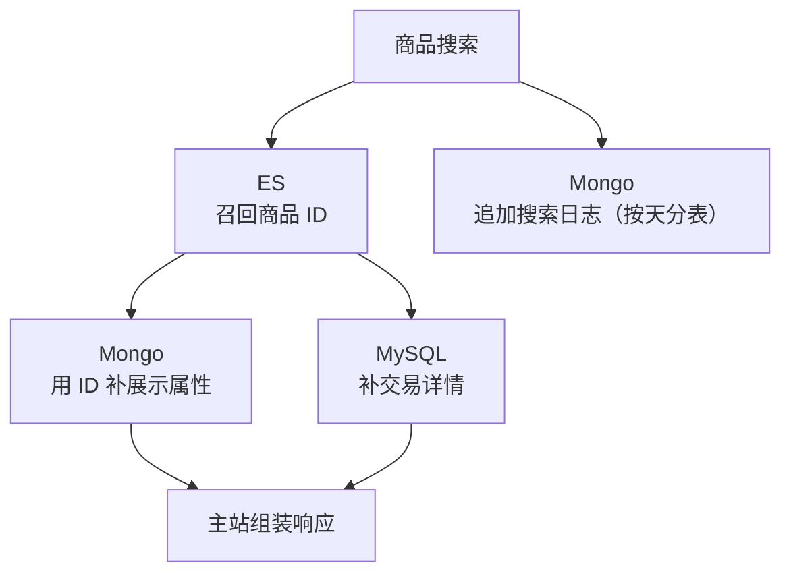

# Go 项目开发: 巧用 MongoDB 补足关系型数据库（搜索日志 + 属性补全）

**MongoDB 是"最像关系型数据库的非关系数据库"**：面向集合存储、模式自由、支持动态查询 / 完整索引 / 聚合 / 文本 / 地理空间查询，原生支持分布式集群，二进制 BSON 存储，易部署易扩展。

商品搜索里有**两处**非常适合用 Mongo：

1. **商品搜索日志**——分析用户行为的高价值数据，量大、只追加、几乎不更新
2. **商品的其他属性字段**——不参与搜索 / 过滤 / 排序的字段

第二个用法正好补上一个痛点：前面我们 ES 只把命中的**商品 ID** 返回给主站，主站再回 MySQL 取详情。这些"不参与搜索"的字段完全可以放 Mongo，搜索接口里用商品 ID 直接补全，少依赖一次 MySQL。

本节以**记录搜索日志**为主讲，把 Mongo 的初始化、分表、建索引、写入一条链路走通。

## 纲要

- MongoDB 特性：面向集合 / 模式自由 / 动态查询 / 完整索引 / 复制恢复 / BSON
- 用途一：**搜索日志**（用户行为分析，价值高）
- 用途二：**商品附加属性**（不参与搜索过滤排序，用 ID 回 Mongo 补全）
- 初始化：`InitMongoClient(name, user, pwd, addr, poolSize)`，`clientName` 用来区分多集群
- `GetMongoClient(name)` 取到客户端，挂到 `global.Mongo`
- 优雅关闭：`Close()` 里设超时再 `Disconnect`
- 接口入口记日志：追加 `createTime` 时间戳后调 `logReport`
- **按天分表**：`productSearch_20261002`，单表过千万查询效率会掉
- **集合不用预建，索引必须预建**：数据量大后再建索引慢且打负载，唯一索引有重复数据直接建不上
- **本地 `sync.Map` 缓存已建索引的表名**，避免每条数据都发一次 create index
- 结构体用 **`bson` 标签**定义字段名
- 返回结果这类大字段可以 **GZip 压缩**后再存

## 存储分层与日志结构

商品搜索的存储不是"一个库搞定"，而是三层各管一段：**ES 负责索引与召回（只给 ID）、Mongo 负责搜索日志与展示属性、MySQL 负责交易与核心详情**。Mongo 在搜索里的两个用法本质上都是"给 ES 的精简索引打补丁"。



三种存储的职责划分，先放一张总表：

| 存储 | 职责 | 典型字段 |
| --- | --- | --- |
| Elasticsearch | 索引、召回 | 名称、价格、销量 |
| MongoDB | 搜索日志、展示属性 | 用户行为、展示 attr |
| MySQL | 交易、核心详情 | 库存、订单、价格 |

Mongo 侧的集合与索引布局（按天分表 + 高频过滤字段预建索引）：

```dir
mongo-shop/
├── productSearch_20261002   搜索日志，按天分表
├── productSearch_20261003
├── product_extra/           商品展示属性，按 ID 查
└── index/
    ├── userID               高频过滤字段
    └── createTime           时间范围查询
```

## 一、初始化与优雅关闭

```go
package main

import (
	"context"
	"fmt"
	"time"

	"go.mongodb.org/mongo-driver/mongo"
	"go.mongodb.org/mongo-driver/mongo/options"
)

const (
	mongoClientName = "shop"
	mongoDatabase   = "shop"
)

// MongoClient：一个 Mongo 集群一个客户端，带名字方便多集群区分
type MongoClient struct {
	name   string
	client *mongo.Client
}

var (
	mongoClients = make(map[string]*MongoClient)
	globalMongo  *MongoClient
)

// InitMongoClient：连接池在初始化时就定好，别每次查都建连接
func initMongoClient(name, user, pwd, addr string, poolSize uint64) error {
	// 生产环境按 user/pwd/集群信息拼带鉴权的连接串
	uri := fmt.Sprintf("mongodb://%s", addr)

	opts := options.Client().ApplyURI(uri).SetMaxPoolSize(poolSize)
	client, err := mongo.Connect(context.Background(), opts)
	if err != nil {
		return err
	}

	ctx, cancel := context.WithTimeout(context.Background(), 5*time.Second)
	defer cancel()
	if err = client.Ping(ctx, nil); err != nil {
		return err
	}

	mongoClients[name] = &MongoClient{name: name, client: client}
	fmt.Println("init mongo client ok:", name, uri)
	return nil
}

// GetMongoClient：按名字取，找不到返回 nil，调用方自己判空
func getMongoClient(name string) *MongoClient {
	return mongoClients[name]
}

// Database：拿到库
func (m *MongoClient) Database(name string) *mongo.Database {
	return m.client.Database(name)
}

// Close：先设超时再 Disconnect，避免关不干净把进程卡住
func (m *MongoClient) Close() error {
	if m == nil || m.client == nil {
		return nil
	}
	ctx, cancel := context.WithTimeout(context.Background(), 5*time.Second)
	defer cancel()
	return m.client.Disconnect(ctx)
}

func main() {
	if err := initMongoClient(mongoClientName, "root", "123456", "127.0.0.1:27017", 100); err != nil {
		fmt.Println("init mongo client error:", err)
		return
	}
	globalMongo = getMongoClient(mongoClientName)

	db := globalMongo.Database(mongoDatabase)
	fmt.Println("database:", db.Name())

	// 优雅关闭：和 http / ES / mysql / cache 一起挂到 closeHooks 里
	_ = globalMongo.Close()
}
```
`clientName` 不是花架子：实际项目里可能同时接**多个 Mongo 集群**（日志集群、属性集群），靠名字取客户端就不会拿混。

## 二、写入搜索日志：按天分表 + 提前建索引

```go
package main

import (
	"context"
	"fmt"
	"sync"
	"time"

	"go.mongodb.org/mongo-driver/bson"
	"go.mongodb.org/mongo-driver/mongo"
	"go.mongodb.org/mongo-driver/mongo/options"
)

// ============ 本地桩：复用块 1 里初始化的 MongoClient ============

const mongoDatabase = "shop"

type MongoClient struct{ client *mongo.Client }

func (m *MongoClient) Database(name string) *mongo.Database {
	if m == nil || m.client == nil {
		return nil
	}
	return m.client.Database(name)
}

// indexedTables：本地缓存，记录已经建过索引的集合名
var indexedTables sync.Map

// searchLog：写入 Mongo 的搜索日志，字段名靠 bson 标签决定
type searchLog struct {
	UserID     int64  `bson:"userID"`
	Kword      string `bson:"kword"`
	PageNumber int    `bson:"pageNumber"`
	PageSize   int    `bson:"pageSize"`
	CreateTime int64  `bson:"createTime"`
	ResultCnt  int    `bson:"resultCnt"`
}

// tableByDay：按天分表，前缀 + 年月日，如 productSearch_20261002
func tableByDay(createTime int64) string {
	day := time.Unix(createTime, 0).Format("20060102")
	return "productSearch_" + day
}

// ensureIndex：只在第一次写这张表时建索引，之后直接放行
func ensureIndex(coll *mongo.Collection) {
	if _, loaded := indexedTables.LoadOrStore(coll.Name(), true); loaded {
		return
	}

	// userID + createTime 是高频过滤字段，必须在数据写入前建好
	if _, err := coll.Indexes().CreateOne(context.Background(), mongo.IndexModel{
		Keys:    bson.D{{Key: "userID", Value: 1}},
		Options: options.Index().SetUnique(false),
	}); err != nil {
		fmt.Println("create index[userID] error:", err)
	}
	if _, err := coll.Indexes().CreateOne(context.Background(), mongo.IndexModel{
		Keys: bson.D{{Key: "createTime", Value: -1}},
	}); err != nil {
		fmt.Println("create index[createTime] error:", err)
	}
}

// logReport：把一条搜索日志写进当天的集合
func logReport(mc *MongoClient, log *searchLog) error {
	if mc == nil {
		fmt.Println("mongo client is nil, skip search log report")
		return nil
	}

	table := tableByDay(log.CreateTime)
	coll := mc.Database(mongoDatabase).Collection(table)

	ensureIndex(coll)

	if _, err := coll.InsertOne(context.Background(), log); err != nil {
		return err
	}
	fmt.Println("search log written:", table, log.Kword)
	return nil
}

func main() {
	// 模拟搜索接口入口处的日志上报
	now := time.Now().Unix()
	_ = logReport(nil, &searchLog{UserID: 10001, Kword: "iphone", PageNumber: 1, PageSize: 20, CreateTime: now, ResultCnt: 128})
	_ = logReport(nil, &searchLog{UserID: 10002, Kword: "小米", CreateTime: now, ResultCnt: 42})
}
```
三个关键设计：

**为什么要按天分表**：如果所有日志都写进一张集合，单表体积会迅速膨胀；**数据量到千万级且字段多（还有大字段）时，查询效率会明显下降**。按天分表后，查某一天的行为数据只扫当天的集合。

**为什么索引要在写数据之前建**：Mongo 不用预先创建集合，但索引是**必须提前建**的——数据量大之后再加索引，执行时间长、集群负载高；而且**唯一索引如果已有重复数据，直接建不上**。

**为什么要 `sync.Map` 缓存**：第一次写这张表时建索引，之后**每条数据都发一次 create index 请求是不必要的**——即使第二次开始必然失败，这些请求打到集群也是白白增加负载。用本地缓存记住"这张表建过了"，直接跳过。

## 三、第二个用法：用 ID 回 Mongo 补商品属性

前面 ES 只返回商品 ID，主站拿到后回 MySQL 取详情。**不参与搜索 / 过滤 / 排序的属性字段完全可以挪到 Mongo**，搜索接口里按 ID 查一次就补全，MySQL 压力少一截。

```go
package main

import (
	"context"
	"fmt"

	"go.mongodb.org/mongo-driver/bson"
	"go.mongodb.org/mongo-driver/mongo"
	"go.mongodb.org/mongo-driver/mongo/options"
)

// ============ 本地桩：复用块 1 的 MongoClient ============

const mongoDatabase = "shop"

type MongoClient struct{ client *mongo.Client }

func (m *MongoClient) Database(name string) *mongo.Database {
	if m == nil || m.client == nil {
		return nil
	}
	return m.client.Database(name)
}

// productExtra：ES 里没有、只用于前端展示的属性
type productExtra struct {
	ID       int64  `bson:"id"`
	Desc     string `bson:"desc"`
	AttrJSON string `bson:"attrJSON"`
}

// fillProductExtra：用商品 ID 批量补全属性
func fillProductExtra(mc *MongoClient, ids []int64) (map[int64]*productExtra, error) {
	res := make(map[int64]*productExtra, len(ids))
	if mc == nil || len(ids) == 0 {
		return res, nil
	}

	coll := mc.Database(mongoDatabase).Collection("product_extra")
	cur, err := coll.Find(
		context.Background(),
		bson.M{"id": bson.M{"$in": ids}},
		options.Find().SetBatchSize(1000),
	)
	if err != nil {
		return res, err
	}
	defer cur.Close(context.Background())

	for cur.Next(context.Background()) {
		var e productExtra
		if err = cur.Decode(&e); err != nil {
			return res, err
		}
		res[e.ID] = &e
	}
	if err = cur.Err(); err != nil {
		return res, err
	}
	fmt.Println("fill extra:", len(res))
	return res, nil
}

func main() {
	list, _ := fillProductExtra(nil, []int64{1001, 1002})
	for id, e := range list {
		fmt.Println(id, e.Desc)
	}
}
```
如果还要把**搜索结果本身**也存进日志（用于后续做点击行为分析），这类大字段建议 **GZip 压缩**后再写，能省下不少存储和 IO。

## 注意事项

1. **MongoDB 是文档库，模式自由不等于不用设计**：字段类型还是要在写入前定好，别指望动态推断。
2. **集合不用预建，索引必须预建**：尤其是唯一索引，有重复数据就永远建不上。
3. **按天分表看 QPS**：QPS 高就按小时分，单表控制在千万级以内。
4. **`sync.Map` 缓存表名**能挡住绝大部分重复的 create index 请求，是性价比很高的优化。
5. **`bson` 标签必须写全**，字段名跟着标签走，忘了写标签就存成 `productID` 这种 Go 字段名了。
6. **连接池在初始化时设好**，`SetMaxPoolSize` 别用默认值直接上生产。
7. **多集群用 `clientName` 区分**，别用全局变量硬塞一个客户端。
8. **关闭要设超时**：`Disconnect` 卡住会把整个优雅退出拖死。
9. **日志写入不能影响主流程**：Mongo 挂了要能降级（跳过日志），不能让搜索接口报错。
10. **`logReport` 先判空再写**，客户端没初始化就静默跳过并打日志。
11. **大字段压缩后再存**：GZip 能省存储，代价是 CPU，热路径要权衡。
12. **ES 只存索引字段、Mongo 存展示字段、MySQL 存交易字段**，三层职责别混。
13. **`$in` 查询要分批**：ID 列表太大（几千个）时单次查询会很慢，按 500~1000 一批切。
14. **游标一定要 `Close`**：不关游标连接会漏，高并发下很快耗尽连接池。

## 本节作业

1. 给 `logReport` 加批量接口 `logReportBatch(mc *MongoClient, logs []*searchLog)`，用 `InsertMany` 一次写多条，并说明批量 size 取多少合适。
2. 把 `ensureIndex` 换成"支持唯一索引"的版本：建索引失败时打错误日志，并把失败的表从 `sync.Map` 里删掉，保证下次重试而不是永久跳过。
3. 用 GZip 把返回结果序列化后存进 `resultCnt` 旁边的 `resultBlob` 字段，写一段压缩 + 解压的测试代码，对比压缩前后的字节数。

## 总结

MongoDB 是"最像关系型数据库的非关系数据库"，在商品搜索里有两处用武之地：**记录只追加、几乎不更新的搜索日志**，以及**存放不参与搜索 / 过滤 / 排序的商品展示属性**。后者正好补上"ES 只返回商品 ID"留下的缺口——主站用 ID 回 Mongo 补属性，比多依赖一次 MySQL 更轻。

写入日志这条链路有三个关键设计：**按天分表**（单表控制在千万级，避免查询效率下滑）、**索引必须写前预建**（数据量大后建索引慢且打负载，唯一索引遇重复数据直接建不上）、**用本地 `sync.Map` 缓存已建索引的表名**（挡掉每条数据都发 create index 的无效请求）。

整体存储遵循"**ES 存索引字段、Mongo 存展示/日志、MySQL 存交易字段**"的三层职责划分，各管一段、互不越界；大字段（如完整搜索结果）GZip 压缩后再写，省存储也省 IO。

