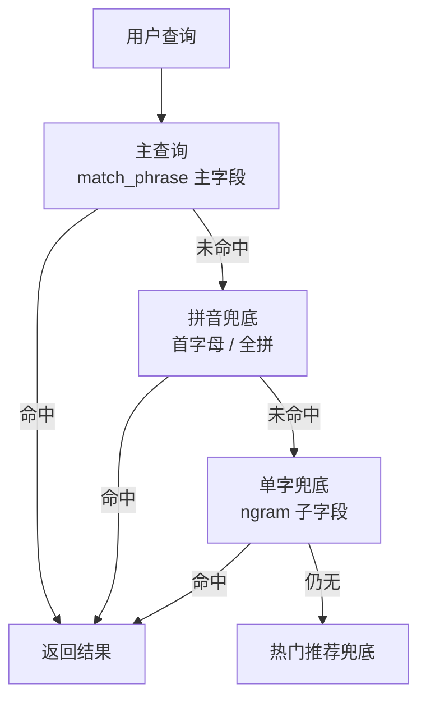

# Go 项目开发: 对搜索性能有决定性因素的数据建模（商品索引 mapping 全解）

**万丈高楼平地起，一个高性能的搜索服务得从高质量的数据建模开始。** 这一节是本章最重的一节，把建模阶段对性能真正起作用的细节过一遍，最后给出**完整的商品索引 setting + mapping**。

七个决定性的点：

- **`index.store.preload` 预热文件缓存**
- **`index.sort` 预排序**
- **`copy_to` 减少查询字段**
- **IK 分词器：写入细、查询粗**
- **拼音分词器 + 单字兜底**
- **`index_options` / `norms` 按需裁剪**
- **慢查询日志开关**

## 纲要

- ES 6.8+ 支持 `index.store.preload`，把热点索引文件预加载进文件系统缓存
- 后缀含义：`nvd` 归一化因子 / `dvd` doc_values / `tim` 词词典 / `doc` 倒排列表 / `dim` 地理位置
- 常用就配 `["nvd", "dvd"]`；**内存装不下反而更慢**，别图省事全量通配符预加载
- 预加载会拖慢索引打开速度，且取决于存储类型和操作系统，是"尽力而为"的配置
- `index.sort`：只对 boolean / 数值 / 日期 / keyword 且带 doc_values 的字段生效
- 支持 `order`（asc/desc）、`missing`（first/last）、嵌套字段不支持、**建索引时只能定一次**
- 代价是索引写入吞吐下降，合并后才真正排序，上线前必须压测
- `copy_to` 把多个字段合成一个字段查，**查询条件从两个变一个**；但只能配 `match`，`match_phrase` 会翻车
- IK 插件要装在**集群每个节点**，`GET _cat/plugins?v` 验证
- **写入用 `ik_max_word`（细），查询用 `ik_smart`（粗）**，token 数差一倍
- `match_phrase` 查不到的三种解法：查询用同一个 analyzer / 设 `slope` / 单字兜底
- `slope` 越大越像 `match`，但临近查询要算词位置，**性能远低于 match，生产不建议依赖**
- 拼音分词关键配置：`keep_separate_first_letter` / `keep_full_pinyin` / `keep_original` / `remove_duplicated_term`
- 拼音场景 `match_phrase` 搜首字母命中不了（position 打散），**查的时候换 `standard` 分词器**即可
- `index_options`：text 默认 `positions`，keyword 默认 `docs`；要邻近查询就别往 `offsets` 走
- `norms`：keyword 默认 false，text 默认 true；简介详情这类不算分字段可以关掉
- 慢查日志：query / fetch / index 三个 warn 阈值
- 商品 mapping 全量配置：3 主分片 + 1 副本、preload、三字段预排序、四套分词器、strict 模式

## 建模要点与索引结构

七个对性能起决定作用的点，落到查询侧就是一套**三级降级**：主查询命中就返回，否则走拼音兜底，再不行走单字兜底，最后热门推荐兜住不出现无结果页。



商品索引里配置的"分析器 + 预加载 + 预排序 + 映射"拆解如下，基本就是这套建模的全家福：

```dir
product-index/
├── analyzers/
│   ├── ik_index_analyzer    写入：ik_max_word（细）
│   ├── ik_search_analyzer   查询：ik_smart（粗）
│   ├── pinyin_analyzer      拼音分词
│   └── single_analyzer      ngram 单字兜底
├── preload/                 nvd, dvd 预加载页缓存
├── sort/                    price, sales, fictitious_sales
└── mappings/
    ├── store_name           主字段 + pinyin/single 子字段
    ├── name                 主字段 + pinyin/single 子字段
    └── desc                 仅 ik 分词
```

## 一、缓存预热：index.store.preload

ES 6.8 起支持配置**启动后需要预加载到文件系统缓存的索引文件**，对提升检索性能很有用——特别是**主机重启后操作系统缓存全失效**的场景。

```json
{
  "index": {
    "store": {
      "preload": ["nvd", "dvd"]
    }
  }
}
```
几个后缀的含义：

| 后缀 | 文件 | 作用 |
| --- | --- | --- |
| `nvd` | norms | 归一化因子（算分用） |
| `dvd` | doc_values | 排序 / 聚合的列式存储 |
| `tim` | 词词典 | term dictionary |
| `doc` | postings | 倒排列表 |
| `dim` | points | 地理位置相关 |

**只配 `nvd` 和 `dvd` 就够了**：`store fields`、`term frequency` 这类文件通常用不上。也可以用通配符全量预加载，但有风险——**物理内存装不下时，文件系统缓存会在大合并后重新被丢弃，反而比不配更慢**。

另外两点：预加载会**拖慢索引打开速度**（加载完索引才可用），而且它取决于存储类型和操作系统，**是尽力而为的配置**；7.15 以上可以通过 API 查看这些文件在磁盘上的实际占用。

## 二、预排序：index.sort

创建索引时可以对**每个 segment 内的文档**预排序，默认不排序。

```json
{
  "index": {
    "sort": {
      "field": ["price", "sales", "fictitious_sales"],
      "order": ["asc", "desc", "desc"]
    }
  }
}
```
约束和代价要记牢：

- **只允许带 doc_values 的 boolean / 数值 / 日期 / keyword 字段**
- `order` 取 `asc` / `desc`，`missing` 取 `first` / `last`，`mode` 取 `min` / `max`
- **嵌套字段不支持**；**建索引时只能定义一次，不能在已有索引上加或改**
- 排序发生在**刷新和合并之后**，所以会**降低索引写入吞吐量**，上线前一定要压测影响

这里给业务里明确要排序的三个字段（价格 / 销量 / 虚拟销量）做预排序，**查询带这些排序条件时能直接跳过大量无用文档**。

## 三、copy_to：把查询条件从两个变成一个

```json
{
  "thirdnameandname": { "type": "text" },
  "surname":          { "type": "text", "copy_to": ["thirdnameandname"] },
  "name":             { "type": "text", "copy_to": ["thirdnameandname"] }
}
```
写文档 `surname=安倍`、`name=晋三`，那么 `thirdnameandname` 里就同时含两个 term。查的时候：

- **`match` 能查到**：只要命中一个 term 就行
- **`match_phrase` 查不到"安倍晋三"**：因为 copy_to 之后是两个独立 term，**没有相邻关系**
- 设个 `slope` 能救回来，但**临近查询要额外算词位置，效率远低于 match**

所以：**copy_to 聚合的场景，查询一律用 `match`，别指望 `match_phrase`**。

## 四、IK 分词器：写入细、查询粗

```json
{
  "analysis": {
    "analyzer": {
      "ik_index_analyzer": {
        "type": "custom",
        "tokenizer": "ik_max_word",
        "filter": ["lowercase"]
      },
      "ik_search_analyzer": {
        "type": "custom",
        "tokenizer": "ik_smart",
        "filter": ["lowercase"]
      }
    }
  }
}
```
字段上写 `"analyzer": "ik_index_analyzer"`（写入分词）+ `"search_analyzer": "ik_search_analyzer"`（查询分词）。

**为什么查询分词要粗一些**：写索引用 `ik_max_word` 分得细（召回全），查的时候用 `ik_smart` 分得粗（减少 term 数、减少无谓比对）。

但这里有个经典坑：`match_phrase` 要求查询词的 token **在倒排索引里 position 连续相邻**。

索引时 `ik_max_word` 把"欢迎来到慕课网学习"分成 `欢迎 / 迎来 / 来到 / 慕课网 / 学习`，`来到` 在 position 2；查询时 `ik_smart` 分成 `欢迎 / 来到 / 慕课网 / 学习`，`来到` 是 position 1——**对不上，查不到**。三种解法：

1. **查询时指定和索引一样的分词器**（`ik_index_analyzer`），position 对得上，立刻能查到
2. **设 `slope=1`**，允许移动一个 position，也能查到；但 `slope` 越大越像 `match`，**临近查询性能低、词间隔越远得分越低**，生产不建议依赖
3. **单字兜底**（下面第五节）

插件安装别忘了两点：`bin/elasticsearch-plugin install` 支持远程地址也支持 `file://` 本地路径，而且**必须集群每个节点都装**，装完用 `GET _cat/plugins?v` 看节点名、插件名、版本是否齐全。

## 五、拼音分词 + 单字兜底

```json
{
  "analysis": {
    "analyzer": {
      "pinyin_analyzer":   { "type": "custom", "tokenizer": "pinyin_tokenizer" },
      "single_analyzer":   { "type": "custom", "tokenizer": "ngram_tokenizer" }
    },
    "tokenizer": {
      "pinyin_tokenizer": {
        "type": "pinyin",
        "keep_separate_first_letter": true,
        "keep_full_pinyin": true,
        "keep_original": true,
        "limit_first_letter_length": 16,
        "lowercase": true,
        "remove_duplicated_term": true
      },
      "ngram_tokenizer": { "type": "ngram", "min_gram": 1, "max_gram": 1 }
    }
  }
}
```
拼音分词几个关键配置：

- `keep_separate_first_letter: true` → 首字母**单独成 token**（"刘德华" → `l` + `d` + `h`）；设 false 则合成 `ldh` 一个 token
- `keep_full_pinyin: true` → 保留完整拼音
- `keep_original: true` → 保留原始中文
- `remove_duplicated_term: true` → **去重，能显著减少倒排存储量**

**坑：拼音场景下 `match_phrase` 搜首字母搜不到。** 因为查询词也被拼音分词器拆得七零八落，position 全被打散，而倒排里只存了首字母那一个 token。解决办法是**查询时换个分词器**：

```json
{ "match_phrase": { "name": "hylmdw" } }
```
改成指定分词器后，用 `standard` 去切这个查询串，它就只剩一个完整 token，正好命中倒排里的那个首字母 token。

**单字兜底**用内置的 `ngram` tokenizer，`min_gram = max_gram = 1` 就是单字拆分。`matching_phrase` 查 "RD" 能命中，因为它只是要求查询 token 是倒排 token 的**连续子集**。注意它会把**空格也当成 token**——这也是能搜到空格的原因。单字兜底通常作为**子字段**挂在业务字段下面，只在召回兜底时用。

## 六、index_options 与 norms：按需裁剪

`index_options` 四个档位，越往下越占空间：

| 值 | 存储内容 | 适用 |
| --- | --- | --- |
| `docs` | 文档 ID | keyword 默认 |
| `frequency` | + term 词频 | 不需要邻近查询时够用 |
| `positions` | + term 位置 | text 默认，**要 match_phrase 就得在这档** |
| `offsets` | + 起止偏移 | 要高亮才需要 |

商品搜索要用 `match_phrase` 做邻近查询，**至少 `positions`**；但不需要高亮，**就不必上 `offsets`**。

`norms` 同理：keyword 默认 `false`，text 默认 `true`。**商品名保留 norms，商品简介 / 详情 / 关键词这些不算分（或算分不重要）的字段可以设成 `false` 省空间。**

## 七、慢查询日志：把慢操作打出来

```json
{
  "index": {
    "query.warn": "500ms",
    "fetch.warn": "1s",
    "index.warn": "1s"
  }
}
```
三个阈值分别管 query / fetch / index 操作，超过就以 warn 级别打日志。注意这些项**统一写在 `index` 下面**，前面不用再重复写 `index.` 前缀。

## 八、商品索引的完整 setting + mapping

把上面所有东西拼起来，就是本项目最终的商品索引：

```json
{
  "settings": {
    "index": {
      "refresh_interval": "1s",
      "number_of_shards": 3,
      "number_of_replicas": 1,
      "store": { "preload": ["nvd", "dvd"] },
      "sort": {
        "field": ["price", "sales", "fictitious_sales"],
        "order": ["asc", "desc", "desc"]
      },
      "query.warn": "500ms",
      "fetch.warn": "1s",
      "index.warn": "1s"
    },
    "analysis": {
      "analyzer": {
        "ik_index_analyzer": { "type": "custom", "tokenizer": "ik_max_word", "filter": ["lowercase"] },
        "ik_search_analyzer": { "type": "custom", "tokenizer": "ik_smart", "filter": ["lowercase"] },
        "pinyin_analyzer": { "type": "custom", "tokenizer": "pinyin_tokenizer" },
        "single_analyzer": { "type": "custom", "tokenizer": "ngram_tokenizer" }
      },
      "tokenizer": {
        "pinyin_tokenizer": {
          "type": "pinyin",
          "keep_separate_first_letter": true,
          "keep_full_pinyin": true,
          "keep_original": true,
          "limit_first_letter_length": 16,
          "lowercase": true,
          "remove_duplicated_term": true
        },
        "ngram_tokenizer": { "type": "ngram", "min_gram": 1, "max_gram": 1 }
      }
    }
  },
  "mappings": {
    "dynamic": "strict",
    "_source": {
      "excludes": ["store_info", "description", "kword"]
    },
    "properties": {
      "id":             { "type": "keyword", "doc_values": false },
      "store_name":     { "type": "text", "index_options": "positions",
                          "analyzer": "ik_index_analyzer", "search_analyzer": "ik_search_analyzer",
                          "fields": {
                            "pinyin": { "type": "text", "store": false,
                                        "analyzer": "pinyin_analyzer", "search_analyzer": "pinyin_analyzer" },
                            "single": { "type": "text", "store": false,
                                        "analyzer": "single_analyzer", "search_analyzer": "single_analyzer" }
                          } },
      "name":           { "type": "text", "index_options": "positions",
                          "analyzer": "ik_index_analyzer", "search_analyzer": "ik_search_analyzer",
                          "fields": {
                            "pinyin": { "type": "text", "store": false,
                                        "analyzer": "pinyin_analyzer", "search_analyzer": "pinyin_analyzer" },
                            "single": { "type": "text", "store": false,
                                        "analyzer": "single_analyzer", "search_analyzer": "single_analyzer" }
                          } },
      "desc":           { "type": "text", "index_options": "positions",
                          "analyzer": "ik_index_analyzer", "search_analyzer": "ik_search_analyzer" },
      "cat_id":         { "type": "keyword", "doc_values": false },
      "price":          { "type": "double" },
      "sales":          { "type": "long" },
      "fictitious_sales": { "type": "long" },
      "is_new":         { "type": "boolean" },
      "is_recommend":   { "type": "boolean" },
      "free_shipping":  { "type": "boolean" }
    }
  }
}
```
几个字段级的取舍：

- **`id` / `cat_id` 是 keyword + `doc_values: false`**：只用来做等值过滤和 ID 召回，**不排序就不开列存**
- **`price` 用 double 保留数值特性**：范围过滤走 BKDTree，效率比 keyword 高
- **`sales` / `fictitious_sales` 是 long + doc_values**：要排序，列存必须开着
- **`_source.excludes` 排除不需要高亮的字段**：`store_info` / `description` / `kword` 不存原文，**倒排和 _source 一起瘦身**
- **`dynamic: strict`**：生产环境必须有，写错字段直接报错

对应的 Go 建索引 + 批量写入：

```go
package main

import (
	"context"
	"fmt"

	"github.com/olivere/elastic/v7"
)

const indexProduct = "shop_product"

// 第八节里那套完整的 setting + mapping，建索引时直接整段传进去
const productIndexBody = `{
  "settings": {
    "index": {
      "refresh_interval": "1s",
      "number_of_shards": 3,
      "number_of_replicas": 1,
      "store": { "preload": ["nvd", "dvd"] },
      "sort": {
        "field": ["price", "sales", "fictitious_sales"],
        "order": ["asc", "desc", "desc"]
      },
      "query.warn": "500ms",
      "fetch.warn": "1s",
      "index.warn": "1s"
    }
  },
  "mappings": {
    "dynamic": "strict",
    "properties": {
      "id": { "type": "keyword", "doc_values": false },
      "store_name": { "type": "text", "index_options": "positions",
                      "analyzer": "ik_index_analyzer", "search_analyzer": "ik_search_analyzer" },
      "name": { "type": "text", "index_options": "positions",
                "analyzer": "ik_index_analyzer", "search_analyzer": "ik_search_analyzer" },
      "desc": { "type": "text", "index_options": "positions",
                "analyzer": "ik_index_analyzer", "search_analyzer": "ik_search_analyzer" },
      "cat_id": { "type": "keyword", "doc_values": false },
      "price": { "type": "double" },
      "sales": { "type": "long" },
      "fictitious_sales": { "type": "long" },
      "is_new": { "type": "boolean" },
      "is_recommend": { "type": "boolean" },
      "free_shipping": { "type": "boolean" }
    }
  }
}`

var esClient *elastic.Client

type productDoc struct {
	ID              string  `json:"id"`
	StoreName       string  `json:"store_name"`
	Name            string  `json:"name"`
	Desc            string  `json:"desc"`
	CatID           string  `json:"cat_id"`
	Price           float64 `json:"price"`
	Sales           int64   `json:"sales"`
	FictitiousSales int64   `json:"fictitious_sales"`
	IsNew           bool    `json:"is_new"`
	FreeShipping    bool    `json:"free_shipping"`
}

// initIndex：把上面那套 setting + mapping 一次性建出来
func initIndex() error {
	if _, err := esClient.CreateIndex(indexProduct).BodyString(productIndexBody).Do(context.Background()); err != nil {
		return err
	}
	fmt.Println("init index ok:", indexProduct)
	return nil
}

func bulkWriteProducts(products []*productDoc) error {
	bulk := esClient.Bulk().Index(indexProduct)
	for _, p := range products {
		bulk.Add(elastic.NewBulkIndexRequest().Id(p.ID).Doc(p))
	}
	if _, err := bulk.Do(context.Background()); err != nil {
		return err
	}
	fmt.Println("bulk write:", len(products))
	return nil
}

func main() {
	if err := initIndex(); err != nil {
		fmt.Println("init index error:", err)
		return
	}
	_ = bulkWriteProducts([]*productDoc{
		{ID: "1001", StoreName: "测试店铺", Name: "苹果手机 iphone", Desc: "全场包邮", CatID: "1",
			Price: 5999, Sales: 100, FictitiousSales: 300, IsNew: true, FreeShipping: true},
	})
}
```
最后查询侧要做**三级降级**（主查询 → 拼音 → 单字），这是把上面几套分词器真正用起来的地方：

```go
package main

import (
	"fmt"

	"github.com/olivere/elastic/v7"
)

// buildShouldQueries：match_phrase 打主字段，打不中就靠拼音、再靠单字兜底
func buildShouldQueries(kword string) []elastic.Query {
	return []elastic.Query{
		elastic.NewMatchPhraseQuery("name", kword).Boost(2.0),
		elastic.NewMatchPhraseQuery("store_name", kword).Boost(1.5),
		elastic.NewMatchPhraseQuery("desc", kword).Boost(0.5),
		// 拼音子字段：用户输入拼音或首字母时命中
		elastic.NewMatchPhraseQuery("name.pinyin", kword).Boost(0.7),
		elastic.NewMatchPhraseQuery("store_name.pinyin", kword).Boost(0.6),
		// 单字兜底：中文分词对不上时至少能搜到部分商品
		elastic.NewMatchPhraseQuery("name.single", kword).Boost(0.3),
		elastic.NewMatchPhraseQuery("store_name.single", kword).Boost(0.2),
	}
}

func search(kword string) {
	q := elastic.NewBoolQuery().
		Should(buildShouldQueries(kword)...).
		MinimumShouldMatch("1")

	src, err := q.Source()
	fmt.Println("query:", src, err)

	// 拼音场景搜不到时，额外用 standard 分词器再查一次
	// 注意 v7 SDK 里 MatchPhraseQuery 没有 WithAnalyzer 构造器，只能链式 Analyzer()
	extra := elastic.NewBoolQuery().Should(
		elastic.NewMatchPhraseQuery("name", kword).Analyzer("standard").Boost(0.7),
		elastic.NewMatchPhraseQuery("store_name", kword).Analyzer("standard").Boost(0.6),
	).MinimumShouldMatch("1")

	src2, err2 := extra.Source()
	fmt.Println("fallback:", src2, err2)
}

func main() {
	search("hylmdw") // 拼音 / 首字母
	search("欢迎来到慕课网学习") // 中文
}
```
## 注意事项

1. **`preload` 只配 `nvd` / `dvd`**，全量通配符预加载有内存反噬风险。
2. **预加载是尽力而为**：取决于存储类型和 OS，还可能拖慢索引打开速度。
3. **索引排序只能建索引时定一次**，字段选错就得重建索引——上线前先想清楚要按哪些字段排。
4. **索引排序吃写入吞吐**，上线前一定要压测，别只测查询。
5. **copy_to 之后只能 `match` 查**，`match_phrase` 会因为 term 不相邻查不到。
6. **IK 插件必须集群所有节点都装**，`GET _cat/plugins?v` 一条条核对。
7. **写入细、查询粗**：`ik_max_word` 写 + `ik_smart` 查，是召回和性能的平衡点。
8. **position 对不上是 match_phrase 查不到的头号原因**，先 `_analyze` 看 token 再说。
9. **`slope` 能救场但别当瑞士军刀**：临近查询贵、间隔越大得分越低。
10. **拼音 `keep_separate_first_letter` 的 true/false 决定首字母是一个 token 还是三个**，直接影响能不能用 match_phrase 搜首字母。
11. **`remove_duplicated_term: true` 能明显减少倒排存储量**，测一下值不值这个 CPU。
12. **单字兜底用子字段挂上去**，不要污染主字段的倒排。
13. **`index_options` 只要 `positions`**，不上 `offsets`（不上高亮的话）。
14. **`norms` 关掉算分不重要的大字段**，存储能省一截。
15. **慢查日志三个阈值先配上**，线上没有慢查日志等于盲飞。
16. **`dynamic: strict` + `_source.excludes`** 双保险，防止字段失控和 _source 膨胀。

## 本节作业

1. **不看笔记，把商品索引的 setting + mapping 完整默写一遍**——这是本节真正的作业。
2. 用 `_analyze` API 分别跑 `ik_max_word` / `ik_smart` / `pinyin` / `ngram`，把四个分词器的 token 结果截图对比，写一份分词对照表。
3. 把 `buildShouldQueries` 改造成按**用户输入的字符集自动选路**：含字母走拼音、纯中文走 IK、都认不出就只走单字兜底，并用 `SearchSource` 打印三种路线的查询体。

## 总结

高性能搜索服务，是从高质量的数据建模起步的。本节七个对性能起决定作用的点，可以归成四类：**预加载与预排序**（`store.preload` 让热点文件进页缓存、`index.sort` 让分片内有序、跳过大量无用文档）、**分词策略**（`ik_max_word` 写 + `ik_smart` 查，召回与性能的平衡；拼音分词 + `ngram` 单字兜底解决 match_phrase 查不到）、**存储裁剪**（`index_options` 只到 `positions`、`norms` 关掉不算分的大字段、慢查日志三个阈值）、**完整 mapping**（3 主分片 1 副本、四套分词器、`dynamic: strict` + `_source.excludes`）。

查询侧要真正把这些用起来，靠的是**三级降级**：主查询（match_phrase 主字段）→ 拼音兜底 → 单字兜底，拼音搜不到时再切 `standard` 分词器补一次。建模阶段的每一处取舍，最终都落在"召回全不全、查得快不快"这两个指标上，上线前务必压测确认排序对写入吞吐的影响、预加载对内存的压力。

