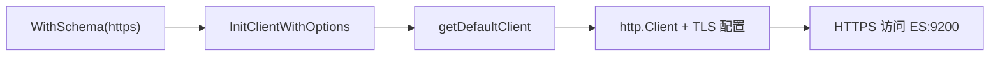

# 项目环境说明

本项目所有中间件均以 docker-compose 形式提供，开箱即用。本节说明各组件的版本与目录位置、ES 的安全（HTTPS/证书）配置、常用 docker-compose 命令，以及 Windows 下使用 Docker 的几个关键坑。

## 纲要

- 技术栈版本：ES 8.2.2、MongoDB 4.4.2、MySQL 5.7、Redis 6.0.9、Kafka
- 各环境目录：Redis 在 cache、MySQL 在 db、ES 在 es、Kafka 在 mq
- ES 安全：证书生成、HTTPS、三节点 + Kibana、healthcheck
- 常用命令：up / stop / down / restart 的区别
- Windows 坑：加速镜像、File Sharing、MongoDB 必须用命名数据卷

## 环境与版本

| 组件 | 版本 | 说明 |
| --- | --- | --- |
| Elasticsearch | 8.2.2 | 通过 `.env` 中的 `ES_VERSION` 指定 |
| Kibana | 随 ES 8.2.2 | 端口 5601，HTTPS 连 ES |
| MongoDB | 4.4.2 | 位于 nosql 目录 |
| MySQL | 5.7（8 亦可） | root/test 密码均为 admin123 |
| Redis | 6.0.9（3.0+ 均可） | 位于 cache 目录 |
| Kafka | 单节点 + Zookeeper | 位于 mq 目录 |

在 git 工程里，`docker-compose.yml` 分散在各组件目录下：Redis 在 `cache/`，MySQL 在 `db/test/`，ES 在 `es/test/`，Kafka 在 `mq/`。MySQL 已预置 root 密码 `admin123` 与用户 `test`（密码同为 `admin123`），数据目录以卷映射出来，并挂载了 `my.cnf` 设置字符集。

## ES 的安全与集群配置

ES 8.x 默认要求节点间认证与 HTTPS。在 `es/test/` 下：

1. 第一个镜像用于**生成证书**，版本读取自 `.env` 中的 `ES_VERSION`，并定义 Kibana 密码、集群名 `shop`、HTTP 端口 9200、Kibana 端口 5601。生成的证书挂载到本地 `certs` 目录。
2. 第二个镜像为 ES 节点，依赖证书生成镜像（`depends_on`），挂载证书、数据目录、插件目录，暴露 9200；通过 `environment` 指定节点名与集群名（来自 `.env`）。
3. 每个节点配 **healthcheck**：每 10 秒用证书经 HTTPS 访问 9200，超过 100 秒未启动则容器启动失败；`restart` 设为失败时重启。第二、三节点依次 `depends_on` 前一节点（依赖 `cluster.initial_master_nodes` 读取首节点状态）。
4. Kibana 依赖首节点，用 curl 每 10 秒检测本地 5601，同样 100 秒超时；连接 ES 需指定证书以走 HTTPS。

插件已预下载到 `plugins/` 目录，可进容器用本地路径安装：`bin/elasticsearch-plugin install file:///usr/share/elasticsearch/data/<插件名>`。

```dir
project-env/
├── cache/            # Redis (docker-compose.yml)
├── db/test/          # MySQL 5.7 + my.cnf + data 卷
├── es/test/
│   ├── .env          # ES_VERSION=8.2.2 等
│   ├── docker-compose.yml
│   ├── certs/        # 生成的证书
│   └── plugins/      # 预下载插件
└── mq/               # Kafka + Zookeeper
```

## 常用 docker-compose 命令

在对应 `docker-compose.yml` 所在目录执行：

- `docker-compose up`：启动集群服务
- `docker-compose stop`：仅**停止**容器
- `docker-compose down`：停止并**删除**容器、网络、数据卷（更彻底）
- `docker-compose restart`：重启服务

## Go SDK 的 HTTPS 支持

ES 客户端封装了 `WithSchema` 选项：通过函数选项模式把 `scheme` 设为 `https`，即可用 HTTPS 连接。核心在 `InitClientWithOptions` 中调用 `getDefaultClient`，后者构造 `http.Client` 并做 TLS 配置（禁用 keep-alive、跳过 TLS 校验），从而支持 HTTPS 访问。



## Windows 使用 Docker 的三个坑

1. **设置加速镜像仓库**：在 Docker Desktop → Settings → Docker Engine 的 `registry-mirrors` 配置（如 163、清华镜像），否则拉镜像极慢。
2. **共享目录（File Sharing）**：挂载出来的目录（如 `certs`、`command/data`、volumes 指定目录）都要加入 File Sharing，否则容器可能启动失败。
3. **MongoDB 必须用命名数据卷**：直接在 Windows 共享目录上 bind mount 会因文件系统特殊性无法启动；要在 `volumes` 中定义命名卷（如 `mongodata`），把数据目录挂到该卷上。

## 总结

本项目用 docker-compose 一键拉起全部依赖，版本以 **ES 8.2.2、MongoDB 4.4.2、MySQL 5.7、Redis 6.0.9、Kafka** 为准。ES 8.x 默认开启安全，需要先用专用镜像生成证书、再以 HTTPS 三节点 + Kibana 组网，插件建议用本地路径安装。

命令层面记住 `stop`（只停）与 `down`（停并删容器/网络/卷）的区别。若用 Windows 开发，务必配好**加速镜像、File Sharing、MongoDB 命名数据卷**这三个最容易踩的坑。Go 客户端已封装 `WithSchema(https)` 的 TLS 支持，开箱即可安全连 ES。
