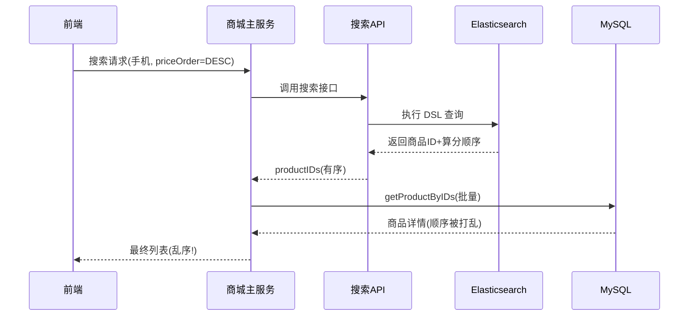

# 商城服务对接搜索服务

本章进入「商城搜索」场景的实战收口：前面我们已经把商品数据通过消费者写进了 ES，这一节要把搜索能力真正接到商城主服务上——前端发搜索请求，主服务调搜索 API 拿到命中商品，再补全详情返回给客户端。过程中会暴露一个真实且经典的坑：从 MySQL 补全详情时把 ES 返回的排序打乱了。

## 纲要

- 启动链路：前端、商城主服务、搜索 API、商品消费者
- 搜索验证：关键词、拼音、价格排序均可用
- 经典坑：用商品 ID 批量查 MySQL 时丢失了 ES 的返回顺序
- 根因：MySQL `IN` 查询不保证顺序，需在 Go 侧按 ES 顺序重组
- 作业：修复结果乱序问题

## 第一节 把搜索接到主服务

本地联调时依次启动：前端（`npm run dev`，监听 8080）、商城主服务 `shop-main`（`go run main.go`）、搜索微服务 `shop-search-api`、以及商品消费者 `product-consumer`。把后台商品先全部下架再上架，触发消费者把商品写入 ES，随后即可在前端搜索。

搜索关键词「手机」能命中标题含手机的商品；搜「小米」能过滤出小米手机；甚至用拼音也能搜到——说明拼音分词已生效。携带 `priceOrder=DESC` 时，搜索 API 的 DSL 日志显示先按 `price` 再按相关性算分排序，符合预期。



## 第二节 顺序被打乱的根因与修复

ES 返回的第一条是 id=20（价格 999 应排第一），但前端展示时第一条却是 id=19（价格 100）。问题出在主服务拿到 `productIDs` 后，用这些 ID 去 MySQL 批量查详情：MySQL 的 `IN (...)` 查询**不保证按传入顺序返回**，于是在「补全详情」这一步顺序被重排。

修复思路很简单：在 Go 侧用 `map[id]detail` 承接 MySQL 结果，再按 ES 返回的 `productIDs` 顺序遍历组装，顺序即可严格还原。

```go
// 修复示意：按 ES 顺序重组，而不是直接用 MySQL 返回顺序
details := getProductByIDs(ids)            // 顺序不确定
m := make(map[int64]Product, len(details))
for _, d := range details {
    m[d.ID] = d
}
ordered := make([]Product, 0, len(ids))
for _, id := range ids {                   // 严格遵循 ES 返回顺序
    if d, ok := m[id]; ok {
        ordered = append(ordered, d)
    }
}
```

```dir
mall-search/
├── web/                 # 前端(8080)
├── shop-main/          # 商城主服务
│   └── main.go
├── shop-search-api/    # 搜索微服务
│   └── product_search.go
└── product-consumer/   # 商品消费者(写ES)
    └── consumer.go
```

| 环节 | 是否保序 | 说明 |
| --- | --- | --- |
| ES 查询返回 | 是 | 按算分/排序字段有序 |
| 主服务传 IDs | 是 | 顺序不变 |
| MySQL 批量查 | 否 | `IN` 不保证顺序 → 乱序根源 |
| Go 侧 map 重组 | 是 | 修复后严格还原 ES 顺序 |

## 总结

本节核心是「搜索接口如何真正落地到主服务」：主服务接收前端请求 → 调搜索 API 拿命中商品 → 补全详情 → 返回客户端。需要重点掌握的是如何用多条件从 ES 查询、如何排序、如何解析命中结果、以及如何判断哪些查询条件被命中（通过 `matchQueries` 字段可看到 name 拼音等具体命中项）。

最值得记住的坑是：**跨数据源补全字段时顺序会丢**。ES 给的是有序 ID 列表，MySQL 批量查回来却无序，直接拼装就乱序。正确做法是「以 ES 顺序为主、用 map 做 O(1) 查找重组」。本节作业正是解决这个乱序问题——动手改一版，你会对手「查询结果与详情补全分离」的设计理解更深。
