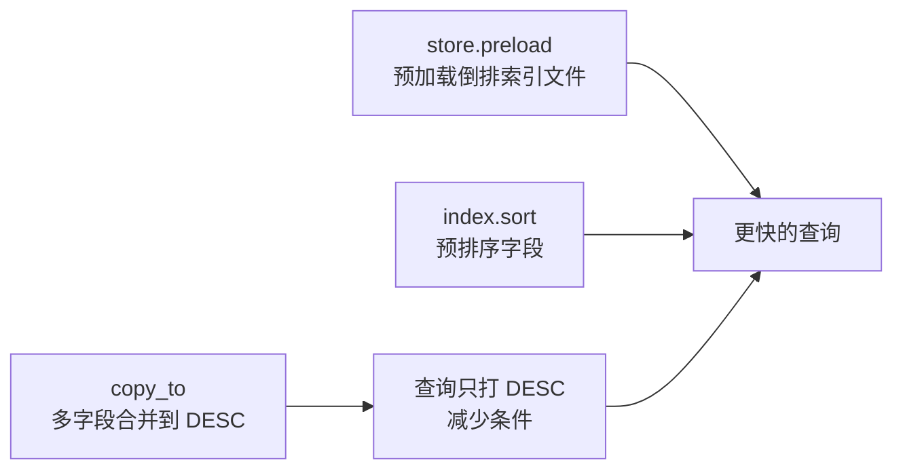
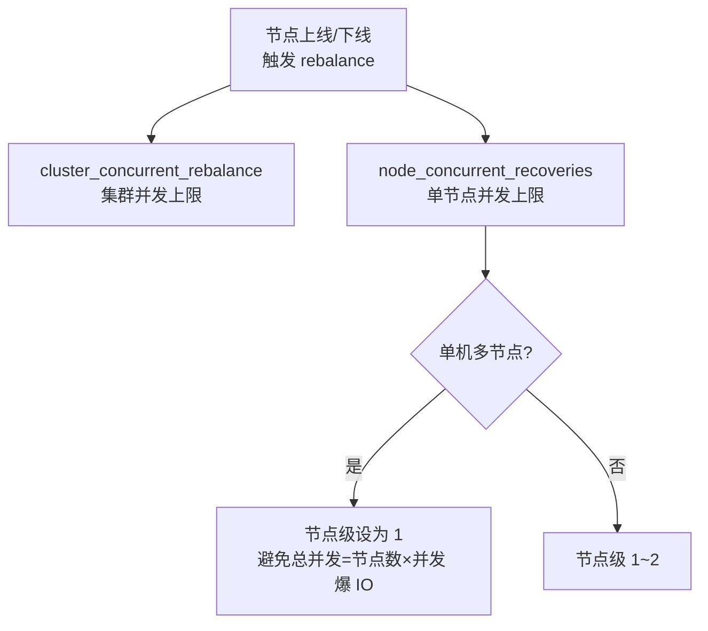

# 集群和索引层面的一些优化：投产前的配置清单与 range 转 term 实战

前面数据建模的小节我们提过三种索引内优化：**预加载索引文件（`store.preload`）、预排序字段（`index.sort`）、用 `copy_to` 减少查询条件**。这一节在它们基础上，补一份**索引规划与集群级别的配置清单**——这些设置大多在投产前就要定好，而且最容易被忽略。最后用一个「价格区间过滤」的实战，演示如何把 `range` 查询优化成 `term` 查询。

## 纲要

- 索引内优化回顾：preload / 预排序 / copy_to
- 索引规划经验值：分片大小、分片数、bulk 体积
- 集群级九项配置：swap、swappiness、memory_lock、禁通配删、auto_create 白名单、recovery、rebalance、merge、延迟恢复
- 价格区间过滤：range → term 的转化实战
- 单机多节点部署时的 IO 防抖要点

## 索引内优化回顾



- **预加载**：`index.store.preload` 配置需要预加载的倒排索引文件后缀（如 `.tip`、`.doc` 等）。
- **预排序**：`index.sort.field` + `index.sort.order` 指定排序字段与方向，加速基于这些字段的检索。
- **`copy_to`**：把 `description`、`keyword` 等字段 `copy_to` 到一个 `DESC` 字段，查询其他字段时统一查 `DESC`，减少查询条件数量。

## 索引规划经验值

集群规模上来后，规划比调参更重要（以下为经验值，最终以线上压测为准）：

| 维度 | 建议 |
| --- | --- |
| 专用主节点 | 集群较大时用专用 master，不承载数据/协调节点角色 |
| 专用协调节点 | 8/16 核以上、读写量都大时，设专用 coordinating 节点并**分离读写请求**（读写各 3 个） |
| 单分片大小 | **30GB ~ 50GB** |
| 每 GB 堆内存分片数 | ≤ 30 个 |
| 单节点分片数 | ≤ 1000 个 |
| 集群总分片数 | ≤ 10 万 |
| bulk 写入大小 | ~10MB |

## 集群级九项配置

这些设置常被人忽略，却是高性能搜索服务的地基。核心原则：**投产前设好，抓住每个细节**。

```dir
集群级优化配置（投产前必设）
├── 操作系统层
│   ├── 关闭 swap（swapoff + /etc/fstab 注释）
│   ├── vm.swappiness = 1
│   └── bootstrap.memory_lock = true
├── 安全层
│   ├── action.destructive_requires_name = true
│   └── action.auto_create_index = 白名单
└── 恢复/均衡/合并层
    ├── node_initial_primary_recoveries
    ├── indices.recovery.max_bytes_per_sec
    ├── cluster_concurrent_rebalance
    ├── node_concurrent_recoveries
    ├── merge 限速（SSD 调大）
    └── node_left.delayed_timeout
```

### 1. 关闭 swap

ES 对内存敏感，swap 会严重拖慢性能。

```bash
swapoff -a                       # 临时关闭
# 再编辑 /etc/fstab，注释掉 swap 所在行，重启后仍保持关闭
```

### 2. 配置 swappiness

```bash
sysctl vm.swappiness             # 查看当前值
# /etc/sysctl.conf 中设置
vm.swappiness=1
```

### 3. 锁定堆内存

在 `config/elasticsearch.yml` 中：

```yaml
bootstrap.memory_lock: true
```

这样 ES 启动后堆内存被固定为配置大小，**不受操作系统内存回收影响**。

### 4. 禁止通配符删除（安全）

ES 允许用 `*` 删掉集群中所有索引，风险极高。线上必须禁止：

```yaml
action.destructive_requires_name: true
```

### 5. 仅允许系统索引自动创建

业务写入一条数据，若集群中没有对应索引，ES 会用 `dynamic mapping` **自动推断字段类型**——而推断出来的类型往往不是你想要的。

```yaml
action.auto_create_index: "monitor*,.monitoring*,.watches*,.triggered_watches*,.watcher-history*"
```

用白名单（支持通配符、逗号分隔）只允许监控类等系统索引自动创建，业务索引必须显式建好 mapping。

### 6 & 7. 加速分片恢复与 rebalance（SSD）

- `cluster.routing.allocation.node_initial_primary_recoveries`：并发恢复的主分片数。
- `indices.recovery.max_bytes_per_sec`：每秒恢复数据上限。机械盘用默认，SSD 可设 **800mb ~ 1gb**。
- `cluster.routing.allocation.cluster_concurrent_rebalance`：整个集群并发重平衡数，可设成**当前节点数**（节点多时可到节点数 ×2）。
- `cluster.routing.allocation.node_concurrent_recoveries`：单节点并发恢复分片数，一般 **1~2**。



**单机多节点部署要特别小心**：一台物理机部署 3 个 ES 节点、节点级并发设为 2 → 该物理机总并发 = 2×3 = 6，磁盘 IO 直接打爆。此时**节点级并发恢复应设为 1**。

### 8. 加快段合并

当段合并速度落后于写入速度，ES 会把合并线程减到 1 以避免段数量爆发。默认段合并限速 **20mb/s**，SSD 可调大：

```bash
# 旧版本（段合并限速未移除时）
PUT _cluster/settings
{ "persistent": { "indices.store.throttle_max_bytes_per_sec": "100mb" } }
```

> 注意：段合并限速在 **7.x 之后已被移除**，现代版本主要靠 IO 调度与 `indices.merge.scheduler.max_merge_count` 等控制，无需（也无法）用上面的 throttle 参数。版本选型时务必对照 release notes。

### 9. 节点延迟恢复

节点离线后默认 **1 分钟**就开始恢复副本，带来大量网络与磁盘 IO。给集群自愈或人工处理留出时间：

```bash
PUT _all/_settings
{ "index.unassigned.node_left.delayed_timeout": "5m" }
```

离线节点重新加入后，可避免不必要的副本恢复。

## 实战：高效过滤价格区间

商品搜索常要过滤某价格区间（如 100~200 元）。

**常规做法——range 查询**：

```json
{
  "query": {
    "bool": {
      "minimum_should_match": 1,
      "should": [
        { "match_phrase": { "name": "商品" } },
        { "range": { "price": { "gte": 0, "lt": 10 } } }
      ]
    }
  }
}
```

`gte` 是 ≥、`lt` 是 <（不取等）；用 `lte` 才是 ≤。高版本 ES 对数值类型的 range 查询做了显著优化，性能已经不错。

**低版本 / 固定区间场景——转 term 查询**：如果平台只提供固定区间按钮（0-10、10-50、50-100、100-200、200-500、500-1000、1000+），用户不能选任意值，就可以把区间存成独立字段：

```json
{
  "properties": {
    "price":     { "type": "integer" },
    "pricerange": { "type": "keyword", "doc_values": false }
  }
}
```

写入时给文档打上 `pricerange`（如 `0-10`、`10-50`）。查询时直接用 `term` 查 `pricerange`，比 `range` 效率更高：

```json
{ "query": { "term": { "pricerange": "0-10" } } }
```

`doc_values=false` 因为该字段只用于 term 过滤、不参与排序。

## 总结

集群和索引层面的优化，是「投产前把地基打牢」的活儿：

- **索引内**：preload 提查询速度、预排序加速检索、`copy_to` 收敛查询条件。
- **规划上**：单分片 30~50GB、每节点分片有上限、bulk ~10MB，读写分离用专用协调节点。
- **集群配置**：关 swap、锁堆内存、禁通配删除、auto_create 白名单防脏 mapping；SSD 上调 recovery / rebalance / merge 限速；单机多节点时把节点级并发恢复压到 1 防 IO 爆炸；`node_left.delayed_timeout` 避免副本恢复风暴。
- **查询上**：固定区间的价格过滤，用 `term` 查预存区间字段，比 `range` 更省。

这些二元配置对大多数场景有效，但部分仍需提前设定以规避问题。真正上线前，请用真实数据压测，让配置落到业务实际曲线上。
