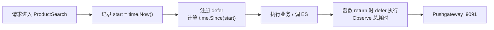

# 搜索性能指标上报

前面实现了搜索接口，本节用之前封装的 SDK，把**搜索接口（商品搜索服务）的 QPS 与耗时分位数上报**出来。调用链是：商城主服务调用商品搜索服务，两个服务的耗时都值得关注，而**性能瓶颈在 ES**，所以要重点上报 search API 的耗时。

## 纲要

- 启动监控三件套：Prometheus / Grafana / Pushgateway
- 增加 Prometheus 配置并映射到结构体（mapstructure）
- 初始化 SDK：host、间隔、job 名、HTTP Client
- 定义 Histogram 指标 `productsearch`（桶 + 标签）
- 在搜索接口入口用 `defer` 上报总耗时
- 标签数量必须与定义一致
- 延伸：Go `defer` 的执行机制（LIFO 与命名返回值）

## 启动监控服务

用 `docker-compose up -d` 一键拉起三个服务（compose 文件在 PKG 包的 prometheus 目录下）。端口约定：

| 服务 | 端口 | 说明 |
| --- | --- | --- |
| Grafana | 3000 | 可视化面板 |
| Pushgateway | 9091 | 应用推送指标的中转站 |
| Prometheus | 默认 9090 | 从 Pushgateway 拉取指标 |

应用连接 Pushgateway，Prometheus 再从 Pushgateway 拉取，最终在 Grafana 展示。

## 配置与初始化

**1. 配置项（config.yaml）**：指向 Pushgateway 暴露的 9091 端口。

```yaml
prometheus:
  host: "localhost:9091"   # Pushgateway 地址
```

**2. 映射到结构体**：用 `mapstructure` 标签把配置解析进结构体。

```go
type Config struct {
    Prometheus PrometheusConf `mapstructure:"prometheus"`
}
type PrometheusConf struct {
    Host string `mapstructure:"host"`
}
```

**3. 初始化 SDK**（入口 `main.go` 的 `init` 中）：

```go
// InitPrometheus 参数：host、上报间隔、appName(job名)、httpClient
prom.InitPrometheus(
    cfg.Prometheus.Host,  // Pushgateway host
    1 * time.Second,      // 演示用 1s；线上 30s 或 60s
    "product-search",     // appName，作为 job name
    http.DefaultClient,   // 用 SDK 封装的 default client
)
```

## 定义指标

在 `metric/productsearch/metric.go` 中定义 Histogram：

```go
opts := prometheus.HistogramOpts{
    Name:    "productsearch",                              // 绘图时写 PromQL 用，必须唯一
    Help:    "商品搜索接口耗时",
    Buckets: []float64{5, 10, 15, 20, 25, 30},            // 5ms~30ms，步长自定
}
// constLabels：主机名 + 应用名（多 pod/多机部署时按标签区分）
// 自定义 label：cluster（过滤打到哪个 ES 集群）
```

- `Name` 必须唯一，绘图时通过它写 PromQL。
- `Buckets` 从 5ms 开始，间隔一定步长，最大到 30ms（以耗时为桶，文件大小也可作桶）。
- **constLabels**：自动上报主机名、应用名，便于多实例区分。
- **自定义 label `cluster`**：用于过滤搜索请求打到了哪个 ES 集群。

## 在接口入口上报（defer）

在搜索接口入口处通过 `defer` 上报，**目的是不占用接口自身的总耗时**——`defer` 在函数即将 return 时才执行，此时计算的时间差就是接口总耗时。

```go
func ProductSearch(...) {
    start := time.Now()
    // 自定义标签 cluster 通过参数传入（数组，可传多个）
    defer func() {
        // 标签值数量必须与指标定义时的自定义标签数量一致
        _ = metricProductSearch.
            WithLabelValues(cluster).
            Observe(time.Since(start).Seconds() * 1000) // 毫秒
    }()
    // ... 业务逻辑
}
```



**务必注意**：`WithLabelValues` 传入的标签值数量，要和指标定义时的自定义标签数量**严格一致**，否则上报会出错。

监控面板与指标的对应关系如下，三类面板正对应前面三类 PromQL：

```dir
grafana-panels/
├── QPS 面板
│   └── irate(countertest[2m])
├── 耗时分布面板
│   ├── <5ms      bucket le=5
│   ├── 5~10ms    le=10 - le=5
│   ├── 10~15ms   le=15 - le=10
│   └── 15~20ms   le=20 - le=15
└── 分位数面板
    ├── P99  histogram_quantile(0.99, ...)
    ├── P95  histogram_quantile(0.95, ...)
    └── P90  histogram_quantile(0.90, ...)
```

## 延伸：Go `defer` 执行机制

本节顺带把 `defer` 讲透，因为上报靠它。

**1. 执行顺序：栈（LIFO）**

```go
defer d1(); defer d2(); defer d3() // 输出 3 2 1
```

`defer` 是栈结构，先进后出，所以最后注册的最先执行。

**2. 对返回值的影响：仅「命名返回值」会被 defer 修改**

```go
func f1() int { x := 5; defer func(){ x++ }(); return x }   // 返回 5（匿名返回，defer 改的是另一份）
func f4() (s int) { s = 5; defer func(){ s++ }(); return s } // 返回 6（命名返回，defer 改的是同一个 s）
```

原因：函数 return 前先对返回值赋值，再执行 defer，最后真正返回。匿名返回时 `defer` 里修改的是函数内局部变量，与返回值不是同一地址；**命名返回值时 `s` 始终是同一地址**，defer 里的自增会反映到最终返回。前三个与最后一个例子中，只有 `f4`（命名返回值）输出 6。

> 实践建议：用 `defer` 上报指标时，把耗时计算写在 `defer` 闭包里，依赖它「函数末尾才执行」的特性拿到真实总耗时，且不干扰主流程。

## 总结

搜索性能指标上报的链路是：**配置 Pushgateway 地址 → 初始化 SDK（host/间隔/job/client）→ 定义 Histogram 指标（桶 + 标签）→ 在接口入口用 `defer` 上报总耗时 → Grafana 出面板**。

- 监控三件套里，应用只对接 **Pushgateway:9091**，Prometheus 负责拉取，Grafana 负责看。
- 上报务必放在 `defer` 里，保证拿到的是**接口完整耗时**，且不增加主流程开销。
- 标签数量必须对齐，这是最容易踩的运行时错误。后续章节我们就用这套上报，在面板上观察搜索服务的真实表现。
