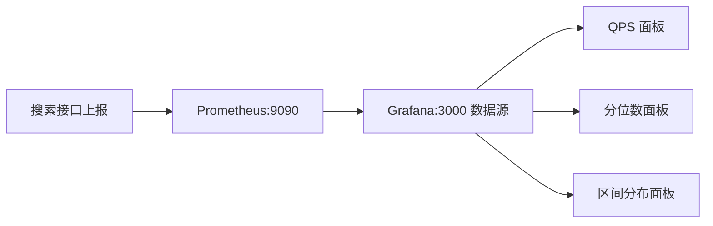

# 搜索性能指标上报

搜索服务的可观测性，核心就是三类图：**QPS、接口耗时分位数、各耗时区间请求数**。本节基于商品搜索接口的监控指标上报，演示如何在 Prometheus + Grafana 中把这三张图画出来。

## 纲要

- 指标上报后，用测试程序跑搜索接口产生数据
- Prometheus 在 9090（容器内），Grafana 在 3000，同 compose 网络用服务名互通
- QPS：`sum(rate(productsearch_count[2m]))`
- 分位数：`histogram_quantile(0.99, sum(rate(productsearch_bucket[2m])) by (le))`
- 区间分布：`increase(productsearch_bucket{le="0.2"}[2m])` 差值计算

## 上报与数据源

在监控指标上报的代码就绪后，先启动商品搜索 API 服务，再用测试程序（位于 `maintest`）调用搜索接口（如 `:9090/api/v1/product/search`）产生上报数据。随后访问 Grafana 的 3000 端口，其数据源已在启动时配好——指向 `prometheus:9090`。由于 Prometheus 的 9090 仅容器内部暴露，而 Grafana 与它同处一个 docker-compose 文件，直接用**服务名**即可访问，无需对外暴露端口。

监控指标在代码里定义为 `productsearch`，并使用了 **Histogram（直方图）**。Histogram 上报后会自动生成三个指标：`productsearch_count`、`productsearch_bucket`、`productsearch_sum`。



## 三张核心面板

**1. QPS。** 新增面板，用 PromQL 源码模式：`sum(rate(productsearch_count{cluster="a"}[2m]))`。`rate` 计算 2 分钟窗口内的每秒增长率，`sum` 把所有节点聚合。去掉 `cluster` 过滤即为总 QPS；保存面板名如「搜索 QPS」。

**2. 耗时分位数。** 用 `histogram_quantile`：`histogram_quantile(0.99, sum(rate(productsearch_bucket[2m])) by (le))` 得到 p99（实测约 350–400ms）。同理可画 p95、p90，数值依次降低。注意分位数必须用 `_bucket` 指标，并 `by (le)` 分组。

**3. 各区间请求数。** 用 `increase(productsearch_bucket{le="0.2"}[2m])` 得到 2 分钟内耗时 ≤200ms 的请求数；区间段用两个 bucket 相减，例如 100–200ms = `bucket{le="0.2"} - bucket{le="0.1"}`。

```dir
metrics-dashboard/
├── 数据源/
│   └── prometheus:9090
├── 面板/
│   ├── QPS/              # rate(count)
│   ├── 分位数/           # histogram_quantile
│   └── 区间分布/         # increase(bucket) 差值
└── 指标定义/
    └── productsearch (Histogram)
```

| 面板 | PromQL 关键 | 说明 |
| --- | --- | --- |
| QPS | `sum(rate(productsearch_count[2m]))` | 可按 cluster/app 过滤 |
| p99 耗时 | `histogram_quantile(0.99, sum(rate(productsearch_bucket[2m])) by (le))` | 约 350–400ms |
| 区间请求数 | `increase(productsearch_bucket{le="0.2"}[2m])` | 用差值算区间 |

## bucket 边界必须与代码一致

代码里定义了 `defaultBuckets`（一组 `le` 边界，如 0.1、0.12、0.15、0.2…）。PromQL 只能按代码中**已定义**的 `le` 值过滤；若写一个不存在的边界（如 0.26），查不到任何数据。所以监控的 bucket 步长必须与代码 `defaultBuckets` 严格对齐，否则区间统计会失效。

## 总结

搜索监控落地只需三张图：**QPS、耗时分位数、耗时区间分布**，类型非常有限，多练即可上手。技术上依靠 Prometheus 的 Histogram 指标 `productsearch_count/_bucket/_sum`：QPS 用 `rate(count)`、分位数用 `histogram_quantile(0.99, sum(rate(bucket[2m])) by (le))`、区间分布用 `increase(bucket{le=...})` 再相减。

两个易错点：一是 Grafana 数据源在同 compose 网络下直接用 `prometheus:9090` 服务名；二是 **bucket 的 `le` 边界必须与代码 `defaultBuckets` 一致**，否则过滤不到数据。作业：完成商城商品搜索接口的 QPS 与耗时上报并绘制面板。
