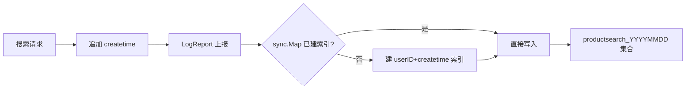

# 巧用NoSQL型数据库补足关系型数据库

MongoDB 是最像关系型数据库的非关系型数据库：文档模型、模式自由、支持动态查询、完全索引、复制与故障恢复，原生支持分布式，特别适合大数据场景。在商品搜索里，它有两个天然用武之地——存搜索日志、存不参与检索的冗余属性。本节以「记录搜索日志」为例，讲清楚如何在 Go 项目里初始化 MongoDB、按天分表、提前建索引，并用本地缓存避免重复建索引的开销。

## 纲要

- 为什么用 MongoDB：文档模型适合存结构多变、写入多的日志
- 初始化：多集群用 `clientName` 区分，挂到 `global.Mongo`
- 优雅关闭：程序退出时 `Disconnect` 并设超时
- 按天分表：集合名 `productsearch_YYYYMMDD`，避免单表过大
- 索引前置 + 本地 `sync.Map` 缓存，避免重复建索引拖垮集群

## 第一节 初始化与优雅关闭

项目入口 `main.go` 的 `init` 中调用封装好的 `localcircle.InitMongoClient`，依次传入 `clientName`、用户名、密码、地址、连接池大小。多个 MongoDB 集群时靠 `clientName` 区分；初始化后通过 `GetMongoClient(name)` 取出并挂到 `global.Mongo` 全局变量，业务里直接 `global.Mongo` 使用。退出时用 `ant`
 之前课程的优雅关闭 hook，增加一步 `global.Mongo.Disconnect(ctx)`（带超时）即可安全释放连接。

```go
// 初始化（示意，以项目封装为准）
localcircle.InitMongoClient("searchLog", user, pwd, addr, poolSize)
global.Mongo = localcircle.GetMongoClient("searchLog")
// 优雅关闭
gracefulHook(func(ctx context.Context) {
    _ = global.Mongo.Disconnect(ctx) // 自带超时
})
```

## 第二节 搜索日志的写入与索引策略

在搜索接口 `internet/server/api/v1/productSearch` 里，拿到搜索条件后追加 `createtime`，调用 `productService.LogReport` 上报。要点有三：

1. **按天分表**：集合名 = `productsearch_` + 当前日期（`YYYYMMDD`）。单表数据量到千万级后查询效率会明显下降，按天切分是性价比最高的方案。
2. **索引前置**：常用过滤字段 `userID` 与 `createtime` 必须在写入前建好索引。数据量起来后再建索引执行极慢、负载极高；唯一索引更是只能在空表时建。
3. **本地缓存避免重复建索引**：每次写入都去建索引，即使失败也会给 MongoDB 增加额外负载。用全局 `sync.Map` 记录「哪些表已建索引」，已建过的直接写、不再发建索引请求。

```go
// 上报搜索日志（示意）
func (s *productService) LogReport(log ProductSearchLog) error {
    if global.Mongo == nil {
        log.Error("mongo 未初始化")
        return errNotInit
    }
    table := "productsearch_" + time.Now().Format("20060102")
    if _, ok := indexCache.Load(table); !ok {
        ensureIndex(table, "userID", "createtime") // 仅首次
        indexCache.Store(table, struct{}{})
    }
    _, err := global.Mongo.Collection(table).InsertOne(ctx, log)
    return err
}
```

结构体字段用 `bson` 标签定义 MongoDB 列名；大字段（如返回结果列表）用项目里的 `comparisons/gzip` 包 `GZipEncode` 压缩后再存，省空间。



```dir
mongo-supplement/
├── init/               # 客户端初始化
│   └── mongo_client.go
├── log/                # 搜索日志
│   ├── log_report.go
│   └── index_cache.go
├── model/              # 结构体
│   └── product_search.go
└── compress/           # 大字段压缩
    └── gzip.go
```

| 设计点 | 做法 | 收益 |
| --- | --- | --- |
| 分表 | `productsearch_YYYYMMDD` | 单表可控、查询快 |
| 索引前置 | 写入前建 userID+createtime | 避免大数据量建索引卡顿 |
| 本地缓存 | `sync.Map` 记已建索引 | 消除重复建索引负载 |
| 压缩 | gzip 存大字段 | 节省存储空间 |

## 总结

用 MongoDB 补足关系型数据库，关键是「让合适的存储干合适的事」：ES 负责检索、MySQL 负责权威详情、MongoDB 负责结构易变、写入多的辅助数据（搜索日志、非检索属性）。初始化时用 `clientName` 隔离多集群、挂全局变量，并务必在退出时优雅 `Disconnect`。

写搜索日志时有两条经验请记住：**按天分表**防止单表膨胀；**索引必须在写入前建好**，并用本地 `sync.Map` 挡掉重复建索引的请求——否则高 QPS 下每次写入都附带建索引调用，会给 MongoDB 平白增加大量负载。进一步还可把返回结果条数、压缩后的结果集也记进日志，便于后续分析搜索质量。
