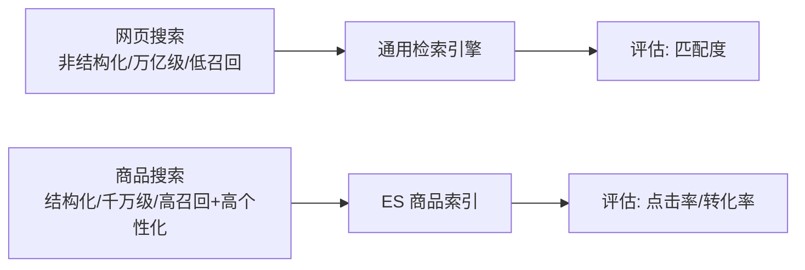
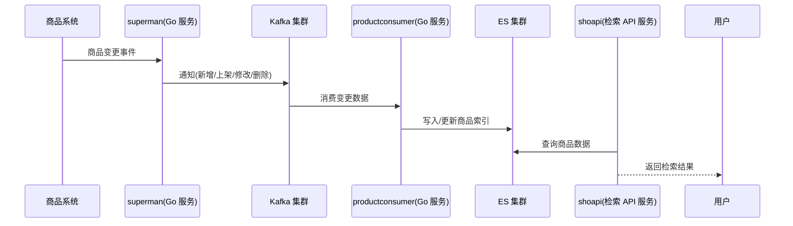

# 商品搜索业务场景和功能分析：电商搜索与网页搜索的七大差异

做搜索不能「套用网页搜索的经验」。电商里的商品搜索，从数据来源到评估目标，和百度式的网页搜索有本质区别。这一节我们先把业务场景和功能分析讲透，再给出本课程实战的商品搜索流程架构，后续所有数据建模与优化都围绕它展开。

## 纲要

- 搜索在电商里的地位：一半以上的流量与转化
- 商品搜索 vs 网页搜索的七大维度差异
- 实战目标：基于商品名称搜索 + 多属性排序
- 商品搜索流程架构：变更通知 → Kafka → 消费入 ES → 检索 API

## 搜索在电商里的地位

电商应用的流量来源很多：搜索、推荐、活动、直播、推广、分销……但在**大多数电商系统里，搜索能带来一半以上的流量和转化**。原因是搜索是用户的**主动行为**，意图明确、更易产生交易，所以在电商系统中占有相当重要的地位。

## 商品搜索 vs 网页搜索

很多人直觉上把两者当成一回事，其实差异巨大：

| 维度 | 网页搜索 | 商品搜索 |
| --- | --- | --- |
| 数据来源 | 整个互联网的网页，靠爬虫抓取 | 企业内部商品数据（即便非自营，也由商家后台写入企业存储） |
| 数据规模 | 万亿级，每天海量新增 | 自营商城往往**万级**，开放商家商城一般**千万级** |
| 数据结构 | 非结构化，需额外清洗 | 结构化，属性统一、字段固定，可直接写入搜索引擎 |
| 召回率要求 | 低（一个热词命中过亿结果很常见） | 高（数据量不大，平台也不希望商品丧失曝光） |
| 个性化要求 | 一般（基于搜索行为分析） | 很高（商城多需登录，用户画像清晰，消费差异大） |
| 评估目标 | 召回结果与关键词匹配度 | **点击率、转化率** |



- **数据来源与结构**：网页数据来自全网、非结构化、要清洗；商品数据来自企业内部、结构化、字段固定，能直接写入 ES。
- **规模与召回**：网页数据量恐怖但召回要求低；商品数据量可控但**召回率要求高**——平台不希望任何一件商品失去曝光机会。
- **个性化**：网页搜索也有个性化，但商品搜索的个性化要求更高。商城一般需登录，用户画像清晰，很容易从浏览/购买记录推断属性；不同用户对商品的喜好和消费能力差异，决定了商品搜索必须给出高度个性化的结果。
- **评估目标**：网页搜索看「召回结果与关键词的匹配度」；商品搜索最终看的是**点击率和转化率**——这直接关联营收。

## 实战目标

本课程实战演示的商品搜索，**核心是基于商品名称的搜索**，并支持按**价格、销量、新品**等属性排序。这是最典型、也最有代表性的电商搜索需求。

## 商品搜索流程架构

商品数据会持续变更（新增、上架、修改、删除），搜索侧必须近实时同步。整体链路如下：



```dir
商品搜索服务架构
├── 商品系统                业务侧增删改
├── superman(Golang)       商品变更事件汇聚
├── Kafka 集群             变更消息队列（解耦）
├── productconsumer(Golang) 消费变更写 ES
│   └── 写入/更新商品索引
└── shoapi(检索API)        从 ES 取数，提供检索服务
    └── 支持名称搜索 + 价格/销量/新品排序
```

1. 商品数据的变更，先经过 **superman**（Go 服务）汇聚；商品的**新增、上架、修改、删除**通过通知方式写入 **Kafka 集群**。
2. 下游的 **productconsumer**（Go 服务）从 Kafka 消费变更数据，写入 **ES 集群**。
3. 再提供一个 **shoapi**（检索 API 服务），从 ES 集群获取商品数据并提供检索能力。

这一「变更通知 → 消息队列 → 消费入 ES → 检索 API」的结构，是电商搜索最常见的解耦范式：写入与检索分离，互不影响。

## 总结

商品搜索不是「小一号的网页搜索」。它的数据**结构化、规模可控、召回率要求高、个性化要求强、以点击率和转化率论英雄**——这些特征直接决定了后续的数据建模（字段怎么定、要不要拼音/单字分词）和架构（读写分离、异步同步）。

本课程会以「商品名称搜索 + 多属性排序」为实战目标，沿「superman → Kafka → productconsumer → ES → shoapi」的链路逐步落地。先把业务场景吃透，后面的技术选型才不会跑偏。
