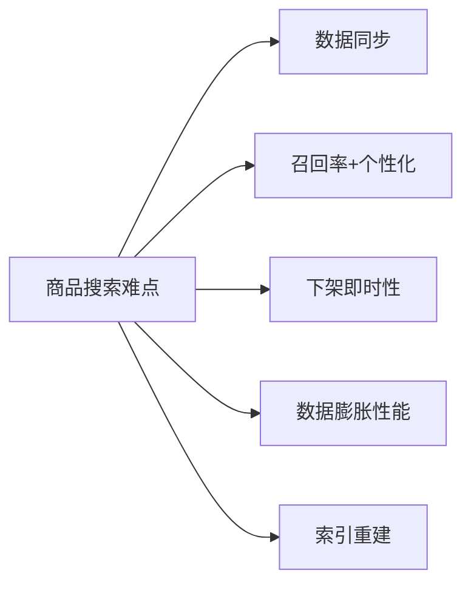

# 商品搜索业务难点分析

大型电商商品搜索远不是「切词 → 倒排召回」那么简单。本篇从五个核心难点出发：数据同步、召回率与个性化、避免下架商品被搜到、非用户维度数据膨胀带来的性能问题、海量索引重建，并给出对应的工程方案。ES 在其中主要承担**召回阶段**。

## 纲要

- 五大难点：数据同步、召回率/个性化、下架即时性、数据膨胀性能、索引重建
- 数据同步：go-mysql-elasticsearch（仅 ES6-）、canal + Kafka + ZK、入库即发 Kafka
- 避免下架被搜到：写时 `refresh=true`，只刷相关分片
- 非用户维度数据 → 无法按用户入径，需路由到全分片
- 索引重建：reindex（百万级）vs 双写 + 存量 8k 写入（海量）；深度分页两种解法

## 五大难点总览



1. **数据同步**：商品数据跨库存/价格/促销/仓库多系统，无法单表同步。
2. **召回率+个性化**：尽量让状态正常的商品都被搜到，并按用户画像做个性化排序。
3. **下架即时性**：已下架商品不能出现在搜索结果里。
4. **数据膨胀性能**：商品非用户维度，全员共享，查询需路由全分片。
5. **索引重建**：mapping/词库变更需重建全量索引，海量数据下极难。

## 数据同步方案

```dir
商品数据同步架构/
├── 单表同步/
│   └── go-mysql-elasticsearch   # 仅 ES6 以下
├── binlog 管道/
│   ├── canal → Kafka → 下游
│   └── ZooKeeper 保高可用
└── 入库即发/
    └── 写入成功后丢 Kafka(可组装多表)
```

- 简单单表同步可用 `go-mysql-elasticsearch`，但**仅支持 ES 6 以下**，且每接一个存储就要多连一个库，连接多了压数据库。
- 推荐用 **canal** 作为 binlog → Kafka 的管道。binlog 默认保留 1 天，借助 Kafka 把读取压力转移给下游，更灵活。
- 保高可用需部署 canal 集群，引入 **ZooKeeper** 协调（架构复杂度上升）。
- 更简方案：数据入库成功后直接丢进 Kafka，既不二次查库，又能定制组装多表数据。白天增量、夜间重新导入保证完整；并提供按商品/商家 ID 批量取数的接口方便重建。

## 避免下架商品被搜到

ES 近实时的本质是：文档先写 `index buffer`，默认 1 秒后 refresh 到 OS cache 才可被搜。商品下架时要让它**立刻**不可搜，SDK 里用 `updateRefresh` 把 `refresh` 设 `true`：

```bash
# 错误：_refresh API 会刷新该索引【全部分片】
POST index/_refresh

# 正确：SDK 中指定 refresh=true，只刷当前数据相关的主+副本分片
# （Go 封装：updateRefresh 方法内部设置 refresh=true）
```

> 关键区别：`_refresh` REST API 刷新整索引所有分片；SDK 里指定的 `refresh=true` **只刷与当前操作数据相关的主副分片**，开销小得多。下架时务必走后者。

## 索引重建与深度分页

mapping 变更很多要重建索引。百万级可在低峰期用 `reindex` API；海量数据 `reindex` 耗时长会拖到高峰期，更靠谱的是**业务双写**（增量/变更写两个集群）+ 从 MySQL 把存量数据以批量方式写入新集群，存量写完再切读写、下线旧集群，实现不停机重建。

从 MySQL 取全量数据时解决深度分页：

```sql
-- 方案1：自增主键游标（利用主键索引，ID 不连续也兼容）
SELECT * FROM goods WHERE id > #{lastMaxId} ORDER BY id LIMIT 100;
```

方案2：搜索服务维护商品 ID，持久化到 MongoDB 或 Redis `bitmap`，用 bitmap 拿到全量 ID 后批量获取，避免深度分页。迁移时：**从从库取数减轻主库压力**；低峰期提高迁移进度；新集群 `refresh_interval` 设为 `-1` 提升写入吞吐。

| 难点 | 方案 | 注意点 |
| --- | --- | --- |
| 数据同步 | canal+Kafka / 入库发 Kafka | 仅 ES6- 用 go-mysql-elasticsearch |
| 下架即时性 | `refresh=true`（SDK） | 别用 `_refresh` 全分片刷新 |
| 数据膨胀 | 路由全分片（非用户维度） | 后续章节详谈 |
| 索引重建 | reindex / 双写+存量 | 海量用双写不停机 |
| 深度分页 | 自增主键游标 / bitmap | 避免 LIMIT 深翻页 |

## 总结

商品搜索的复杂度来自「数据来自多系统、要个性化、要近实时、数据非用户维度、还要能重建」。对应打法：**同步用 canal+Kafka 或入库即发 Kafka**（小表才用 go-mysql-elasticsearch）；**下架即时性靠 SDK 的 `refresh=true` 只刷相关分片**，绝不用全索引 `_refresh`；**非用户维度数据导致查询打全分片**，是后续性能优化的重点；**索引重建海量场景用双写 + 从库存量迁移**，深度分页用自增主键游标或 Redis bitmap 规避。把每个难点落到具体机制上，搜索体系才稳得住。
