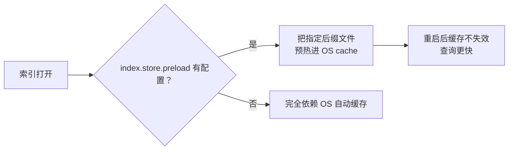

# 搜索性能有决定性因素的数据建模需注意的地方

数据建模直接决定搜索性能。本节讲三个常被忽视、却影响巨大的建模手段：**用文件系统缓存预热、用索引排序（index sorting）加速、用 copy_to 减少查询字段**，最后给出商品索引的 mapping 写法思路。

## 纲要

- `index.store.preload`：把热点索引文件预热进 OS 文件缓存
- 各文件后缀含义（nvd/dvd/dim/doc/dip）与风险
- `index.sort.*`：段内排序及其代价
- `copy_to`：合并字段、减少查询字段数
- 商品索引 mapping 的落地建议

## 一、用文件系统缓存预热

从 ES 6.8 起，支持在索引打开时把相关文件**预加载到文件系统缓存**（OS cache）以加速查询。默认查询完全依赖操作系统文件缓存来缓存 IO。

通过 `index.store.preload` 告诉操作系统，把指定扩展名的文件预加载并打开：

```json
PUT /product
{
  "settings": {
    "index.store.preload": ["nvd", "dvd", "dim", "doc", "dip"]
  }
}
```

| 后缀 | 加载内容 | 用途 |
| --- | --- | --- |
| `nvd` | norms 文件 | 各种规范化因子 |
| `dvd` | doc values | 排序、聚合的列存 |
| `dim` | terms dictionary | 词典 |
| `doc` | postings | 倒排列表 |
| `dip` | points | 地理/数值类缓存数据 |

- 默认值空数组（不预加载）。对频繁搜索的索引，建议设 `nvd`、`dvd`。
- 它会触发 norms、doc values 等预加载到物理内存；而 `tim`/`doc_values` 之外的如 `store fields`、`term vectors` 通常没用，一般不关心。



**风险与注意**

- 该配置是「尽力而为」，不保证生效（取决于存储类型与操作系统），且可能**拖慢索引打开速度**——必须先把数据加载进物理内存索引才可用。
- 若**物理内存装不下这些文件**，大合并后重新打开时会丢弃文件系统缓存，反而让索引和搜索更慢。
- 可用 API 查看已加载文件的磁盘占用（7.15+ 支持）。

## 二、索引排序（index sorting）

创建索引时可配置**对每个分片内的 segment 中文档排序**。默认 lucene 不排序。

```json
PUT /product
{
  "settings": {
    "index.sort.field": ["price"],
    "index.sort.order": "asc",
    "index.sort.mode": "min",
    "index.sort.missing": "last"
  }
}
```

| 配置项 | 含义 | 取值 |
| --- | --- | --- |
| `index.sort.field` | 排序字段列表 | 仅允许带 doc_values 的 boolean / numeric / date / keyword |
| `index.sort.order` | 排序顺序 | `asc` 升序 / `desc` 降序 |
| `index.sort.mode` | 用哪个值排序 | `min` 最小值 / `max` 最大值 |
| `index.sort.missing` | 缺字段文档如何处理 | `last` 排最后 / `first` 排最前 |

注意：

- **只能在创建索引时定义一次**，不能在已有索引上添加或更新。
- 嵌套（nested）字段不支持索引排序。
- 由于要在 refresh 和 merge 后对文档排序，**会在索引吞吐量上付出代价**，启用前应在应用上测试影响。

## 三、用 copy_to 减少查询字段

把多个字段复制到一个合成字段，查询时只查这一个字段，减少查询条件数。

```json
PUT /test_index
{
  "mappings": {
    "properties": {
      "surname": { "type": "text", "copy_to": "fullname" },
      "name":    { "type": "text", "copy_to": "fullname" },
      "fullname":{ "type": "text" }
    }
  }
}
```

写入 `{ "surname": "安倍", "name": "晋三" }` 后，`fullname` 同时包含两者。

- 用 `match` 查 `fullname` 可命中「安倍」或「晋三」任一词。
- 但 `match_phrase` 对 copy_to 字段支持不好（复制后两词无相邻关系），短语查询容易搜不到；`slop` 同样不友好。
- **核心收益**：原本要对 `surname` 和 `name` 各做一次 match（两个查询条件），合并后只查一个字段，查询效率更高。

```dir
product-mapping/
├── settings
│   ├── index.store.preload   文件缓存预热
│   └── index.sort.*         段内排序
├── mappings
│   ├── 基础字段（keyword/text）
│   ├── copy_to 合成字段
│   └── 时间/数值字段（doc_values）
└── 分词器
    └── analyzer 选择
```

## 商品索引 mapping 的落地建议

- 频繁参与过滤/排序的字段保留 `doc_values`；不需要的字段关掉以省空间。
- 用 `index.store.preload` 预热 norms/doc values，但确保机器内存装得下。
- 若业务按某字段（如价格、时间）有稳定排序需求，可考虑索引排序。
- 对需要联合检索的多个文本字段，用 `copy_to` 合成单字段，简化查询、提速。
- 分词器按字段语义选：精确匹配用 `keyword`，全文检索用 `text` + 合适 analyzer。

## 总结

数据建模里这三个手段，都是「**用空间/初始化代价换查询速度**」：

- `index.store.preload` 把热点文件预热进 OS 缓存，重启也不怕缓存失效，但**内存装不下反而变慢**；
- `index.sort.*` 段内排序加速特定查询，代价是**写入吞吐下降**，且只能建索引时定一次；
- `copy_to` 合并字段减少查询条件数，是性价比很高的查询优化。

建模没有银弹，**先想清查询模式（查什么、怎么排序、怎么过滤），再决定哪些文件预热、是否排序、哪些字段合并**——这才是「决定性因素」的来由。
