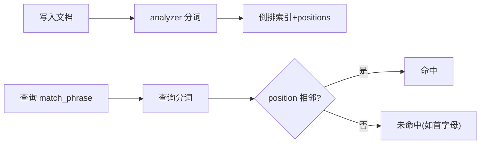

# 搜索性能有决定性因素的数据建模需注意的地方

数据建模直接决定搜索体验与性能上限。本节聚焦商品搜索里最容易踩的语言相关坑：拼音搜索怎么配、首字母为什么搜不到、`match_phrase` 与分词器的位置信息、单字兜底怎么做，以及 `index_options` / `norms` / 慢查询日志这些「看不见但很关键」的底层开关。

## 纲要

- 拼音分词器：全节点安装、用 `_cat/plugins` 校验、analyzer/tokenizer 配置
- 首字母搜索坑：`match_phrase` 要求位置相邻，首字母被打散后搜不到
- 单字兜底：ngram（min=max=1）实现任意相邻子串可查
- `index_options`：DOCS/freqs/positions/offsets 的存储成本与取舍
- `norms` 与慢查询：商品名需 norms，慢查用 slowlog 阈值配置

## 第一节 拼音分词器的安装与使用

分词插件必须在 ES **全部节点**安装，装完用下面 API 校验每个节点是否都就位：

```bash
# 查看各节点已安装的分词插件
GET /_cat/plugins?v
```

定义拼音分析器时，`analyzer` 与 `tokenizer` 同级放在 `analysis` 下；常用配置：`keep_separate_first_letter`（首字母单独拆，如「刘德华」→ l/d/h）、`keep_full_pinyin`（保留完整拼音）、`keep_original`（保留原文）、`limit_first_letter_length=16`、`lowercase`、`remove_duplicated_term`。

首字母搜不到的典型原因：`match_phrase` 要求查询词分词后的所有 `position` 在倒排索引里相邻且都命中；而首字母被拆成多个 token、位置被打散，无法满足相邻条件。改用 `match` 或指定 `standard` 分词器（不拆首字母）即可搜到。善用 `_analyze` 接口对比「写入时的 token」与「查询时的 token」，是排查分词坑的必备手段。

## 第二节 单字兜底、index_options 与慢查询

单字兜底用内置 `ngram` tokenizer，把 `min_gram` 与 `max_gram` 都设为 1，即逐字拆分，任意相邻字母（含空格）都能命中。商品索引需要 `match_phrase` 邻近查询，因此 `index_options` 至少设到 `positions`；不需要高亮的偏移量，就不必设 `offsets`。

```json
{
  "settings": {
    "analysis": {
      "tokenizer": {
        "ngram_tokenizer": { "type": "ngram", "min_gram": 1, "max_gram": 1 }
      },
      "analyzer": {
        "ngram_analyzer": { "tokenizer": "ngram_tokenizer" }
      }
    },
    "index.search.slowlog.threshold.query.warn": "500ms",
    "index.search.slowlog.threshold.fetch.warn": "1s",
    "index.indexing.slowlog.threshold.index.warn": "1s"
  },
  "mappings": {
    "properties": {
      "name": { "type": "text", "analyzer": "pinyin_analyzer", "search_analyzer": "pinyin_analyzer", "index_options": "positions" },
      "summary": { "type": "text", "norms": false }
    }
  }
}
```

`index_options` 四档（越往下越占空间）：`DOCS`（仅文档 ID）→ `freqs`（+词频）→ `positions`（+位置，text 默认）→ `offsets`（+起止偏移，keyword 默认 DOCS）。`norms` 存归一化因子：keyword 默认 `false`，text 默认 `true`；商品名需要相关性算分要保留 `norms`，简介/详情若算分不重要可关掉省空间。



```dir
modeling-pit/
├── analyzer/           # 分词配置
│   ├── pinyin.json
│   └── ngram.json
├── mapping/            # 字段建模
│   ├── index_options
│   └── norms
└── ops/                # 运维
    ├── cat_plugins
    └── slowlog
```

| 开关 | 可选值 | 商品搜索建议 |
| --- | --- | --- |
| `index_options` | DOCS/freqs/positions/offsets | name 设 positions（需 phrase 查询） |
| `norms` | true/false | name 开；简介可关 |
| 慢查阈值 | query/fetch/index | query>500ms、index>1s 告警 |

## 总结

数据建模里「语言相关」的坑最多也最隐蔽。拼音分词要全节点安装并用 `_cat/plugins` 校验；首字母搜不到不是 ES 的 bug，而是 `match_phrase` 的「位置相邻」约束与分词器把首字母打散共同作用的结果，换 `match` 或 `standard` 分词器即可。`ngram`（min=max=1）是单字兜底的利器，但要注意它连空格也会建 term。

底层开关上记住两条：**`index_options`** 商品名至少 `positions`（支撑 phrase 查询），不用的偏移量别开，省磁盘省内存；**`norms`** 商品名要留（相关性算分），算分不重要的长文本可关。最后用 `slowlog` 阈值（query 500ms、fetch/index 1s）把慢查询慢写暴露到日志，是性能治理的第一抓手。这部分务必结合 `_analyze` 反复试，真正理解后项目里才能用得得心应手。
