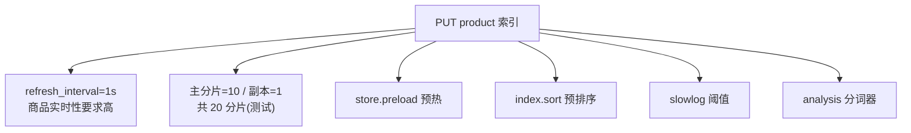
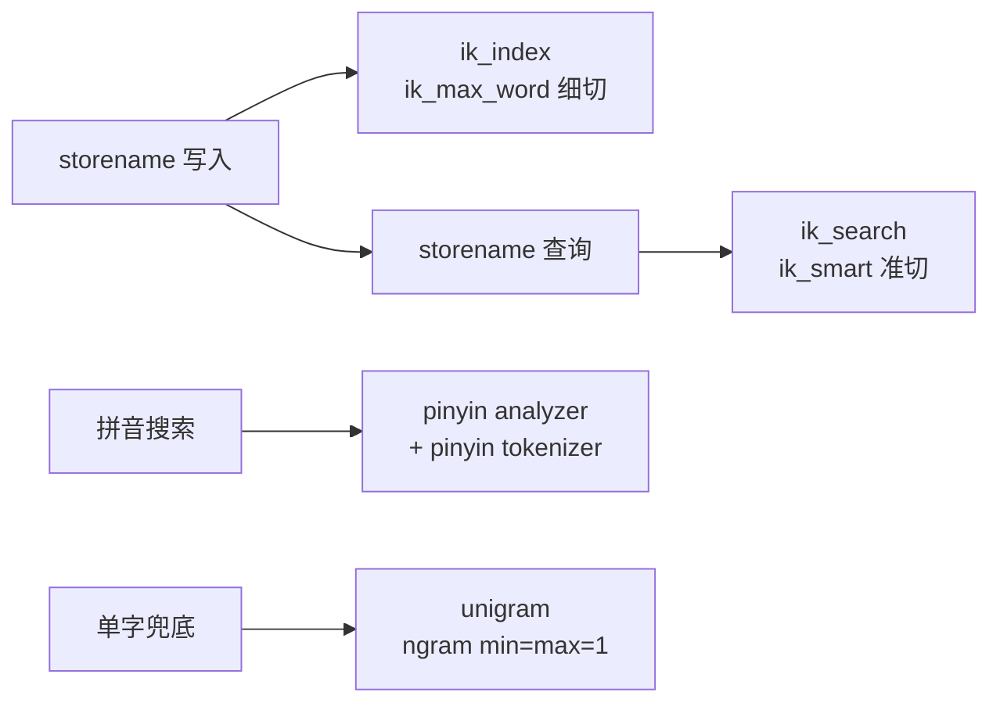

# 搜索性能有决定性因素的数据建模需注意的地方（四）：索引预热、预排序与 copy_to

前面几节我们已经拆解了字段类型选择、字段属性（`index_options` / `norms` / `doc_values` / `store`）的确定。这一节回到「**搜索性能有决定性因素**」的视角，落地一个完整的商品索引：先看设置在投产前怎么定，再看 mapping 怎么设计，重点是把**索引预热、预排序、分词器组合**这三类对搜索性能影响最大的点一次做对。

> 本节以课程实战的商品索引（索引名 `product`）为例，命令以 ES REST API 描述，分词器以 IK + 拼音 + 单字兜底的组合为例。

## 纲要

- settings：refresh_interval、分片规划、慢查阈值
- **索引预热**：`index.store.preload` 把倒排文件常驻
- **预排序**：`index.sort` 让检索按常用字段提前有序
- **copy_to**：把多字段合并到一个检索字段，减少查询条件
- mapping：`dynamic=strict`、`_source` 排除、商品名字段的多子字段设计
- 分词器组合：IK（ik_max_word / ik_smart）+ 拼音 + 单字兜底

## settings：分片与实时性



- **refresh_interval**：商品对实时性要求高，用默认的 **1 秒**。
- **分片规划**：测试设主分片 10、副本 1（共 20 分片）；线上具体数量后续专门讨论，按数据量与节点规格定。
- **慢查阈值**：配置 search slowlog（query 的 warn / info）与 indexing slowlog，便于上线后抓慢查询。（这些阈值都在 `index` 结构下统一配置，不用每个键再加 `index.` 前缀。）

## 索引预热：store.preload

`index.store.preload` 是一个数组，指定需要**预加载到文件系统缓存**的倒排索引文件后缀。把热点文件（如 terms 的 `.tim`、postings 的 `.doc`、doc values 的 `.dvd` 等，具体后缀随版本而异）提前预热，能显著减少查询时的磁盘随机读。

```json
{
  "index": {
    "store": {
      "preload": ["tip", "doc", "dvd"]
    }
  }
}
```

> 后缀名请以实际 ES 版本的索引文件格式为准；盲目 preload 过多文件会占用大量 page cache，需结合内存权衡。

## 预排序：index.sort

`index.sort` 让我们提前声明「这个索引会按哪些字段排序」，ES 在写段时就让段内数据有序，**加速基于这些字段的检索与聚合**。

```json
{
  "index": {
    "sort": {
      "field": ["price", "sales", "fusionsales"],
      "order": ["asc", "desc", "desc"]
    }
  }
}
```

- `price` 正向（asc）、`sales` 销量与 `fusionsales` 虚拟销量逆向（desc）。
- 这三个是业务里明确要排序的字段，提前预排序能让相关查询直接受益。

## copy_to：收敛查询条件

把多个需要被检索的字段 `copy_to` 到一个统一字段（如 `desc`），查询时只打这个合并字段，就能覆盖对原多个字段的检索，**减少查询条件数量、降低布尔查询复杂度**。

| 手段 | 作用 | 注意事项 |
| --- | --- | --- |
| `store.preload` | 预热倒排文件，减磁盘读 | 别预热过多，避免吃光 page cache |
| `index.sort` | 段内预排序，加速排序/聚合 | 只列真实高频排序字段 |
| `copy_to` | 多字段合并检索，简化查询 | 原字段仍需按需建倒排 |

## mapping：严格模式与 _source 裁剪

```dir
product 索引 mapping 结构
├── dynamic: strict          不允许未定义字段写入
├── _source.excludes        排除不需高亮的字段
└── properties
    ├── id                keyword, doc_values=false
    └── storename         商品名称(text)
        ├── analyzer=ik_index / search_analyzer=ik_search
        ├── .pinyin       拼音子字段
        └── .single       单字兜底子字段
```

- **`dynamic: strict`**：生产环境用严格模式，**mapping 里没定义的字段拒绝写入**，防止脏数据和不预期的类型推断。
- **`_source` 排除**：商品名称、商品详情、描述、关键词等**不需要高亮**的字段，从 `_source` 排除（它们仍需分词建倒排，只是不进 `_source`），节省 `_source` 存储。
- **`id`**：`keyword` 类型；不参与排序，故 `doc_values=false`。

## 商品名字段的多子字段设计

`storename`（商品名称）是检索核心，设计最复杂：

```json
{
  "storename": {
    "type": "text",
    "index_options": "positions",
    "analyzer": "ik_index",
    "search_analyzer": "ik_search",
    "fields": {
      "pinyin": {
        "type": "text",
        "store": false,
        "analyzer": "pinyin",
        "search_analyzer": "pinyin"
      },
      "single": {
        "type": "text",
        "store": false,
        "analyzer": "unigram",
        "search_analyzer": "unigram"
      }
    }
  }
}
```

- `index_options=positions`：`text` 默认值就是 positions，这里显式强调，以支持 phrase 查询。
- **写入分词器 `ik_index`**（基于 `ik_max_word`，切得细），**查询分词器 `ik_search`**（基于 `ik_smart`，切得准），这是 IK 的标准用法。
- **`.pinyin` 子字段**：支持拼音搜索。
- **`.single` 单字兜底**：用 `unigram`（ngram，min=max=1）做单字分词，保证极小输入也能命中。

## 分词器组合



| 分词器 | 类型/配置 | 用途 |
| --- | --- | --- |
| `ik_index` | custom + `ik_max_word` + lowercase | 写入时细粒度切词 |
| `ik_search` | custom + `ik_smart` + lowercase | 查询时粗粒度切词 |
| `pinyin` | `tokenizer: pinyin`，`keep_first_letter` / `keep_full_pinyin` / `keep_original=true`，`limit_first_letter_length=16`，`lowercase=true`，`remove_duplicated_term=true` | 拼音检索 |
| `unigram` | `tokenizer: ngram`，`min_gram=max_gram=1` | 单字兜底 |

拼音分词器还需在 `tokenizer` 同级定义 `pinyin` tokenizer（`type: pinyin`），以及 `unigram` tokenizer（`type: ngram`，`min_gram=max_gram=1`）。

## 总结

对搜索性能有决定性影响的数据建模，胜负往往在 settings 和 mapping 的这几个点上：

- **预热**（`store.preload`）让倒排文件常驻缓存，减磁盘读；
- **预排序**（`index.sort`）让段内提前有序，加速排序聚合；
- **`copy_to`** 收敛查询条件，简化布尔查询；
- **`dynamic: strict` + `_source` 排除**守住数据质量与存储；
- **商品名字段用「IK 细切/准切 + 拼音 + 单字兜底」多子字段**，兼顾中文、拼音和极小输入。

这些设置大多在投产前就要定好，且彼此关联——分片数影响预热收益，预排序字段必须和真实高频排序一致。落地前建议对照业务真实的排序与检索字段，把这份 mapping 过一遍。
