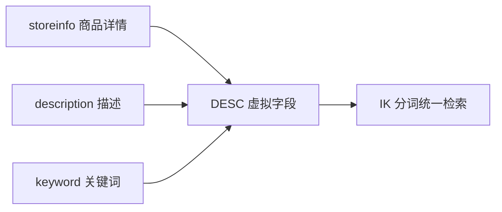

# 搜索性能有决定性因素的数据建模需注意的地方（五）

高性能搜索服务从高质量的数据建模开始。本篇以「商品索引」为例，把 `copy_to` 聚合多字段、各字段 `doc_values` 的取舍、数值类型范围过滤、IK/拼音分词配置这几个最影响性能的细节讲透，并补充拼音分词 `keep_separate_first_letter` 的差异。

## 纲要

- `DESC` 虚拟字段用 `copy_to` 聚合详情/描述/关键词，统一检索入口
- `catID` 用 `keyword` 且 `doc_values=false`（只过滤不排序）
- `price` 用 `double` 保留数值特性，靠 BKD 做高效范围过滤
- `sales`/`favorite`/`isNew` 等排序字段必须开 `doc_values`
- 拼音分词 `keep_separate_first_letter` 为 true/false 的 token 差异

## 用 copy_to 聚合多字段

商品详情、描述、关键词都要参与检索，与其分别查，不如建一个虚拟的 `DESC` 字段，把它们 `copy_to` 进来统一搜：



```json
{
  "desc": {
    "type": "text",
    "index_options": "positions",
    "analyzer": "ik_max_word",
    "search_analyzer": "ik_max_word"
  },
  "storeinfo":  { "type": "text", "copy_to": "desc", "analyzer": "ik_max_word" },
  "description": { "type": "text", "copy_to": "desc", "analyzer": "ik_max_word" },
  "keyword":    { "type": "text", "copy_to": "desc", "analyzer": "ik_max_word" }
}
```

> `DESC` 不是数据表里的真实字段，是把多个字段 copy 进来的**检索聚合字段**。`index_options` 默认就是 `positions`，可不显式写。

## doc_values 的取舍

`doc_values` 决定字段能否做排序/聚合（走列式存储）。是否开启直接影响性能与存储：

```dir
商品索引字段设计/
├── desc/storeinfo/description/keyword   # copy_to 聚合检索
├── catID          # keyword, doc_values=false(只过滤)
├── price          # double, doc_values 默认开(范围过滤)
├── sales          # long, doc_values=true(排序)
├── favorite       # long 虚拟销量, doc_values=true(排序)
└── isNew          # boolean, doc_values 默认开(排序)
```

```json
{
  "catID": { "type": "keyword", "doc_values": false },
  "price": { "type": "double" },
  "sales": { "type": "long", "doc_values": true },
  "favorite": { "type": "long" },
  "isNew": { "type": "boolean" }
}
```

| 字段 | 类型 | `doc_values` | 原因 |
| --- | --- | --- | --- |
| `catID` | keyword | false | 只做过滤，不排序/聚合 |
| `price` | double | 默认 true | 数值范围过滤用 BKD，高效 |
| `sales` | long | true | 需按销量排序 |
| `favorite` | long | true | 虚拟销量，需排序 |
| `isNew` | boolean | 默认 true | 是否新品，需排序 |

要点：**只过滤不排序的字段（如 `catID`）关掉 `doc_values` 省存储**；需要排序的字段务必保留。数值类型（price/sales）保留数值特性，范围过滤靠 BKD 树，效率远高于 text。

## 拼音分词 keep_separate_first_letter

拼音分词器有个关键开关 `keep_separate_first_letter`：

- 设为 `false`：首字母合并进一个 token（如「欢迎来到慕课网学习」→ 首字母 hylmdw 一个 token）。
- 设为 `true`：每个首字母拆成独立 token（h / y / l / m / d / w 各自成 token），更适合「拼音首字母检索」。

```bash
# 用 analyze 接口验证分词效果
GET goods/_analyze
{ "analyzer": "pinyin", "text": "欢迎来到慕课网学习" }
```

> 注意：拼音分词如需高亮，要把 `keep_full_pinyin` / offset 相关配置设为正确值（`offset` 默认 true 才能让拼音 token 支持高亮，必要时按文档调整）。

## 总结

商品索引建模的性能要点就几处：**用 `copy_to` 把详情/描述/关键词聚合进一个 `DESC` 字段统一检索**，减少多字段查询；**`doc_values` 按需开关**——只过滤不排序的 `catID` 关掉省空间，排序字段（sales/favorite/isNew/price）必须保留；**价格等数值字段保留数值类型**，靠 BKD 做高效范围过滤；**拼音分词 `keep_separate_first_letter` 决定首字母是合并还是拆分**，直接影响拼音搜索体验。字段属性定对了，召回快、排序稳，高性能搜索才有地基。
