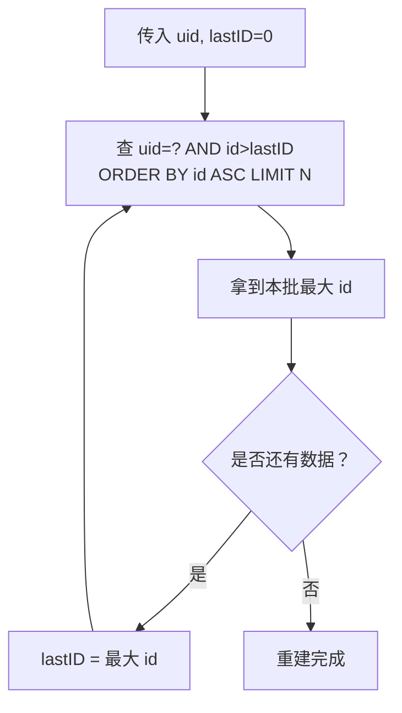

# 如何快速重建用户订单索引

生产环境中，随着业务演进，索引的 mapping、分片、数据口径常常需要重建。本节以**按用户维度重建订单索引**为例，讲清楚如何「从上游客库批量拉取、避免深度分页、安全写入 ES」，并点出一个极易踩坑的 mapping 时间格式问题。

## 纲要

- 用游标（cursor）分批拉取订单：按主键 ID 递增、避免深度分页
- 每批从上一批最大 ID 开始，取固定条数
- 补充购物车等关联信息
- AKSK 校验：调商城主服务前先灌库
- mapping 时间格式坑：`time.Time` 写入格式与 mapping 不一致会写不进

## 分批拉取：游标分页

service 层调用 model 层的 `getOrderUseCursor`，参数为 `(uid, lastID, pageSize)`。关键点：查询条件 `uid = ? AND id > lastID`，并按 `id` 正序排序，取前 `pageSize` 条。

```sql
SELECT * FROM orders
WHERE uid = 4
  AND id > 0          -- 首次传 0；第二批传上一批最大 id（如 10）
  AND id != 0         -- 过滤已删除的订单
ORDER BY id ASC
LIMIT 10;
```

流程：

1. 首次 `lastID = 0`，返回 id 1~10；
2. 第二批带 `lastID = 10`，取 id > 10 的下 10 条；
3. 直到不足一页，结束。



**为什么用 ID 游标？**

- 充分利用主键索引加速；
- **避免深度分页**（如 `LIMIT 100000, 10` 随偏移增大越来越慢）；
- 每批都是「上一批之后」的定长切片，稳定可控。

## 补充关联信息

拿到订单列表后，遍历补充购物车信息（一个订单含多个商品），数据来自 `storeordercartinfo` 表——这就是刚才导入的订单数据。

## AKSK 校验

调用商城主程序前需生成 AKSK 并做校验。课程提供了 test 程序：`internal/models/austest` 下生成 AKSK 数据库数据。

```bash
# 1. 先跑 test 程序，把 AKSK 导入 mysql
go run internal/models/austest/main.go
# 2. 启动商城主服务
go run cmd/mall/main.go
# 3. 启动重建脚本（设好 uid）
go run cmd/rebuild_schedule/main.go
```

`config.yaml` 里配置的 `order.aks` 即刚才生成的 AKSK，重建脚本凭它调用商城接口。启动后可先在 ES 用 `term` 过滤 `uid` 验证，重建完成后应能看到对应订单索引数据。

## mapping 时间格式坑（重点）

订单索引 mapping 里有多个时间字段：`updatetime`、`paytime`、`createtime`，类型都是 `date`。

```json
{
  "createtime": {
    "type": "date",
    "format": "yyyy-MM-dd HH:mm:ss"
  }
}
```

**坑在这里**：Go 结构体用的是 `time.Time`，SDK 写入 ES 时序列化成的是带 `T` 和时区的格式，例如：

```
2026-08-01T12:00:00+08:00
```

而 mapping 里限定的是 `yyyy-MM-dd HH:mm:ss`（中间是空格、无时区）。**ES 不会帮你做这种「智能转换」**，写入格式与 mapping 限定的格式不一致时，这条数据**根本写不进索引**。

| 环节 | 格式 |
| --- | --- |
| Go `time.Time` 默认序列化 | `2026-08-01T12:00:00+08:00`（RFC3339，带 T 与时区） |
| mapping 限定 `yyyy-MM-dd HH:mm:ss` | 不带 T、不带时区 |
| 结果 | 格式不匹配，写入被拒绝 |

**教训**：mapping 里的 `date.format` 必须和 SDK 实际写入的格式一致。要么 mapping 写成 `"yyyy-MM-dd'T'HH:mm:ssZ"` 之类兼容 RFC3339，要么在写入前用 `Format` 把 `time.Time` 转成 mapping 期望的字符串。

```dir
rebuild-order/
├── config.yaml
│   └── order.aks              AKSK 配置
├── internal/models/austest
│   └── 生成 AKSK → mysql
├── cmd/mall
│   └── 商城主服务
├── cmd/rebuild_schedule
│   └── 重建脚本（指定 uid）
└── ES 索引
    ├── settings（分片/副本）
    └── mappings（含 date 格式约定）
```

## 总结

按用户维度重建订单索引，核心是**用主键 ID 做游标分批拉取**：每批从上一批最大 ID 之后取固定条数，既利用了主键索引，又彻底规避了深度分页。再补充购物车等关联信息、用 AKSK 调通上游，即可在不影响线上服务的前提下完成重建。

两个务必记住的点：

1. **游标优于偏移分页**——数据量大时深度分页会拖垮数据库；
2. **mapping 的 `date.format` 要和 SDK 实际写入格式严格一致**，否则会出现「数据悄无声息写不进」的诡异问题。这正是课程强调的：索引迁移与重建，是持续迭代系统里至关重要、却又处处是坑的一环。
