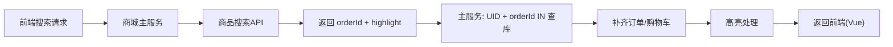

# 订单搜索接口实现

订单搜索的难点不在查询本身，而在**高亮信息的还原与组装**：搜索微服务只返回命中的 `orderId` 与高亮片段，真正的订单详情要从数据库补齐，并把商品名称、订单号的高亮正确映射到前端可渲染的结构。本节拆解这套处理流程。

## 纲要

- 搜索微服务只返回 orderId + highlight（`_source=false`）
- 主服务用 UID + orderId IN 列表从库补齐订单与购物车
- 用两个 map 在「商品名称 ↔ 商品ID」间互查（因索引中以数组对应存储）
- 高亮处理：先处理商品名称，再处理拼音（名称优先），最后处理订单号
- 前端（Vue）用数据绑定渲染 `<em>` 高亮

## 整体流程

商城主服务接收前端搜索请求，调用商品搜索 API（搜索微服务）。搜索结果只含 `orderId` 与高亮字段（`_source=false`，仅返回 ID 与 highlight）。拿到所有 `orderId` 后，主服务用 `UID = 当前用户` 且 `orderId IN (命中列表)` 的条件从数据库一次性查出订单信息，再遍历补充购物车信息，最后处理高亮。



## 高亮处理的两个 Map

由于索引中「商品名称」与「商品ID」是**数组且一一对应**存储的，处理高亮时需要双向查找，因此用两个 map：

- `cutInfoRm`（名称→ID）：key 为商品名称（string），value 为商品ID（int64）；
- `cutInfoH`（ID→高亮名称）：key 为商品ID（int64），value 为带高亮标签的商品名称（string）。

遍历购物车，把 `name → id` 放入 `cutInfoRm`。若 `names` 字段有高亮：用两次 `replace` 去掉 `<em>` 与 `</em>` 标签，得到**原始商品名称**，再用 `cutInfoRm` 反查到商品ID，把带高亮名称写入 `cutInfoH`。即便出现重名商品，取最后一个即可，不影响业务展示。

```dir
order-search/
├── 接入层/
│   └── 商城主服务
├── 搜索层/
│   └── 商品搜索API (_source=false)
└── 组装层/
    ├── 查库补齐订单/购物车
    ├── cutInfoRm (name→id)
    ├── cutInfoH (id→高亮name)
    └── 高亮处理(名称/拼音/订单号)
```

| 字段 | 高亮处理 | 说明 |
| --- | --- | --- |
| 商品名称 names | 去 `<em>` 标签→反查 ID→标记高亮 | 数组，需 map 互查 |
| 拼音 pinyin | 仅当名称未命中时才用 | 名称优先 |
| 订单号 orderId | 生成 `displayOrderId` | text 单值，含后四位高亮 |

## 三处高亮细节

1. **商品名称优先于拼音**：若 `names` 已匹配高亮，拼音字段不再重复高亮；仅当名称未命中时，才使用拼音的高亮结果。
2. **订单号高亮**：订单号是单值 text 字段，处理相对简单，新增 `displayOrderId` 字段存放「高亮后的订单号」用于前端展示；同时支持按订单**后四位**高亮。若订单号或后四位已匹配，优先展示订单号匹配；二者都没匹配则 `displayOrderId` 等于原始订单号。
3. **前端渲染**：高亮信息里的 `<em>` 标签原样带回，前端（Vue）通过数据绑定把其转换为实际高亮样式。

## 总结

订单搜索接口的实现重点在于**搜索与详情的分离与重组**：搜索微服务只负责「找 ID + 高亮」，主服务再用 `UID + orderId IN` 从库补齐完整订单与购物车。因为索引里商品名称与商品ID 以数组对应存储，必须用「名称↔ID」两个 map 互查才能把高亮正确还原到具体商品。

高亮处理遵循「**商品名称优先于拼音、订单号生成 displayOrderId**」的原则，重名商品取最后一个不影响展示。最终高亮标签由 Vue 前端绑定渲染。理解这套组装逻辑，是做好订单类搜索高亮的关键。
