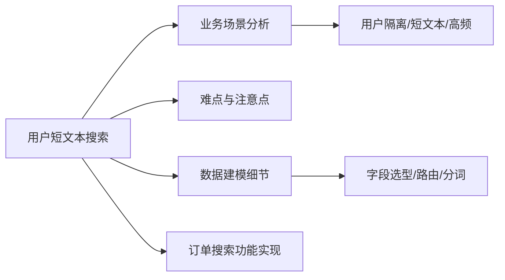

# 用户短文本搜索场景-章节导学

垂直搜索里最常见的形态，是「带明确用户维度的短文本搜索」——联系人搜索、订单搜索都在此列。本章以**订单搜索**为例，拆解这类场景的实战与优化：从业务场景与功能分析入手，挖出难点与注意点，再深入数据建模细节，最后实现订单搜索的业务功能。这是继「商城搜索」之后的第二个具体场景实战，有了前面的经验，本章推进会更快。

## 纲要

- 场景特征：用户维度明确、文本短、查询高频
- 切入点：以订单搜索为例串起业务分析 → 数据建模 → 功能实现
- 难点：用户隔离、短文本分词、排序与性能
- 学习路径：建议先学完「商城搜索」章再进入本章
- 目标：掌握一类可复用的短文本搜索优化经验

## 第一节 为什么单讲「用户维度短文本」

联系人、订单这类搜索有两个共同点：查询必然带着用户身份（只能看自己的），文本短且结构化字段多（订单号、状态、金额、时间）。它们既不像全文检索那样自由，又不像数据库点查那样简单，恰恰处在 ES 最擅长的中间地带——但也最容易因为建模不当把性能做垮。

本章会从业务场景和功能分析开始，先把「要搜什么、怎么筛、怎么排」想清楚，再谈数据建模：哪些字段进 ES、用什么类型、要不要开启 norms、分词怎么配。想清楚之后再动手实现订单搜索接口。

## 第二节 本章学习地图

下面这张图给出本章主线，建议和「商城搜索」章对照着学——很多建模套路是相通的，区别在「用户维度」带来的隔离与路由。



```dir
order-search/
├── analysis/           # 业务与功能分析
│   ├── scenario.md
│   └── difficulty.md
├── modeling/           # 数据建模
│   ├── mapping.json
│   └── routing.md
└── impl/               # 功能实现
    ├── search_api.go
    └── sort.go
```

| 环节 | 关键问题 | 本章交付 |
| --- | --- | --- |
| 场景分析 | 搜什么、怎么筛、怎么排 | 功能清单 |
| 数据建模 | 字段类型/路由/分词 | mapping 方案 |
| 功能实现 | 查询与排序 | 订单搜索接口 |

## 总结

「用户维度短文本搜索」是垂直搜索里最高频、也最容易被低估的一类场景。它的难点不在检索本身，而在于先把业务想透：用户隔离怎么做、短文本怎么分词、排序与性能怎么兼顾。本章以订单搜索为样本，带大家走完「分析 → 建模 → 实现」的完整闭环。

本章是「商城搜索」之后的第二个实战场景，强烈建议先学完上一章再进入——很多建模与对接经验可以直接复用，只是多了「用户维度」带来的隔离与路由考量。如果学起来吃力，也可以先复习前面的基础章节。把这一类的套路吃透，你就能把它迁移到联系人搜索、工单搜索等任意短文本场景。
