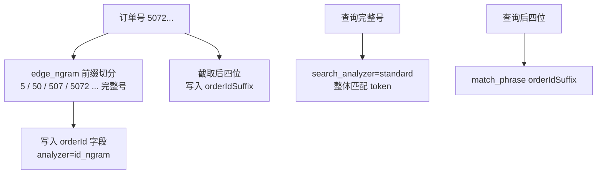
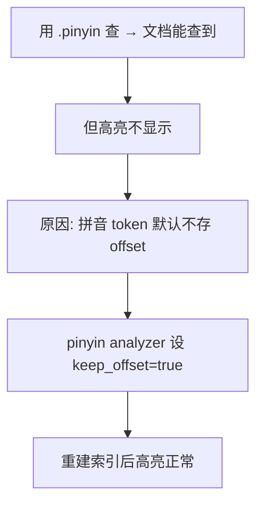

# 特定场景下的数据建模（二）：订单号前后缀搜索与商品名拼音搜索

通用数据建模讲完，这一节进入两个**典型的特定场景**：一是订单号的前缀 / 完整 / 后缀搜索，二是商品标题的拼音搜索。两者都不走「标准分词」的寻常路，需要为字段量身定制分词器与子字段。

> 以下以订单索引（索引名 `order`）为例，订单文档用 `userId` 做 `routing`。

## 纲要

- 订单号搜索的诉求与三种方案对比
- 方案落地：edge_ngram 前缀分词 + 后缀独立字段
- 为什么「前缀 + 后缀」比单字分词噪音更小
- 商品标题拼音搜索：pinyin analyzer 与子字段
- **坑**：拼音高亮失效，根因是 `keep_offset` 默认 false

## 订单号搜索的三种方案

用户端（如淘宝）通常只支持**完整订单号**过滤；但后台/客服场景常需要按**前缀、完整、后四位**搜索。三种实现思路：

| 方案 | 做法 | 评价 |
| --- | --- | --- |
| ES `prefix` / `regexp` 查询 | 直接查 | 性能差，**不采用** |
| 定制分词插件 | 让分词器原生支持前缀/后缀切分 | 存储与整体性能最优，但**实现难度大、需自研插件**，大厂有资源可做 |
| edge_ngram + 后缀字段 | 用 `edge_ngram` 做前缀分词，后四位存独立字段 | **简单可落地**，代价是多了字段和查询条件 |

我们采用第三种简单方案。

## 方案落地：edge_ngram 前缀 + 后缀字段



**分词器（settings）**：

```json
{
  "analysis": {
    "analyzer": {
      "id_ngram": { "tokenizer": "id_ngram_tokenizer" }
    },
    "tokenizer": {
      "id_ngram_tokenizer": {
        "type": "edge_ngram",
        "min_gram": 1,
        "max_gram": 18,
        "token_chars": ["letter", "digit"]
      }
    }
  }
}
```

- `edge_ngram` 按**前缀**切分：`5072…` → `5` / `50` / `507` / `5072` … 一直到完整订单号。
- `max_gram=18` 对应订单号长度；`token_chars` 限定只对**字母（含中文）和数字**做处理。
- 商品名称仍用 `unigram`（`ngram`，`min_gram=max_gram=1`）做单字兜底。

**mapping（properties）**：

| 字段 | 类型 | 分词器 | 说明 |
| --- | --- | --- | --- |
| `orderId` | text | 索引 `id_ngram`，查询 `standard` | 前缀分词，完整号也能命中 |
| `orderIdSuffix` | text | 索引 `id_ngram`，查询 `standard` | 存订单**后四位**，解决后缀匹配 |
| `userId` | keyword | —— | `doc_values=false`（不排序） |
| `storeId` | keyword | —— | `doc_values=false` |
| `storename` | text | `unigram` | 单字分词兜底 |

```dir
order 索引结构（订单号前后缀 + 拼音）
├── settings
│   ├── analysis
│   │   ├── analyzer
│   │   │   ├── id_ngram        edge_ngram 前缀分词
│   │   │   └── pinyin          拼音分词
│   │   └── tokenizer
│   │       ├── id_ngram_tokenizer   edge_ngram(min=1,max=18)
│   │       ├── pinyin_tokenizer     type=pinyin
│   │       └── unigram              ngram(min=max=1)
│   └── 主分片=1 / 副本=0（测试）
└── mappings
    ├── orderId           text | 索引 id_ngram / 查询 standard
    ├── orderIdSuffix     后四位 | 同 orderId 分词
    ├── userId            keyword | doc_values=false
    ├── storeId            keyword | doc_values=false
    └── storename         text | unigram
        ├── .pinyin       拼音子字段（keep_offset=true）
        └── .single       单字兜底子字段
```

关键点：**`orderId` 的索引分词器是 `id_ngram`，但查询分词器用 `standard`**。因为 `standard` 把整串数字当成一个 token，而前缀分词产生的 token 里恰好包含这个完整串，于是用**完整订单号**能直接 `match_phrase` 命中并高亮；用**后四位**查 `orderIdSuffix` 也能命中——前后缀问题一并解决。

写入时用 `userId` 做 `routing`，查询也必须带同样的 `routing` 才高效；高亮字段设 `orderId` 与 `storename`。

## 为什么不用单字分词

如果把订单号也用 `unigram` 单字切分，任意中间几位（如 `104`）都能搜到该订单，结果里会混入大量无关订单，**噪音极大**。对比之下，「前缀 + 后缀」更贴合用户「输入前几位或后四位」的真实使用场景。

## 商品标题拼音搜索

商品名称需要支持拼音检索。定义 pinyin tokenizer 与 analyzer：

```json
{
  "tokenizer": {
    "pinyin_tokenizer": { "type": "pinyin" }
  },
  "analyzer": {
    "pinyin": { "tokenizer": "pinyin_tokenizer" }
  }
}
```

给 `storename` 加一个 `.pinyin` 子字段（`analyzer: pinyin`）。查询时：
- 用 `match_phrase` 查中文关键词（如「品」），三个商品都能高亮查出；
- 用 `.pinyin` 子字段查拼音，文档能查到，但**高亮却失效了**。

## 坑：拼音高亮失效，根因是 keep_offset



高亮依赖 token 的 **offset（字符偏移）**。拼音分词器默认 `keep_offset: false`，导致拼音 token 没有偏移信息，高亮引擎无处下手。修复方法：在 pinyin analyzer 配置里加上 **`keep_offset: true`**，删除索引、重建并重新写入后，拼音高亮即正常。

> 这是个非常常见的问题，落地拼音搜索时务必留意 `keep_offset`。

## 总结

两个特定场景，两条数据建模经验：

- **订单号前后缀搜索**：用 `edge_ngram`（`min_gram=1, max_gram=长度`）做前缀分词，配合一个**后四位独立字段**兜底后缀；查询侧用 `standard` 分词器，使完整号也能命中。相比单字分词，噪音更小、更贴合使用场景。
- **商品标题拼音搜索**：`storename` 加 `.pinyin` 子字段用 pinyin analyzer；**一定要把 `keep_offset` 设为 true**，否则文档能查到、高亮却失效。

特定场景的数据建模，本质就是「为字段选对分词器 + 用子字段隔离不同检索诉求」。通用规则之外，多想一步「这个字段到底会被怎么搜」，才能把坑提前填平。
