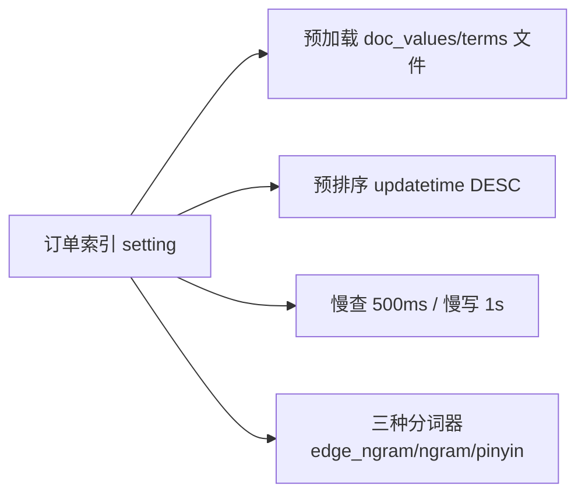

# 特定场景下的数据建模

订单搜索和商品搜索的建模诉求不同：订单要按号段前缀/后缀检索、按更新时间预排序、有严格的字段约束。本篇以「订单索引」为例，把 setting（预加载、预排序、慢日志、分词器）和 mapping（dynamic 严格、订单号前后缀、各类字段属性）的完整设计讲一遍。

## 纲要

- setting：预加载 doc values/terms 文件、按 `updatetime` 预排序、慢查慢写阈值
- 三种分词器：edge_ngram 前缀、ngram 单字、pinyin
- `dynamic: strict` 拒绝未知字段（注意 `dynamic` 拼写）
- 订单号 `orderID` 用 edge_ngram 做前缀检索、另建 `orderIDSuffix` 做后缀匹配
- UID 等不检索不排序字段用 keyword + `doc_values=false`，时间字段保留 date 排序

## 订单索引 setting 设计



```json
{
  "settings": {
    "index": {
      "refresh_interval": "1s",
      "number_of_shards": 1,
      "number_of_replicas": 0,
      "store": { "preload": ["nvd", "dvd", "tim"] },
      "sort": { "field": "updatetime", "order": "desc" },
      "search": { "slowlog": { "threshold": { "query": { "warn": "500ms" } } } },
      "indexing": { "slowlog": { "threshold": { "index": { "warn": "1s" } } } }
    }
  }
}
```

- **预加载**：`index.store.preload` 把 doc values（`.nvd`/`.dvd`）和 terms（`.tim`）类文件预载到堆外，加速段打开与检索（具体后缀以版本为准，建议复习第三章）。
- **预排序**：`index.sort.field=updatetime` + `order=desc`，按更新时间预排序，提升时间范围查询效率。
- **慢日志**：查询 warn 阈值 500ms，写入 warn 阈值 1s，方便定位慢操作。

## 分词器配置

```dir
订单索引分析器/
├── edge_ngram_analyzer   # 订单号前缀(1~18)
│   └── tokenizer: edge_ngram
├── ngram_analyzer        # 商品名单字(1~1)
│   └── tokenizer: ngram
└── pinyin_analyzer       # 拼音检索
    └── tokenizer: pinyin
```

- **前缀分词（edge_ngram）**：`min_gram=1`、`max_gram=18`（订单号 18 位），token_chars 取 `letter`+`digit`。
- **ngram 单字**：`min_gram=max_gram=1`，用于商品名检索。
- **拼音分词**：若需高亮，要把 offset 相关配置设为正确值，拼音 token 才支持高亮。

## mapping 与字段属性

`dynamic` 设为 `strict`——写入未知字段直接报错，**注意拼写是 `dynamic` 不是 `DYNAMIC`**（源码里这个拼写坑导致初次创建失败）。

```json
{
  "mappings": {
    "dynamic": "strict",
    "properties": {
      "orderID":    { "type": "text", "analyzer": "edge_ngram_analyzer", "search_analyzer": "standard" },
      "orderIDSuffix": { "type": "text", "analyzer": "edge_ngram_analyzer", "search_analyzer": "standard" },
      "uid":        { "type": "keyword", "doc_values": false },
      "name":       { "type": "text", "analyzer": "ngram_analyzer", "search_analyzer": "ngram_analyzer" },
      "productId":  { "type": "keyword", "doc_values": false },
      "orderStatus":{ "type": "keyword", "doc_values": false },
      "refundStatus":{ "type": "keyword", "doc_values": false },
      "logisticsType":{ "type": "keyword", "doc_values": false },
      "payTime":    { "type": "date" },
      "createTime": { "type": "date" },
      "updateTime": { "type": "date" }
    }
  }
}
```

| 字段 | 类型 | 分词/属性 | 说明 |
| --- | --- | --- | --- |
| `orderID` | text | edge_ngram / standard | 订单号前缀匹配 |
| `orderIDSuffix` | text | edge_ngram / standard | 订单号后缀匹配 |
| `uid` | keyword | doc_values=false | 不检索不排序 |
| `productId` | keyword | doc_values=false | 数组存储，不排序 |
| `orderStatus` 等 | keyword | doc_values=false | 状态类，不排序 |
| `payTime/createTime/updateTime` | date | doc_values 默认 true | 用于排序 |

要点：订单号既要前缀也要后缀匹配，所以拆成 `orderID`（前缀）+ `orderIDSuffix`（后缀）两个 text 字段，索引用 edge_ngram、搜索用 standard。`uid`/状态类只做等值过滤不排序，关 `doc_values` 省空间；时间字段保留 date 且 `doc_values` 默认开，支撑排序。

## 总结

订单索引建模围绕「号段检索 + 时间预排序 + 字段约束」三件事：**setting 里用 `store.preload` 预载文件、`index.sort` 按 `updatetime` 预排序、配慢查慢写日志**；**三种分词器各司其职**（edge_ngram 做订单号前后缀、ngram 做商品名单字、pinyin 做拼音）；**`dynamic: strict` 拦住脏字段**（别把 `dynamic` 拼错）；**字段属性按检索/排序需求取舍**——只过滤不排序的 `uid`、状态字段关 `doc_values`，时间字段保留 date 排序。把这些定准，订单检索既快又稳。
