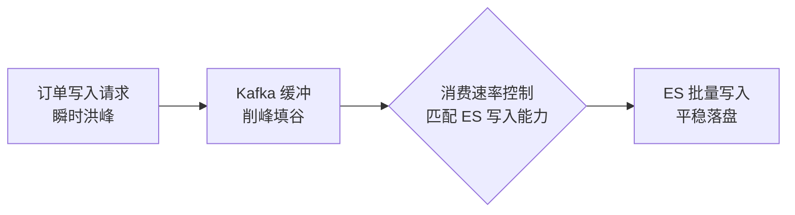

# 如何做流量削峰（本章未完结，持续更新中）

订单类业务在节假日、大促等关键节点会出现短时暴增的瞬时流量。除了微服务架构里的**隔离、限流、熔断、降级**，针对搜索场景下的订单写入，我们还有更贴合业务特性的削峰手段。本节讲如何控制写入速率，避免极端流量冲垮集群。

## 纲要

- 业务特征：订单有列表兜底、搜索可容忍延迟 → 引入 MQ
- 用 Kafka 缓冲写入，按 ES 写入能力控制消费速率
- 写/查资源要平衡：满速写入会拖慢查询
- 控制消费速率三招：ES 429 状态码、bulk 参数、分区与并发
- 应用层限流兜底

## 为什么能削峰：业务允许延迟

订单搜索有个天然缓冲：**订单列表本身能兜底**，用户即使搜不到刚下的单，也能从列表看到；而搜索可以**容忍一定延迟**。这就给了我们在写入路径上引入消息队列的空间。

当出现瞬时流量时，先把订单消息**暂存到 Kafka**，再按 ES 的实际写入能力控制消费速率，让索引过程平稳进行。



## 写与查的资源平衡

按经验，用 bulk 方式写 ES 集群可扛住**每秒约 10 万**的写入请求，绝大多数业务的写入速率不会拖后腿。但必须权衡**写入与查询对集群资源的争夺**：

- 满速写入会消耗大量网络 IO、内存、CPU；
- 写入过猛会让 **refresh 和段合并更频繁**，导致查询缓存更快失效，反而拖慢查询。

所以即便集群写入能力高，也有必要**控制整体写入速率，给查询留出资源**——整个集群最终都是为查询服务的。

## 控制消费速率的三招

| 手段 | 说明 |
| --- | --- |
| ES 返回 429 | 写入超上限被拒绝（请求被丢弃），需重试并降速 |
| 调整 bulk 参数 | SDK 两种提交方式，控制批量/缓冲节奏 |
| 分区数与消费并发 | Kafka 分区数决定消费并发上限，配合应用层限流 |

**1. 关注 ES 的 429 状态码**

ES 抛出 **429（Too Many Requests）** 说明写入请求超过集群处理能力，且这些请求会被丢弃。此时应当**重试并降低消费速率**。

**2. 调整 bulk 参数**

SDK 封装了两种 bulk 提交方式：

- **整批提交**：传入一批文档，直接以 bulk 方式提交；
- **逐条累积**：文档先进 bulk processor 的 channel，达到**一定条数 / 大小 / 时间**阈值后，由 bulk processor 统一提交。

```go
// 方式一：整批直接提交
bulkRequest(doc1, doc2, ...).Do(ctx)

// 方式二：逐条 add 到 bulk processor
// 达到 count / size / flushInterval 任一阈值时自动 flush
processor.Add(doc) // doc 先进入 channel，后台按阈值统一提交
```

后者通过本地缓冲把分散的写入聚成批量，天然起到「攒批、控速」作用。

**3. 分区数与消费并发**

线上会起多个应用实例同时消费，消费并发很大程度上取决于 **Kafka 的分区数**——分区越多、起的消费线程越多，消费越快。再叠加应用层限流，就能精确控制打到 ES 的速率。

```dir
traffic-shaping/
├── 入口限流
│   └── 微服务隔离/限流/熔断/降级
├── 写入缓冲
│   ├── Kafka Topic
│   └── 分区数 → 消费并发
├── 消费侧控速
│   ├── ES 429 重试降速
│   ├── bulk 阈值（count/size/time）
│   └── 应用层限流
└── ES 写入
    └── bulk 批量落盘
```

## 总结

订单写入的流量削峰，核心是**用「业务可容忍延迟」换取「写入平滑」**：引入 Kafka 把瞬时洪峰缓冲成平稳流，再按 ES 写入能力控制消费速率。

三条控速路径要组合起来用：

- **ES 429** 是集群给的背压信号，收到就降速重试；
- **bulk 参数**（整批 vs 缓冲阈值）决定单次写入的聚合度；
- **Kafka 分区数 + 应用层限流**决定消费并发上限。

记住一点：**写入能力再强也要给查询留资源**——盲目满速写入，refresh/merge 变频繁，查询缓存失效，最终是整个集群变慢。控速不是保守，而是为了让「写」和「查」都能稳。
