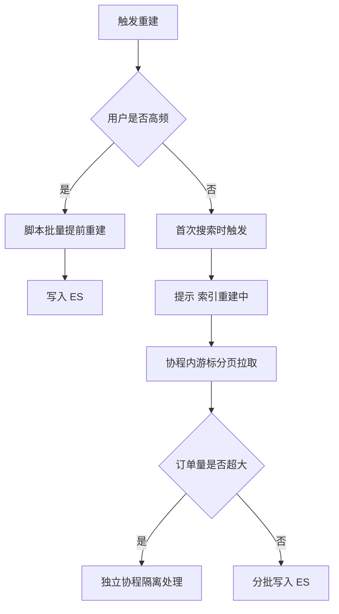

# Go 项目开发: 如何快速重建用户订单索引

线上出 Bug 了、索引写坏了、要跨集群迁移 TB 级数据 —— 这时候 `reindex` 基本指望不上。本文讲一套**从上游数据库按用户维度重建索引**的工程做法：二八原则下先把高频用户的索引跑出来，低频用户走"首次搜索时被动重建"，再用游标分页把全量订单分批拽回来。最后讲一个极易翻车的**时间格式坑**。

## 纲要

- 哪些场景需要重建用户索引
- 高频用户主动重建，低频用户被动重建
- 重建流程：从 ordermain 拉数据写 ES
- 游标分页：用 ID 排序避免深度分页
- AKSK 鉴权与开发者接口
- 一个必踩的坑：时间格式与 mapping 必须一致

## 哪些场景需要重建用户索引

**场景一：用户的索引数据异常。**

比如消息丢失、写入失败。用户反馈"搜不到我的订单"时，通过重建该用户的索引数据可以快速止血。

**场景二：索引数据需要重建或迁移，特别是跨集群迁移。**

ES 自带的 `reindex` 这类工具有明显局限：一般数据达到 **TB 级**，就很难再通过 reindex 迁移数据了。原因是：

- 失败率很高，而且耗时很长；
- 会严重影响当前集群的性能，甚至导致现有集群无法正常提供服务。

所以线上数据迁移，一般会**从上游数据库拉取全量数据**的方式来实现。

**场景三：搜索功能上线晚于平台本身。**

假设电商平台已经上线运营两年，之前一直只能按订单号搜索；现在刚上线"按订单中的商品名称搜索"的功能，这就涉及**存量数据处理**。

对海量数据场景，如果把从不使用搜索、或使用频率极低的那部分用户的订单数据全部提前建好索引，对系统而言是一种浪费。

## 高频用户主动重建，低频用户被动重建

由于并非全部用户都使用搜索，**百分之二十的高频用户贡献了百分之八十的搜索请求**。所以重建策略分两路：

- **高频用户**（用过搜索功能的用户）：先用脚本的方式**提前把他们的索引重建好**；
- **低频用户**：采用**被动建索引**的方式 —— **用户首次搜索时触发该用户全部订单数据的重建**，并提示用户"索引重建中"。

因为单用户的索引数据并不多，**单个用户全部订单数据的重建一般能在秒级完成**。

对于个别订单量特别庞大的用户，使用**隔离策略**：放到其他协程中处理，防止阻塞住整个重建进度。



## 重建流程：从 ordermain 拉数据写 ES

前置工作：订单购物车表做了字段命名更新（原来是大写，现在改成小写 + 下划线），所以这部分旧数据要**重新导入一遍** —— 执行 sql 脚本，删表后重建数据。

源码入口在 `shopschedule` 工程：

```go
package main

import (
	"context"
	"fmt"
)

// OrderAPI 订单查询接口,对应 ordermain 的 dev/v1/order/user 开发者接口。
type OrderAPI interface {
	// FetchOrders 按 UID + 游标 lastID 拉取一页订单,返回下一批的游标。
	FetchOrders(ctx context.Context, uid int64, lastID string, size int) (*OrderPage, error)
}

// OrderPage 一页订单数据,nextID 为 0 表示没有下一批。
type OrderPage struct {
	NextID string
	Orders []Order
}

// Order 订单摘要。
type Order struct {
	ID        string
	UID       int64
	OrderID   string
	Status    string
	UpdateAt  string
}

// ESWriter 索引写入抽象,生产环境替换成 ES 客户端即可。
type ESWriter interface {
	Index(ctx context.Context, index, docID, routing string, doc interface{}) error
}

// RebuildUserOrders 按用户维度重建订单索引。
// 无条件 for 循环 + 游标推进:直到 nextID 为空才跳出,天然避免深度分页。
func RebuildUserOrders(ctx context.Context, api OrderAPI, es ESWriter, uid int64) error {
	const pageSize = 10

	lastID := "0"
	for {
		page, err := api.FetchOrders(ctx, uid, lastID, pageSize)
		if err != nil {
			return fmt.Errorf("拉取用户 %d 订单失败: %w", uid, err)
		}
		for _, o := range page.Orders {
			doc := map[string]any{
				"order_id":  o.OrderID,
				"uid":       fmt.Sprintf("u_%d", o.UID),
				"status":    o.Status,
				"updatetime": o.UpdateAt,
			}
			if err := es.Index(ctx, "suporder", o.OrderID, fmt.Sprintf("u_%d", o.UID), doc); err != nil {
				return fmt.Errorf("写入订单 %s 失败: %w", o.OrderID, err)
			}
		}
		if page.NextID == "" {
			break
		}
		lastID = page.NextID
	}
	return nil
}

type fakeAPI struct{ pages []OrderPage }

func (f fakeAPI) FetchOrders(ctx context.Context, uid int64, lastID string, size int) (*OrderPage, error) {
	for i, p := range f.pages {
		if p.NextID == lastID {
			return &f.pages[i], nil
		}
	}
	return &OrderPage{}, nil
}

type fakeES struct{ indexed int }

func (e *fakeES) Index(ctx context.Context, index, docID, routing string, doc interface{}) error {
	e.indexed++
	return nil
}

func main() {
	api := fakeAPI{pages: []OrderPage{
		{NextID: "10", Orders: []Order{{ID: "1", UID: 3, OrderID: "O001", Status: "DONE"}}},
		{NextID: "20", Orders: []Order{{ID: "11", UID: 3, OrderID: "O002", Status: "WAIT_PAY"}}},
		{NextID: "", Orders: []Order{{ID: "21", UID: 3, OrderID: "O003", Status: "DONE"}}},
	}}
	es := &fakeES{}
	if err := RebuildUserOrders(context.Background(), api, es, 3); err != nil {
		panic(err)
	}
	fmt.Println("重建完成,写入文档数:", es.indexed)
}
```

执行方式：入口在 `main.go`，通过 `switch` 读取当前系统的 **task 任务配置**决定跑哪个脚本；`config` 目录下的配置里 `app.task = orderrebuild`，所以当前跑的就是重建订单这个任务。

## 游标分页：用 ID 排序避免深度分页

上游接口（`dev/v1/order/user`）接收 `uid` 和 `lastID` 两个参数，另外还有每页条数的配置（`size`，默认每页 10 条）。

model 层的查询逻辑：

- 查询条件是 `uid = 传入的 userID`，并且**主键 id > lastID**（首次把 0 传进去）；
- 按 `id` 正序排序，取前 N 条；
- 下一批把上一批的**最大 id** 作为 `lastID` 再传回来。

```sql
select *
from t_order
where uid = ?
  and id > ?
  and is_delete = 0
order by id asc
limit 10;
```

关键点在于：**先把 ID 排序，再按 ID 大于上一批的 ID 过滤**。这样既充分利用了 ID 的主键索引提高查询效率，又**避免了深度分页**。

拿到订单列表后遍历，把订单里的**购物车信息补充进来**（一个订单可能包含多个商品），商品名和商品 ID 分别组装成两个字段，再写入 ES。

调用接口时要带上 **AKSK**。AKSK 的生成有现成的 test 程序，把生成的 AKSK 数据导入 MySQL 之后才能调用商城接口。

## 接口端：开发者接口与 AKSK 鉴权

这个接口是**开发者接口**，不做用户登录态校验，靠 **AKSK** 校验调用方权限：

- 请求头里带 `ossDate` 和一个加密串；
- 中间件 `ossCheck` 比对加密串与数据库中的 AKSK；
- 校验通过才认为有权限访问。

是否需要额外判断用户是否存在？严格意义上需要，用户不存在应该返回对应用户错误。但如果**企业内部接口**默认调用方拿到的都是体系内 UID，就可以省掉对 user 表的查询操作。

这里有个边界要记牢：**开发者接口没有登录态，传不存在的 UID 会查不到数据，但不会报错** —— 重建任务里如果 UID 拼错，表现就是"跑了但一条都没写进去"。

## 一个必踩的坑：时间格式与 mapping 必须一致

索引 `suporder` 的 mapping 里，时间字段（`updatetime`、`paytime`、`createtime`）都是 date 类型，可以**限定日期格式**：

```json
{
  "mappings": {
    "properties": {
      "createtime": {
        "type": "date",
        "format": "yyyy-MM-dd HH:mm:ss"
      }
    }
  }
}
```

但这里有一个非常隐蔽的坑：

- 代码里结构体字段定义的是 `time.Time`；
- SDK 序列化之后写进 ES 的日期是 **`2026-10-03T15:04:05+08:00`** 这种带 `T` 和时区偏移的格式；
- **mapping 里限定的 format 不会做智能转换**，它只负责"解析"。写入的格式和 mapping 声明的格式不一致时，**这条数据根本写不进来**（报 mapper parsing exception）。

所以两条路选一条：

1. **mapping 不限定 format**，让 ES 用默认的严格顺序去解析；
2. **在写入侧自己格式化**，把 `time.Time` 按 mapping 限定的格式输出成字符串再写入。

```go
package main

import (
	"fmt"
	"time"
)

// Order 上游返回的一条订单。
type Order struct {
	ID        string
	UID       int64
	OrderID   string
	Status    string
	CreatedAt time.Time
	UpdatedAt time.Time
}

// 订单号固定 18 位,取后四位单独建索引,用于支持订单号后缀搜索。
const SurfaceLen = 4

// OrderDoc 写入 suporder 索引的文档。
type OrderDoc struct {
	OrderID         string   `json:"order_id"`
	UID             int64    `json:"uid"`
	OrderIDSurface  string   `json:"order_idsurface"`
	IndexNames      []string `json:"index_names"`       // 该订单下全部商品名
	IndexProductsID []string `json:"index_products_id"` // 该订单下全部商品ID
	Status          string   `json:"status"`
	CreateTime      string   `json:"createtime"`
	UpdateTime      string   `json:"updatetime"`
}

// buildOrderDoc 组装索引文档:补齐订单后四位与商品明细。
func buildOrderDoc(o Order, goodsNames, goodsIDs []string) OrderDoc {
	surface := ""
	if len(o.OrderID) >= SurfaceLen {
		surface = o.OrderID[len(o.OrderID)-SurfaceLen:]
	}
	return OrderDoc{
		OrderID:         o.OrderID,
		UID:             o.UID,
		OrderIDSurface:  surface,
		IndexNames:      goodsNames,
		IndexProductsID: goodsIDs,
		Status:          o.Status,
		CreateTime:      o.CreatedAt.Format("2006-01-02 15:04:05"),
		UpdateTime:      o.UpdatedAt.Format("2006-01-02 15:04:05"),
	}
}

// FormatESDate 输出 mapping 限定的日期格式。
// 如果 mapping 写的是 yyyy-MM-dd HH:mm:ss,这里就必须按这个格式序列化,
// 直接塞 time.Time 会被 SDK 转成带 T 和时区偏移的格式而导致写入失败。
func FormatESDate(t time.Time) string {
	return t.Format("2006-01-02 15:04:05")
}

func main() {
	now := time.Date(2026, 10, 3, 15, 4, 5, 0, time.Local)
	fmt.Println("SDK 默认序列化:", now.Format(time.RFC3339))
	fmt.Println("mapping 限定格式:", FormatESDate(now))
}
```

## 验收与注意点

重建完成后按 UID 过滤验证：

```json
{
  "query": { "term": { "uid": "1003" } }
}
```

几个务必注意的点：

- **游标分页必须能终止** —— `nextID` 为空才跳出，否则就是一个死循环；
- **ES 的 `ESID` 用订单 ID，routing 用用户 ID**，和查询侧的 routing 保持一致，否则重建出来的数据搜不到；
- **大用户隔离** —— 单个超大用户的重建放到独立协程，不阻塞整体进度；
- **日期格式一致** —— mapping 写死 format 时，写入侧必须同格式序列化。

## 重建任务的工程结构

重建脚本按 `app.task` 选择执行，整体工程结构如下：

```dir
shopschedule/                      订单重建任务工程
├── main.go                        入口：switch 读取 app.task 选择脚本
├── config/
│   └── app.yaml                   app.task = orderrebuild
├── internal/
│   ├── fetch/                     ordermain 拉取层
│   │   └── OrderAPI               按 UID + lastID 游标拉订单
│   ├── convert/                   文档组装层
│   │   └── buildOrderDoc          订单 + 购物车 -> ES 文档
│   └── sink/                      ES 写入层
│       └── ESWriter               Index 带 routing=UID
└── pkg/
    └── cursor/                   游标分页推进（避免深度分页）
```

## API 速览

| 环节 | 关键做法 |
| --- | --- |
| 触发策略 | 高频用户脚本预建，低频用户首次搜索被动触发 |
| 分页 | 游标分页 `id > lastID`，`order by id asc limit N` |
| 鉴权 | 开发者接口 AKSK，中间件比对 `ossDate` 与加密串 |
| 接口入参 | `uid` + `lastID` + `size`（默认 10） |
| 文档组装 | 订单后四位单独成字段，商品名/商品ID 拼成数组 |
| 写入 | 索引 `suporder`，文档 ID 用订单号，routing 用 UID |
| 日期 | mapping 限定 format 时，写入侧必须同格式序列化 |

## 总结

重建索引这件事，工程上的核心不是"怎么把数据搬过去"，而是**在不影响在线服务的前提下分批搬**：

- **按用户维度**切，而不是按全量文档切，天然符合搜索的访问分布；
- **游标分页**拉数据，用主键 ID 推进，彻底绕开深度分页；
- **高频先建、低频后建**，用二八原则把重建成本压到可接受范围；
- 最后那条**时间格式**的坑最不体面 —— 数据一条都写不进去，日志只报一句 mapper parsing exception，不仔细比对根本定位不到。

索引数据的迁移和重建，对一个不断优化迭代的系统而言是至关重要的能力。而**从上游库拉取数据重建**这种方式，能灵活满足各种重建与迁移需求，比 reindex 可靠得多。

