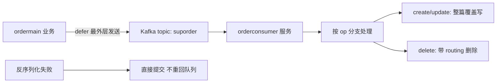

# Go 项目开发: 索引订单数据

上一节讲的是"按用户维度重建索引"，这一节讲常态链路：**订单状态变更后，怎么把变更通知消费成索引数据**。核心在 `orderconsumer` 这个微服务上。本文把消息结构、文档组装、消费分支、脏数据处理和上游发送时机一次讲清，顺带说清 `defer` 到底该写在哪一层。

## 纲要

- orderconsumer 微服务的初始化
- 变更消息与索引文档的结构
- 文档组装：商品名与商品 ID 的一一对应
- 消费分支：创建/更新覆盖写，删除必须带 routing
- 反序列化失败的脏数据直接提交
- 上游什么时候发消息：defer 放在最外层

## orderconsumer 的初始化

新建一个订单微服务 `orderConsumer`：

- `main.go` 里初始化 **ES 客户端、Redis 客户端、MongoDB 客户端**；
- 服务退出时实现这些组件的**优雅关闭**；
- 入口里开启订单消费：topic 是 `suporder`，消费组 `orderConsumer`，回调函数 `messageHandler`。

## 变更消息与索引文档的结构

变更消息里包含：

- **操作类型**（创建 / 删除 / 更新）；
- **订单状态**；
- **订单购物车信息**（下单时的商品明细）。

索引文档字段：`orderID`、`orderIDSurface`（后四位）、`names`（商品名数组）、`productIDS`（商品 ID 数组）、`uid`、`payTime`、`payType`、`refundStatus`、`deliveryType`、`status`、`createTime`、`updateTime`。

> 建索引时有一个必须加上的配置：**拼音 offset**。因为订单索引要支持拼音字段高亮，拼音分词器默认丢 offset 的话高亮会失效。

## 文档组装：商品名与商品 ID 的一一对应

订单里的商品信息都在购物车里，需要把商品名和商品 ID 分别从购物车中取出来，放进 `names` 和 `productIDS` 两个字段。

关键点是：**切片本身有序，追加顺序就是写入顺序**，所以两个字段天然一一对应 —— 第一个商品 ID 对应第一个商品名。

```go
package main

import "fmt"

// SurfaceLen 订单号后四位的长度。
const SurfaceLen = 4

// OrderIndexDoc 写入 ES 的订单索引文档。
type OrderIndexDoc struct {
	OrderID         string   `json:"order_id"`
	OrderIDSurface  string   `json:"order_idsurface"`
	Names           []string `json:"names"`            // 商品名,与 productIDS 一一对应
	ProductIDS      []int64  `json:"product_ids_id"`   // 商品ID
	UID             string   `json:"uid"`
	Status          string   `json:"status"`
	PayType         string   `json:"pay_type"`
	RefundStatus    string   `json:"refund_status"`
	DeliveryType    string   `json:"delivery_type"`
	CreateTime      string   `json:"create_time"`
	UpdateTime      string   `json:"updatetime"`
}

// CartItem 购物车里的一项商品。
type CartItem struct {
	GoodsID   int64
	GoodsName string
}

// BuildDoc 由订单与购物车组装索引文档。
func BuildDoc(orderID string, uid int64, status string, cart []CartItem) OrderIndexDoc {
	names := make([]string, 0, len(cart))
	ids := make([]int64, 0, len(cart))

	for _, c := range cart {
		names = append(names, c.GoodsName)
		ids = append(ids, c.GoodsID)
	}

	surface := ""
	if len(orderID) >= SurfaceLen {
		surface = orderID[len(orderID)-SurfaceLen:]
	}

	return OrderIndexDoc{
		OrderID:        orderID,
		OrderIDSurface: surface,
		Names:          names,
		ProductIDS:     ids,
		UID:            fmt.Sprintf("u_%d", uid),
		Status:         status,
	}
}

func main() {
	doc := BuildDoc("202401150001930001", 1001, "WAIT_RECEIVE", []CartItem{
		{GoodsID: 1, GoodsName: "商品一"},
		{GoodsID: 2, GoodsName: "商品二"},
	})
	fmt.Printf("后四位=%s 商品名=%v 商品ID=%v 对应关系可按下标取\n",
		doc.OrderIDSurface, doc.Names, doc.ProductIDS)
}
```

## 消费分支：覆盖写与删除

拿到变更通知后组装索引，再按操作类型分支处理：

- **创建 / 更新** → 写入索引。订单更新一般只改状态，但消息里带的是**完整订单信息**，所以**直接整篇覆盖写**是最便捷的处理方式，代码也最简洁；
- **删除** → 调用 ES 的 `delete` 方法。

```go
package main

import (
	"encoding/json"
	"fmt"
)

// CartItem 购物车里的一项商品。
type CartItem struct {
	GoodsID   int64
	GoodsName string
}

// OrderMessage Kafka 里的一条订单变更消息。
type OrderMessage struct {
	Op      Op
	OrderID string
	UID     int64
	Status  string
	Cart    []CartItem
}

// decode 反序列化一条变更消息。
func decode(raw []byte) (*OrderMessage, error) {
	var m OrderMessage
	if err := json.Unmarshal(raw, &m); err != nil {
		return nil, err
	}
	return &m, nil
}

// BuildDoc 由订单与购物车组装索引文档。
func BuildDoc(orderID string, uid int64, status string, cart []CartItem) OrderIndexDoc {
	names := make([]string, 0, len(cart))
	ids := make([]int64, 0, len(cart))
	for _, c := range cart {
		names = append(names, c.GoodsName)
		ids = append(ids, c.GoodsID)
	}
	surface := ""
	if len(orderID) >= SurfaceLen {
		surface = orderID[len(orderID)-SurfaceLen:]
	}
	return OrderIndexDoc{OrderID: orderID, OrderIDSurface: surface,
		Names: names, ProductIDS: ids, UID: fmt.Sprintf("u_%d", uid), Status: status}
}

// OrderIndexDoc 索引文档骨架,块1 已有完整定义,这里只列消费分支关心的字段。
type OrderIndexDoc struct {
	OrderID        string   `json:"order_id"`
	OrderIDSurface string   `json:"order_idsurface"`
	Names          []string `json:"names"`
	ProductIDS     []int64  `json:"product_ids_id"`
	UID            string   `json:"uid"`
	Status         string   `json:"status"`
}

// SurfaceLen 订单号后四位长度。
const SurfaceLen = 4

// Op 操作类型。

type Op string

const (
	OpCreate Op = "create"
	OpUpdate Op = "update"
	OpDelete Op = "delete"
)

// ESHandler 索引操作抽象。
type ESHandler interface {
	Index(docID, routing string, doc interface{}) error
	Delete(docID, routing string) error
}

// HandleOrderEvent 消费一条订单变更消息。
// 反序列化失败的消息直接提交(return nil),不要重回队列。
func HandleOrderEvent(h ESHandler, raw []byte) error {
	msg, err := decode(raw)
	if err != nil {
		// 脏数据:重投也不可能反序列化成功,直接提交避免阻塞整个分区
		return nil
	}

	doc := BuildDoc(msg.OrderID, msg.UID, msg.Status, msg.Cart)
	routing := doc.UID

	switch msg.Op {
	case OpDelete:
		// 删除时千万不要漏掉 routing,否则删不掉
		if err := h.Delete(msg.OrderID, routing); err != nil {
			return err
		}
		return nil
	case OpCreate, OpUpdate:
		// 带的是完整订单,整篇覆盖写
		return h.Index(msg.OrderID, routing, doc)
	}
	// 未知操作类型,直接按无操作处理
	return nil
}

func main() {
	h := &fakeES{}
	raw := []byte(`{"op":"delete","order_id":"O20261003001","uid":1001,"status":"DONE"}`)
	if err := HandleOrderEvent(h, raw); err != nil {
		panic(err)
	}
	fmt.Println("消费完成,删除次数:", h.deleted, "路由:", h.lastRouting)
}

type fakeES struct {
	deleted bool
	lastRouting string
}

func (f *fakeES) Index(docID, routing string, doc interface{}) error { return nil }
func (f *fakeES) Delete(docID, routing string) error {
	f.deleted = true
	f.lastRouting = routing
	return nil
}

```

**删除时务必带上 routing** —— 这是订单消费里最容易漏的一个参数，漏了之后 `delete` 会响应成功但文档还在，表现就是"删不掉"。

## 反序列化失败的消息直接提交

如果反序列化不成功，处理方式是**直接 `return nil`，让 Kafka 直接提交**。

原因很直接：这份数据既然反序列化不成功，**重回队列再次消费也不可能反序列化成功**，只会白白占用分区的消费进度。所以对这类脏数据，**直接消费掉，不要重回队列**。

## 上游什么时候发消息：defer 必须写在最外层

链路的另一半在 `ordermain`：订单创建 / 发货 / 支付 / 状态变更时，都要往同一个 topic 发一条变更通知。

```go
package main

import (
	"encoding/json"
	"fmt"
	"time"
)

// Op 操作类型。
type Op string

const (
	OpCreate Op = "create"
	OpUpdate Op = "update"
	OpDelete Op = "delete"
)

// CartItem 购物车商品。
type CartItem struct{ GoodsID int64; GoodsName string }

// OrderMessage 订单变更消息。
type OrderMessage struct {
	Op      Op       // 操作类型
	OrderID string
	UID     int64
	Status  string
	Cart    []CartItem
}

// orderEvent 把订单变更通知序列化后发到 Kafka。
func orderEvent(msg OrderMessage) ([]byte, error) {
	data, err := json.Marshal(msg)
	if err != nil {
		return nil, err
	}
	// Kafka value encode 后投递到 suporder topic
	return data, nil
}

// EventSender 模拟 Kafka 生产者。
type EventSender struct{ sent int }

func (s *EventSender) Send(payload []byte) {
	time.Sleep(5 * time.Millisecond) // 模拟一次网络往返
	s.sent++
	fmt.Println("  已投递变更通知,字节数:", len(payload))
}

// CreateOrderRight 正确做法:在最外层函数里 defer 发消息。
// HTTP 响应用户级接口,耗时敏感;用 defer 让发送动作从响应耗时里挪出去。
func CreateOrderRight(s *EventSender, msg OrderMessage) {
	defer func() {
		data, err := orderEvent(msg)
		if err != nil {
			return
		}
		s.Send(data)
	}()

	// 业务主体:落库等
	time.Sleep(2 * time.Millisecond)
}

// CreateOrderWrong 错误做法:defer 写进内层函数。
// 内层返回即执行,但外层接口依然要等消息发完,省不下任何耗时。
func CreateOrderWrong(s *EventSender, msg OrderMessage) {
	emitLater(s, msg)
	time.Sleep(2 * time.Millisecond)
}

func emitLater(s *EventSender, msg OrderMessage) {
	defer func() {
		data, _ := orderEvent(msg)
		s.Send(data)
	}()
}

func main() {
	s := &EventSender{}
	msg := OrderMessage{Op: OpCreate, OrderID: "O20261003001", UID: 1001,
		Status: "WAIT_PAY", Cart: []CartItem{{GoodsID: 1, GoodsName: "商品一"}}}

	start := time.Now()
	CreateOrderRight(s, msg)
	fmt.Printf("正确做法 接口耗时 %.1fms\n", float64(time.Since(start).Microseconds())/1000)

	start = time.Now()
	CreateOrderWrong(s, msg)
	fmt.Printf("错误做法 接口耗时 %.1fms\n", float64(time.Since(start).Microseconds())/1000)
}
```

两个细节值得单独拎出来：

- **为什么要用 `defer` 发消息**：订单是用户级接口，对耗时敏感。把发 Kafka 这种耗时操作放到 `defer` 里，发送动作会排在响应函数返回之后执行，不占接口总时长。
- **`defer` 必须写在最外层函数里才有效**。如果写在内层函数里，内层一返回消息就发出去了，但队列仍在等着，**整个接口的耗时一点没减**。

## 消费与写入链路

订单变更通知经 Kafka 进入 `orderconsumer`，按操作类型分支处理：



## 消费微服务的工程结构

```dir
orderconsumer/                     订单消费微服务
├── main.go                       初始化 ES/Redis/Mongo，优雅关闭
├── handler/
│   └── messageHandler            topic=suporder 消费回调
├── service/
│   ├── decode/                   Kafka 消息反序列化
│   ├── build/                    组装索引文档（商品名<->ID 对应）
│   └── dispatch/                 按 op 分支：覆盖写 / 删除
└── infra/
    ├── es/                       ES 写入与删除（删除必带 routing）
    └── kafka/                    消费组 orderConsumer
```

## API 速览

| 环节 | 关键做法 |
| --- | --- |
| 初始化 | ES + Redis + MongoDB 客户端，退出时优雅关闭 |
| topic / group | topic `suporder`，消费组 `orderConsumer` |
| 文档组装 | 商品名与商品 ID 用两个切片，按追加顺序一一对应 |
| 写入 | 创建/更新整篇覆盖写，文档 ID 用订单号 |
| 删除 | 一定带上 routing，否则删不掉 |
| 脏数据 | 反序列化失败直接提交，不重回队列 |
| 拼音高亮 | 索引配置必须加拼音 offset |
| 上游发送 | 在最外层函数用 defer 发 Kafka，不占接口耗时 |

## 总结

订单索引的常态链路可以压缩成一句话：**上游 `defer` 发变更通知到 Kafka → 下游 `orderconsumer` 消费 → 按 op 分支覆盖写或带 routing 删除**。

三个最容易出事的点：

- **删除漏了 routing**，表现为删除成功但数据还在，极难排查；
- **反序列化失败的消息重回队列**，会把整个分区的消费进度拖死，脏数据必须直接提交；
- **`defer` 写错层级**，自以为异步了消息，实际接口该慢还是慢。

这条链路和商品消费的逻辑大同小异，都是"上游把变更推到 Kafka，下游微服务消费成索引"。差异只在订单多了一层**购物车商品明细的组装**，以及**状态机**带来的多种操作类型。

