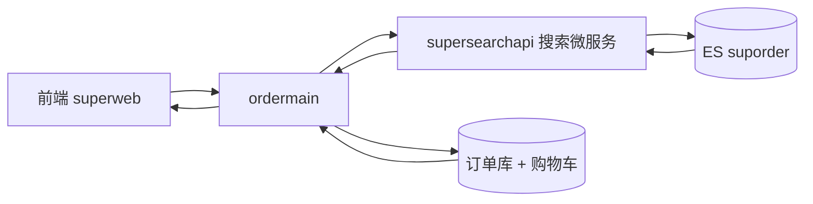

# Go 项目开发: 订单搜索接口实现

订单搜索的查询比商品搜索复杂在一个地方：**用户可能拿商品名搜，也可能复制订单号搜，还可能记不清只记得后四位**。这一节把搜索微服务的**五路 should 加权查询**、**按关键词形态动态降噪**、**高亮回写**三件事讲透，并给出完整可编译的 Go 实现。

## 纲要

- 订单搜索的调用链路
- ordermain 侧：只拿 OrderID 和高亮，再回查订单详情
- 搜索微服务：五路 should 加权查询
- 按关键词形态降噪：字母才查拼音，纯数字才查订单号
- 高亮设置与最终查询语句
- 高亮回写：两个 map 与 displayOrderID

## 调用链路



- 前端调 `ordermain` 的 `/api/v1/order/search`；
- `ordermain` 再调搜索微服务 `127.0.0.1:9090/api/v1/order/search`；
- 搜索微服务查 ES，只返回 **OrderID + 高亮**；
- `ordermain` 拿着这批 OrderID 回数据库查订单详情和购物车，拼装后返回前端。

业务发展到一定阶段，订单搜索和商品搜索应该拆成不同微服务；本Demo 沿用同一个搜索服务工程。

## ordermain 侧：只拿 OrderID 和高亮

service 层 `searchOrder` 先组装参数（uid、keyword、分页、状态），再带上**签名和签名生成时间**发 HTTP 请求：

- 返回码不是 200，或者响应体里有错误 → 直接 `return nil` 并把错误打出来；
- 解析出的结果里取**命中总条数**和**当前页码**；
- 从 `hits` 里只取 **ESID（OrderID）** 和高亮信息 —— 因为 `fetch_source` 设成了 `false`，索引里什么都不取，只拿 ID。

```go
package main

import (
	"crypto/md5"
	"encoding/hex"
	"encoding/json"
	"fmt"
	"io"
	"net/http"
	"strconv"
	"time"
)

// SearchOrderReq 前端传来的订单搜索请求。
type SearchOrderReq struct {
	UID      int64
	Keyword  string
	Page     int
	PageSize int
	Status   string
}

// SearchResp 搜索微服务返回结果。
type SearchResp struct {
	Total int64 `json:"total"`
	Page  int   `json:"page"`
	Hits  []struct {
		OrderID   string              `json:"order_id"`
		Highlight map[string][]string `json:"highlight"`
	} `json:"hits"`
}

// sign 计算接口签名,与商品搜索一致:md5(uid + keyword + timestamp)。
func sign(uid int64, keyword, ts string) string {
	h := md5.New()
	h.Write([]byte(fmt.Sprintf("%d%s%s", uid, keyword, ts)))
	return hex.EncodeToString(h.Sum(nil))
}

// SearchOrder 调用搜索微服务的订单搜索接口。
func SearchOrder(client *http.Client, req SearchOrderReq) (*SearchResp, error) {
	ts := strconv.FormatInt(time.Now().Unix(), 10)
	target := fmt.Sprintf("http://127.0.0.1:9090/api/v1/order/search?uid=%d"+
		"&keyword=%s&page=%d&pagesize=%d", req.UID, req.Keyword, req.Page, req.PageSize)

	httpReq, err := http.NewRequest(http.MethodGet, target, nil)
	if err != nil {
		return nil, err
	}
	httpReq.Header.Set("sig", sign(req.UID, req.Keyword, ts))
	httpReq.Header.Set("timestamp", ts)

	resp, err := client.Do(httpReq)
	if err != nil {
		return nil, err
	}
	defer resp.Body.Close()

	body, err := io.ReadAll(resp.Body)
	if err != nil {
		return nil, err
	}
	if resp.StatusCode != http.StatusOK {
		return nil, fmt.Errorf("搜索服务返回 %d: %s", resp.StatusCode, body)
	}
	var out SearchResp
	if err := json.Unmarshal(body, &out); err != nil {
		return nil, err
	}
	return &out, nil
}

func main() {
	client := &http.Client{Timeout: 3 * time.Second}
	res, err := SearchOrder(client, SearchOrderReq{UID: 1001, Keyword: "联想", Page: 1, PageSize: 10})
	if err != nil {
		fmt.Println("搜索失败:", err)
		return
	}
	fmt.Println("命中总数:", res.Total)
	for _, h := range res.Hits {
		fmt.Println("  orderID:", h.OrderID, "高亮:", h.Highlight)
	}
}
```

## 搜索微服务：五路 should 加权查询

核心在 service 层的 `searchOrder`：

- 先定义一个 bool query，should 里放多个查询条件，用 **`minimum_should_match` 至少匹配一个**；
- 定义**五个查询条件**，并给不同权重：

| 条件 | 查询方式 | 权重 | 说明 |
| --- | --- | --- | --- |
| 商品名称 | `match_phrase` | 最高 | 用户最想看到的就是商品名命中 |
| 商品名称 | `match` | 1 | 对连续性无要求，比短语匹配低一档 |
| 商品名拼音 | `names.pinyin` match_phrase | 0.7 | 支持拼音搜索 |
| 订单号 | `orderID` match_phrase | 0.5 | 命中订单号排后面 |
| 订单号后四位 | `orderIDSurface` | 0.3 | 权重最低 |

权重的意义在最终排序：如果关键词同时匹配了两个订单，**命中商品名的那条要排在命中订单号的前面**。

```go
package main

import (
	"fmt"
	"unicode"
)

// SearchQuery 搜索微服务接收到的查询参数。
type SearchQuery struct {
	UID      int64
	Keyword  string
	Page     int
	PageSize int
	Status   string
}

// hasLetter 关键词是否包含字母:含字母才需要走拼音查询。
func hasLetter(s string) bool {
	for _, r := range s {
		if unicode.Is(unicode.Letter, r) {
			return true
		}
	}
	return false
}

// isPureDigit 关键词是否纯数字:纯数字才需要走订单号查询。
func isPureDigit(s string) bool {
	if s == "" {
		return false
	}
	for _, r := range s {
		if !unicode.Is(unicode.Digit, r) {
			return false
		}
	}
	return true
}

// buildQuery 构造订单搜索的 ES 查询体。
// 关键:先用关键词形态过滤掉一部分 should 条件,查询条件越少效率越高。
func buildQuery(q SearchQuery) map[string]any {
	should := []map[string]any{}

	// 商品名短语匹配,权重最高
	should = append(should, map[string]any{
		"match_phrase": map[string]any{"goodsName": map[string]any{"query": q.Keyword, "boost": 3.0}},
	})
	// 商品名普通匹配,对连续性无要求
	should = append(should, map[string]any{
		"match": map[string]any{"goodsName": map[string]any{"query": q.Keyword, "boost": 1.0}},
	})
	// 中文不需要拼音,含字母才加拼音条件
	if hasLetter(q.Keyword) {
		should = append(should, map[string]any{
			"match_phrase": map[string]any{
				"names.pinyin": map[string]any{"query": q.Keyword, "boost": 0.7},
			},
		})
	}
	// 订单号全部是数字,纯数字才加订单号条件
	if isPureDigit(q.Keyword) {
		should = append(should, map[string]any{
			"match_phrase": map[string]any{"orderID": map[string]any{"query": q.Keyword, "boost": 0.5}},
		})
		should = append(should, map[string]any{
			"match": map[string]any{"orderIDSurface": map[string]any{"query": q.Keyword, "boost": 0.3}},
		})
	}

	must := []map[string]any{
		{"term": map[string]any{"uid": fmt.Sprintf("u_%d", q.UID)}}, // 防止越权查到别人订单
	}
	if q.Status != "" {
		must = append(must, map[string]any{"term": map[string]any{"status": q.Status}})
	}

	return map[string]any{
		"from": (q.Page - 1) * q.PageSize,
		"size": q.PageSize,
		"query": map[string]any{
			"bool": map[string]any{
				"must":                 must,
				"should":               should,
				"minimum_should_match": 1,
			},
		},
	}
}

// shouldCount 统计 should 条件数量,便于观察降噪效果。
func shouldCount(query map[string]any) int {
	boolQuery := query["query"].(map[string]any)["bool"].(map[string]any)
	return len(boolQuery["should"].([]map[string]any))
}

func main() {
	q := SearchQuery{UID: 1001, Keyword: "联想", Page: 1, PageSize: 10}
	fmt.Println("中文关键词 条件数 =", shouldCount(buildQuery(q)))

	d := SearchQuery{UID: 1001, Keyword: "2024011500", Page: 1, PageSize: 10}
	fmt.Println("纯数字关键词 条件数 =", shouldCount(buildQuery(d)))
}
```


## 高亮设置

高亮对象设置三个东西：

- **高亮片段长度**：100 字符（商品名不是长文本，100 足够）；
- **高亮片段数量**：1（短文本只返回一处）；
- **高亮字段**：按关键词形态动态决定 —— 中文高亮 `goodsName`；字母时还要高亮 `names.pinyin`；数字时要高亮 `orderID` 和 `orderIDSurface`。

发起搜索时用 SDK 的 `Search.WithHighlight()` 这类函数式选项把高亮传进去。

must 里除了状态过滤，一定带上 **`term uid`**，把查询范围限定在当前登录用户的订单内，**防止越权查到别人的订单**。

最终语句长这样：

```json
{
  "from": 0, "size": 10,
  "query": {
    "bool": {
      "must":    [{ "term": { "uid": "u_1001" } }],
      "should": [
        { "match_phrase": { "goodsName":     { "query": "联想", "boost": 3.0 } } },
        { "match":        { "goodsName":     { "query": "联想", "boost": 1.0 } } },
        { "match_phrase": { "names.pinyin":  { "query": "lianxiang", "boost": 0.7 } } },
        { "match_phrase": { "orderID":       { "query": "20240115", "boost": 0.5 } } },
        { "match":        { "orderIDSurface":{ "query": "1500", "boost": 0.3 } } }
      ],
      "minimum_should_match": 1
    }
  },
  "sort": [{ "updatetime": "desc" }],
  "_source": false
}
```

排序用有序切片：先按相关度打分，再按 `updatetime`（或 `createtime`）排，越靠前的排序条件影响越大。`store` 设 `_source: false`，只取 ID。

## 指标上报：为什么必须用 defer

controller 层要先上报 QPS 和耗时：

- **不能用 `go` 协程**去做 —— 耗时要从接口前置时间算起，协程会把这行代码的极短耗时当成整接口耗时，统计不准；
- 所以用 **`defer`** 在接口退出时统一上报。

搜索日志同样在 `defer` 里上报：MongoDB **按表前缀 `order_search` 生成表名**，先查本地 `sync.Map` 缓存有没有这张表，没有就按 `userID` 和 `createtime` 建索引，把表名塞回缓存，再插入日志。

## 高亮回写：两个 map 与 displayOrderID

`ordermain` 拿到 SearchID 后用 `where uid = ? and order_id in (?)` 回数据库查订单详情，再遍历补充购物车信息，然后做高亮处理。

索引里商品名和商品 ID 是**两个一一对应的数组**，所以高亮要反查出"哪个商品被命中了"：

```go
package main

import (
	"fmt"
	"strings"
)

// CartItem 购物车里的一项。
type CartItem struct {
	GoodsID   int64
	GoodsName string // 带 <em> 标签的高亮名
}

// OrderDetail 数据库查出来的订单。
type OrderDetail struct {
	OrderID string
	UID     int64
	Cart    []CartItem
}

// OrderView 返回前端的订单视图。
type OrderView struct {
	OrderID      string
	DisplayOrder string // 前端要展示的订单号
	Products     []ProductView
}

// ProductView 商品视图,storeName 已替换为带高亮标签的名称。
type ProductView struct {
	GoodsID   int64
	StoreName string
}

// fillHighlight 把 ES 返回的高亮回写到订单详情上。
// cutInfoName:商品名 -> 商品ID
// cutInfoHl:  商品ID -> 商品名(带高亮标签)
func fillHighlight(o OrderDetail, hl map[string][]string) OrderView {
	view := OrderView{OrderID: o.OrderID, DisplayOrder: o.OrderID}

	cutInfoName := make(map[string]int64, len(o.Cart))  // 原始商品名 -> ID
	cutInfoHl := make(map[int64]string, len(o.Cart))    // 商品ID -> 高亮商品名

	for _, c := range o.Cart {
		cutInfoName[c.GoodsName] = c.GoodsID
	}

	names, nameHitted := hl["names"]
	if nameHitted {
		for _, hlName := range names {
			raw := strings.NewReplacer("<em>", "", "</em>", "").Replace(hlName)
			gid, ok := cutInfoName[raw]
			if !ok {
				continue
			}
			// 商品名重名时以最后一个为准,只要被高亮就说明该订单命中
			cutInfoHl[gid] = hlName
		}
	}

	// 拼音高亮兜底:商品名没命中时才用拼音高亮(商品名与用户意图更相关)
	if pinyin, ok := hl["names.pinyin"]; ok {
		for _, hlName := range pinyin {
			raw := strings.NewReplacer("<em>", "", "</em>", "").Replace(hlName)
			for name, gid := range cutInfoName {
				if cutInfoHl[gid] != "" {
					continue // 商品名已经命中,不再重复高亮
				}
				if strings.Contains(raw, name[:1]) {
					cutInfoHl[gid] = hlName
					break
				}
			}
		}
	}

	if len(cutInfoHl) > 0 {
		for _, c := range o.Cart {
			view.Products = append(view.Products, ProductView{
				GoodsID:   c.GoodsID,
				StoreName: cutInfoHl[c.GoodsID],
			})
		}
	}

	// 订单号高亮:优先展示订单号本身的匹配,都没命中就用原生订单号
	if orderFrag, ok := hl["orderID"]; ok && len(orderFrag) > 0 {
		view.DisplayOrder = strings.NewReplacer("<em>", "", "</em>", "").Replace(orderFrag[0])
	}
	return view
}

func main() {
	o := OrderDetail{OrderID: "202401150001930001", UID: 1001,
		Cart: []CartItem{{GoodsID: 1, GoodsName: "联想手机"}, {GoodsID: 2, GoodsName: "鼠标"}}}
	view := fillHighlight(o, map[string][]string{
		"names":   {"<em>联想</em>手机"},
		"orderID": {"20240115000193<em>0001</em>"},
	})
	fmt.Println("展示订单号:", view.DisplayOrder)
	for _, p := range view.Products {
		fmt.Printf("  商品%d 名称=%s\n", p.GoodsID, p.StoreName)
	}
}
```

三个处理要点：

- **先去掉 `<em>` 标签**得到原始商品名，再用"商品名 → 商品 ID"的反查表找到命中的商品；
- **商品名重名**不影响结果，以最后一个同名商品为准 —— 只要高亮上了，就说明该订单里的商品命中了；
- **拼音高亮与商品名高亮冲突时以商品名为准**，因为商品名与用户搜索意图最相关。

订单号是非数组字段，处理简单：新增一个 **`displayOrderID`** 字段专门给前端展示，值就是高亮之后的订单号；如果订单号和后四位都没命中，`displayOrderID` 就退化为原生订单号。

## 搜索微服务的工程结构

```dir
supersearchapi/                   订单搜索微服务
├── controller/
│   └── searchOrder              入口：defer 上报 QPS/耗时
├── service/
│   ├── buildQuery/              五路 should 加权查询
│   ├── highlight/               高亮片段 100/1 动态选字段
│   └── fillHighlight/           两个 map 反查 + displayOrderID
└── repo/
    └── es/                      查 ES，_source:false 只取 ID
```

## API 速览

| 环节 | 关键做法 |
| --- | --- |
| 链路 | 前端 → ordermain → 搜索微服务 → ES，只回 OrderID + 高亮 |
| 越权防护 | must 里 `term uid`，限定当前用户订单 |
| 加权 | should 五条件，boost 3.0 / 1.0 / 0.7 / 0.5 / 0.3 |
| 降噪 | 含字母才查拼音，纯数字才查订单号与后四位 |
| 高亮 | 片段长度 100、数量 1，字段按关键词形态动态选 |
| 排序 | 有序切片：相关度 → updatetime |
| 取数 | `_source: false`，只取 ID |
| 上报 | 指标与日志用 defer 上报，不能用 goroutine 统计耗时 |
| 回写 | 商品名 ↔ 商品ID 两个 map 反查，displayOrderID 供前端展示 |

## 总结

订单搜索接口的复杂度集中在**查询形态识别**和**高亮回写**两处：

- 五路 should 的权重设计，本质是在模拟用户的搜索意图 —— **商品名最相关，订单号其次，后四位最弱**；再用"是否含字母""是否纯数字"这两道判断把无效条件砍掉，查询效率直接受益；
- 高亮回写之所以要建两个 map，是因为**索引里商品名和商品 ID 是对应数组**，前端只认商品名，而高亮只告诉你"哪个字符串被命中了"，必须反查到具体是哪一个商品。

最容易出问题的两点：忘记 `must` 里的 uid 过滤造成**越权**，以及拼音和商品名高亮**重复叠加**导致前端双标签。前者是安全红线，后者是体验细节，两个都得在验收时单独看。

