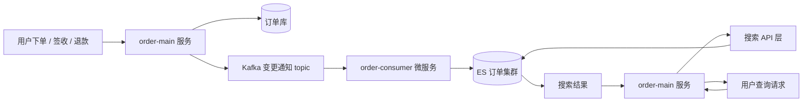

# Go 项目开发: 订单搜索业务场景和功能分析

商品搜索做到一定规模后，订单搜索往往会被独立出来。原因不是"顺手"，而是**两者的索引模型、查询模式、数据生命周期完全不同**。本文把订单搜索的业务场景拆开讲：两个搜索维度怎么设计 routing、订单数据的四个业务特征、以及订单搜索服务的整体架构。

## 纲要

- 订单搜索要不要从商品搜索里独立出来
- 用户端与商家端：两个 routing 维度
- 订单搜索的功能特点：没有个性化，但要控制分词噪音
- 订单搜索的四个业务特征
- 订单搜索服务的整体架构

## 订单搜索要不要独立成服务

先回到微服务拆分的常识：**商品和订单属于两个不同的业务模块**。业务发展到一定阶段，这两块由不同团队负责时，商品搜索服务和订单搜索服务就应该拆成独立的微服务，至少在**索引存储上完全隔离** —— 使用不同的 ES 集群。

理由很实在：

- **索引结构不同**。商品索引关心的是类目、品牌、价格区间、规格属性；订单索引关心的是订单号、订单状态、商品明细、时效。
- **写入节奏不同**。商品是低频变更、全量重建；订单是持续写入、状态频繁流转。
- **查询目标不同**。商品搜索追求召回与相关性；订单搜索追求**精确、快、可控**。

> 本文为便于演示不进一步拆分，工程上建议按团队边界拆成独立的搜索服务，索引与集群各自独立。

## 用户端与商家端：两个 routing 维度

订单搜索分**用户端**和**商家端**，两者的 routing 策略不一样：

- **用户端**用**用户 ID** 做 routing 存储订单数据。
- **商家端**用**店铺 ID** 做 routing 存储订单。

不管用户端还是商家端，**都有明确的维度**。这是订单搜索最大的红利：routing 一上，查询只命中一个分片。工程上要保证**写入和查询用同一个 routing 字段**，否则数据散到全部分片，优化就白做了。

```go
package main

import (
	"errors"
	"fmt"
)

// OrderSearchReq 订单搜索请求。
type OrderSearchReq struct {
	UID      int64    // 用户ID，用户端搜索的唯一维度
	ShopID   int64    // 店铺ID，商家端搜索的维度，用户端填 0
	Keyword  string   // 搜索关键词：商品名称 或 订单号片段
	Statuses []string // 订单状态过滤，如 WAIT_PAY / WAIT_RECEIVE / DONE
	Page     int      // 当前页，从 1 开始
	PageSize int      // 每页大小
	FromDate string   // 时间范围起点，业务上默认只搜近一年
	ToDate   string
}

// Routing 计算 ES 写入与查询使用的 routing 值。
// 用户端用 UID、商家端用 ShopID，同一维度的数据必然落到同一个分片。
func (r OrderSearchReq) Routing() (string, error) {
	switch {
	case r.UID > 0 && r.ShopID > 0:
		return "", errors.New("用户端与商家端维度不能同时使用")
	case r.UID > 0:
		return fmt.Sprintf("u_%d", r.UID), nil
	case r.ShopID > 0:
		return fmt.Sprintf("s_%d", r.ShopID), nil
	}
	return "", errors.New("缺少路由维度：用户端需 UID，商家端需 ShopID")
}

func main() {
	req := OrderSearchReq{UID: 10086, Keyword: "机械键盘", Page: 1, PageSize: 20}
	routing, err := req.Routing()
	if err != nil {
		panic(err)
	}
	fmt.Println("routing =", routing)
}
```

## 功能特点：没有个性化，但要控制分词噪音

订单搜索相比商品搜索，**没有太多个性化的东西** —— 用户对自己下单后的商品是有认知的。

所以管理的重心只有一条：**在分词上控制噪音，避免召回与用户关键词匹配度不高的数据**。

另外两个使用习惯必须照顾到：

- 一个订单里包含**多个商品**，用户可能按**商品名称**搜索，也可能按**订单号**搜索。
- 订单号的搜索习惯通常是**只用前几位或后几位**。所以订单号字段不能只做一次 `term` 精确匹配，需要支持**前缀/后缀片段匹配**，以及**数字分段**（订单号里穿插业务日期时尤其常见）。

也就是说，订单索引里至少要能支撑两种召回：`goods_name` 的全文匹配 + `order_no` 的片段匹配。

```go
package main

import (
	"encoding/json"
	"fmt"
	"time"
)

// buildOrderQuery 构造用户端订单搜索的 ES 查询体。
// 关键词为空时退化为全量匹配，避免 must 为空导致无结果。
func buildOrderQuery(keyword string, statuses []string, from, to time.Time) map[string]any {
	filter := []any{
		map[string]any{"range": map[string]any{"create_time": map[string]any{
			"gte": from.Format("2006-01-02"),
			"lte": to.Format("2006-01-02"),
		}}},
	}
	if len(statuses) > 0 {
		filter = append(filter, map[string]any{"terms": map[string]any{"status": statuses}})
	}

	boolQuery := map[string]any{"filter": filter}
	if keyword == "" {
		boolQuery["must"] = []any{map[string]any{"match_all": map[string]any{}}}
	} else {
		boolQuery["must"] = []any{map[string]any{"match": map[string]any{"goods_name": keyword}}}
	}

	return map[string]any{
		"from":             0,
		"size":             20,
		"track_total_hits": 1000,
		"query":             map[string]any{"bool": boolQuery},
	}
}

func main() {
	q := buildOrderQuery("机械键盘", []string{"WAIT_PAY"},
		time.Now().AddDate(0, 0, -30), time.Now())
	body, _ := json.Marshal(q)
	fmt.Println(string(body))
}
```

## 订单搜索的四个业务特征

这是订单搜索规划集群的直接依据，每一条都对应后面的架构决策。

**一、请求高度集中在订单状态过滤上。**

- 百分之**五十以上**的搜索请求是按**订单状态**过滤的。
- 按支付方式、物流类型、订单号、商品名称过滤的请求占比非常少。

**二、未完成状态的订单占绝对多数。**

在按订单状态过滤的请求里，又有**百分之九十以上**来自**未完成状态**的订单。这说明订单数据有非常明显的**冷热维度**：不管总体订单量如何庞大，**未完成热状态订单的数量总会维持在一个相对恒定的量级**。

**三、订单数据有明显的时序特征。**

已完成的订单，整体数据量非常庞大。考虑到扩展性，**可以按时间来分索引**，业务上默认支持搜索近一年的订单即可。

**四、状态最终一定会收敛到完成。**

未支付订单超时后自动取消，已支付订单一定时间后自动确认完成，退款流程走完订单也是完成状态。所以**最终状态一定会变成完成状态** —— 这条是后面冷热集群之间数据迁移的理论基础。

## 订单搜索服务的整体架构

写入链路与查询链路完全分离：



- **写入侧**：业务请求先打到 `order-main`，落库之后往 Kafka 发一条变更通知；下游 `order-consumer` 消费，建索引写入 ES 集群。
- **查询侧**：用户发起查询到 `order-main`，由搜索 API 把关键词和过滤条件翻译成查询请求打到 ES，拿到结果再回填给业务返回。

关键点在于：**查询侧不直接依赖写入侧，而是通过 ES 这个最终一致的中间态解耦**。消费延迟就是索引可见性的延迟，这个指标要单独监控。

## 订单搜索服务的拓扑

订单搜索与商品搜索在集群与索引上完全隔离，整体服务拓扑如下：

```dir
order-search/                     订单搜索服务
├── order-main/                  业务入口：落库 + 发变更通知
│   ├── api/                     用户端 / 商家端 接口
│   └── routing/                 UID / ShopID 双维度
├── search-api/                  搜索 API 层：翻译查询
│   ├── user/                    routing=UID
│   └── shop/                    routing=ShopID
├── order-consumer/              消费 Kafka 建索引
└── es-cluster/                  订单独立集群
    ├── hot/                     未完成状态（热）
    └── cold/                    已完成状态（冷）
```

## API 速览

| 能力 | 关键做法 |
| --- | --- |
| 集群隔离 | 订单搜索与商品搜索使用不同集群，索引不共享 |
| routing | 用户端 `routing=UID`，商家端 `routing=ShopID`，写入查询一致 |
| 状态过滤 | `terms` 过滤 status，是最高频的过滤条件 |
| 时间分索引 | 按时间分索引，业务默认只搜近一年 |
| 写入链路 | order-main 落库 → Kafka → order-consumer → ES |
| 查询链路 | order-main → 搜索 API → ES |

## 总结

订单搜索的本质是**一个带明确维度的状态机查询系统**：有 UID 或 ShopID 做 routing，天然能少打分片；有明确的冷热维度，天然适合分层存储；有明确的时序边界，天然适合按时间切索引。

这三条先把架构骨架定下来 —— 后面的难点分析、集群规划、写入隔离，都是在这条骨架上往上加层。真正要提前想清楚的只有一件事：**routing 必须在建索引时定好，数据一旦写散了，重建索引的代价远高于后面所有优化的总和**。

