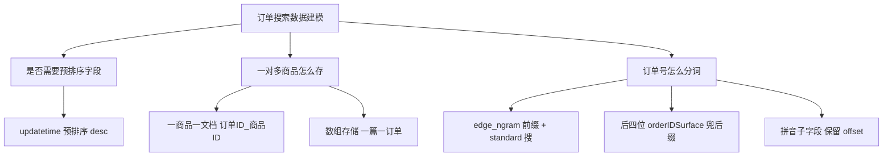

# Go 项目开发: 特定场景下的数据建模

订单搜索的数据模型，跟商品搜索完全不是一回事。核心难点只有三个：**要不要预排序字段？一个订单多个商品怎么存？订单号怎么支持前缀和后缀搜索？** 三个问题定下来，mapping 就是水到渠成的事。本文逐个拆，最后给出一份可以直接落地的 setting + mapping。

## 纲要

- 建模前必须回答的三个问题
- 问题一：预排序字段怎么设
- 问题二：一个订单多个商品，两种建模方式
- 问题三：订单号的前缀与后缀匹配
- 拼音搜索与拼音高亮的坑
- 订单索引的完整 setting 与 mapping

## 建模前必须回答的三个问题

基于前面订单搜索的功能分析，建模时只考虑下面三件事：

- 是否需要**预排序字段**？如果需要，哪些字段需要预排序？
- 一个订单中包含**多个商品**，这种一对多关系怎么处理？
- **订单号怎么分词**，才能高效支持前缀和后缀匹配？

三个问题逐个解决。

## 问题一：预排序字段

订单数据有明确的时间特征，业务上**按更新时间排序的请求占大多数**。

所以直接用**更新时间作为预排序字段**：

```json
{
  "sort.field": "updatetime",
  "sort.order": "desc"
}
```

预排序字段的作用是在**索引阶段就生成好排序用的 doc_values**，查询时不用再临时算排序，对深分页和高频排序场景收益很大。

## 问题二：一个订单多个商品，两种建模方式

前面讲过，处理父子关系的文档至少有三种方案：**join 类型的父子关系文档**、**nested 类型**、**把订单对应的每个商品单独作为一个文档存储**。

这里有一个业务事实要先抓住：**订单中多个商品，只要匹配上一个，我们就认为这个订单是匹配的** —— 也就是说**并不关心父子文档的对应关系**。既然不关心对应关系，父子文档和 nested 在海量数据下的性能问题就绕开了。

于是只剩两种务实方案。

### 方式一：一个商品一篇文档

把订单里的多个商品**拆成多个文档**存储。文档 ID 用**订单 ID + 下划线 + 商品 ID** 拼接，routing 用用户 ID。

```
document: 20240115000193_1   routing: 1001   商品ID=1
document: 20240115000193_2   routing: 1001   商品ID=2
document: 20240115000193_3   routing: 1001   商品ID=3
```

查询时用布尔查询：

- `must` 里用 `term` 过滤当前用户的 `userID`（即 routing 字段）；
- `should` 里用 `match_phrase` 查商品名称；
- 一定要设 **`minimum_should_match`**，规定 `should` 至少命中一个条件。

```json
// 等价的查询体,Go 侧通过结构体序列化后下发
{
  "query": {
    "bool": {
      "must":   [{"term": {"userID": "1001"}}],
      "should": [{"match_phrase": {"storeName": "商品"}}],
      "minimum_should_match": 1
    }
  },
  "highlight": {"fields": {"storeName": {}}}
}
```

**优点**：文档里的字段全部是**最简单的基本类型**，高亮处理也简单 —— 使用 ES 的过程中应尽量使用基本数据类型，**减少对象、数组等复杂类型**。

**缺点**：

- 更新订单状态时，需要更新**全部商品**对应文档的状态，所以上游业务通知里必须带上订单的**全部商品 ID**；
- 同一个订单里出现多个相同关键词的商品，或者用订单号搜索时，会检索到**同一个订单的多个商品**；
- 这种结果如果**在应用层按订单号去重，会导致部分商品的高亮丢失**；如果**让 ES 去重，又要消耗查询性能**；分页和展示上也有麻烦。

对于分页问题，搜索场景有个通用解法：**绝大部分用户只关心前三页结果**，可以一次性把前三页结果查回来做重排处理，一定程度上规避深分页。

### 方式二：数组方式存储

用数组存多个商品信息，一篇文档就是一个订单：**文档 ID 直接用订单 ID**，数组元素一一对应。

```go
package main

import "fmt"

// OrderDocArray 数组建模:一篇文档就是一个订单,商品用数组承载。
type OrderDocArray struct {
	OrderID   string   `json:"orderID"`
	UID       int64    `json:"uid"`
	GoodsID   []string `json:"goodsID"`   // 商品ID数组,与商品名一一对应
	GoodsName []string `json:"goodsName"` // 商品名称数组
	Status    string   `json:"status"`
	UpdateAt  string   `json:"updatetime"`
}

// Routing 数组建模下 routing 仍然是用户ID,查询侧不受影响。
func (d OrderDocArray) Routing() string { return fmt.Sprintf("u_%d", d.UID) }

// SplitDocs 把数组建模的订单拆成"一商品一文档"的模式。
// 两种建模可以随时互转,因为拆分规则只有"订单ID_商品ID"这一条约定。
func (d OrderDocArray) SplitDocs() []string {
	docs := make([]string, 0, len(d.GoodsID))
	for _, gid := range d.GoodsID {
		docs = append(docs, fmt.Sprintf("%s_%s", d.OrderID, gid))
	}
	return docs
}

func main() {
	order := OrderDocArray{
		OrderID:   "20240115000193",
		UID:       1001,
		GoodsID:   []string{"1", "2", "3"},
		GoodsName: []string{"商品一", "商品二", "商品三"},
		Status:    "WAIT_RECEIVE",
	}
	fmt.Println("routing =", order.Routing())
	fmt.Println("拆分后文档ID =", order.SplitDocs())
}
```

**优点**：一篇文档一个订单，**最大化节省存储空间**，因为不需要把公共字段（订单状态、物流类型、支付信息）重复存 N 份。

**更新友好**：订单状态是按**整个订单维度**更新的，部分商品退款也是按整个订单的退款状态处理，所以订单更新后**只需要更新这一篇文档**。

**怎么选？看业务形态**：

- 类似**淘宝**这种电商平台，**单商品下单的场景更多**，拆分存储并不会对存储造成太大负担 → 拆；
- **生鲜团购**这类场景，**大多数情况是多商品同时下单** → 用数组存更划算。

## 问题三：订单号的前缀与后缀匹配

订单号的分词通常在下单场景需求比较大，一般通过**订单号的前缀、完整的订单号、或者订单号后几位**来搜索。

- **用户端**（淘宝这类）大多只能通过**完整的订单号**过滤，基本是复制完整订单号来搜，需求不算大；
- 为了覆盖更多使用场景，这里支持按**前缀 + 完整订单号 + 后四位**来搜索。

**首先排除的方案**：使用 ES 的**前缀查询和正则查询**，性能上原因直接不考虑（前缀查询对 inverted index 不友好，正则更不用提）。

### 方案一：定制分词插件（性能最好，成本最高）

对分词器做定制化开发，让分词器**支持按前缀和后缀方式分词**。这对存储和整体性能都是最优选择，缺点是实现难度较大，需要人力投入开发分词插件。大型电商平台有足够开发资源，可以考虑。

### 方案二：edge_ngram 前缀分词 + 后四位单独字段（工程常用）

这里提供另一种更简单的实现：**把订单号的后缀截取出来，放到单独字段中索引查询**。弊端是多了个字段和查询条件，查询性能有一定损失，但实现成本几乎为零。

分词器设计：

- `edge_ngram` tokenizer：`min_gram=1`，`max_gram=18`（订单号 18 位），`token_chars=[letter, digit]`；
- 商品名称用 `ngram` tokenizer：`min_gram=max_gram=1`，实现**单字分词**。

关键技巧在**索引分词器与搜索分词器不一致**：

| 字段 | 索引分词器 | 搜索分词器 |
| --- | --- | --- |
| `orderID` | `edge_ngram`（前缀分词） | `standard` |
| `orderIDSurface`（后四位） | `edge_ngram` | `standard` |
| `goodsName` | `ngram`（单字） | `ngram` |

为什么要这样配？`standard` 分词器对**数字不做拆分，会当成一个整体 token**。而 `edge_ngram` 在索引阶段已经把完整订单号也切出了一个 token（到最后一位就停了），所以**用 standard 去搜完整订单号，正好命中那个整体 token**。

```go
package main

import (
	"encoding/json"
	"fmt"
)

// OrderQueryBuilder 订单搜索查询体构造器。
type OrderQueryBuilder struct {
	UID        int64    // routing 维度,用户端用UID
	Keyword    string   // 完整订单号 / 订单号前缀 / 商品名称
	UseSurface bool     // 关键词是否走后四位字段
}

// Build 构造订单搜索查询。
// orderID 走 edge_ngram(可匹配前缀),orderIDSurface 只存后四位,用于兜住后缀搜索。
func (b OrderQueryBuilder) Build() (string, error) {
	should := []map[string]any{
		{"match_phrase": map[string]any{"orderID": b.Keyword}},
	}
	if b.UseSurface {
		should = append(should, map[string]any{
			"match_phrase": map[string]any{"orderIDSurface": b.Keyword},
		})
	}

	body := map[string]any{
		"query": map[string]any{
			"bool": map[string]any{
				"must": []map[string]any{
					{"term": map[string]any{"uid": fmt.Sprintf("u_%d", b.UID)}},
				},
				"should":                 should,
				"minimum_should_match":   1,
			},
		},
		"highlight": map[string]any{
			"fields": map[string]any{
				"orderID":   map[string]any{},
				"goodsName": map[string]any{},
			},
		},
	}
	data, err := json.Marshal(body)
	if err != nil {
		return "", err
	}
	return string(data), nil
}

func main() {
	q, err := OrderQueryBuilder{UID: 1001, Keyword: "20240115000193", UseSurface: true}.Build()
	if err != nil {
		panic(err)
	}
	fmt.Println(q)
}
```

**为什么还要单独存后四位？** 单字分词有个副作用：搜索范围会被放大到噪音。比如订单号 18 位，用 `ngram` 单字分词后，**中间任意连续数字（比如 "104"）都能命中这个订单**，无关订单全冒出来。

所以工程上用**前缀配合后缀字段**来匹配，既保留完整订单号的精确命中，又给后四位搜索留出口，最符合真实用户的使用习惯。

## 拼音搜索与拼音高亮的坑

商品标题要支持**拼音搜索**：定义 `pinyin` tokenizer，商品名称 `storeName` 上加一个**拼音子字段**。

```json
{
  "storeName": {
    "type": "text",
    "fields": {
      "pinyin": { "type": "text", "analyzer": "pinyin_analyzer" }
    }
  }
}
```

用拼音字段查询时**能查到文档，但高亮出不来了** —— 这是个非常常见的问题。

原因：**拼音分词器默认会忽略 token 的 offset**，而高亮是**基于 offset 回原始文本**的，offset 丢了，高亮自然落空。解决办法是重建索引，在拼音配置上**把 offset 保留下来**（不同版本插件的参数名有差异，以所用插件文档为准，核心是让拼音 token 带 offset）。

```go
package main

import "fmt"

// PinyinHighlightNote 记录拼音高亮需要保留 offset。
type PinyinHighlightNote struct {
	Field     string // 开启 offset 的字段
	NeedsKeep bool   // 版本差异:有些插件叫 keep_offset,有些需要 keep_raw 配合
	Note      string
}

// 拼音 tokenizer 需要显式保留 offset,否则 highlight 无法定位到原始商品名。
func PinyinAnalyzerConfig() map[string]any {
	return map[string]any{
		"tokenizer": map[string]any{
			"pinyin": map[string]any{
				"type":                      "pinyin",
				"keep_separate_first_letter": false,
				"keep_full_pinyin":           true,
				"lowercase":                  true,
				"keep_offset":                true, // 必须:否则拼音高亮失效
			},
		},
	}
}

func main() {
	fmt.Println(PinyinAnalyzerConfig())
	_ = PinyinHighlightNote{Field: "goodsName.pinyin", NeedsKeep: true, Note: "拼音高亮依赖 offset"}
}
```

## 订单索引的完整 setting 与 mapping

三个问题都解决了，最后把 setting 和 mapping 一次性定稿。

```json
{
  "settings": {
    "index": {
      "refresh_interval": "1s",
      "number_of_shards": 1,
      "number_of_replicas": 0,
      "store": { "preload": ["nvd", "doc"] },
      "sort.field": ["updatetime"],
      "sort.order": ["desc"],
      "search.slowlog.threshold.query.warn": "500ms",
      "search.slowlog.threshold.fetch.warn": "1s",
      "indexing.slowlog.threshold.index.warn": "1s"
    },
    "analysis": {
      "tokenizer": {
        "edge_ngram": { "type": "edge_ngram", "min_gram": 1, "max_gram": 18,
                        "token_chars": ["letter", "digit"] },
        "ngram":     { "type": "ngram", "min_gram": 1, "max_gram": 1,
                       "token_chars": ["letter", "digit"] },
        "pinyin":    { "type": "pinyin", "keep_separate_first_letter": false,
                       "keep_full_pinyin": true, "keep_offset": true }
      },
      "analyzer": {
        "edge_ngram_analyzer": { "type": "custom", "tokenizer": "edge_ngram" },
        "ngram_analyzer":      { "type": "custom", "tokenizer": "ngram" },
        "pinyin_analyzer":     { "type": "custom", "tokenizer": "pinyin" }
      }
    }
  },
  "mappings": {
    "dynamic": "strict",
    "properties": {
      "orderID":         { "type": "text", "index_analyzer": "edge_ngram_analyzer",
                           "search_analyzer": "standard" },
      "orderIDSurface":  { "type": "text", "index_analyzer": "edge_ngram_analyzer",
                           "search_analyzer": "standard" },
      "uid":             { "type": "keyword", "doc_values": false },
      "goodsName":       { "type": "text", "index_analyzer": "ngram_analyzer",
                           "search_analyzer": "ngram_analyzer",
                           "fields": { "pinyin": { "type": "text",
                                                   "analyzer": "pinyin_analyzer" } } },
      "goodsID":         { "type": "keyword", "doc_values": false },
      "status":          { "type": "keyword", "doc_values": false },
      "refundStatus":    { "type": "keyword", "doc_values": false },
      "logisticsType":   { "type": "keyword", "doc_values": false },
      "payType":         { "type": "keyword", "doc_values": false },
      "payName":         { "type": "keyword", "doc_values": false },
      "payTime":         { "type": "date" },
      "createTime":      { "type": "date" },
      "updatetime":      { "type": "date" }
    }
  }
}
```

几处配置背后的取舍：

| 配置 | 取值 | 理由 |
| --- | --- | --- |
| `dynamic` | `strict` | 写入带进来的未知字段直接报错，避免脏字段污染索引 |
| `uid` / `goodsID` / `status` 等 | `keyword` + `doc_values: false` | 这些字段**不分词、不排序**，只用于 `term` 过滤，关掉 doc_values 省一半磁盘 |
| 时间字段 | `date`，保留 doc_values | 时间字段**都要参与排序**，doc_values 必须留 |
| `store.preload` | `nvd`, `doc` | 把 norms 和 doc_values 预加载到内存，加快查询 |
| slowlog | 500ms / 1s / 1s | 慢查询、慢取、慢写入的分级阈值，快速定位拖慢集群的查询 |

> `dynamic: strict` 是最容易被忽略的一项。生产上一旦开了 `dynamic: true`，上游加个字段写进来私自扩字段，字段类型和分词器都可能有坑，排查成本极高。

## 建模决策流程

三个建模问题对应的决策路径如下：



## 索引结构与模块划分

```dir
suporder 索引结构/
├── settings/
│   ├── edge_ngram              订单号前缀分词
│   ├── ngram                   商品名单字分词
│   └── pinyin                  拼音（保留 offset）
├── mappings/
│   ├── orderID                 text + edge_ngram
│   ├── orderIDSurface          后四位 兜后缀
│   ├── goodsName              数组 + pinyin 子字段
│   ├── uid/status              keyword + doc_values:false
│   └── updatetime             date 预排序字段
└── dynamic: strict            未知字段直接报错
```

## API 速览

| 能力 | 关键做法 |
| --- | --- |
| 预排序 | `sort.field=updatetime` + `sort.order=desc` |
| 一对多建模 | 拆分文档（订单ID_商品ID）或数组（一篇一订单），按业务形态选 |
| 订单号前缀 | `edge_ngram` 索引 + `standard` 搜索，max_gram 取订单号长度 |
| 订单号后缀 | 单独存后四位到 `orderIDSurface` 字段 |
| 商品名分词 | `ngram` min/max 都设 1，单字分词 |
| 拼音 | `pinyin` tokenizer + 子字段，**必须保留 offset 才高亮** |
| 字段类型 | 只过滤不排序的字段统一 `keyword` + `doc_values: false` |

## 总结

订单建模这条链路上，真正决定成败的三件事：

- **预排序字段**用更新时间，查询侧几乎零成本拿到稳定的排序；
- **一对多关系**不要用 join / nested，要么拆文档、要么用数组，选择依据是"单商品下单多还是多商品同时下单多"；
- **订单号**用 `edge_ngram` + `standard` 的索引/搜索分词器组合，再加一个后四位字段兜后缀，避开前缀查询和正则查询的性能陷阱。

最后一个反复踩到的坑：**拼音分词器默认丢 offset，导致能搜不能高亮**。这类问题在验收时很容易漏 —— 因为"搜得到"这一步是过的，只有前端展示才会暴露。

