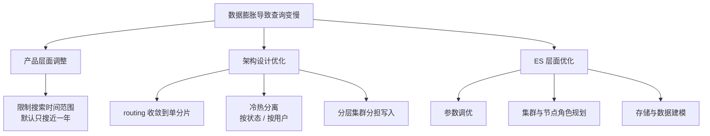
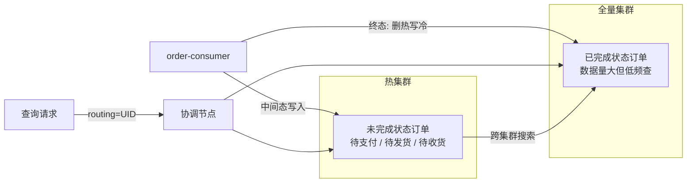

# Go 项目开发: 千亿级订单搜索业务难点分析

数据量涨到千亿级之后，查询性能为什么断崖式下跌？答案不在 Go 代码里，而在**倒排索引的内存模型**里。本文从内存与磁盘的比例关系出发，给出订单搜索的三条解决路线，重点讲透**按状态分冷热**和**按用户分冷热**两套架构，以及活跃用户如何动态圈定。

## 纲要

- 数据膨胀为什么会拖垮查询
- 三个解决方向：产品、架构、ES
- 方向一：用 UID 做 routing，把查询压到一个分片
- 方向二：按订单状态做冷热分离
- 方向三：按用户活跃度做冷热分离
- 活跃用户怎么圈：定期统计与租期制

## 数据膨胀为什么会拖垮查询

对 ES 集群而言，**为什么数据量达到一定瓶颈后会出现明显的查询性能问题**？

因为倒排索引里有相当一部分数据结构是**常驻内存**的 —— 每新增一个文档，都可能带来内存消耗。这也是前面建议**内存与磁盘比例控制在 1:32 左右**的原因：1GB 堆内存对应 32GB 数据，堆内存配 32G，磁盘在 1T 左右就是比较合适的值。

> 这只是建议值。实际生产中基于成本考虑，比例往往会远超这个数，**只要不出问题，规划就是合理的**。

但比例一旦超过某个阈值，就会带来显著的性能问题。这个阈值因场景差别很大：**读写量级、硬件配置、数据格式、分词方式**都会影响它。

## 三个解决方向

解决数据膨胀带来的性能问题，一般有三个方向：



**产品层面**的调整最容易被忽视，但往往最有效。订单搜索规定**只能搜索近一年的订单**，整个架构设计就在很大程度上规避了数据膨胀。超过一年的订单从索引中淘汰，集群里的数据量立刻降一个量级。

**架构层面**做两件事：一是用用户 ID 做 routing，查询只打到一个分片；二是冷热分离。

**ES 层面**包括参数调优、集群规划、节点角色与存储规划、数据建模。这是本篇后面的重点。

## 方向一：UID 做 routing，查询只到一个分片

订单搜索的第一个设计：

- 使用**用户 ID 作为 routing**
- 查询时只有当前用户 UID 这一个路由，**不会命中多余分片**

这一点非常关键。routing 一收敛，**每次查询的分片数就从上千降到 1**，查询性能的天花板直接抬上去。代价是：routing 必须在建索引那一刻定好。

## 方向二：按订单状态做冷热分离

根据前面订单数据的分析，**用户大部分查询集中在未完成状态的订单** —— 不管整体订单数据如何膨胀，这部分数据的总量总会维持在一定量级。

于是可以这样切：



因为状态最终一定会收敛到完成态（未支付超时自动取消、已支付超时自动确认、退款流程走完也是完成），所以：

- **热集群**（写集群）只存中间状态的订单；
- **全量集群**只存已完成状态的订单；
- 两者之间用**跨集群搜索**串起来，**应用层不需要考虑多路召回的排序和分页问题**。

### 迁移怎么做

实现其实很简单。在消费订单数据时判断：

- 订单是**完成状态** → 直接**删除它在写集群里的文档**，同时**写入全量集群**；
- 这样保证写集群里全是中间态订单，全量集群里全是完成态订单。

```go
package main

import "fmt"

// OrderStatus 订单状态。
type OrderStatus string

const (
	StatusWaitPay     OrderStatus = "WAIT_PAY"      // 待支付
	StatusWaitShip    OrderStatus = "WAIT_SHIP"     // 待发货
	StatusWaitReceive OrderStatus = "WAIT_RECEIVE"  // 待收货
	StatusDone        OrderStatus = "DONE"          // 完成（终态）
	StatusCancel      OrderStatus = "CANCEL"        // 取消（终态）
)

// IsMutable 判断订单是否处于中间状态，也就是热集群需要保留的数据。
func IsMutable(s OrderStatus) bool {
	switch s {
	case StatusWaitPay, StatusWaitShip, StatusWaitReceive:
		return true
	default:
		return false
	}
}

// ShouldMigrate 订单进入终态时需要跨集群迁移：删热写冷。
func ShouldMigrate(s OrderStatus) bool {
	return !IsMutable(s)
}

func main() {
	for _, s := range []OrderStatus{StatusWaitPay, StatusWaitReceive, StatusDone, StatusCancel} {
		fmt.Printf("%-14s 中间态=%-6v 需跨集群迁移=%v\n", s, IsMutable(s), ShouldMigrate(s))
	}
}
```

## 方向三：按用户活跃度做冷热分离

除了按状态分，还可以**按用户维度划分冷热集群**。

互联网二八原则：**百分之八十的搜索请求来自百分之二十的活跃用户**。把这部分用户单独放进热集群，不仅减轻全量集群的读取压力，而且这部分用户数据量相对少，集群可以分配更充足的服务器资源。

架构上：

- **热集群**：存储这 20% 高频使用订单搜索功能的用户数据；
- **冷集群**：存储剩下 80% 低频用户的订单数据。

注意，**冷热用户并不是固定的**，需要动态分析用户搜索行为来圈定活跃用户，同时也要圈出哪些活跃用户长期没有搜索行为，把它们从热集群迁回冷集群。

### 活跃用户怎么圈：两种方案

**方案一：定期分析搜索日志。**

统计用户一段时间内的搜索频率，比如**最近一个月搜索次数在三次以上**就认为是热用户，把这部分用户的订单放到热集群。

**方案二：租期制。**

在 MongoDB 这类数据库里记录**用户首次搜索时间、搜索次数、以及淘汰到冷集群的最终过期时间**。

关键细节：**不需要每次搜索都实时更新这些字段**，否则会给数据库带来较大读写压力。可以在**夜间闲时**分析当天搜索日志统一更新一次。

```go
package main

import (
	"fmt"
	"time"
)

// ActiveUserLease 活跃用户租期记录，存储在 MongoDB 中。
type ActiveUserLease struct {
	UID         int64     // 用户 ID
	FirstSearch time.Time // 首次搜索时间
	Count       int       // 近一个月搜索次数
	ExpiredAt   time.Time // 淘汰到冷集群的过期时间
}

// HotThreshold 圈定热用户的搜索次数阈值。
const HotThreshold = 3

// RenewLease 夜间闲时调用：用户再次活跃，租期顺延 30 天。
func RenewLease(l *ActiveUserLease, now time.Time) {
	if l.ExpiredAt.After(now) {
		l.FirstSearch = now
		l.Count++
		l.ExpiredAt = now.AddDate(0, 0, 30)
	}
}

// ShouldPromote 活跃度达标，从冷集群升级到热集群。
func ShouldPromote(l ActiveUserLease) bool {
	return l.Count >= HotThreshold
}

// ShouldDemote 租期已过且活跃度不足，从热集群降级到冷集群。
func ShouldDemote(l ActiveUserLease, now time.Time) bool {
	return l.ExpiredAt.Before(now) && l.Count < HotThreshold
}

func main() {
	now := time.Now()
	l := ActiveUserLease{UID: 10086, FirstSearch: now.AddDate(0, 0, -40), Count: 1,
		ExpiredAt: now.AddDate(0, 0, -10)}
	fmt.Println("到期未续约，应降级：", ShouldDemote(l, now))

	RenewLease(&l, now)
	fmt.Println("续约后过期时间：", l.ExpiredAt.Format("2006-01-02"),
		"可升级：", ShouldPromote(l))
}
```

### 迁移与重置

从热集群淘汰到冷集群的过程：

1. **不要直接从 ES 里查询这部分数据**，而是**调用上游接口，按 userID 获取该用户全部的订单数据**；
2. 先**从热集群删除**该用户的全部订单；
3. 再**写入冷集群**。

同理还要反向查：一个月内搜索次数达标、但仍在冷集群的用户，**从冷集群迁移到热集群**。

迁移之后记得**重置租期**：

- 被迁到冷集群的用户：重置首次搜索时间和搜索次数，**租期重新计算**；
- 被升级到热集群的用户：租期从**当前时间**开始算。

**为什么要用动态淘汰而不是一个月分析一次？** 因为一个月才分析一次的话，需要淘汰或迁移的用户可能堆在一起，有可能几个晚上都迁移不完。租期制把迁移量摊平到每天，避免出现"集中迁移"的灾难夜。

```go
package main

import (
	"context"
	"fmt"
	"time"
)

// OrderDocument 写入 ES 的订单文档。
type OrderDocument struct {
	OrderNo   string    `json:"order_no"`
	UID       int64     `json:"uid"`
	Status    string    `json:"status"`
	GoodsName string    `json:"goods_name"`
	CreateAt  time.Time `json:"create_time"`
}

// OrderStore 订单读取抽象：迁移时统一从这里按 UID 拉取全量订单。
type OrderStore interface {
	OrdersByUID(ctx context.Context, uid int64) ([]*OrderDocument, error)
}

// hotClient 热集群客户端，只暴露按 routing 清理文档的能力。
type hotClient interface {
	DeleteByRouting(ctx context.Context, routing string) (int, error)
}

// coldClient 全量集群客户端。
type coldClient interface {
	BulkIndex(ctx context.Context, docs ...*OrderDocument) error
}

// MigrateUserOrders 把某个用户的订单整体迁出热集群。
// 执行顺序刻意设计成 先读 → 再写 → 最后删，中途失败不会丢数据。
func MigrateUserOrders(ctx context.Context, store OrderStore,
	hot hotClient, cold coldClient, uid int64) (int, error) {

	routing := fmt.Sprintf("u_%d", uid)

	orders, err := store.OrdersByUID(ctx, uid)
	if err != nil {
		return 0, fmt.Errorf("查询用户订单失败: %w", err)
	}
	docs := make([]*OrderDocument, 0, len(orders))
	for _, o := range orders {
		docs = append(docs, &OrderDocument{
			OrderNo:   o.OrderNo,
			UID:       o.UID,
			Status:    o.Status,
			GoodsName: o.GoodsName,
			CreateAt:  o.CreateAt,
		})
	}
	if len(docs) > 0 {
		if err := cold.BulkIndex(ctx, docs...); err != nil {
			return 0, fmt.Errorf("写入全量集群失败: %w", err)
		}
	}
	if _, err := hot.DeleteByRouting(ctx, routing); err != nil {
		return len(docs), fmt.Errorf("清理热集群失败: %w", err)
	}
	return len(docs), nil
}

// ---------- 下面是一组演示用的内存实现，接入真实存储时替换即可 ----------

type memStore struct{ data map[int64][]*OrderDocument }

func (m memStore) OrdersByUID(ctx context.Context, uid int64) ([]*OrderDocument, error) {
	out := make([]*OrderDocument, 0, len(m.data[uid]))
	for _, d := range m.data[uid] {
		out = append(out, d)
	}
	return out, nil
}

type memCold struct{ indexed int }

func (c *memCold) BulkIndex(ctx context.Context, docs ...*OrderDocument) error {
	c.indexed += len(docs)
	return nil
}

type memHot struct{ deleted int }

func (h *memHot) DeleteByRouting(ctx context.Context, routing string) (int, error) {
	h.deleted++
	return h.deleted, nil
}

func main() {
	store := memStore{data: map[int64][]*OrderDocument{
		10086: {{OrderNo: "O20261002001", UID: 10086, Status: "DONE", GoodsName: "机械键盘"}},
	}}
	hot, cold := &memHot{}, &memCold{}
	n, err := MigrateUserOrders(context.Background(), store, hot, cold, 10086)
	fmt.Printf("迁移 %d 条，热集群清理 %d 次，全量集群写入 %d 条，err=%v\n",
		n, hot.deleted, cold.indexed, err)
}
```

> 这套"先写后删"的顺序是硬要求：先删后写，一旦写失败，用户订单在两边都找不到。

## 冷热分离的集群拓扑

千亿级订单搜索按 routing、按状态、按用户三个维度做分层，拓扑如下：

```dir
order-search-clusters/           千亿级订单搜索集群
├── routing=UID                 查询收敛到单分片
├── by-status/                  按订单状态分冷热
│   ├── hot-cluster             中间态订单
│   └── full-cluster            已完成订单（跨集群搜索）
└── by-user/                    按用户活跃度分冷热
    ├── hot-users               20% 活跃用户
    └── cold-users              80% 低频用户（租期制）
```

## API 速览

| 手段 | 关键做法 |
| --- | --- |
| 内存磁盘比 | 经验值 1:32，比例超阈值即出现明显性能衰减 |
| routing | 写入与查询同用 `routing=UID`，命中单分片 |
| 状态冷热 | 中间态写集群，终态全量集群，跨集群搜索 |
| 用户冷热 | 20% 活跃用户存热集群，其余存冷集群 |
| 活跃度判定 | 定期统计搜索日志，或租期制（首搜时间 + 次数 + 过期时间） |
| 迁移顺序 | 先读全量 → 再写目标集群 → 最后删源集群 |

## 总结

解决千亿级订单搜索的性能问题，真正的抓手是**"分层"**：

- **产品层**把搜索范围收窄到一年，直接砍掉一大截数据量；
- **架构层**用 routing 收敛分片、用按状态/按用户的冷热分离把热数据抠出来单独供电；
- **ES 层**再去做参数、节点、建模的精细调优。

其中成本最低、见效最快的是 routing 和按状态分冷热，因为它们完全建立在前面已经确定的数据模型之上。**一旦按状态迁移实现之后，写入侧压力就会成为下一个瓶颈** —— 这正是下一节要引入第三层集群的原因。

