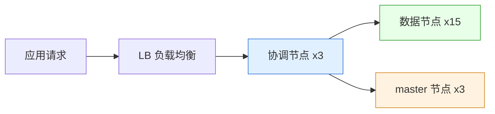

# Go 项目开发: 千亿级订单数据下如何规划集群存储

规划一个千亿级订单的 ES 集群，到底要多少台机器、多少个分片、JVM 该怎么配？本文按**存储预估 → 节点规划 → JVM 关键设置**三步走，把每一步的算式和配置都摆出来，顺便讲清一个高频混淆点：**协调节点和 ingest 节点到底不是一回事**。

## 纲要

- 存储预估：从平均文档大小算到总容量
- 分片数怎么定
- 节点规划：数据节点、主节点、协调节点
- 协调节点 vs ingest 节点
- 什么情况下才需要独立协调节点
- JVM 与系统层的关键设置

## 存储预估

前面讲过集群存储预估的方式：**向集群写入一定量的数据，用索引占用的总存储空间除以文档数量，得到平均每个文档占用的空间**。

这里要注意一个很容易被忽略的事实：**如果存储的是需要分词的文本，会有一定的膨胀率** —— 特别是大文本，分词后占用空间一般比原始文本稍大，具体程度跟分词力度和索引的压缩设置有关。

千亿级订单按平均 1KB/文档估算：

```go
package main

import (
	"fmt"
	"math"
)

// EstimateInput 容量预估输入。
type EstimateInput struct {
	DocTotal      int64   // 预估文档总数
	AvgDocSizeKB  float64 // 抽样得到的平均单文档大小(KB)
	DiskUsedRatio float64 // 需要预留的磁盘空余比例,官方建议不低于 0.3
	Replica       int     // 副本份数,0 表示无副本
	TargetShardGB float64 // 单主分片目标大小(GB)
}

// CapacityPlan 容量预估结果。
type CapacityPlan struct {
	RawGB        float64 // 文档原始占用
	ReservedGB   float64 // 预留空余后需要准备的容量
	TotalGB      float64 // 再叠加副本后的总容量
	PrimaryShard int     // 建议主分片数
}

// Estimate 千亿级订单的存储规划。
// 分片数始终按"主数据"计算,副本不额外增加分片,只增加磁盘占用。
func Estimate(in EstimateInput) CapacityPlan {
	const KBPerGB = 1024.0

	rawGB := float64(in.DocTotal) * in.AvgDocSizeKB / KBPerGB
	reservedGB := rawGB * (1 + in.DiskUsedRatio)
	totalGB := reservedGB * float64(1+in.Replica)

	primaryShard := int(math.Ceil(rawGB / in.TargetShardGB))
	return CapacityPlan{
		RawGB:        rawGB,
		ReservedGB:   reservedGB,
		TotalGB:      totalGB,
		PrimaryShard: primaryShard,
	}
}

func main() {
	e := Estimate(EstimateInput{
		DocTotal:      100_000_000_000, // 1000 亿条
		AvgDocSizeKB:  1,
		DiskUsedRatio: 0.3,
		Replica:       1,
		TargetShardGB: 30,
	})
	fmt.Printf("文档原始占用: %.0f GB (%.0f TB)\n", e.RawGB, e.RawGB/1024)
	fmt.Printf("预留 30%% 后需准备: %.0f GB (%.0f TB)\n", e.ReservedGB, e.ReservedGB/1024)
	fmt.Printf("再加 1 份副本共需磁盘: %.0f GB (%.0f TB)\n", e.TotalGB, e.TotalGB/1024)
	fmt.Printf("建议主分片数: %d\n", e.PrimaryShard)
}
```

代入数字：

- 千亿 × 1KB ≈ **100TB** 文档占用；
- 预留不低于 **30%** 磁盘 → 需要准备 **150TB**；
- 设置 **1 份副本** → 总共需要 **300TB** 磁盘；
- 单分片按 30GB 控制：100TB ≈ 10 万 GB，10 万 ÷ 30 ≈ **三千个主分片**。

> 三十分片这个数别直接抄。真正落地时要让主分片数**能被后续的节点数整除**，否则扩节点时分片会分配不均。

## 节点规划

| 角色 | 推荐配置 | 台数 |
| --- | --- | --- |
| 数据节点 | 32 核 / 128G 内存 / 10T SSD | 15（加 1 副本约 30 台） |
| master 节点 | 16 核 / 32G | 至少 3 台 |
| 协调节点 | 16 核 / 64G 以上 | 按需 |

三点说明：

- **数据节点和协调节点尽量不要混合部署**。数据节点本身占用内存大，一旦有大的聚合查询打到它，很容易影响 master 或数据节点的稳定性，所以节点规划时要尽可能把不同角色拆开。
- **超过十个节点的集群，就有必要设置独立的 master 节点**。
- 但不是所有业务都需要独立协调节点 —— 判据在下面。

## 协调节点 vs ingest 节点

这是很多同学容易混淆的地方：

- **ingest 节点**（预处理节点）主要负责 **ingest pipeline 任务**，一般业务根本没用到 pipeline。
- **协调节点**是 ES 中一种**概念上的节点角色**。其他节点角色都能在配置文件里通过固定角色指定，但**协调节点严格来说只是一种概念** —— ES 中任意一个节点都可以充当协调节点，请求发到哪个节点，那个节点就临时充当协调节点去转发。

所以**设置独立协调节点的含义是**：不给这个节点任何其他角色，只让它用来收发 ES 请求。

```dir
# elasticsearch.yml —— 6.x / 7.x 设置独立协调节点
# 6.x: 节点上显式关闭所有角色
node.master: false
node.data: false
node.ingest: false
node.ml: false
node.remote_cluster_client: false
node.transform: false

# 7.x 起推荐显式写成一个空角色列表
node.roles: []
```

设置好独立协调节点后，**ES 的连接地址要改成这几个协调节点的地址**。这里有一个必须注意的坑：

> 使用 Go 客户端连接时，**要关闭 sniff**！开启 sniff 之后 SDK 会嗅探集群中的其他节点，把数据节点也加进连接池 —— 结果全集群节点都在收发请求，独立协调节点就白设了。Java / 其他语言的 SDK 同样要注意这一点。

```go
package main

import (
	"fmt"
	"time"
)

// ESNode 一个独立协调节点的 HTTP 地址。
type ESNode struct {
	Addr string // 应用侧只连协调节点,不连数据节点
}

// ESClientOptions 订单搜索服务连接 ES 的参数。
type ESClientOptions struct {
	Nodes          []ESNode
	Sniff          bool          // 必须为 false
	Healthcheck    bool
	DialTimeout    time.Duration
	ReadTimeout    time.Duration
	MaxIdlePerNode int
}

// NewOrderSearchClient 构造连接独立协调节点的客户端配置。
func NewOrderSearchClient() ESClientOptions {
	return ESClientOptions{
		Nodes: []ESNode{
			{Addr: "http://es-coord-01.internal:9200"},
			{Addr: "http://es-coord-02.internal:9200"},
			{Addr: "http://es-coord-03.internal:9200"},
		},
		Sniff: false, // 一旦开启,数据节点会被自动拉进连接池,协调节点隔离失效
		//        ↑ 这一行是本节最关键的坑
		Healthcheck:    true,
		DialTimeout:    2 * time.Second,
		ReadTimeout:    10 * time.Second,
		MaxIdlePerNode: 8,
	}
}

func main() {
	opt := NewOrderSearchClient()
	for _, n := range opt.Nodes {
		fmt.Println("连接地址:", n.Addr)
	}
	fmt.Println("sniff 是否关闭:", !opt.Sniff, " 单节点空闲连接:", opt.MaxIdlePerNode)
}
```

## 什么时候才需要独立协调节点

两条判据，满足任一就该上：

1. **有深度分页或者聚合查询**。深度分页和聚合会占用大量内存，一旦这些请求打到主节点或数据节点，就可能影响集群稳定性。
2. **查询和写入请求量比较大**，且发现应用连接的那几个 ES 节点负载**明显高于其他节点**。

最终的节点拓扑就是这样一层一层收口：



## 部署与 JVM 的关键设置

**部署层面**：

- 单个集群里的**各节点不要跨机房部署**，尽最大可能放在同一个机房，避免节点间跨机房网络通信。
- 有多块网卡时，把 **transport 端口和 HTTP 端口绑定到不同网卡**：transport 用于节点间通信，HTTP 用于应用与 ES 之间的通信，这样能起到网络隔离的效果。

**JVM 层面**，按下面规则设：

```dir
# jvm.options
# 1) Xms 与 Xmx 必须设置成一样,避免运行时扩容导致 STOP-The-World 卡顿
# 2) Xmx 不超过物理内存的一半,且一般不超过 32G
-Xms32g
-Xmx32g

# 3) 关闭 swap,配合 elasticsearch.yml 的 bootstrap.memory_lock: true
```

| 设置 | 怎么做 | 为什么 |
| --- | --- | --- |
| 堆大小 | `Xms` = `Xmx` = 32g | 两者不一致会在运行时触发扩容，产生 stop-the-world 卡顿 |
| 堆上限 | 不超过物理内存 50%，不超过 32G | 开启**压缩指针**后 32G 以内性能最好，再大收益递减 |
| 堆外内存 | 预留至少一半物理内存给操作系统 | ES 的写入**强依赖操作系统文件缓存**；7.x 之后部分堆占用被移到堆外，需要更多 OS 内存 |
| 编译器模式 | 用 **server 模式** | client 模式启动快但运行性能与内存管理效率低；server 模式启动慢一些，但会做更多编译优化（指令重排等） |
| 垃圾回收器 | 用 **G1** | G1 能按设定的预期停顿时间，优先选择**回收时间最少、回收对象最多**的区域，把 GC 停顿控制在可控范围 |
| 关闭 swap | `bootstrap.memory_lock: true` | 一旦内存被 swap 到磁盘，查询延迟会断崖式下跌 |

## 集群拓扑与部署结构

千亿级订单集群按角色拆分节点，部署结构如下：

```dir
es-prod-cluster/                 千亿级订单集群拓扑
├── coord-nodes x3               独立协调节点（关闭 sniff）
├── master-nodes x3              独立主节点
├── data-nodes x15              32C/128G/10T SSD
└── deployment/
    ├── same-room               同机房部署
    ├── dual-nic               transport / http 分网卡
    └── jvm: Xms=Xmx=32g       G1 + memory_lock
```

## API 速览

| 项 | 关键做法 |
| --- | --- |
| 容量预估 | 抽样写数据 → 索引总空间 ÷ 文档数 = 平均单文档大小 |
| 膨胀率 | 需分词的大文本膨胀更明显，与分词力度、压缩设置相关 |
| 分片数 | 单主分片 30GB（SSD），主分片数能被节点数整除 |
| 节点角色 | 数据节点与协调节点拆开，超过 10 节点设独立 master |
| 独立协调节点 | `node.roles: []` + 客户端**关闭 sniff**，连接地址只填协调节点 |
| JVM | `Xms=Xmx=32g`、server 模式、G1、`bootstrap.memory_lock: true` |

## 总结

千亿级集群的规划可以收敛成一条链：**抽样算出单文档大小 → 得到总容量 → 按单分片 30GB 反推分片数 → 按分片数和数据量倒推节点台数 → 最后把 JVM 参数对齐内存模型**。

三个最常见的翻车点：**开 sniff 把独立协调节点废掉**、**Xms 与 Xmx 不一致**、**JVM 堆吃掉超过一半物理内存把操作系统文件缓存挤掉**。这三条在压测阶段就会暴露，越早踩越好修；等到线上出问题，迁移一个三千分片的索引就是几天的事。

