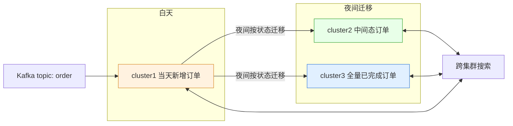

# Go 项目开发: 如何避免大量写入导致集群高负载而影响查询效率

冷热分离之后，读写压力全压在数据规模可控的热集群上，看起来已经很优雅了。但**每天完成态订单一多，写集群过载、全量集群也被写入拖垮**。这时候加机器没用，得加层。本文用"一层不行就再来一层"的思路，把订单集群拆成三层，并给出夜间迁移的两种实现方案。

## 纲要

- 冷热分离之后，为什么写入反而成了新瓶颈
- 架构经验：一层不行就再来一层
- 三层集群：当天集群 / 热集群 / 全量集群
- 方案一：Kafka 多消费组 + Redis Bitmap 做夜间迁移
- 方案二：MongoDB 按日期分表承接白天新增订单
- 迁移的边界条件与收尾

## 冷热分离之后的新问题

前面实现的迁移逻辑是：消费订单数据时判断，订单是完成状态就**删写集群里的文档 + 写全量集群**。

问题在于，**如果每天订单量很大、完成态订单也很多**：

- 热数据集群（写集群）可能面临**过载**；
- 全量集群因为每秒大量完成态订单写入，依然带来**较大的压力**。

查询性能还没优化回来，写入先把集群拖垮了。

## 架构经验：一层不行就再来一层

这里要介绍一条架构设计里很重要的经验：**一层不行，就再来一层**。

分层思想能帮我们解决很多问题：

- 应用层和 DB 层之间**引入一层缓存层**，很大程度上解决 DB 层的查询性能问题；
- Go 语言的调度模型最初是 **GM 模型**，为了解决性能问题引入了 **P 层**，才发展成今天的 **GMP 模型**。

针对上面的架构，再引入一层 —— **一个专门存储当天新增订单的集群**。

## 三层集群的架构



具体切法：

- 一般下单量和订单状态变更量**基本相当**，活动期间下单量更多；
- 为了分担原热集群的写入压力，新引入一个集群专门存**当天新增的订单**（cluster1）；
- 原来存热状态订单的集群变成 **cluster2，只存中间状态订单**；
- cluster3 是**全量集群**，存已完成状态的订单；
- **夜间业务低峰期**，把 cluster1 的数据迁到 cluster2 和 cluster3 里；由于当天订单可能是中间态也可能是完成态，迁移时要**按订单状态分别迁移**。

查询侧反而更简单了：**cluster1 + cluster2 + cluster3 三个集群一起做跨集群搜索**。因为 routing 用的是用户 ID，打到每个集群里的路由只有一个，所以**每次查询命中分片数最多是三**，而且是在三个独立集群里执行，查询性能依然可控。

## 方案一：Kafka 多消费组 + Redis Bitmap

怎么实现"按订单状态迁移到对应集群"？用 **Kafka 多消费组**的特性 —— 同一个 topic 可以起不同的 consumer group 来消费。

```go
package main

import (
	"context"
	"fmt"
)

// OrderEvent 从 Kafka 消费到的订单变更事件。
type OrderEvent struct {
	OrderNo string // 订单号
	UID     int64  // 路由维度
	Status  string // WAIT_RECEIVE / DONE / CANCEL
	IsNew   bool   // 是否当天新增
}

// IsFinal 订单是否处于终态:终态进全量集群,中间态进热集群。
func IsFinal(status string) bool { return status == "DONE" || status == "CANCEL" }

// clusterWriter 三个集群共同的写入抽象。
type clusterWriter interface {
	Name() string
	Index(ctx context.Context, e OrderEvent) error
}

// esCluster 一个 ES 集群的本地模拟,接入真实客户端时替换 Index 实现。
type esCluster struct {
	name string
	docs int
}

func (c *esCluster) Name() string { return c.name }

func (c *esCluster) Index(ctx context.Context, e OrderEvent) error {
	c.docs++
	return nil
}

// bitmapChecker 判断订单是否属于当天写入 cluster1 的那批数据。
type bitmapChecker interface {
	Contains(ctx context.Context, orderNo string) bool
}

// memoryBitmap 演示用的内存实现,生产环境换成 Redis Bitmap。
type memoryBitmap struct{ data map[string]struct{} }

func (m memoryBitmap) Contains(ctx context.Context, orderNo string) bool {
	_, ok := m.data[orderNo]
	return ok
}

// Dispatcher 决定订单事件应该落到哪个集群。
type Dispatcher struct {
	day    clusterWriter // cluster1 当天新增
	hot    clusterWriter // cluster2 中间态
	full   clusterWriter // cluster3 全量
	bitmap bitmapChecker
}

// OnCreate 白天下单:当天新增订单先进 cluster1。
func (d *Dispatcher) OnCreate(ctx context.Context, e OrderEvent) error {
	return d.day.Index(ctx, e)
}

// OnChange 订单状态变更:终态直接进全量集群,中间态进热集群。
func (d *Dispatcher) OnChange(ctx context.Context, e OrderEvent) error {
	if IsFinal(e.Status) {
		return d.full.Index(ctx, e)
	}
	return d.hot.Index(ctx, e)
}

// NightMigrate 夜间迁移:只搬 cluster1 里那批当天新进来的数据。
// 只认 Bitmap 里的订单号,不是当天的直接跳过。
func (d *Dispatcher) NightMigrate(ctx context.Context, events []OrderEvent) (int, error) {
	var moved int
	for _, e := range events {
		if !d.bitmap.Contains(ctx, e.OrderNo) {
			continue
		}
		if IsFinal(e.Status) {
			if err := d.full.Index(ctx, e); err != nil {
				return moved, err
			}
		} else {
			if err := d.hot.Index(ctx, e); err != nil {
				return moved, err
			}
		}
		moved++
	}
	return moved, nil
}

// Consumer 一个消费组,对应 Kafka 里独立的 consumergroup。
type Consumer struct {
	group  string
	topic  string
	handle func(ctx context.Context, batch []OrderEvent) error
}

func (c Consumer) Group() string { return c.group }
func (c Consumer) Topic() string { return c.topic }

// Run 消费循环,这里用固定批次模拟一次 poll。
func (c Consumer) Run(ctx context.Context, batch []OrderEvent) error { return c.handle(ctx, batch) }

// buildConsumers 同一个 topic 起两个消费组:白天写业务,夜间做迁移。
// 两个消费组 group 必须不同,否则会构成同组内的分区竞争。
func buildConsumers(d *Dispatcher) []Consumer {
	return []Consumer{
		{
			group: "orderConsumer",
			topic: "order",
			handle: func(ctx context.Context, batch []OrderEvent) error {
				for _, e := range batch {
					if e.IsNew {
						if err := d.OnCreate(ctx, e); err != nil {
							return err
						}
						continue
					}
					if err := d.OnChange(ctx, e); err != nil {
						return err
					}
				}
				return nil
			},
		},
		{
			group: "orderConsumer1",
			topic: "order",
			handle: func(ctx context.Context, batch []OrderEvent) error {
				_, err := d.NightMigrate(ctx, batch)
				return err
			},
		},
	}
}

func main() {
	ctx := context.Background()
	c1, c2, c3 := &esCluster{name: "cluster1"}, &esCluster{name: "cluster2"}, &esCluster{name: "cluster3"}
	d := &Dispatcher{day: c1, hot: c2, full: c3,
		bitmap: memoryBitmap{data: map[string]struct{}{"O1": {}}}}

	// 白天:新增订单进 cluster1,中间态变更直接进 cluster2
	_ = buildConsumers(d)[0].Run(ctx, []OrderEvent{
		{OrderNo: "O1", UID: 10086, Status: "WAIT_PAY", IsNew: true},
		{OrderNo: "O2", UID: 10086, Status: "WAIT_SHIP"},
	})

	// 夜间:迁移 cluster1 里那批当天数据
	_ = buildConsumers(d)[1].Run(ctx, []OrderEvent{
		{OrderNo: "O1", UID: 10086, Status: "DONE"},
		{OrderNo: "O2", UID: 10086, Status: "WAIT_RECEIVE"},
	})

	fmt.Println("cluster1 文档:", c1.docs, "cluster2 文档:", c2.docs, "cluster3 文档:", c3.docs)
}
```

**为什么必须先用 Bitmap 判断这条订单是不是 cluster1 里的？**

因为 cluster1 只存当天新增订单，而一部分中间态订单在白天就已经直接写进 cluster2 了，所以**不是 topic 里的全部消息都需要迁移**，只需要迁移白天新增的这部分。

**能不能靠"新增还是修改"这个标记来过滤？不行** —— cluster1 里新增的订单，它的状态在当天也会被多次修改。

所以必须用 Redis（或 MongoDB）把需要进 cluster1 的订单号记录下来做判断。

## 方案二：MongoDB 按日期分表承接白天订单

除了 Kafka 多消费组，另一种迁移方式是**把白天新增的订单记录到 MongoDB，以订单 ID 作为主键**：

- 订单变更时，先查 MongoDB 里有没有记录：
  - **有** → 更新订单状态，同时更新 cluster1 里的订单；
  - **没有** → 说明是老订单的状态流转，直接按状态迁移到 cluster2 / cluster3；
- 夜间迁移时直接查 MongoDB，**每次取 100 条**，按订单状态迁到 cluster2 和 cluster3，迁完再从 MongoDB 删除这批记录，同时从 cluster1 删除。

```go
package main

import (
	"context"
	"errors"
	"fmt"
	"time"
)

// errEmptyRow 空占位行,仅用于自动建表。
var errEmptyRow = errors.New("空占位行")

// mongoTable 按日期生成表名:order_day_20261002。
// 关键:必须按日期分表,收尾时整张表 drop 掉,而不是逐条 delete。
func mongoTable(day time.Time) string {
	return "order_day_" + day.Format("2006_01_02")
}

// PendingOrder MongoDB 里暂存的一条待迁移订单。
type PendingOrder struct {
	OrderNo string
	UID     int64
	Status  string
}

// OrderEvent 迁移时喂给集群的文档事件。
type OrderEvent struct {
	OrderNo string
	UID     int64
	Status  string
}

// IsFinal 终态进全量集群,中间态进热集群。
func IsFinal(status string) bool { return status == "DONE" || status == "CANCEL" }

// clusterWriter 集群写入抽象。
type clusterWriter interface {
	Name() string
	Index(ctx context.Context, e OrderEvent) error
}

// esCluster 一个 ES 集群的本地模拟。
type esCluster struct {
	name string
	docs int
}

func (c *esCluster) Name() string { return c.name }

func (c *esCluster) Index(ctx context.Context, e OrderEvent) error {
	c.docs++
	return nil
}

// OrderStore 暂存表抽象:白天追加、夜间批量取出、收尾整表删除。
type OrderStore interface {
	Append(ctx context.Context, table string, o PendingOrder) error
	TakeBatch(ctx context.Context, table string, size int) ([]PendingOrder, error)
	DropTable(ctx context.Context, table string) error
}

// memStore 演示用的内存实现,生产环境换成 MongoDB 集合。
type memStore struct{ rows map[string][]PendingOrder }

func (m memStore) Append(ctx context.Context, table string, o PendingOrder) error {
	if _, ok := m.rows[table]; !ok {
		m.rows[table] = []PendingOrder{} // 表不存在则自动创建
	}
	if o == (PendingOrder{}) {
		return errEmptyRow
	}
	m.rows[table] = append(m.rows[table], o)
	return nil
}

func (m memStore) TakeBatch(ctx context.Context, table string, size int) ([]PendingOrder, error) {
	rows := m.rows[table]
	if len(rows) == 0 {
		return nil, nil
	}
	n := size
	if n > len(rows) {
		n = len(rows)
	}
	batch := rows[:n]
	m.rows[table] = rows[n:]
	return batch, nil
}

func (m memStore) DropTable(ctx context.Context, table string) error {
	delete(m.rows, table)
	return nil
}

// BatchSize 夜间单次处理条数。
const BatchSize = 100

// NightDrain 夜间把暂存表里的订单迁移到 cluster2 / cluster3,最后整表删除。
func NightDrain(ctx context.Context, store OrderStore,
	hot, full clusterWriter, table string) (int, error) {

	const maxRound = 10000 // 兜底,防止死循环
	total := 0
	for i := 0; i < maxRound; i++ {
		batch, err := store.TakeBatch(ctx, table, BatchSize)
		if err != nil {
			return total, fmt.Errorf("读取暂存表失败: %w", err)
		}
		if len(batch) == 0 {
			break
		}
		for _, o := range batch {
			e := OrderEvent{OrderNo: o.OrderNo, UID: o.UID, Status: o.Status}
			if IsFinal(o.Status) {
				if err := full.Index(ctx, e); err != nil {
					return total, err
				}
			} else {
				if err := hot.Index(ctx, e); err != nil {
					return total, err
				}
			}
			total++
		}
	}
	if err := store.DropTable(ctx, table); err != nil {
		return total, fmt.Errorf("删除暂存表失败: %w", err)
	}
	return total, nil
}

// ensureTable 切换日期时确认当天表存在。
func ensureTable(ctx context.Context, store OrderStore, day time.Time) (string, error) {
	table := mongoTable(day)
	if err := store.Append(ctx, table, PendingOrder{}); err != nil && !errors.Is(err, errEmptyRow) {
		return "", err
	}
	return table, nil
}

func main() {
	ctx := context.Background()
	store := memStore{rows: map[string][]PendingOrder{}}

	table, err := ensureTable(ctx, store, time.Now())
	if err != nil {
		panic(err)
	}
	_ = store.Append(ctx, table, PendingOrder{OrderNo: "O1", UID: 10086, Status: "DONE"})
	_ = store.Append(ctx, table, PendingOrder{OrderNo: "O2", UID: 10086, Status: "WAIT_RECEIVE"})

	c2, c3 := &esCluster{name: "cluster2"}, &esCluster{name: "cluster3"}
	n, err := NightDrain(ctx, store, c2, c3, table)
	if err != nil {
		panic(err)
	}
	fmt.Printf("迁移 %d 条,cluster2=%d,cluster3=%d,暂存表已清空=%v\n",
		n, c2.docs, c3.docs, len(store.rows[table]) == 0)
}
```

这里有两个必须记牢的细节：

1. **MongoDB 删除时如果只删数据，会留下磁盘碎片，磁盘空间不能完全回收。**
2. **所以按日期生成表，处理完直接删整张表**，可以充分回收存储空间。

由于 MongoDB 里只存一天的新增订单，**数据量可控**，再加上以订单号作为主键操作，**执行效率还是有保障的**。

## 迁移的边界条件

不管用哪种方案，夜间迁移都要处理三件事：

- **只搬当天 cluster1 的数据**，靠 Bitmap 或暂存表过滤，不能全量重放 topic；
- **终态与中间态分开落**，终态进 cluster3，中间态进 cluster2；
- **迁完清源**，即删 cluster1 里的旧文档，同时清掉 Bitmap / 暂存表中的记录。

## 三层集群与迁移结构

写入过载通过加层解决，三层集群与夜间迁移结构如下：

```dir
order-clusters/                  三层订单集群
├── cluster1 当天新增            白天扛写入
├── cluster2 中间态              热集群
├── cluster3 全量完成            全量集群
└── night-migrate/               夜间迁移
    ├── kafka 多消费组           Redis Bitmap 过滤当天
    └── mongo 按日期分表          整表 drop 回收碎片
```

## API 速览

| 手段 | 关键做法 |
| --- | --- |
| 分层 | 当天 cluster1 扛写入，cluster2 中间态，cluster3 全量 |
| 迁移窗口 | 夜间业务低峰期批量迁移 |
| 查询 | 三集群跨集群搜索，routing=UID 使分片数上限为 3 |
| Kafka 多消费组 | 同一 topic 两个 consumergroup，夜间组只做迁移 |
| Bitmap 过滤 | 记录当天进 cluster1 的订单号，夜间按此判断 |
| 暂存表 | MongoDB 以订单 ID 为主键，**按日期建表 + 整表 drop** |
| 批大小 | 每次 100 条，迁完清源 |

## 总结

写入过载的解法从来不是"加机器"，而是**把写入路径切开**：当天的新数据先进 cluster1，中间态和终态在白天就已经分流到 cluster2 / cluster3，夜间再把 cluster1 收敛掉。

三条硬经验：

- **同一个 topic 可以起多个消费组**，白天正常写、夜间专门迁移，两套逻辑互不干扰；
- **必须能判断"这条订单是不是今天进 cluster1 的"**，用 Redis Bitmap 或按日期的 MongoDB 表，光看新增/修改标记不可靠；
- **删数据一定要按日期整表删**，只删行会留碎片，白占磁盘。

这样分层之后，写入压力被摊到多个集群，查询侧又因为是三个独立集群的跨集群搜索、且每个集群只有一个路由，性能不会退化。

