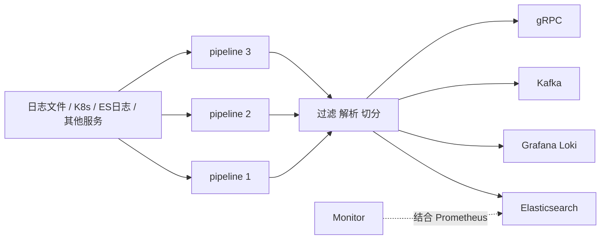

# Go 项目开发: 日志搜索业务场景和功能分析

对互联网产品而言，**日志几乎无处不在**。它既是推荐系统与个性化排序的数据基础，也是线上出故障时唯一的回溯证据。本文从日志的来源与作用讲起，重点介绍云原生日志系统 LOG —— 为什么在容器大规模动态迁移的 K8s 环境下，传统的 filebeat + logstash 组合撑不住了。

## 纲要

- 日志的三个来源
- 日志的三个作用
- ELK 覆盖不了的场景
- 云原生日志系统 LOG 是什么
- LOG 的五个特点
- 数据处理流程

## 日志的三个来源

| 来源 | 内容 |
| --- | --- |
| **机器日志** | 通常意义上的日志数据：机器运行产生的日志，以及机器上运行的服务产生的日志 |
| **通信日志** | 网络抓包产生的数据 |
| **应用日志** | 代码端主动输出的日志 |

## 日志的三个作用

- **运维监控**；
- **业务分析**；
- **安全审计与回溯取证**。

总而言之，日志用来提供**搜索、分析、可视化、监控告警**等功能，帮助企业做**线上业务实时监控、业务异常原因定位、业务日志数据统计分析、安全与合规审计**。

在关键时候，日志发挥的作用不可替代，构建一套稳定高性能的企业级日志系统十分必要。

## ELK 覆盖不了的场景

实际场景中各业务组对日志解析的需求各不相同，**ELK 这种架构并不一定满足需求**。如果 filebeat 和 logstash 解决不了业务里定制化的日志处理需求，还有大量开源产品可以选。

一条背景：互联网高速发展下，采用云原生技术支撑数字化研发已经成为主流。但**云原生环境下容器规模大、频繁动态迁移、日志存储多样、K8s 元信息查询**等特点，迫使日志管理方式必须跟着变。

业务实践深入后，日志方面的人肉运维越来越多，**功能开发难扩展、难支撑更大规模**等问题逐渐浮出水面。业界既有开源方案也没能满足需求 —— 性能不高、扩展与功能开发效率低、对容器化场景支持有限，大部分开源项目都没有提供一套完整的日志解决方案。

于是，面向云原生场景的日志系统 **LOG**（网易与工商银行联合发起）应运而生。

## LOG 是什么

它是一个**基于 Go 的轻量级、高性能云原生日志采集客户端与中转处理器**：

- 支持**多 pipeline** 与**组件热插拔**；
- 提供**一站式日志解决方案**；
- 支持**日志中转、过滤、解析、切分、报警**等能力。

### 五个特点



把 LOG 的采集管道拆成"来源 — pipeline — 拦截器 — 输出"四段，组件结构如下：

```dir
log-system/
├── source/                 采集来源：日志文件 / K8s 标准输出 / ES
├── pipeline/               多 pipeline，任务之间强隔离
│   ├── p1/                 应用日志
│   └── p2/                 容器日志
├── interceptor/            过滤 / 解析 / 切分
│   └── trim_level          砍掉低级别噪声
└── sink/                   输出
    ├── elasticsearch/
    ├── loki/
    └── kafka/
```

**一、轻量级高性能。** 使用 Go 开发，资源占用非常小，吞吐性能强 —— LOG 的 CPU 消耗比 filebeat 还低，但吞吐比 filebeat 高很多。

**二、可扩展、可插拔。** 配置不同的 source、interceptor（拦截器）与 sink（输出），就拥有中转、过滤、解析、切分和日志告警能力。也可以**用 Go 快速自研插件**。

**三、强隔离。** 采用**多 pipeline 设计**，减少 pipeline 任务之间的相互干扰，可以同时采集多个不同数据源。

**四、可靠性。** 具备完善的日志可观测性、原生的 Prometheus metrics 支持，还有限流拦截器。

**五、云原生。** 配置中心集成 K8s，通过创建实例就能采集容器日志。

## 采集侧的代码组织方式

不管用 LOG 还是自己写采集端，**管道式组织**是最通用的形状：source 取数据，经过 interceptor 过滤/解析/切分，最后 sink 输出。

```go
package main

import (
	"context"
	"fmt"
	"time"
)

// LogEntry 一条结构化日志。字段统一加前缀,配合索引模板推断类型。
type LogEntry struct {
	Timestamp time.Time `json:"date_time"`
	Level     string    `json:"keyword_level"`
	Service   string    `json:"keyword_service"`
	Message   string    `json:"text_message"`
	TraceID   string    `json:"keyword_trace_id"`
}

// Source 日志来源抽象:文件或 K8s 标准输出。
type Source interface {
	Read(ctx context.Context) ([]LogEntry, error)
}

// Interceptor 拦截器:过滤、解析、切分。
type Interceptor interface {
	Name() string
	Do(entries []LogEntry) []LogEntry
}

// Sink 输出抽象:Elasticsearch / Kafka / Loki / gRPC。
type Sink interface {
	Name() string
	Write(ctx context.Context, entries []LogEntry) error
}

// TrimLevel 一个最简单的拦截器:砍掉 trace 级别以下的噪声。
type TrimLevel struct{ MinLevel string }

var levelRank = map[string]int{" DEBUG ": 10, " INFO ": 20, " WARN ": 30, " ERROR ": 40}

func (t TrimLevel) Name() string { return "trim_level" }

func (t TrimLevel) Do(entries []LogEntry) []LogEntry {
	min := levelRank[" "+t.MinLevel+" "]
	kept := entries[:0]
	for _, e := range entries {
		if levelRank[" "+e.Level+" "] >= min {
			kept = append(kept, e)
		}
	}
	return kept
}

// Pipeline 一条采集管道,不同 pipeline 之间互不干扰。
type Pipeline struct {
	Name   string
	Source Source
	Chain  []Interceptor
	Sink   Sink
}

// Run 跑一轮采集。
func (p Pipeline) Run(ctx context.Context) error {
	raw, err := p.Source.Read(ctx)
	if err != nil {
		return err
	}
	for _, ic := range p.Chain {
		raw = ic.Do(raw)
	}
	if len(raw) == 0 {
		return nil
	}
	return p.Sink.Write(ctx, raw)
}

func main() {
	p := Pipeline{
		Name:   "app-logs",
		Source: fileSource{},
		Chain:  []Interceptor{TrimLevel{MinLevel: "WARN"}},
		Sink:   consoleSink{},
	}
	if err := p.Run(context.Background()); err != nil {
		fmt.Println("采集失败:", err)
	}
}

// fileSource 演示用的文件来源。
type fileSource struct{}

func (f fileSource) Read(ctx context.Context) ([]LogEntry, error) {
	return []LogEntry{
		{Timestamp: time.Now(), Level: "DEBUG", Service: "order", Message: "debug 噪声"},
		{Timestamp: time.Now(), Level: "ERROR", Service: "order",
			Message: "连接超时", TraceID: "a1b2c3"},
	}, nil
}

// consoleSink 演示用的控制台输出。
type consoleSink struct{}

func (c consoleSink) Name() string { return "console" }

func (c consoleSink) Write(ctx context.Context, entries []LogEntry) error {
	for _, e := range entries {
		fmt.Printf("[%s] %s %s trace=%s %s\n", e.Timestamp.Format("15:04:05"),
			e.Level, e.Service, e.TraceID, e.Message)
	}
	return nil
}
```

## API 速览

| 能力 | 说明 |
| --- | --- |
| 日志来源 | 机器日志、通信日志（抓包）、应用日志 |
| 日志作用 | 运维监控、业务分析、安全审计与回溯取证 |
| LOG 定位 | Go 编写的云原生日志采集客户端 + 中转处理器 |
| pipeline | 多 pipeline 设计，任务之间强隔离 |
| 插件 | source / interceptor / sink 可插拔，支持 Go 自研插件 |
| 输出 | Elasticsearch、Grafana Loki、Kafka、gRPC |
| 告警 | monitor 结合 Prometheus |

## 总结

日志系统选型时，最容易被忽略的不是"采集得够不够快"，而是三件事：

- **容器化适配**：K8s 下容器频繁迁移、日志存储多样，传统 agent 的模型要重写；
- **隔离性**：多个数据源混在一套 pipeline 里，一个任务的变更会打到其他任务，多 pipeline 是刚需；
- **可插拔**：日志格式由各业务组自己定义，硬编码解析规则必然会被业务拖着改。

LOG 这套系统的价值就在于把这三点都做成了默认能力：Go 写、CPU 比 filebeat 更低而吞吐更高；pipeline 之间互相隔离；source/interceptor/sink 全部可热插拔，还能用 Go 自研插件。

采集只是第一步。**日志写进 ES 之后，索引建模才是真正决定集群能不能长期跑下去的地方** —— 那部分坑（dynamic mapping 炸字段、分片数失控、日期字段类型推断错）在下一节逐个拆。

