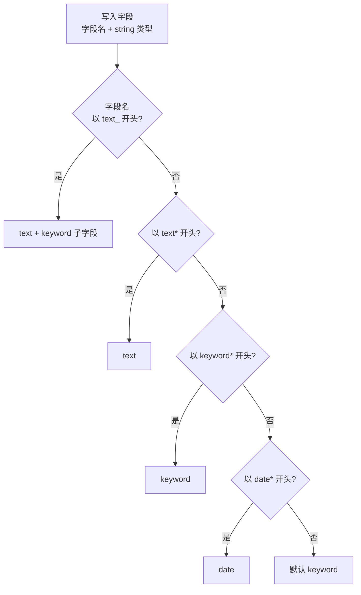

# Go 项目开发: 日志索引数据建模常见误区

日志收集上报时，各业务组的日志格式不一样，直接写进 ES 几乎必然踩坑。这一节把三个最常见的坑讲透：**字段爆炸到上千个**、**分片数失控到三万以上**、**日期字段被推断成数值导致整批写入失败**。解法是同一套：**索引模板 + dynamic_templates**。

## 纲要

- 三个高频误区
- 字段前缀约定：全文检索字段与非全文检索字段
- 索引模板与 dynamic_templates 的写法
- 最大的坑：规则有先后顺序
- 一份可直接用的日志索引模板
- 分片治理的其他手段

## 误区脉络与模板结构

三个误区（字段爆炸 / 分片失控 / 日期被判数值）根因都一个：**让 ES 自己猜类型**。解法是用索引模板 + dynamic_templates 把类型推断收进规则里，而规则按数组顺序从上往下匹配、越靠上越优先。字段名命中后的落点可以这样看：



模板自身由"动态字段规则 + 设置 + 分片"三块组成，落地结构如下：

```dir
log-index-template/
├── dynamic_templates/
│   ├── text_and_keyword    text_* → text + keyword 子字段
│   ├── text                text* → text
│   ├── keyword             keyword* → keyword
│   └── date                date* → date
├── settings/
│   ├── refresh_interval    30s 落盘
│   └── translog            async 异步刷盘
└── shards/                 单分片 + 0 副本
```

## 三个高频误区

**误区一：dynamic mapping 默认开启，同一个索引生成上千个字段。**

业务日志格式不统一，上游随便加个字段，ES 就自动扩一个映射。字段一多，倒排索引膨胀、集群元数据变大，查询和写入一起变慢。

**误区二：索引生成间隔太短、分片数设得过多，整个集群分片数爆炸。**

特别是当**集群分片数超过三万以上**，再加上日志格式不统一导致大量索引在新增字段 —— 在**三万分片以上的量级再新增字段是一个十分耗时的操作**，直接造成整个集群的写入瓶颈。

**误区三：字段格式不对应，比如同一个日期字段在没有值时默认写了 0。**

ES 动态推断字段类型时会把 `0` 认成**数值类型**，之后**所有该字段的真实数据都写不进去**，ES 服务器产生大量写入失败日志，这些失败日志本身又会影响集群性能。

## 字段前缀约定：把日志字段分成两类

所有问题都可以用 **dynamic templates** 解决。做法是先定一条规矩：

- **需要全文检索的字段** → 字段名用约定前缀，比如 `text_xxx`；
- **不需要全文检索的字段** → 字段名用 `keyword_xxx`、`date_xxx`，按前缀自动推断类型。

这样写入前不用关心类型，写的时候按前缀命名即可，**字段格式由模板统一托管**。

第一步先放开自动建索引的允许范围：

```json
{
  "action.auto_create_index": "app-logs*,monitor*,+*"
}
```

默认行为下，string 类型字段被动态推断成 `text` 类型加一个 `keyword` 子字段 —— 可以用 `GET /app-logs-1/_mapping` 验证。

## 索引模板与 dynamic_templates 的写法

索引模板两个关键参数：

- **`order`**：模板优先级，**值越大优先级越高**。多个模板对同一字段设了属性，以 order 最大的为准；
- **`index_patterns`**：作用范围，比如 `app-logs*`，星号匹配后面任意字符。

```json
{
  "index_patterns": ["app-logs*"],
  "order": 200,
  "settings": {
    "number_of_shards": 1,
    "number_of_replicas": 0
  },
  "mappings": {
    "dynamic_templates": [
      {
        "string_to_keyword": {
          "match_mapping_type": "string",
          "mapping": { "type": "keyword" }
        }
      },
      {
        "string_to_text": {
          "match_mapping_type": "string",
          "match": "text*",
          "mapping": { "type": "text" }
        }
      }
    ]
  }
}
```

第一条规则把**写入的 string 字段统一推断成 keyword**；第二条额外加了 `match: "text*"`，只让**以 `text` 开头的字段**推断成 text。

想看集群里全部索引模板，用 `GET /_cat/templates`。

## 最大的坑：规则有先后顺序

只有两条规则时看着没问题，加上 `text*` 规则后就翻车了：两个规则都命中 `textname` 字段（写入类型是 string，且字段名以 text 打头），结果它**被推断成了 keyword 而不是 text**。

```go
package main

import "fmt"

// Rule 一条 dynamic_template 规则。
type Rule struct {
	Name            string // 规则名
	MatchMappingTyp string // 匹配写入字段的类型
	Match           string // 匹配字段名前缀,空表示不限制
	MappingType     string // 最终推断的类型
}

// resolve 模拟 ES 的 dynamic_template 匹配过程。
// 关键:规则按数组顺序从上往下找,命中的第一条生效,越靠上权重越高。
func resolve(rules []Rule, fieldType, fieldName string) string {
	for _, r := range rules {
		if r.MatchMappingTyp != fieldType {
			continue
		}
		if r.Match != "" && !hasPrefix(fieldName, r.Match) {
			continue
		}
		return r.MappingType
	}
	return "text(keyword子字段)" // 默认动态推断
}

func hasPrefix(s, prefix string) bool {
	for i := 0; i < len(prefix); i++ {
		if i >= len(s) || s[i] != prefix[i] {
			return false
		}
	}
	return true
}

func main() {
	rules := []Rule{
		{Name: "string_to_keyword", MatchMappingTyp: "string", MappingType: "keyword"},
		{Name: "string_to_text", MatchMappingTyp: "string", Match: "text*", MappingType: "text"},
	}
	fmt.Println("顺序一 textname =>", resolve(rules, "string", "textname"))

	// 把 text 规则放到最前面,结果与预期一致
	swapped := []Rule{rules[1], rules[0]}
	fmt.Println("顺序二 textname =>", resolve(swapped, "string", "textname"))
}
```

**结论：dynamic_templates 里的规则有先后顺序，越靠上权重越高。** 两个规则都命中时，最终取**靠上的那条**。所以 `text*` 这类要覆盖默认行为的规则，必须写在 `string → keyword` 规则之前。

排查方式很朴素：把规则调换顺序、重建索引、再写一条数据看 mapping，现象立刻复现。

## 一份可直接用的日志索引模板

```json
{
  "index_patterns": ["app-logs*"],
  "order": 200,
  "settings": {
    "index.max_result_window": 65536,
    "index.refresh_interval": "30s",
    "index.number_of_shards": 1,
    "index.number_of_replicas": 0,
    "index.unassigned.node_left.delayed_timeout": "5m",
    "index.translog.sync_interval": "10s",
    "index.translog.durability": "async"
  },
  "mappings": {
    "dynamic_templates": [
      {
        "text_and_keyword": {
          "match": "text_*",
          "mapping": { "type": "text", "fields": { "keyword": { "type": "keyword" } } }
        }
      },
      { "text": { "match": "text*", "mapping": { "type": "text" } } },
      { "keyword": { "match": "keyword*", "mapping": { "type": "keyword" } } },
      {
        "date": {
          "match": "date*",
          "mapping": { "type": "date", "format": "yyyy-MM-dd HH:mm:ss" }
        }
      }
    ]
  }
}
```

每一项配置的取舍：

| 配置 | 取值 | 理由 |
| --- | --- | --- |
| `max_result_window` | 65536（默认 1 万） | 日志查询常有长范围聚合，放宽默认值 |
| `refresh_interval` | 30s | 日志实时性**秒级就够**，30 秒落盘一次对写入性能帮助很大 |
| `node_left.delayed_timeout` | 5m（默认 1m） | 节点短暂离线时避免立刻触发副本恢复 |
| `translog.sync_interval` | 10s | 日志可用性要求没那么高 |
| `translog.durability` | `async` | **异步刷盘**，写性能提升明显 |

字段规则四条：`text_*` → text 带 keyword 子字段；`text*` → text；`keyword*` → keyword；`date*` → date（可用 `format` 指定日期格式）。

命名一旦约定好，写日志时给字段加上前缀就行，类型由模板兜底：

```go
package main

import (
	"encoding/json"
	"fmt"
	"time"
)

// AppLog 业务日志结构体:字段名按前缀约定命名。
type AppLog struct {
	DateTime   time.Time `json:"date_time"`            // -> date
	KeywordLvl string    `json:"keyword_level"`       // -> keyword
	TextMsg    string    `json:"text_message"`        // -> text + keyword
	Trace      string    `json:"keyword_trace_id"`    // -> keyword
}

func main() {
	l := AppLog{DateTime: time.Now(), KeywordLvl: "ERROR", TextMsg: "连接超时", Trace: "a1b2c3"}
	data, _ := json.Marshal(l)
	fmt.Println(string(data))
}
```

## 分片治理的其他手段

除了模板，还有几条独立的经验：

- **字段膨胀本身** → 用前面讲过的 `dynamic: strict`，或者用 **flattened 类型**；
- **分片过多** → 减少单索引分片数，使用 **rollover 策略**（索引达到一定大小后再生成新索引），而不是按时间无限建小索引；
- **旧索引** → 低频的旧索引**备份压缩、关闭，甚至删除**，能在很大程度上腾出集群资源。

## API 速览

| 能力 | 做法 |
| --- | --- |
| 放开建索引白名单 | `action.auto_create_index: "app-logs*,+*"` |
| 模板优先级 | `order` 越大越优先 |
| 模板作用范围 | `index_patterns: ["app-logs*"]` |
| 动态字段规则 | `dynamic_templates` 数组，**越靠上越优先** |
| 全文字段 | 字段名 `text_*` / `text*`，推断为 text |
| 过滤字段 | 字段名 `keyword*` / `date*`，推断为 keyword / date |
| 查看模板 | `GET /_cat/templates` |

## 总结

日志索引建模的本质是**用命名约定换掉类型自由**：

- 三个坑 —— 字段爆炸、分片失控、日期被判成数值 —— 根因都是"让 ES 自己猜"；
- 解法是把类型推断收进索引模板，靠**字段前缀** tells ES 该用哪种类型；
- 最容易栽的是**规则顺序**，`text*` 规则必须排在默认 string 规则前面，否则"写了前缀却没生效"会反复出现。

工程上把这条约定写进日志库 SDK，业务方只知道"加 `text_` 前缀就能全文搜"，不需要理解 mapping。

