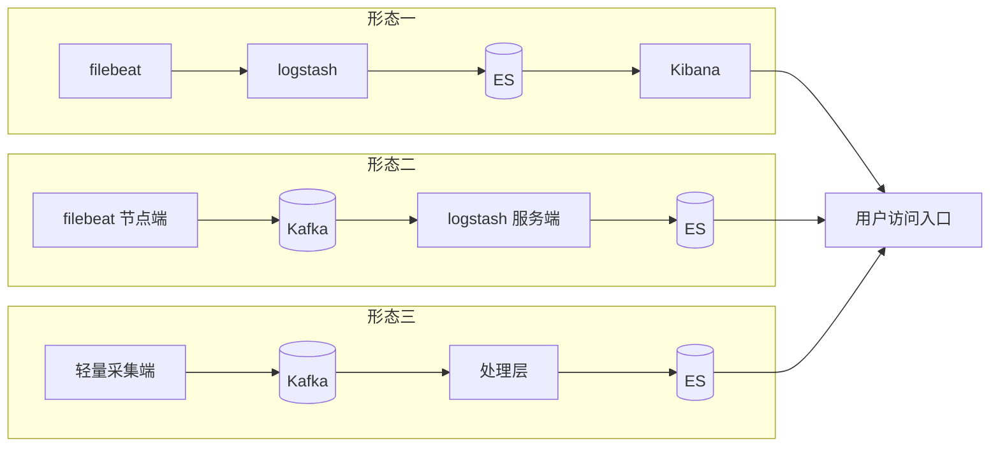

# Go 项目开发: 日志搜索业务难点分析

日志业务难在哪？**来源多、结构乱、量大、成本高，还要秒级可查**。这一节把四个难点逐个拆，并给出 ELK 架构从"单机 filebeat"到"Kafka 缓冲"再到"轻量采集"的完整演进路线。

## 纲要

- 日志业务的四个难点
- 统一格式：用 K8s 接管应用日志
- 其他集成场景：flattened 与字段拼接
- 分级隔离：热点业务分集群，ERROR 单独通道
- 消息队列缓冲：给 ES 一个喘息的机会
- ELK 架构的三种形态

把"分层 + 隔离"落到具体组件上，整个日志平台的部署结构大致如下：

```dir
log-platform/
├── collector/              轻量采集端，K8s 接管应用日志
├── kafka/                  流量缓冲，可控消费速率
├── es-hot/                 热点业务独立集群
├── es-normal/              普通业务集群
└── routing/
    ├── error_queue         ERROR 单独通道，优先消费
    └── warn_queue          其他级别日志
```

## 日志业务的四个难点

- **数据来源种类多样**，数据结构不统一；
- **日志写入量很大**，需要平衡成本，还要兼顾时效性；
- 部分场景对时效性要求高，**需要秒级别的搜索和告警**。

## 统一格式：用 K8s 接管应用日志

实际生产中大多处理的是应用日志。在没有 K8s 之前，各个业务组的日志结构各不相同。

云原生之后，**应用日志统一输出到 K8s 的指定目录** —— 各业务组的日志字段可以统一起来：除了日志内容、日志时间，把**应用名、容器 podID** 这些信息统一附加到应用输出的日志上，**很大程度上就能解决格式不统一的问题**。

## 其他集成场景：flattened 与字段拼接

没法全靠 K8s 统一的地方，两条替代路线：

- 用 ES 的 **flattened 类型**直接把结构存进去；
- 或者**把需要全文检索的字段拼接成一个字段**来处理。

## 分级隔离：热点业务分集群，ERROR 单独通道

大量数据写入对 ES 集群压力很大，这里要用到**隔离原则**：

- **按业务量级隔离**：写入量很大的热点业务，使用**单独的日志集群**存储；
- **按日志级别隔离**：把 ERROR 级别日志和其他级别隔离处理，ERROR 使用**单独的消息队列**，并且**优先处理 ERROR 级别日志**。

原因：ERROR 级别日志数据量通常不大，但如果和其他级别日志一起处理，**一旦出现线上堆积，错误日志的处理就会延时，从而造成线上告警延时** —— 这是告警系统最不能接受的情况。

```go
package main

import (
	"context"
	"fmt"
	"sort"
	"time"
)

// Level 日志级别。
type Level string

const (
	LevelError Level = "ERROR"
	LevelWarn  Level = "WARN"
	LevelInfo  Level = "INFO"
)

// LogRecord 一条日志(line 结构统一后)。
type LogRecord struct {
	Time    time.Time
	Level   Level
	Service string
	PodID   string
	Message string
}

// Router 按级别与业务把日志路由到不同的队列。
type Router struct {
	errorQueue chan LogRecord // ERROR 单独通道
	warnQueue  chan LogRecord
	hotQueues  map[string]chan LogRecord // 热点业务独立通道
}

// NewRouter 建路由:ERROR 单开一路,热点业务单开一路。
func NewRouter(hotServices ...string) *Router {
	r := &Router{
		errorQueue: make(chan LogRecord, 1024),
		warnQueue:  make(chan LogRecord, 4096),
		hotQueues:  make(map[string]chan LogRecord),
	}
	for _, s := range hotServices {
		r.hotQueues[s] = make(chan LogRecord, 2048)
	}
	return r
}

// Route 投递一条日志。
func (r *Router) Route(rec LogRecord) {
	switch {
	case rec.Level == LevelError:
		r.errorQueue <- rec
	case r.hotQueues[rec.Service] != nil:
		r.hotQueues[rec.Service] <- rec
	default:
		r.warnQueue <- rec
	}
}

// priority 消费优先级:ERROR 永远最先被处理,避免告警延时。
func priority(rec LogRecord) int {
	switch rec.Level {
	case LevelError:
		return 0
	case LevelWarn:
		return 1
	default:
		return 2
	}
}

// Drain 按优先级消费,模拟消费端。
func (r *Router) Drain(ctx context.Context, n int) {
	batch := []LogRecord{
		{Time: time.Now(), Level: LevelInfo, Service: "order", PodID: "pod-a", Message: "查询"},
		{Time: time.Now(), Level: LevelError, Service: "order", PodID: "pod-a", Message: "连接超时"},
	}
	sort.SliceStable(batch, func(i, j int) bool { return priority(batch[i]) < priority(batch[j]) })
	for i, rec := range batch {
		fmt.Printf("第 %d 条 级别=%s 服务=%s 消息=%s\n", i+1, rec.Level, rec.Service, rec.Message)
	}
}

func main() {
	r := NewRouter("order")
	r.Route(LogRecord{Level: LevelInfo, Service: "order"})
	r.Route(LogRecord{Level: LevelError, Service: "order"})
	r.Drain(context.Background(), 2)
}
```

## 消息队列缓冲：给 ES 一个喘息的机会

从各个数据源节点收集到的日志，一般经过处理和过滤后写入 Kafka，最终才落到 ES 集群。

这样**给了 ES 缓冲的机会**：不会因为瞬时流量过大而打垮 ES 集群，也不会因为下游服务器宕机而导致数据丢失。

## ELK 架构的三种形态



**形态一：filebeat → logstash → ES → Kibana**

- 把 logstash 部署到需要收集日志的全部节点上做采集，过滤分析后发给 ES，用 Kibana 做查询和报表生成；
- 优势：**简单，容易搭建和上手，适合小规模使用**；
- 问题：filebeat / logstash **资源消耗大**，运行时占用 CPU 和内存比较高；而且**没有消息队列缓存，存在数据丢失隐患**。

**形态二：引入 Kafka**

- 节点上的采集端把日志写入 Kafka，再由**服务端**统一分析处理过滤后写入 ES，Kibana 呈现；
- 这里两次用到采集组件，但**角色完全不同**：节点端的是客户端，负责采集；从 Kafka 读取的是服务端，负责统一处理；
- 引入消息队列后，数据能够暂存，**logstash server 故障期间日志也能暂存在 Kafka**，而且**可以控制消费速率来控制 ES 的写入**，避免瞬时大量写入打垮 ES；
- 适合大规模集群；但采集端资源占用过多的问题还在。

**形态三：收集端换成更轻量的组件**

- 把节点上的 logstash 换成更轻量的采集器（filebeat 一类），日志同样先写 Kafka，再由处理层统一输出到 ES；
- **更灵活、消耗资源更少、扩展性更强**。

## API 速览

| 手段 | 关键做法 |
| --- | --- |
| 统一格式 | 应用日志统一输出到 K8s 指定目录，附加应用名与 podID |
| 兼容旧格式 | 用 flattened 类型，或把需全文检索的字段拼成一个字段 |
| 业务隔离 | 写入量大的热点业务用独立日志集群 |
| 级别隔离 | ERROR 单队列、优先消费，避免告警延时 |
| 流量缓冲 | 日志经 Kafka 再落 ES，可控消费速率 |
| 架构演进 | filebeat → 加 Kafka 缓冲 → 采集端换轻量组件 |

## 总结

日志搜索这块的解法，几乎全是**"分层 + 隔离"**四个字：

- **格式乱** → 用 K8s 统一接管，拿不下的用 flattened 或字段拼接兜底；
- **量大** → 热点业务独立集群、ERROR 独立队列且优先消费、Kafka 在前面挡一层；
- **成本** → 冷数据降配、生命周期管理、预聚合（下一节展开）。

真正要注意的是**告警链路的延时**：ERROR 日志如果和普通日志挤在同一个消费通道里，一旦线上堆积，最先受影响的不是搜索，而是告警。这类故障发生时业务感知很直接，但根因往往藏在"同级处理"这四个字里。

