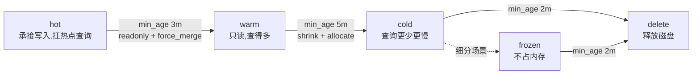

# Go 项目开发: 索引生命周期管理原理及实践

前面讲存储成本时说过一句话：**降低存储成本最有效的手段不是换更便宜的磁盘，而是让索引按年龄走完自己的生命周期**。这一节把这条链路拆开讲：四个阶段、七个 action，以及 policy 里最容易算错的时间口径 `min_age`。

全文围绕一个问题展开：**一个日志索引从被创建到被删除，它的索引状态、分片分布、磁盘占用是怎么被自动改写的。**

## 纲要

- 四个阶段：hot / warm / cold / delete 与"生老病死"
- rollover：滚动切分与别名的配合
- shrink：收缩主分片的前置条件
- allocate：按节点温度搬分片
- freeze 与 open/close：冻结历史索引
- readonly 与 force_merge：换查询性能
- policy 与 min_age：时间口径的坑
- 用 Go 维护一套生命周期状态机

## 四个阶段

生命周期管理有两个基本概念：**阶段（phase）** 和 **行为（action）**。每个阶段都有若干 action，action 执行完才过渡到下一个阶段。



多数场景下就这四个阶段。有些场景会在 cold 之后再切一个 **frozen** 阶段（冻结、不加载倒排索引到内存），本课程为了简化把 frozen 归进了 cold 的范畴。

| 阶段 | 索引能否写入 | 查询特征 | 典型 action | 存储目标 |
| --- | --- | --- | --- | --- |
| hot | 能写 | 扛全部实时流量 | `rollover` | 原始形态，多副本 |
| warm | 只读 | 仍被高频查 | `readonly`、`force_merge`、`shrink`、`allocate` | 合并段、缩分片 |
| cold | 只读 | 查询少、慢得多 | `allocate`、`freeze` | 挪到冷节点、释放内存 |
| delete | — | 不可查 | `delete` | 立即释放磁盘 |

对有长期价值的数据，更稳的做法是先在 delete 之前**备份、打包、压缩**到更廉价的存储（对象存储 / 归档集群），再删除索引。

## rollover：滚动切分

`rollover` 是滚动的意思，**按索引大小、文档数、创建时间自动切换到新索引**。触发时创建新索引，同时索引别名自动指向它，新索引的 `is_write_index` 置为 `true`。

```json
{
  "conditions": {
    "max_age": "7d",
    "max_docs": 500000000,
    "max_size": "50gb"
  }
}
```

三个条件**任一达到即触发**。几个必须记住的点：

- **`max_docs` 别超过 21 亿。** 单分片最大文档数是 `2^31 - 1`（约 21 亿多）。索引进 cold 阶段会 shrink 到一个分片，此时文档数超过这个上限，**shrink 直接失败**。
- **触发条件别设太激进。** 生存时间、文档数、大小同时设，任何一个先到就切索引 —— 结果是索引数量暴涨，集群总分片数跟着暴涨，拖垮整个集群。
- **检测是周期性的。** ES 定期检测是否达到触发条件，周期由 `index.lifecycle.rollover.check.interval` 控制，**默认 10 分钟**。线上 10 分钟够用；做实验演示就把它调小。`max_age` 小于检测周期的，慢几个周期触发是正常的。

```
PUT /_cluster/settings
{
  "transient": {
    "index.lifecycle.rollover.check.interval": "30s"
  }
}
```

别名配合是 rollover 的关键：业务端永远写别名 `app-log`，写入落到 `app-log-000002`；切索引后别名指向 `app-log-000003`，业务**完全无感知**。

```
写入别名 app-log ──┐
                   ├──► app-log-000001 (已达 max_size)
                   └──► app-log-000002 (当前写入)  ── 触发 rollover ──► app-log-000003
```

## shrink：收缩主分片

`shrink` 把主分片数缩减为原数的**因子**，最小到 1。原来 20 个主分片，可以收缩成 1、2、4、5、10。

执行前必须满足四个条件：

1. 索引已置为**只读**；
2. 索引健康状态为 **green**；
3. **所有主副分片集中在同一个节点上**；
4. 收缩到单分片时，文档数必须小于单分片上限（约 21 亿）。

第 3 条是实操里最常见的失败原因 —— 需要先把索引分配到单节点，或者手动挪。

## allocate：按节点温度搬分片

`allocate` 用在 warm / cold 阶段，把索引上的分片分配到满足节点属性的节点上。三种规则，**至少指定一个**：

| 规则 | 语义 |
| --- | --- |
| `include` | 分配到满足**任意一个**属性的节点上 |
| `require` | 分配到满足**全部**属性的节点上 |
| `exclude` | 分配到**不包含任何一个**属性的节点上 |

属性指节点属性，典型的是节点温度 `temperature`（hot / warm / cold）以及节点名、节点 IP。

```json
{
  "index.routing.allocation.require.temperature": "warm"
}
```

上面这条把索引从 hot 节点迁到 warm 节点。另一个高频用法是**节点下线**：

```json
{
  "index.routing.allocation.exclude._name": "es-03"
}
```

执行后 `es-03` 上的所有分片会被驱逐到其它节点。注意它写在 `persistent` 还是 `transient` —— 用 `persistent`，集群重启后配置仍然生效。

## freeze：冻结历史索引

索引存在状态有三种，很多人把 frozen 和 close 搞混：

| 状态 | 可读写 | 占用内存 | 能否搜索 | 能否 allocate |
| --- | --- | --- | --- | --- |
| open | 读写 | 倒排索引在内存 | 是，最快 | 能 |
| frozen | 不可写 | 不占内存 | 需要显式参数 | 不能 |
| close | 不可读写 | 不占内存 | 不能 | 不能 |

frozen 的典型场景是**持续数据 + 冷热分离的大集群**：写入压力下节点频繁触发熔断，把部分历史索引冻结可以立刻腾出节点内存。

```
POST /app-log-000001/_freeze      # 冻结
POST /app-log-000001/_unfreeze    # 解冻
```

**注意一个坑：索引被冻结后默认不支持搜索**，查询时必须显式传参数把这个开关设为 `false`，否则查询结果里直接看不到它。

## readonly 与 force_merge

- **`readonly`**：索引置为只读，不再写入和更新，纯查询。
- **`force_merge`**：把索引的段强制合并到 **1 个段**。段越少，查询时合并结果集的成本越低。代价是 merge 期间很吃 IO，**务必放低峰执行**。
- **`shrink`** 通常紧跟 force_merge，先合并段再缩分片，缩完的索引更小。

## policy 与 min_age：最容易算错的时间口径

policy 是生命周期管理的核心，它把 action 编排进各阶段并触发。绑定很简单：

```json
PUT /_ilm/policy/log-90d
{
  "policy": {
    "metadata": {
      "description": "日志索引 90 天生命周期",
      "project_name": "order-search",
      "department": "infra"
    },
    "phases": {
      "warm": {
        "min_age": "10d",
        "actions": {
          "force_merge": { "max_num_segments": 1 }
        }
      },
      "delete": {
        "min_age": "30d",
        "actions": {
          "delete": {}
        }
      }
    }
  }
}
```

然后绑定索引：

```json
PUT /app-log-000002/_settings
{
  "index.lifecycle.name": "log-90d"
}
```

### min_age 到底从哪儿开始算

这是本节最值钱的一段。上面这个策略问一句：**delete 阶段的 30 天，是从索引创建开始算，还是从进入 warm 开始算？**

答案是：**从索引创建时刻开始算。** 也就是说整个生命周期由 delete 阶段的 `min_age` 决定。

按上面这个配置推一遍：索引创建后立刻进 hot；活满 10 天进 warm，同时执行 force_merge；活满 30 天进 delete，执行删除。**总存活周期是 30 天，不是 40 天。**

官方例子更直观（hot 3 分钟 → warm 5 分钟 → cold 2 分钟 → delete）：

```mermaid
gantt
    dateFormat x
    axisFormat %Ss
    section 索引生命周期
    hot (3m)   :a1, 0, 180s
    warm (5m)  :a2, after a1, 300s
    cold (2m)  :a3, after a2, 120s
    delete     :milestone m1, after a3, 0s
```



三条铁律：

1. **检查 min_age 并进入下一阶段之前，本阶段的 action 必须已经执行完成**；
2. **hot 阶段不设 `min_age` 时默认为 0 毫秒** —— 该阶段操作一完成就立即进入下一个阶段（意味着绑定 policy 的瞬间就已经在 hot 了）；
3. **改 policy 只对新数据生效** —— 对已经处在 warm 阶段的索引没有任何影响，只会影响更新之后新建的索引、或还没走到该阶段的索引。

查看集群里已定义的 policy：`GET /_ilm/policy`。

## 工程化：用 Go 维护生命周期状态机

阶段判定是纯逻辑，可以把它抽成公司内部的 ILM 状态机，跟着业务自己的"活跃度"策略走，而不是只认 ES 原生的 age。

一个日志生命周期运维工程的目录结构：

```
ilm/
├── cmd/
│   └── rollover/
│       └── main.go                 # 触发 rollover 的定时器
├── internal/
│   ├── lifecycle/
│   │   ├── policy.go               # policy 定义与校验
│   │   └── stage.go                # min_age 判定 + action 编排
│   └── es/
│       └── client.go               # 索引读写、settings 变更
└── configs/
    └── log-ilm.json                # 阶段与阈值配置
```

## Demo 示例

下面这份代码把四个阶段、rollover 触发条件、shrink 前置校验、allocate 匹配规则做成一个自包含的判定器，**所有分支都能跑通**。

```go
package main

import (
	"fmt"
	"time"
)

// Phase 索引生命周期阶段。
type Phase string

const (
	PhaseHot    Phase = "hot"
	PhaseWarm   Phase = "warm"
	PhaseCold   Phase = "cold"
	PhaseDelete Phase = "delete"
)

// Action 阶段内可执行的行为。
type Action string

const (
	ActionRollover   Action = "rollover"
	ActionReadOnly   Action = "readonly"
	ActionForceMerge Action = "force_merge"
	ActionShrink     Action = "shrink"
	ActionAllocate   Action = "allocate"
	ActionFreeze     Action = "freeze"
	ActionDelete     Action = "delete"
)

// 单分片最大文档数约 21 亿,超了 shrink 到单分片必然失败。
const maxDocsPerShard = int64(1<<31 - 1)

// Index 一个被生命周期管理的索引。
type Index struct {
	Name      string
	CreateAt  time.Time
	Docs      int64
	SizeBytes int64
	Primaries int
	Segments  int
	Phase     Phase
	Green     bool
	ReadOnly  bool
	Temp      string
	Nodes     []string // 分片当前分布在哪些节点
}

// Step 某阶段内的一个动作,min_age 从索引创建时刻起算。
type Step struct {
	Phase  Phase
	Action Action
	MinAge time.Duration
}

// Policy 生命周期策略。
type Policy struct {
	Name  string
	Steps []Step
}

// Condition rollover 的三个触发条件,任一达到即触发。
type Condition struct {
	MaxAge    time.Duration
	MaxDocs   int64
	MaxSize   int64
}

// ShouldRollover 判断是否需要滚动到新索引。
func ShouldRollover(c Condition, idx Index, now time.Time) bool {
	return now.Sub(idx.CreateAt) >= c.MaxAge ||
		idx.Docs >= c.MaxDocs ||
		idx.SizeBytes >= c.MaxSize
}

// Evaluate 按 min_age 推算当前阶段与待执行动作。
// 关键口径:min_age 从索引创建时刻起算,不是从进入上一阶段起算,
// 所以整个生命周期由最后一个阶段的 min_age 决定。
func Evaluate(p Policy, idx Index, now time.Time) (Phase, []Action) {
	age := now.Sub(idx.CreateAt)
	phase, pending := PhaseHot, []Action{}
	for _, s := range p.Steps {
		if age < s.MinAge {
			break
		}
		phase = s.Phase
		pending = append(pending, s.Action)
	}
	return phase, pending
}

// ShrinkReport shrink 前置校验结果。
type ShrinkReport struct {
	OK     bool
	Reason string
}

// CanShrink shrink 需要满足的四个前提。
func CanShrink(idx Index) ShrinkReport {
	if !idx.ReadOnly {
		return ShrinkReport{false, "索引必须处于只读状态"}
	}
	if !idx.Green {
		return ShrinkReport{false, "索引健康状态必须为 green"}
	}
	if len(idx.Nodes) != 1 {
		return ShrinkReport{false, "所有主副分片必须集中在单个节点"}
	}
	if idx.Docs > maxDocsPerShard {
		return ShrinkReport{false, "文档数超过单分片上限 21 亿,收缩后写入会失败"}
	}
	return ShrinkReport{true, ""}
}

// AllocateRule allocate 的三种匹配规则,至少指定一种。
type AllocateRule struct {
	Include map[string]string // 满足任意一个
	Require map[string]string // 满足全部
	Exclude map[string]string // 不能包含任何一个
}

// Match 判断节点属性能否承载该索引。
func Match(r AllocateRule, attr map[string]string) bool {
	anyOK := len(r.Include) == 0
	for k, v := range r.Include {
		if attr[k] == v {
			anyOK = true
		}
	}
	allOK := true
	for k, v := range r.Require {
		if attr[k] != v {
			allOK = false
		}
	}
	noneOK := true
	for k, v := range r.Exclude {
		if attr[k] == v {
			noneOK = false
		}
	}
	return anyOK && allOK && noneOK
}

// Apply 执行单个动作。真实 ILM 里 shrink 之前一定先 readonly。
func Apply(idx *Index, a Action) {
	switch a {
	case ActionReadOnly:
		idx.ReadOnly = true
	case ActionForceMerge:
		idx.Segments = 1
		idx.ReadOnly = true
	case ActionShrink:
		rep := CanShrink(*idx)
		if !rep.OK {
			fmt.Printf("  shrink 跳过:%s\n", rep.Reason)
			return
		}
		idx.Primaries = 1
		idx.Nodes = []string{"node-7"}
		idx.Temp = "cold"
	case ActionAllocate:
		idx.Temp = "cold"
	case ActionDelete:
		fmt.Printf("  delete:释放 %s 占用的磁盘\n", idx.Name)
	}
}

func main() {
	// hot 阶段不设 min_age,默认为 0:绑定 policy 后立即进入 hot。
	policy := Policy{Name: "log-90d", Steps: []Step{
		{Phase: PhaseWarm, Action: ActionForceMerge, MinAge: 10 * 24 * time.Hour},
		{Phase: PhaseCold, Action: ActionShrink, MinAge: 30 * 24 * time.Hour},
		{Phase: PhaseDelete, Action: ActionDelete, MinAge: 90 * 24 * time.Hour},
	}}

	idx := Index{
		Name: "app-log-000002", CreateAt: time.Now(), Docs: 120000000,
		SizeBytes: 300 << 30, Primaries: 12, Segments: 46,
		Phase: PhaseHot, Green: true, ReadOnly: true, Temp: "hot",
		Nodes: []string{"node-7"},
	}

	// 存活 35 天:过了 warm(10 天),没到 delete(90 天)。
	now := idx.CreateAt.Add(35 * 24 * time.Hour)
	phase, actions := Evaluate(policy, idx, now)
	fmt.Printf("索引=%s 存活=%s\n", idx.Name, now.Sub(idx.CreateAt).Round(time.Hour))
	fmt.Printf("当前阶段=%s 待执行=%v\n", phase, actions)
	for _, a := range actions {
		Apply(&idx, a)
	}
	fmt.Printf("只读=%v 段数=%d 主分片=%d 温度=%s\n",
		idx.ReadOnly, idx.Segments, idx.Primaries, idx.Temp)

	// rollover:按 30 小时 / 21 亿文档 / 50GB 三个条件判定。
	c := Condition{MaxAge: 30 * time.Hour, MaxDocs: maxDocsPerShard, MaxSize: 50 << 30}
	fmt.Printf("触发 rollover = %v\n",
		ShouldRollover(c, idx, idx.CreateAt.Add(30*time.Hour)))

	// allocate:只要求落在冷节点上。
	rule := AllocateRule{Require: map[string]string{"temperature": "cold"}}
	fmt.Printf("能否落到冷节点 = %v\n",
		Match(rule, map[string]string{"temperature": idx.Temp, "node_name": "node-7"}))
}
```

跑出来的结果：

```
索引=app-log-000002 存活=840h0m0s
当前阶段=cold 待执行=[force_merge shrink]
只读=true 段数=1 主分片=1 温度=cold
触发 rollover = true
能否落到冷节点 = true
```

## API 速览

| 能力 | 做法 |
| --- | --- |
| 查已定义策略 | `GET /_ilm/policy` |
| 建策略 | `PUT /_ilm/policy/{name}`,phases 里配 min_age + actions |
| 绑定索引 | `PUT /{index}/_settings` 设 `index.lifecycle.name` |
| 滚动切换 | `POST /{alias}/_rollover` + `conditions.max_age/max_docs/max_size` |
| 缩分片 | `POST /{index}/_shrink/{target}`(前置:只读、green、单节点、<21 亿) |
| 按温度迁走 | `index.routing.allocation.require.temperature` |
| 节点下线 | `index.routing.allocation.exclude._name` |
| 冻结 / 解冻 | `POST /{index}/_freeze` / `_unfreeze` |
| 改检测周期 | `index.lifecycle.rollover.check.interval`,默认 10m |
| 生命周期时长口径 | `min_age` 从**索引创建时刻**起算,由最后一个阶段决定总时长 |

## 总结

索引生命周期管理的本质是**把"什么时候该删索引"这件事从人脑迁进配置**：

- 四个阶段 **hot / warm / cold / delete** 对应"生老病死"，frozen 只是 cold 的一个细分；
- 七个 action 里，**rollover 防单索引过大**，**shrink + force_merge 压存储**，**allocate 搬节点**，**freeze 腾内存**，**delete 放磁盘**；
- 最容易栽的是 **min_age 的时间口径** —— 从索引创建起算，不是从进入上一阶段起算，所以总生命周期由最后一个阶段的 `min_age` 决定；
- 改 policy 只对新数据生效，线上改完一定要确认存量索引的阶段没被"拔高"。

工程上把这套判定逻辑用 Go 固化成状态机（上面那段），再配合业务自己的活跃度规则（活跃用户订单优先留热集群），才能既省钱又不误删。

